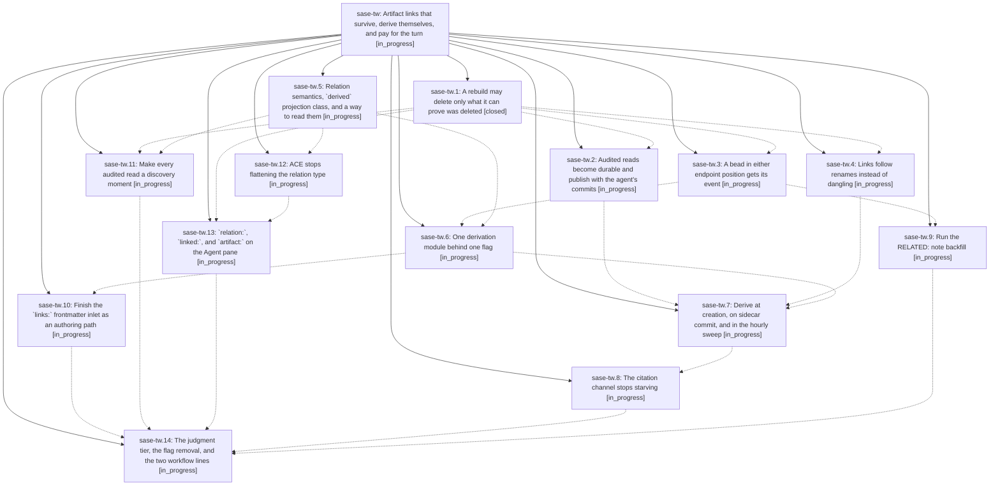

# Bead: sase-tw — Artifact links that survive, derive themselves, and pay for the turn

[Bead Pages](../README.md) / sase-tw

**Status:** ◐ in_progress · **Type:** ▸ plan · **Tier:** epic
**Owner:** `bryanbugyi34@gmail.com` · **Created by:** [bbugyi200.athena.sase-tj.land.w3](https://github.com/sase-org/sase--agents/blob/main/families/bbugyi200.athena.sase-tj.land.w3.md) · **Assignee:** `sase-tw.land`
**Created:** 2026-08-25 15:34:34 EDT
**Plan:** [202608/artifact\_link\_durability\_and\_derivation.md](https://github.com/sase-org/sase--plans/blob/main/202608/artifact_link_durability_and_derivation.md)

## Description

The artifact-link graph stops losing durable rows, grows to ~1,600 edges derived from facts SASE already owns without adding one token to the average agent's context, and becomes load-bearing: every audited read shows its neighborhood, ACE carries the relation type, and the Artifacts Agent pane filters on `relation:`, `linked:`, and `artifact:`.

## Phases

| Bead | Title | Status | Size | Created | Agents | Commits |
|---|---|---|---|---|---:|---:|
| [sase-tw.1](sase-tw.1.md) | A rebuild may delete only what it can prove was deleted | ✓ closed | medium | 2026-08-25 | 1 | 1 |
| [sase-tw.10](sase-tw.10.md) | Finish the \`links:\` frontmatter inlet as an authoring path | ◐ in_progress | medium | 2026-08-25 | 1 | 0 |
| [sase-tw.11](sase-tw.11.md) | Make every audited read a discovery moment | ◐ in_progress | medium | 2026-08-25 | 1 | 0 |
| [sase-tw.12](sase-tw.12.md) | ACE stops flattening the relation type | ◐ in_progress | medium | 2026-08-25 | 1 | 0 |
| [sase-tw.13](sase-tw.13.md) | \`relation:\`, \`linked:\`, and \`artifact:\` on the Agent pane | ◐ in_progress | medium | 2026-08-25 | 1 | 0 |
| [sase-tw.14](sase-tw.14.md) | The judgment tier, the flag removal, and the two workflow lines | ◐ in_progress | medium | 2026-08-25 | 1 | 0 |
| [sase-tw.2](sase-tw.2.md) | Audited reads become durable and publish with the agent's commits | ◐ in_progress | medium | 2026-08-25 | 1 | 0 |
| [sase-tw.3](sase-tw.3.md) | A bead in either endpoint position gets its event | ◐ in_progress | medium | 2026-08-25 | 1 | 0 |
| [sase-tw.4](sase-tw.4.md) | Links follow renames instead of dangling | ◐ in_progress | medium | 2026-08-25 | 1 | 0 |
| [sase-tw.5](sase-tw.5.md) | Relation semantics, \`derived\` projection class, and a way to read them | ◐ in_progress | medium | 2026-08-25 | 1 | 0 |
| [sase-tw.6](sase-tw.6.md) | One derivation module behind one flag | ◐ in_progress | medium | 2026-08-25 | 1 | 0 |
| [sase-tw.7](sase-tw.7.md) | Derive at creation, on sidecar commit, and in the hourly sweep | ◐ in_progress | medium | 2026-08-25 | 1 | 0 |
| [sase-tw.8](sase-tw.8.md) | The citation channel stops starving | ◐ in_progress | medium | 2026-08-25 | 1 | 0 |
| [sase-tw.9](sase-tw.9.md) | Run the RELATED: note backfill | ◐ in_progress | small | 2026-08-25 | 1 | 0 |

## Lineage

## Agents

| Agent | Bead | Commits |
|---|---|---:|
| [bbugyi200.athena.sase-tw.1](https://github.com/sase-org/sase--agents/blob/main/agents/bbugyi200.athena.sase-tw.1/README.md) | [sase-tw.1](sase-tw.1.md) | 1 |
| [bbugyi200.athena.sase-tw.10](https://github.com/sase-org/sase--agents/blob/main/agents/bbugyi200.athena.sase-tw.10/README.md) | [sase-tw.10](sase-tw.10.md) | 0 |
| [bbugyi200.athena.sase-tw.11](https://github.com/sase-org/sase--agents/blob/main/agents/bbugyi200.athena.sase-tw.11/README.md) | [sase-tw.11](sase-tw.11.md) | 0 |
| [bbugyi200.athena.sase-tw.12](https://github.com/sase-org/sase--agents/blob/main/agents/bbugyi200.athena.sase-tw.12/README.md) | [sase-tw.12](sase-tw.12.md) | 0 |
| [bbugyi200.athena.sase-tw.13](https://github.com/sase-org/sase--agents/blob/main/agents/bbugyi200.athena.sase-tw.13/README.md) | [sase-tw.13](sase-tw.13.md) | 0 |
| [bbugyi200.athena.sase-tw.14](https://github.com/sase-org/sase--agents/blob/main/agents/bbugyi200.athena.sase-tw.14/README.md) | [sase-tw.14](sase-tw.14.md) | 0 |
| [bbugyi200.athena.sase-tw.2](https://github.com/sase-org/sase--agents/blob/main/agents/bbugyi200.athena.sase-tw.2/README.md) | [sase-tw.2](sase-tw.2.md) | 0 |
| [bbugyi200.athena.sase-tw.3](https://github.com/sase-org/sase--agents/blob/main/agents/bbugyi200.athena.sase-tw.3/README.md) | [sase-tw.3](sase-tw.3.md) | 0 |
| [bbugyi200.athena.sase-tw.4](https://github.com/sase-org/sase--agents/blob/main/agents/bbugyi200.athena.sase-tw.4/README.md) | [sase-tw.4](sase-tw.4.md) | 0 |
| [bbugyi200.athena.sase-tw.5](https://github.com/sase-org/sase--agents/blob/main/agents/bbugyi200.athena.sase-tw.5/README.md) | [sase-tw.5](sase-tw.5.md) | 0 |
| [bbugyi200.athena.sase-tw.6](https://github.com/sase-org/sase--agents/blob/main/agents/bbugyi200.athena.sase-tw.6/README.md) | [sase-tw.6](sase-tw.6.md) | 0 |
| [bbugyi200.athena.sase-tw.7](https://github.com/sase-org/sase--agents/blob/main/agents/bbugyi200.athena.sase-tw.7/README.md) | [sase-tw.7](sase-tw.7.md) | 0 |
| [bbugyi200.athena.sase-tw.8](https://github.com/sase-org/sase--agents/blob/main/agents/bbugyi200.athena.sase-tw.8/README.md) | [sase-tw.8](sase-tw.8.md) | 0 |
| [bbugyi200.athena.sase-tw.9](https://github.com/sase-org/sase--agents/blob/main/agents/bbugyi200.athena.sase-tw.9/README.md) | [sase-tw.9](sase-tw.9.md) | 0 |
| [bbugyi200.athena.sase-tw.land](https://github.com/sase-org/sase--agents/blob/main/agents/bbugyi200.athena.sase-tw.land/README.md) | [sase-tw](README.md) | 0 |

## Commits

| Repo | Commit | Subject | Bead | Committed |
|---|---|---|---|---|
| sase | [`e46adb7`](https://github.com/sase-org/sase/commit/e46adb77f14965dd49d680f35618e1b92b36a1cf) | fix(artifact-links): preserve aggregate rows across workspace rebuilds | [sase-tw.1](sase-tw.1.md) | 2026-08-25 16:02:32 EDT |
