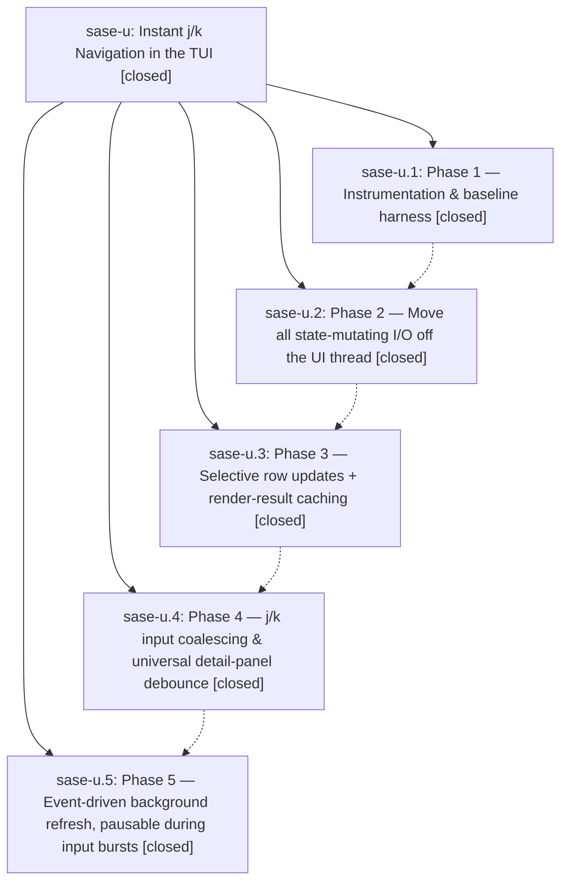

# Bead: sase-u — Instant j/k Navigation in the TUI

[Bead Pages](../README.md) / sase-u

**Status:** ✓ closed · **Resolution:** (unrecorded) · **Type:** plan · **Tier:** epic
**Owner:** `bryanbugyi34@gmail.com`
**Created:** 2026-04-26 07:23:24 UTC · **Closed:** 2026-04-26 08:52:11 UTC
**Plan:** [202604/instant\_jk\_navigation.md](https://github.com/sase-org/sase--plans/blob/main/202604/instant_jk_navigation.md)

## Phases

| Bead | Title | Status | Size | Agents | Commits |
|---|---|---|---|---:|---:|
| [sase-u.1](sase-u.1.md) | Phase 1 — Instrumentation & baseline harness | ✓ closed | small | 0 | 1 |
| [sase-u.2](sase-u.2.md) | Phase 2 — Move all state-mutating I/O off the UI thread | ✓ closed | small | 0 | 1 |
| [sase-u.3](sase-u.3.md) | Phase 3 — Selective row updates + render-result caching | ✓ closed | small | 0 | 1 |
| [sase-u.4](sase-u.4.md) | Phase 4 — j/k input coalescing & universal detail-panel debounce | ✓ closed | small | 0 | 1 |
| [sase-u.5](sase-u.5.md) | Phase 5 — Event-driven background refresh, pausable during input bursts | ✓ closed | small | 0 | 1 |

## Lineage

## Commits

| Commit | Subject | Bead | Committed (UTC) |
|---|---|---|---|
| [`e32eab2`](https://github.com/sase-org/sase/commit/e32eab2fa004b172b1384eebd5d99520e3bffc00) | feat: add SASE\_TUI\_PERF=1 j/k key-to-paint instrumentation + baseline harness (sase-u.1) | [sase-u.1](sase-u.1.md) | 2026-04-26 07:39:37 |
| [`3780207`](https://github.com/sase-org/sase/commit/3780207dc8a035b3704f2996827855f00fdaa04e) | feat: move TUI auto-approve and bulk-dismiss disk I/O off the event loop (sase-u.2) | [sase-u.2](sase-u.2.md) | 2026-04-26 07:55:16 |
| [`e44715f`](https://github.com/sase-org/sase/commit/e44715f2c8cd921c09af784ee0225ae5b837326d) | feat(ace): tab-agnostic detail-panel debouncer for j/k navigation (sase-u.4) | [sase-u.4](sase-u.4.md) | 2026-04-26 08:17:47 |
| [`3e8a9f9`](https://github.com/sase-org/sase/commit/3e8a9f97c0b932faffee5ea06b10f1a448c994ef) | feat(ace): event-driven artifact refresh with j/k nav gate (sase-u.5) | [sase-u.5](sase-u.5.md) | 2026-04-26 08:31:33 |
| [`e2f4617`](https://github.com/sase-org/sase/commit/e2f4617bcfb2df449d8dbcb296f4f3367a3d73ba) | feat(ace): selective row updates + render-result cache for agents tab (sase-u.3) | [sase-u.3](sase-u.3.md) | 2026-04-26 08:52:03 |
