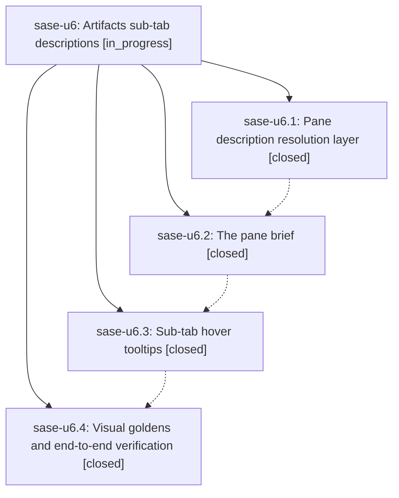

# Bead: sase-u6 — Artifacts sub-tab descriptions

[Bead Pages](../README.md) / sase-u6

**Status:** ◐ in_progress · **Type:** ▸ plan · **Tier:** epic
**Owner:** `bryanbugyi34@gmail.com` · **Created by:** [bbugyi200.athena.0e2](https://github.com/sase-org/sase--agents/blob/main/families/bbugyi200.athena.0e2.md) · **Assignee:** `sase-u6.land`
**Created:** 2026-08-26 07:55:16 EDT
**Plan:** [202608/artifacts\_subtab\_descriptions.md](https://github.com/sase-org/sase--plans/blob/main/202608/artifacts_subtab_descriptions.md)

<!-- sase:links:start -->

## Links

| Relation | Artifact | Why |
| --- | --- | --- |
| implemented-by | [plan:202608/artifacts_subtab_descriptions.md][1] | derived from the plan's `bead_id:` frontmatter field |

[1]: https://github.com/sase-org/sase--plans/blob/main/202608/artifacts_subtab_descriptions.md

<!-- sase:links:end -->

## Description

Every Artifacts sub-tab — the five built-ins, the Plan pane, and every pane a sidecar ref creates — carries a resolved, never-empty description that the TUI renders as an accent-anchored pane brief under the sub-tab strip and as a hover tooltip on the strip itself, with the copy configurable per pane from a sidecar's ref spec or the user's sase.yml.

## Notes

[2026-08-26T12:37:05Z · 0e3] DISCOVERED ISSUE: During unrelated case-aware word-completion verification on 2026-08-26, `just check` escalated to the governed full test lane (core-identity-changed) and failed exactly `tests/ace/tui/test_artifacts_scaffold.py::test_subtab_strip_labels_and_accents_cover_all_panes` after 37,198 tests passed. Focused reproduction on the same tree also fails: `.venv/bin/pytest tests/ace/tui/test_artifacts_scaffold.py::test_subtab_strip_labels_and_accents_cover_all_panes -vv` reports that the test expects `ARTIFACTS_SUBTAB_ORDER == ("agents", "stitches", "patches", "beads", "agents", "files")`, but runtime has `("agents", "stitches", "patches", "beads", "files")`. No Artifacts source or test files are dirty in this word-completion change. This is causally linked to the active Artifacts sub-tab descriptions epic, especially phase `sase-u6.4` (visual goldens and end-to-end verification), rather than a new standalone task.

[2026-08-26T12:52:09Z · 0e5] DISCOVERED ISSUE: During file_ref_pool_extension_and_relative_path verification at c8a3c606871efe8cfe86dec918f477e9d05b17d6, `just check` escalated to the governed full test lane and failed exactly `tests/ace/tui/test_artifacts_scaffold.py::test_subtab_strip_labels_and_accents_cover_all_panes`; focused rerun of the same node also failed. Assertion expects `ARTIFACTS_SUBTAB_ORDER == ("agents", "stitches", "patches", "beads", "agents", "files")`, but runtime is `("agents", "stitches", "patches", "beads", "files")`. The current diff touches file-ref capture/rendering tests/docs, not ACE TUI scaffold/source. This independently corroborates note #1 on this active epic and remains causally linked to phase `sase-u6.4`.

[2026-08-26T12:58:28Z · 0e6] DISCOVERED ISSUE: While implementing plan:202608/ci_green_repair.md on 2026-08-26, targeted Agent-pane PNG tests passed 6/6 after updating only the six approved artifacts_agents_* goldens, but the full 'just test-visual' lane failed broadly with 334 failed / 476 passed / 1 skipped in 817.81s. The first sampled failures time out waiting for artifacts_subtab='patches' after page.press('2') while the last observed subtab is 'stitches', and the failure list spans many unrelated visual modules. I recorded the standing-backlog corroboration as +1 on task sase-r5; this note is here because the sampled signature is Artifacts sub-tab navigation and phase sase-u6.4 owns visual goldens/end-to-end verification for sub-tab work.

## Phases

| Bead | Title | Status | Size | Created | Agents | Commits |
|---|---|---|---|---|---:|---:|
| [sase-u6.1](sase-u6.1.md) | Pane description resolution layer | ✓ closed | medium | 2026-08-26 | 1 | 1 |
| [sase-u6.2](sase-u6.2.md) | The pane brief | ✓ closed | medium | 2026-08-26 | 1 | 1 |
| [sase-u6.3](sase-u6.3.md) | Sub-tab hover tooltips | ✓ closed | small | 2026-08-26 | 1 | 1 |
| [sase-u6.4](sase-u6.4.md) | Visual goldens and end-to-end verification | ✓ closed | small | 2026-08-26 | 1 | 1 |

## Lineage

## Agents

| Agent | Bead | Commits |
|---|---|---:|
| [bbugyi200.athena.sase-u6.1](https://github.com/sase-org/sase--agents/blob/main/agents/bbugyi200.athena.sase-u6.1/README.md) | [sase-u6.1](sase-u6.1.md) | 1 |
| [bbugyi200.athena.sase-u6.2](https://github.com/sase-org/sase--agents/blob/main/agents/bbugyi200.athena.sase-u6.2/README.md) | [sase-u6.2](sase-u6.2.md) | 1 |
| [bbugyi200.athena.sase-u6.3](https://github.com/sase-org/sase--agents/blob/main/agents/bbugyi200.athena.sase-u6.3/README.md) | [sase-u6.3](sase-u6.3.md) | 1 |
| [bbugyi200.athena.sase-u6.4](https://github.com/sase-org/sase--agents/blob/main/families/bbugyi200.athena.sase-u6.4.md) | [sase-u6.4](sase-u6.4.md) | 1 |
| [bbugyi200.athena.sase-u6.land](https://github.com/sase-org/sase--agents/blob/main/agents/bbugyi200.athena.sase-u6.land/README.md) | [sase-u6](README.md) | 0 |

## Commits

| Repo | Commit | Subject | Bead | Committed |
|---|---|---|---|---|
| sase | [`a792f5d`](https://github.com/sase-org/sase/commit/a792f5dc7eef7b937cf2d59f9d286840d392da82) | feat(artifacts): resolve pane descriptions | [sase-u6.1](sase-u6.1.md) | 2026-08-26 10:28:23 EDT |
| sase | [`ceaa377`](https://github.com/sase-org/sase/commit/ceaa377fe3d539948edaac34bcb401fe630d658b) | feat(artifacts): add the pane description brief | [sase-u6.2](sase-u6.2.md) | 2026-08-26 11:23:55 EDT |
| sase | [`23b7abf`](https://github.com/sase-org/sase/commit/23b7abf1b2e1817aaa307468209039253baadab6) | feat(tui): add tooltips to panel tab strip | [sase-u6.3](sase-u6.3.md) | 2026-08-26 11:43:05 EDT |
| sase | [`2cbe2f1`](https://github.com/sase-org/sase/commit/2cbe2f17d0d4e0b5fd7d1eec0cdf970303472268) | test(artifacts): add pane-description PNG goldens and rebaseline visuals | [sase-u6.4](sase-u6.4.md) | 2026-08-26 12:55:14 EDT |
