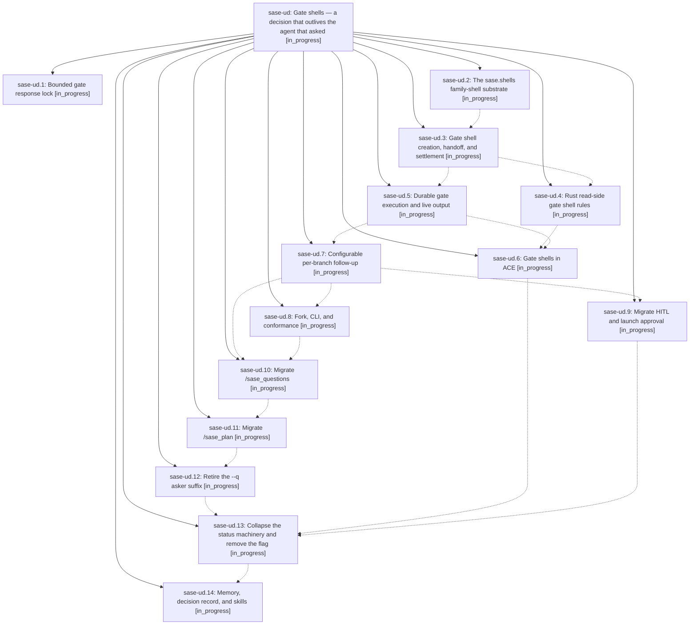

# Bead: sase-ud — Gate shells — a decision that outlives the agent that asked

[Bead Pages](../README.md) / sase-ud

**Status:** ◐ in_progress · **Type:** ▸ plan · **Tier:** epic
**Owner:** `bryanbugyi34@gmail.com` · **Created by:** [bbugyi200.athena.0eg](https://github.com/sase-org/sase--agents/blob/main/families/bbugyi200.athena.0eg.md) · **Assignee:** `sase-ud.land`
**Created:** 2026-08-26 14:02:50 EDT
**Plan:** [202608/gate\_shells.md](https://github.com/sase-org/sase--plans/blob/main/202608/gate_shells.md)

<!-- sase:links:start -->

## Links

| Relation | Artifact | Why |
| --- | --- | --- |
| implemented-by | [plan:202608/gate_shells.md][1] | derived from the plan's `bead_id:` frontmatter field |

[1]: https://github.com/sase-org/sase--plans/blob/main/202608/gate_shells.md

<!-- sase:links:end -->

## Description

Every sase gate that an agent creates becomes a named gate shell in that agent's family, kills its creator instead of blocking it, streams its approved commands' live output into ACE, owns the family's TALE/QUESTION/APPROVED statuses, and launches a configurable follow-up agent carrying the gate's typed results — with gates and monitors sharing one family-shell substrate.

## Phases

| Bead | Title | Status | Size | Created | Agents | Commits |
|---|---|---|---|---|---:|---:|
| [sase-ud.1](sase-ud.1.md) | Bounded gate response lock | ◐ in_progress | small | 2026-08-26 | 1 | 1 |
| [sase-ud.10](sase-ud.10.md) | Migrate /sase\_questions | ◐ in_progress | large | 2026-08-26 | 1 | 0 |
| [sase-ud.11](sase-ud.11.md) | Migrate /sase\_plan | ◐ in_progress | large | 2026-08-26 | 1 | 0 |
| [sase-ud.12](sase-ud.12.md) | Retire the --q asker suffix | ◐ in_progress | large | 2026-08-26 | 1 | 0 |
| [sase-ud.13](sase-ud.13.md) | Collapse the status machinery and remove the flag | ◐ in_progress | large | 2026-08-26 | 1 | 0 |
| [sase-ud.14](sase-ud.14.md) | Memory, decision record, and skills | ◐ in_progress | small | 2026-08-26 | 1 | 0 |
| [sase-ud.2](sase-ud.2.md) | The sase.shells family-shell substrate | ◐ in_progress | large | 2026-08-26 | 1 | 0 |
| [sase-ud.3](sase-ud.3.md) | Gate shell creation, handoff, and settlement | ◐ in_progress | large | 2026-08-26 | 1 | 0 |
| [sase-ud.4](sase-ud.4.md) | Rust read-side gate shell rules | ◐ in_progress | medium | 2026-08-26 | 1 | 0 |
| [sase-ud.5](sase-ud.5.md) | Durable gate execution and live output | ◐ in_progress | medium | 2026-08-26 | 1 | 0 |
| [sase-ud.6](sase-ud.6.md) | Gate shells in ACE | ◐ in_progress | large | 2026-08-26 | 1 | 0 |
| [sase-ud.7](sase-ud.7.md) | Configurable per-branch follow-up | ◐ in_progress | large | 2026-08-26 | 1 | 0 |
| [sase-ud.8](sase-ud.8.md) | Fork, CLI, and conformance | ◐ in_progress | medium | 2026-08-26 | 1 | 0 |
| [sase-ud.9](sase-ud.9.md) | Migrate HITL and launch approval | ◐ in_progress | medium | 2026-08-26 | 1 | 0 |

## Lineage

## Agents

| Agent | Bead | Commits |
|---|---|---:|
| [bbugyi200.athena.sase-ud.1](https://github.com/sase-org/sase--agents/blob/main/agents/bbugyi200.athena.sase-ud.1/README.md) | [sase-ud.1](sase-ud.1.md) | 1 |
| [bbugyi200.athena.sase-ud.10](https://github.com/sase-org/sase--agents/blob/main/agents/bbugyi200.athena.sase-ud.10/README.md) | [sase-ud.10](sase-ud.10.md) | 0 |
| [bbugyi200.athena.sase-ud.11](https://github.com/sase-org/sase--agents/blob/main/agents/bbugyi200.athena.sase-ud.11/README.md) | [sase-ud.11](sase-ud.11.md) | 0 |
| [bbugyi200.athena.sase-ud.12](https://github.com/sase-org/sase--agents/blob/main/agents/bbugyi200.athena.sase-ud.12/README.md) | [sase-ud.12](sase-ud.12.md) | 0 |
| [bbugyi200.athena.sase-ud.13](https://github.com/sase-org/sase--agents/blob/main/agents/bbugyi200.athena.sase-ud.13/README.md) | [sase-ud.13](sase-ud.13.md) | 0 |
| [bbugyi200.athena.sase-ud.14](https://github.com/sase-org/sase--agents/blob/main/agents/bbugyi200.athena.sase-ud.14/README.md) | [sase-ud.14](sase-ud.14.md) | 0 |
| [bbugyi200.athena.sase-ud.2](https://github.com/sase-org/sase--agents/blob/main/families/bbugyi200.athena.sase-ud.2.md) | [sase-ud.2](sase-ud.2.md) | 0 |
| [bbugyi200.athena.sase-ud.3](https://github.com/sase-org/sase--agents/blob/main/agents/bbugyi200.athena.sase-ud.3/README.md) | [sase-ud.3](sase-ud.3.md) | 0 |
| [bbugyi200.athena.sase-ud.4](https://github.com/sase-org/sase--agents/blob/main/agents/bbugyi200.athena.sase-ud.4/README.md) | [sase-ud.4](sase-ud.4.md) | 0 |
| [bbugyi200.athena.sase-ud.5](https://github.com/sase-org/sase--agents/blob/main/agents/bbugyi200.athena.sase-ud.5/README.md) | [sase-ud.5](sase-ud.5.md) | 0 |
| [bbugyi200.athena.sase-ud.6](https://github.com/sase-org/sase--agents/blob/main/agents/bbugyi200.athena.sase-ud.6/README.md) | [sase-ud.6](sase-ud.6.md) | 0 |
| [bbugyi200.athena.sase-ud.7](https://github.com/sase-org/sase--agents/blob/main/agents/bbugyi200.athena.sase-ud.7/README.md) | [sase-ud.7](sase-ud.7.md) | 0 |
| [bbugyi200.athena.sase-ud.8](https://github.com/sase-org/sase--agents/blob/main/agents/bbugyi200.athena.sase-ud.8/README.md) | [sase-ud.8](sase-ud.8.md) | 0 |
| [bbugyi200.athena.sase-ud.9](https://github.com/sase-org/sase--agents/blob/main/agents/bbugyi200.athena.sase-ud.9/README.md) | [sase-ud.9](sase-ud.9.md) | 0 |
| [bbugyi200.athena.sase-ud.land](https://github.com/sase-org/sase--agents/blob/main/agents/bbugyi200.athena.sase-ud.land/README.md) | [sase-ud](README.md) | 0 |

## Commits

| Repo | Commit | Subject | Bead | Committed |
|---|---|---|---|---|
| sase | [`00bb5a0`](https://github.com/sase-org/sase/commit/00bb5a0824bc02a0eadadcf9b1aa352ef17cd920) | fix(notification-gates): bound cancel\_gate lock acquisition with a timeout | [sase-ud.1](sase-ud.1.md) | 2026-08-26 14:18:31 EDT |
