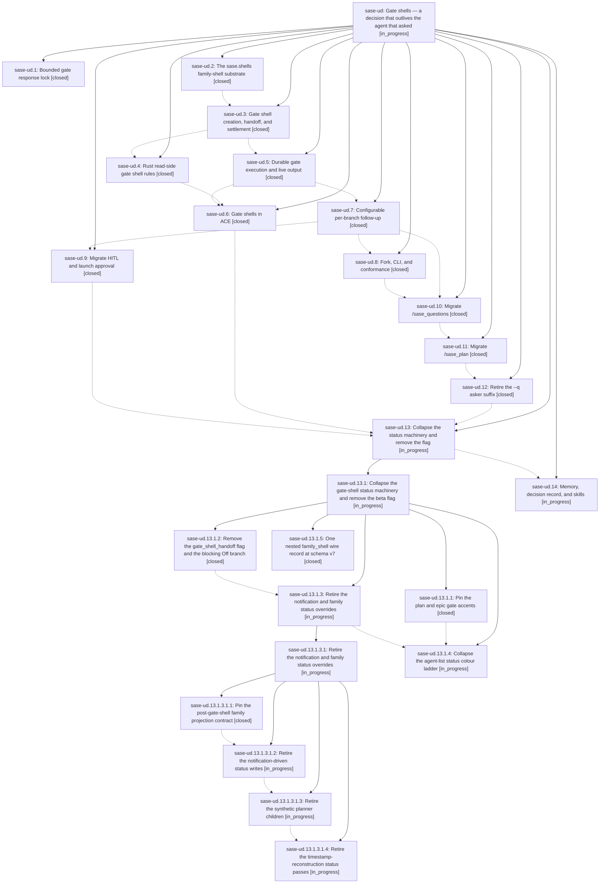

# Bead: sase-ud — Gate shells — a decision that outlives the agent that asked

[Bead Pages](../README.md) / sase-ud

**Status:** ◐ in_progress · **Type:** ▸ plan · **Tier:** epic
**Owner:** `bryanbugyi34@gmail.com` · **Created by:** [bbugyi200.athena.0eg](https://github.com/sase-org/sase--agents/blob/main/families/bbugyi200.athena.0eg.md) · **Assignee:** `sase-ud.land`
**Created:** 2026-08-26 14:02:50 EDT
**Plan:** [202608/gate\_shells.md](https://github.com/sase-org/sase--plans/blob/main/202608/gate_shells.md)

<!-- sase:links:start -->

## Links

| Relation | Artifact | Why |
| --- | --- | --- |
| implemented-by | [plan:202608/gate_shells.md][1] | derived from the plan's `bead_id:` frontmatter field |

[1]: https://github.com/sase-org/sase--plans/blob/main/202608/gate_shells.md

<!-- sase:links:end -->

## Description

Every sase gate that an agent creates becomes a named gate shell in that agent's family, kills its creator instead of blocking it, streams its approved commands' live output into ACE, owns the family's TALE/QUESTION/APPROVED statuses, and launches a configurable follow-up agent carrying the gate's typed results — with gates and monitors sharing one family-shell substrate.

## Phases

| Bead | Title | Status | Size | Created | Agents | Commits |
|---|---|---|---|---|---:|---:|
| [sase-ud.1](sase-ud.1.md) | Bounded gate response lock | ✓ closed | small | 2026-08-26 | 1 | 1 |
| [sase-ud.10](sase-ud.10.md) | Migrate /sase\_questions | ✓ closed | large | 2026-08-26 | 1 | 1 |
| [sase-ud.11](sase-ud.11.md) | Migrate /sase\_plan | ✓ closed | large | 2026-08-26 | 1 | 1 |
| [sase-ud.12](sase-ud.12.md) | Retire the --q asker suffix | ✓ closed | large | 2026-08-26 | 1 | 1 |
| [sase-ud.13](sase-ud.13.md) | Collapse the status machinery and remove the flag | ◐ in_progress | large | 2026-08-26 | 1 | 0 |
| [sase-ud.14](sase-ud.14.md) | Memory, decision record, and skills | ◐ in_progress | small | 2026-08-26 | 1 | 0 |
| [sase-ud.2](sase-ud.2.md) | The sase.shells family-shell substrate | ✓ closed | large | 2026-08-26 | 1 | 1 |
| [sase-ud.3](sase-ud.3.md) | Gate shell creation, handoff, and settlement | ✓ closed | large | 2026-08-26 | 1 | 1 |
| [sase-ud.4](sase-ud.4.md) | Rust read-side gate shell rules | ✓ closed | medium | 2026-08-26 | 1 | 2 |
| [sase-ud.5](sase-ud.5.md) | Durable gate execution and live output | ✓ closed | medium | 2026-08-26 | 1 | 1 |
| [sase-ud.6](sase-ud.6.md) | Gate shells in ACE | ✓ closed | large | 2026-08-26 | 1 | 1 |
| [sase-ud.7](sase-ud.7.md) | Configurable per-branch follow-up | ✓ closed | large | 2026-08-26 | 1 | 1 |
| [sase-ud.8](sase-ud.8.md) | Fork, CLI, and conformance | ✓ closed | medium | 2026-08-26 | 1 | 1 |
| [sase-ud.9](sase-ud.9.md) | Migrate HITL and launch approval | ✓ closed | medium | 2026-08-26 | 1 | 2 |

## Lineage

## Agents

| Agent | Bead | Commits |
|---|---|---:|
| [bbugyi200.athena.sase-ud.1](https://github.com/sase-org/sase--agents/blob/main/agents/bbugyi200.athena.sase-ud.1/README.md) | [sase-ud.1](sase-ud.1.md) | 1 |
| [bbugyi200.athena.sase-ud.10](https://github.com/sase-org/sase--agents/blob/main/families/bbugyi200.athena.sase-ud.10.md) | [sase-ud.10](sase-ud.10.md) | 1 |
| [bbugyi200.athena.sase-ud.11](https://github.com/sase-org/sase--agents/blob/main/families/bbugyi200.athena.sase-ud.11.md) | [sase-ud.11](sase-ud.11.md) | 1 |
| [bbugyi200.athena.sase-ud.12](https://github.com/sase-org/sase--agents/blob/main/families/bbugyi200.athena.sase-ud.12.md) | [sase-ud.12](sase-ud.12.md) | 1 |
| [bbugyi200.athena.sase-ud.13](https://github.com/sase-org/sase--agents/blob/main/families/bbugyi200.athena.sase-ud.13.md) | [sase-ud.13](sase-ud.13.md) | 0 |
| [bbugyi200.athena.sase-ud.13.1.1](https://github.com/sase-org/sase--agents/blob/main/agents/bbugyi200.athena.sase-ud.13.1.1/README.md) | [sase-ud.13.1.1](sase-ud.13.1.1.md) | 1 |
| [bbugyi200.athena.sase-ud.13.1.2](https://github.com/sase-org/sase--agents/blob/main/families/bbugyi200.athena.sase-ud.13.1.2.md) | [sase-ud.13.1.2](sase-ud.13.1.2.md) | 1 |
| [bbugyi200.athena.sase-ud.13.1.3](https://github.com/sase-org/sase--agents/blob/main/families/bbugyi200.athena.sase-ud.13.1.3.md) | [sase-ud.13.1.3](sase-ud.13.1.3.md) | 0 |
| [bbugyi200.athena.sase-ud.13.1.3.1.1](https://github.com/sase-org/sase--agents/blob/main/families/bbugyi200.athena.sase-ud.13.1.3.1.1.md) | [sase-ud.13.1.3.1.1](sase-ud.13.1.3.1.1.md) | 1 |
| [bbugyi200.athena.sase-ud.13.1.3.1.2](https://github.com/sase-org/sase--agents/blob/main/agents/bbugyi200.athena.sase-ud.13.1.3.1.2/README.md) | [sase-ud.13.1.3.1.2](sase-ud.13.1.3.1.2.md) | 0 |
| [bbugyi200.athena.sase-ud.13.1.3.1.3](https://github.com/sase-org/sase--agents/blob/main/agents/bbugyi200.athena.sase-ud.13.1.3.1.3/README.md) | [sase-ud.13.1.3.1.3](sase-ud.13.1.3.1.3.md) | 0 |
| [bbugyi200.athena.sase-ud.13.1.3.1.4](https://github.com/sase-org/sase--agents/blob/main/agents/bbugyi200.athena.sase-ud.13.1.3.1.4/README.md) | [sase-ud.13.1.3.1.4](sase-ud.13.1.3.1.4.md) | 0 |
| [bbugyi200.athena.sase-ud.13.1.3.1.land](https://github.com/sase-org/sase--agents/blob/main/agents/bbugyi200.athena.sase-ud.13.1.3.1.land/README.md) | [sase-ud.13.1.3.1](sase-ud.13.1.3.1.md) | 0 |
| [bbugyi200.athena.sase-ud.13.1.4](https://github.com/sase-org/sase--agents/blob/main/agents/bbugyi200.athena.sase-ud.13.1.4/README.md) | [sase-ud.13.1.4](sase-ud.13.1.4.md) | 0 |
| [bbugyi200.athena.sase-ud.13.1.5](https://github.com/sase-org/sase--agents/blob/main/agents/bbugyi200.athena.sase-ud.13.1.5/README.md) | [sase-ud.13.1.5](sase-ud.13.1.5.md) | 2 |
| [bbugyi200.athena.sase-ud.13.1.land](https://github.com/sase-org/sase--agents/blob/main/agents/bbugyi200.athena.sase-ud.13.1.land/README.md) | [sase-ud.13.1](sase-ud.13.1.md) | 0 |
| [bbugyi200.athena.sase-ud.14](https://github.com/sase-org/sase--agents/blob/main/agents/bbugyi200.athena.sase-ud.14/README.md) | [sase-ud.14](sase-ud.14.md) | 0 |
| [bbugyi200.athena.sase-ud.2](https://github.com/sase-org/sase--agents/blob/main/families/bbugyi200.athena.sase-ud.2.md) | [sase-ud.2](sase-ud.2.md) | 1 |
| [bbugyi200.athena.sase-ud.3](https://github.com/sase-org/sase--agents/blob/main/families/bbugyi200.athena.sase-ud.3.md) | [sase-ud.3](sase-ud.3.md) | 1 |
| [bbugyi200.athena.sase-ud.4](https://github.com/sase-org/sase--agents/blob/main/agents/bbugyi200.athena.sase-ud.4/README.md) | [sase-ud.4](sase-ud.4.md) | 2 |
| [bbugyi200.athena.sase-ud.5](https://github.com/sase-org/sase--agents/blob/main/agents/bbugyi200.athena.sase-ud.5/README.md) | [sase-ud.5](sase-ud.5.md) | 1 |
| [bbugyi200.athena.sase-ud.6](https://github.com/sase-org/sase--agents/blob/main/families/bbugyi200.athena.sase-ud.6.md) | [sase-ud.6](sase-ud.6.md) | 1 |
| [bbugyi200.athena.sase-ud.7](https://github.com/sase-org/sase--agents/blob/main/families/bbugyi200.athena.sase-ud.7.md) | [sase-ud.7](sase-ud.7.md) | 1 |
| [bbugyi200.athena.sase-ud.8](https://github.com/sase-org/sase--agents/blob/main/agents/bbugyi200.athena.sase-ud.8/README.md) | [sase-ud.8](sase-ud.8.md) | 1 |
| [bbugyi200.athena.sase-ud.9](https://github.com/sase-org/sase--agents/blob/main/agents/bbugyi200.athena.sase-ud.9/README.md) | [sase-ud.9](sase-ud.9.md) | 2 |
| [bbugyi200.athena.sase-ud.land](https://github.com/sase-org/sase--agents/blob/main/agents/bbugyi200.athena.sase-ud.land/README.md) | [sase-ud](README.md) | 0 |

## Commits

| Repo | Commit | Subject | Bead | Committed |
|---|---|---|---|---|
| sase | [`00bb5a0`](https://github.com/sase-org/sase/commit/00bb5a0824bc02a0eadadcf9b1aa352ef17cd920) | fix(notification-gates): bound cancel\_gate lock acquisition with a timeout | [sase-ud.1](sase-ud.1.md) | 2026-08-26 14:18:31 EDT |
| sase | [`e16872c`](https://github.com/sase-org/sase/commit/e16872c9deaa9e48cf73e9d26196adf6bae621d8) | feat(shells): add shells substrate | [sase-ud.2](sase-ud.2.md) | 2026-08-26 15:53:46 EDT |
| sase | [`1cb772d`](https://github.com/sase-org/sase/commit/1cb772d9c38e648f432460e0a097e78e4ef06df6) | feat(gate): add gate shell lifecycle | [sase-ud.3](sase-ud.3.md) | 2026-08-26 16:52:30 EDT |
| sase | [`5a82847`](https://github.com/sase-org/sase/commit/5a8284733de96e1aa0665bdcc7d5ac5a82a3be0c) | feat: project gate shell read metadata | [sase-ud.4](sase-ud.4.md) | 2026-08-26 17:26:04 EDT |
| sase-core | [`sase-core@1983158`](https://github.com/sase-org/sase-core/commit/1983158782d1ce0d1c8431cadc62493101fd4ddf) | feat: scan gate shell read metadata | [sase-ud.4](sase-ud.4.md) | 2026-08-26 17:27:00 EDT |
| sase | [`460aa87`](https://github.com/sase-org/sase/commit/460aa87863cb8355582c5bc15ecb6679464bd109) | feat(gate): stream gate-shell command output to gate.log and add answer --detach | [sase-ud.5](sase-ud.5.md) | 2026-08-26 18:06:45 EDT |
| sase | [`10d2c17`](https://github.com/sase-org/sase/commit/10d2c17a171ffff1fcf700edadc46be1e4405f2e) | feat(ace): render gate shell rows in agents tui | [sase-ud.6](sase-ud.6.md) | 2026-08-26 21:19:23 EDT |
| sase | [`72abf37`](https://github.com/sase-org/sase/commit/72abf372901571748ba63dc5a88213ac3ba7e875) | feat(gate-shell): add configurable per-branch follow-up (sase-ud.7) | [sase-ud.7](sase-ud.7.md) | 2026-08-26 21:28:20 EDT |
| sase | [`277099e`](https://github.com/sase-org/sase/commit/277099e77516daba6b338faa866dd9b5f0a12d8b) | feat(gates): migrate HITL and launch approval to shells | [sase-ud.9](sase-ud.9.md) | 2026-08-26 22:22:41 EDT |
| sase--agents | [`sase--agents@8fc9605`](https://github.com/sase-org/sase--agents/commit/8fc96055cba06fda99105f666273697b068350f8) | docs(prompts): archive August prompt materials | [sase-ud.9](sase-ud.9.md) | 2026-08-26 22:40:36 EDT |
| sase | [`d4c3bb4`](https://github.com/sase-org/sase/commit/d4c3bb4083fe11d0b74d3e9ab3fa7ebe0b19e6e1) | feat(gate-shell): add fork classification, CLI list/show/cancel, and shell conformance | [sase-ud.8](sase-ud.8.md) | 2026-08-26 22:43:35 EDT |
| sase | [`05ce87f`](https://github.com/sase-org/sase/commit/05ce87fbf3d0942372ccc3b74cec299f8374af39) | feat(gate-shell): migrate /sase\_questions to a gate shell behind gate\_shell\_handoff | [sase-ud.10](sase-ud.10.md) | 2026-08-27 00:13:19 EDT |
| sase | [`32da1f3`](https://github.com/sase-org/sase/commit/32da1f3d2d76878f61dec184514b7e8620e0b461) | feat(plan): add shell-backed approval handoff | [sase-ud.11](sase-ud.11.md) | 2026-08-27 01:34:36 EDT |
| sase | [`777e51e`](https://github.com/sase-org/sase/commit/777e51e734a6770e232e039ecfa159a199247295) | feat(agents): retire q asker suffix | [sase-ud.12](sase-ud.12.md) | 2026-08-27 08:31:56 EDT |
| sase | [`c133ff7`](https://github.com/sase-org/sase/commit/c133ff76868f706033770ba7488cfbac869b60b0) | fix(plan-shell): pin gate accents to ladder | [sase-ud.13.1.1](sase-ud.13.1.1.md) | 2026-08-27 09:08:36 EDT |
| sase | [`588a1cf`](https://github.com/sase-org/sase/commit/588a1cfaeb86331ce59ec5e649a77682674f2015) | feat(agent-scan): fold monitor\_\*/gate\_\* wire fields into nested family\_shell at schema v7 | [sase-ud.13.1.5](sase-ud.13.1.5.md) | 2026-08-27 11:06:51 EDT |
| sase-core | [`sase-core@f0224ef`](https://github.com/sase-org/sase-core/commit/f0224efa66a0f31f1d4b96b7e4bcd04f2902c80b) | feat(agent-scan): fold monitor\_\*/gate\_\* wire fields into nested family\_shell at schema v7 | [sase-ud.13.1.5](sase-ud.13.1.5.md) | 2026-08-27 11:07:52 EDT |
| sase | [`a646bda`](https://github.com/sase-org/sase/commit/a646bdaf6b75838326f8c9d16f42fb935393e5c1) | refactor(plan-gate): remove the gate\_shell\_handoff flag and blocking Off branch | [sase-ud.13.1.2](sase-ud.13.1.2.md) | 2026-08-27 11:14:29 EDT |
| sase | [`2f8bc9a`](https://github.com/sase-org/sase/commit/2f8bc9abb4e90d23f5e1dd1c171da61d5639b1b8) | test(status-strip): pin gate-shell family projection contract for \_apply\_status\_overrides | [sase-ud.13.1.3.1.1](sase-ud.13.1.3.1.1.md) | 2026-08-27 12:27:38 EDT |
