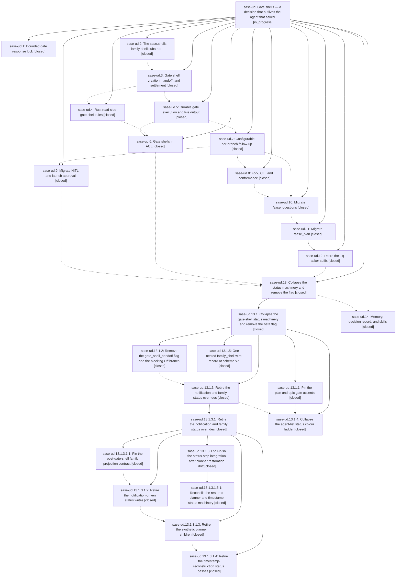

# Bead: sase-ud — Gate shells — a decision that outlives the agent that asked

[Bead Pages](../README.md) / sase-ud

**Status:** ◐ in_progress · **Type:** ▸ plan · **Tier:** epic
**Owner:** `bryanbugyi34@gmail.com` · **Created by:** [bbugyi200.athena.0eg](https://github.com/sase-org/sase--agents/blob/main/families/bbugyi200.athena.0eg.md) · **Assignee:** `sase-ud.land`
**Created:** 2026-08-26 14:02:50 EDT
**Plan:** [202608/gate\_shells.md](https://github.com/sase-org/sase--plans/blob/main/202608/gate_shells.md)

<!-- sase:links:start -->

## Links

| Relation | Artifact | Why |
| --- | --- | --- |
| implemented-by | [plan:202608/gate_shells.md][1] | derived from the plan's `bead_id:` frontmatter field |

[1]: https://github.com/sase-org/sase--plans/blob/main/202608/gate_shells.md

<!-- sase:links:end -->

## Description

Every sase gate that an agent creates becomes a named gate shell in that agent's family, kills its creator instead of blocking it, streams its approved commands' live output into ACE, owns the family's TALE/QUESTION/APPROVED statuses, and launches a configurable follow-up agent carrying the gate's typed results — with gates and monitors sharing one family-shell substrate.

## Notes

[2026-08-27T18:29:48Z · 0f4] DISCOVERED ISSUE: tale gate settlement silently drops the coder follow-up — approving a tale settles the gate shell to TALE APPROVED and launches nothing (no --code member, no gate_followup_error, no log line, nothing for ACE to render). Caused by a strictness divergence between two phases of this epic: sase-ud.7 (72abf3729) added the settlement-time re-parse gate_shell/followup_policy.py::_parse_shell, which calls GateShellSpec.from_mapping WITHOUT allow_branch_subsets; sase-ud.11 (32da1f3d2) then added allow_branch_subsets (notification_gates/model_request.py:249-253, allow_branch_subsets=kind in {'epic_plan','plan'}) plus a tale shell block whose 'approve' and 'commit' branch keys are subsets of the compiled multi-option branch ['approve','commit'] (plan_gate.py:160 TALE_PLAN_SUBMIT_GROUP). Settlement is therefore stricter than creation: _valid_branch_keys rejects the singleton keys, from_mapping raises GateError('shell branch key must be a compiled branch or timeout, stopped, or failed'), and _parse_shell's bare 'except Exception: return None' swallows it. resolve_gate_followup then returns None, settlement._apply_branch_policy deletes gate_next_action, and shells/settlement.py:55,74 keys the whole launch decision off that field — so it skips the launch arm AND every _record_followup_outcome/_record_followup_error call, writes nothing, and releases the claim. plan_next_action / prepare_accepted_plan_successor are never reached. Reproduced against the live 0f2 gate (project gh_bobs-org__bob-cli, gate 773c2f50-61a2-4431-bf3f-11825dd52ff8): _parse_shell returns None, policy None, presentation (None, None); its settled agent_meta.json has no gate_next_action and no gate_followup_* field, gate_next_fork is still 'family' and gate_accent still '#FF87AF' (creation-time shell.next values, never overwritten by the approve+commit branch's 'none'/'#00D7D7'), and the agent name registry holds 0f2, 0f2--plan, 0f2--gate but no 0f2--code. Blast radius: every tale approval since 32da1f3d2 — the gate-shell path is now the only path that launches a tale's coder, so the capability is fully broken. Epic plan gates and question/HITL/launch-approval/custom gates are unaffected (plan_gate.py:160 is the only place in src/ declaring gate groups, so no other kind compiles a multi-option branch). Test gap: every gate-shell settlement/policy test uses single-option compiled branches ((('cleanup',),('reject',)), (('submit',),)); tests/plan_shell/test_create.py uses the tale shape but only ever parses it with allow_branch_subsets=True, reproducing the divergence rather than catching it. A tale plan fixing this is being proposed: share one SUBSET_BRANCH_GATE_KINDS constant between creation and settlement, key the settlement parse off the envelope's own kind, log + record gate_followup_error instead of swallowing, and add a conformance test asserting settlement never parses more strictly than creation.

[2026-08-27T23:28:59Z · 0fb] DISCOVERED ISSUE: every gate-shell handoff reports its creator as a FAILED agent run, publishing a spurious second notification for one decision. handle_gate_marker (axe/run_agent_exec_gate.py:93, added by 1cb772d9c as a copy of run_agent_exec_monitor.py) returns the new loop outcome 'gated', but none of the four downstream sites that special-case the older 'monitored' handoff outcome were taught about it. Consequences, all confirmed on 0f9--plan (gh_bobs-org__bob-cli, artifacts .../ace-run/202608/27/20260827185959) and on every --plan handoff today (0ey.f2, 0ez, 0f0, 0f1, 0f2, 0f3, 0f4, 0f9): (1) run_agent_runner_finalize.py:321 returns early only for {plan_rejected, monitored}, so a sender='user-agent' notification 'CODEX(gpt-5.6-sol) @0f9 failed' is published 1s after the gate's own sender='plan' 'Tale ready for review' notification — this is the user-reported symptom; (2) run_agent_exec_finalize.py:164 reuses the handoff transcript only for 'monitored', so finalize_loop re-saves the chat with response_content='' and clobbers the '# Gate handoff' body handle_gate_marker just wrote — every gated chat file on this host has an empty '## Response'; (3) run_agent_exec_finalize.py:183 omits 'gated' from the {completed, monitored} branch, so the creator writes done.json outcome 'gated' with no artifacts, colliding with the gate shell MEMBER's own outcome 'gated' marker (gate_shell/settlement.py:216) — core/dismissed_agent_completion.effective_done_outcome then looks for a gate_state the creator does not have and fails closed to FAILURE_OUTCOME, so %wait dependency resolution sees the creator as a failed artifact; (4) run_agent_exec_finalize.py:279 omits 'gated' from the success set, so the run logs 'Agent completed with status: FAILED' and run_agent_runner_lifecycle.py:189 takes the visible-failure branch, calling hold_workspace_claim for a claim the gate shell already moved to workflow 'ace-gate' and printing 'Error holding workspace #10 ... was not found'. The monitor handoff is exempted from that whole block by monitor_handoff_claim_transferred; the gate handoff has no equivalent, and fixing (4) without adding one would turn the harmless hold error into an active release_workspace + clear_occupant_record of the pending gate shell's workspace. Not affected: the SIGTERM path, which already covers every non-monitor handoff marker via run_agent_runner_signals._NON_MONITOR_HANDOFF_MARKERS. A tale plan fixing this is being proposed: share one SHELL_HANDOFF_OUTCOMES constant between the monitor and gate outcomes, use it at all four sites, add a gate analogue of monitor_handoff_claim_transferred keyed on workflow 'ace-gate' (no pid-liveness check, because a pending gate shell has no process and deliberately keeps the dead creator's pid), and add a parity guard test so the next shell kind cannot repeat this.

[2026-08-27T23:29:32Z · 0fb] DISCOVERED ISSUE: a pending gate shell never actually holds its workspace — ACE's Agents-tab loader frees it within ~10-30s of creation, every time. gate_shell/start_claim.move_gate_shell_claim transfers the creator's RUNNING-field claim to workflow 'ace-gate' keeping from_pid == to_pid == creator_pid, then the creator process is killed; ace/scheduler/stale_running_cleanup._gate_claim_is_releasable documents and respects that ('Pending gate shells intentionally keep the creator's old PID in the RUNNING row'), but ace/tui/models/_loaders/_running_loaders.py:139 does not: load_agents_from_running_field calls _release_stale_running_claim on ANY unpinned claim whose pid is not live, with no monitor/gate awareness and no caller_tag. Evidence from ~/.sase/logs/workspace_claims.jsonl for 2026-08-27: 7 of 7 gate-shell claims that survived creation were released by the ACE TUI (pid 3425508, untagged 'release') shortly after their 'gate-shell-create' transfer — 190424 create ws#10 -> 190440 release; 140926 -> 140933; 141042 -> 141108; 141808 -> 142010; 142327 -> 142348; 143115 -> 143128; 121141 -> 121149. Consequence at settlement: gate_shell/followup.py passes transfer_from_pid=gate_creator_claim_pid, the transfer fails ('workspace #10 with pid 290816 was not found'), and the follow-up records gate_followup_outcome 'launched-degraded' with _fresh_claim_degraded_reason — visible verbatim in 0f9--gate's done.json. Every gate-shell follow-up launch on this host is therefore degraded. Worse latent case: between the release and the settlement the workspace is back in the free pool, so an unrelated agent can take it and the follow-up degrades all the way to workspace #0 (_workspace_zero_degraded_reason), losing the gate's approved-command workspace. Monitor claims are not affected because a monitor's supervisor pid is live. Likely fix: teach the loader the same rule stale_running_cleanup already encodes — skip GATE_WORKSPACE_CLAIM_WORKFLOW ('ace-gate') claims unless the owning gate-shell member's marker says it is terminal, and pass a caller_tag so the ledger attributes the release. Separate root cause from the 'gated' outcome-parity issue noted above; not covered by the tale plan being proposed for that one.

[2026-08-28T11:24:08Z · 0fc--code] DISCOVERED ISSUE: Approved plan 202608/axe_chop_summary_contract.md fixed the gate_shell_reclaim chop's result-reporting contract, but the public helper src/sase/gate_shell/reclaim.py::reclaim_pending_gate_shells still returns the private dataclass _GateShellReclaimSummary. That shape is now consumed by the builtin chop's structured summary path, so the gate-shell epic should decide whether the summary type should be public or the public helper should expose a stable non-private result contract. Scope: make the reclaim summary API explicit and keep symvision expectations aligned.

[2026-08-28T14:47:15Z · 0fi--code] Note #4 is resolved by tale plan 202608/gate_shell_reclaim_chop_contract.md (this workspace): _GateShellReclaimSummary is now the public GateShellReclaimSummary with bounded error_details, and sase_chop_gate_shell_reclaim consumes that type by name so the symbol stays live for symvision. Settlement semantics are unchanged.

[2026-08-28T15:31:36Z · 0fi--1] Correction to the earlier Note #4 resolution: 0fi--code implemented GateShellReclaimSummary + the chop contract in a different workspace clone, then the check-full follow-up resumed on a clean tree that did not contain those files. This follow-up re-applied the verified implementation in the landing workspace. Settlement semantics are still unchanged; the public reclaim result contract and chop rewrite are present again and will be declared for host-owned commit from this run.

## Phases

| Bead | Title | Status | Size | Created | Agents | Commits |
|---|---|---|---|---|---:|---:|
| [sase-ud.1](sase-ud.1.md) | Bounded gate response lock | ✓ closed | small | 2026-08-26 | 1 | 1 |
| [sase-ud.10](sase-ud.10.md) | Migrate /sase\_questions | ✓ closed | large | 2026-08-26 | 1 | 1 |
| [sase-ud.11](sase-ud.11.md) | Migrate /sase\_plan | ✓ closed | large | 2026-08-26 | 1 | 1 |
| [sase-ud.12](sase-ud.12.md) | Retire the --q asker suffix | ✓ closed | large | 2026-08-26 | 1 | 1 |
| [sase-ud.13](sase-ud.13.md) | Collapse the status machinery and remove the flag | ✓ closed | large | 2026-08-26 | 1 | 0 |
| [sase-ud.14](sase-ud.14.md) | Memory, decision record, and skills | ✓ closed | small | 2026-08-26 | 1 | 1 |
| [sase-ud.2](sase-ud.2.md) | The sase.shells family-shell substrate | ✓ closed | large | 2026-08-26 | 1 | 1 |
| [sase-ud.3](sase-ud.3.md) | Gate shell creation, handoff, and settlement | ✓ closed | large | 2026-08-26 | 1 | 1 |
| [sase-ud.4](sase-ud.4.md) | Rust read-side gate shell rules | ✓ closed | medium | 2026-08-26 | 1 | 2 |
| [sase-ud.5](sase-ud.5.md) | Durable gate execution and live output | ✓ closed | medium | 2026-08-26 | 1 | 1 |
| [sase-ud.6](sase-ud.6.md) | Gate shells in ACE | ✓ closed | large | 2026-08-26 | 1 | 1 |
| [sase-ud.7](sase-ud.7.md) | Configurable per-branch follow-up | ✓ closed | large | 2026-08-26 | 1 | 1 |
| [sase-ud.8](sase-ud.8.md) | Fork, CLI, and conformance | ✓ closed | medium | 2026-08-26 | 1 | 1 |
| [sase-ud.9](sase-ud.9.md) | Migrate HITL and launch approval | ✓ closed | medium | 2026-08-26 | 1 | 2 |

## Lineage

## Agents

| Agent | Bead | Commits |
|---|---|---:|
| [bbugyi200.athena.sase-ud.1](https://github.com/sase-org/sase--agents/blob/main/agents/bbugyi200.athena.sase-ud.1/README.md) | [sase-ud.1](sase-ud.1.md) | 1 |
| [bbugyi200.athena.sase-ud.10](https://github.com/sase-org/sase--agents/blob/main/families/bbugyi200.athena.sase-ud.10.md) | [sase-ud.10](sase-ud.10.md) | 1 |
| [bbugyi200.athena.sase-ud.11](https://github.com/sase-org/sase--agents/blob/main/families/bbugyi200.athena.sase-ud.11.md) | [sase-ud.11](sase-ud.11.md) | 1 |
| [bbugyi200.athena.sase-ud.12](https://github.com/sase-org/sase--agents/blob/main/families/bbugyi200.athena.sase-ud.12.md) | [sase-ud.12](sase-ud.12.md) | 1 |
| [bbugyi200.athena.sase-ud.13](https://github.com/sase-org/sase--agents/blob/main/families/bbugyi200.athena.sase-ud.13.md) | [sase-ud.13](sase-ud.13.md) | 0 |
| [bbugyi200.athena.sase-ud.13.1.1](https://github.com/sase-org/sase--agents/blob/main/agents/bbugyi200.athena.sase-ud.13.1.1/README.md) | [sase-ud.13.1.1](sase-ud.13.1.1.md) | 1 |
| [bbugyi200.athena.sase-ud.13.1.2](https://github.com/sase-org/sase--agents/blob/main/families/bbugyi200.athena.sase-ud.13.1.2.md) | [sase-ud.13.1.2](sase-ud.13.1.2.md) | 1 |
| [bbugyi200.athena.sase-ud.13.1.3](https://github.com/sase-org/sase--agents/blob/main/families/bbugyi200.athena.sase-ud.13.1.3.md) | [sase-ud.13.1.3](sase-ud.13.1.3.md) | 0 |
| [bbugyi200.athena.sase-ud.13.1.3.1.1](https://github.com/sase-org/sase--agents/blob/main/families/bbugyi200.athena.sase-ud.13.1.3.1.1.md) | [sase-ud.13.1.3.1.1](sase-ud.13.1.3.1.1.md) | 1 |
| [bbugyi200.athena.sase-ud.13.1.3.1.2](https://github.com/sase-org/sase--agents/blob/main/agents/bbugyi200.athena.sase-ud.13.1.3.1.2/README.md) | [sase-ud.13.1.3.1.2](sase-ud.13.1.3.1.2.md) | 1 |
| [bbugyi200.athena.sase-ud.13.1.3.1.3](https://github.com/sase-org/sase--agents/blob/main/agents/bbugyi200.athena.sase-ud.13.1.3.1.3/README.md) | [sase-ud.13.1.3.1.3](sase-ud.13.1.3.1.3.md) | 1 |
| [bbugyi200.athena.sase-ud.13.1.3.1.4](https://github.com/sase-org/sase--agents/blob/main/families/bbugyi200.athena.sase-ud.13.1.3.1.4.md) | [sase-ud.13.1.3.1.4](sase-ud.13.1.3.1.4.md) | 1 |
| [bbugyi200.athena.sase-ud.13.1.3.1.5.1](https://github.com/sase-org/sase--agents/blob/main/families/bbugyi200.athena.sase-ud.13.1.3.1.5.1.md) | [sase-ud.13.1.3.1.5.1](sase-ud.13.1.3.1.5.1.md) | 1 |
| [bbugyi200.athena.sase-ud.13.1.4](https://github.com/sase-org/sase--agents/blob/main/families/bbugyi200.athena.sase-ud.13.1.4.md) | [sase-ud.13.1.4](sase-ud.13.1.4.md) | 1 |
| [bbugyi200.athena.sase-ud.13.1.5](https://github.com/sase-org/sase--agents/blob/main/agents/bbugyi200.athena.sase-ud.13.1.5/README.md) | [sase-ud.13.1.5](sase-ud.13.1.5.md) | 2 |
| [bbugyi200.athena.sase-ud.13.1.land](https://github.com/sase-org/sase--agents/blob/main/families/bbugyi200.athena.sase-ud.13.1.land.md) | [sase-ud.13.1](sase-ud.13.1.md) | 0 |
| [bbugyi200.athena.sase-ud.14](https://github.com/sase-org/sase--agents/blob/main/agents/bbugyi200.athena.sase-ud.14/README.md) | [sase-ud.14](sase-ud.14.md) | 1 |
| [bbugyi200.athena.sase-ud.2](https://github.com/sase-org/sase--agents/blob/main/families/bbugyi200.athena.sase-ud.2.md) | [sase-ud.2](sase-ud.2.md) | 1 |
| [bbugyi200.athena.sase-ud.3](https://github.com/sase-org/sase--agents/blob/main/families/bbugyi200.athena.sase-ud.3.md) | [sase-ud.3](sase-ud.3.md) | 1 |
| [bbugyi200.athena.sase-ud.4](https://github.com/sase-org/sase--agents/blob/main/agents/bbugyi200.athena.sase-ud.4/README.md) | [sase-ud.4](sase-ud.4.md) | 2 |
| [bbugyi200.athena.sase-ud.5](https://github.com/sase-org/sase--agents/blob/main/agents/bbugyi200.athena.sase-ud.5/README.md) | [sase-ud.5](sase-ud.5.md) | 1 |
| [bbugyi200.athena.sase-ud.6](https://github.com/sase-org/sase--agents/blob/main/families/bbugyi200.athena.sase-ud.6.md) | [sase-ud.6](sase-ud.6.md) | 1 |
| [bbugyi200.athena.sase-ud.7](https://github.com/sase-org/sase--agents/blob/main/families/bbugyi200.athena.sase-ud.7.md) | [sase-ud.7](sase-ud.7.md) | 1 |
| [bbugyi200.athena.sase-ud.8](https://github.com/sase-org/sase--agents/blob/main/agents/bbugyi200.athena.sase-ud.8/README.md) | [sase-ud.8](sase-ud.8.md) | 1 |
| [bbugyi200.athena.sase-ud.9](https://github.com/sase-org/sase--agents/blob/main/agents/bbugyi200.athena.sase-ud.9/README.md) | [sase-ud.9](sase-ud.9.md) | 2 |
| [bbugyi200.athena.sase-ud.land](https://github.com/sase-org/sase--agents/blob/main/agents/bbugyi200.athena.sase-ud.land/README.md) | [sase-ud](README.md) | 0 |

## Commits

| Repo | Commit | Subject | Bead | Committed |
|---|---|---|---|---|
| sase | [`00bb5a0`](https://github.com/sase-org/sase/commit/00bb5a0824bc02a0eadadcf9b1aa352ef17cd920) | fix(notification-gates): bound cancel\_gate lock acquisition with a timeout | [sase-ud.1](sase-ud.1.md) | 2026-08-26 14:18:31 EDT |
| sase | [`e16872c`](https://github.com/sase-org/sase/commit/e16872c9deaa9e48cf73e9d26196adf6bae621d8) | feat(shells): add shells substrate | [sase-ud.2](sase-ud.2.md) | 2026-08-26 15:53:46 EDT |
| sase | [`1cb772d`](https://github.com/sase-org/sase/commit/1cb772d9c38e648f432460e0a097e78e4ef06df6) | feat(gate): add gate shell lifecycle | [sase-ud.3](sase-ud.3.md) | 2026-08-26 16:52:30 EDT |
| sase | [`5a82847`](https://github.com/sase-org/sase/commit/5a8284733de96e1aa0665bdcc7d5ac5a82a3be0c) | feat: project gate shell read metadata | [sase-ud.4](sase-ud.4.md) | 2026-08-26 17:26:04 EDT |
| sase-core | [`sase-core@1983158`](https://github.com/sase-org/sase-core/commit/1983158782d1ce0d1c8431cadc62493101fd4ddf) | feat: scan gate shell read metadata | [sase-ud.4](sase-ud.4.md) | 2026-08-26 17:27:00 EDT |
| sase | [`460aa87`](https://github.com/sase-org/sase/commit/460aa87863cb8355582c5bc15ecb6679464bd109) | feat(gate): stream gate-shell command output to gate.log and add answer --detach | [sase-ud.5](sase-ud.5.md) | 2026-08-26 18:06:45 EDT |
| sase | [`10d2c17`](https://github.com/sase-org/sase/commit/10d2c17a171ffff1fcf700edadc46be1e4405f2e) | feat(ace): render gate shell rows in agents tui | [sase-ud.6](sase-ud.6.md) | 2026-08-26 21:19:23 EDT |
| sase | [`72abf37`](https://github.com/sase-org/sase/commit/72abf372901571748ba63dc5a88213ac3ba7e875) | feat(gate-shell): add configurable per-branch follow-up (sase-ud.7) | [sase-ud.7](sase-ud.7.md) | 2026-08-26 21:28:20 EDT |
| sase | [`277099e`](https://github.com/sase-org/sase/commit/277099e77516daba6b338faa866dd9b5f0a12d8b) | feat(gates): migrate HITL and launch approval to shells | [sase-ud.9](sase-ud.9.md) | 2026-08-26 22:22:41 EDT |
| sase--agents | [`sase--agents@8fc9605`](https://github.com/sase-org/sase--agents/commit/8fc96055cba06fda99105f666273697b068350f8) | docs(prompts): archive August prompt materials | [sase-ud.9](sase-ud.9.md) | 2026-08-26 22:40:36 EDT |
| sase | [`d4c3bb4`](https://github.com/sase-org/sase/commit/d4c3bb4083fe11d0b74d3e9ab3fa7ebe0b19e6e1) | feat(gate-shell): add fork classification, CLI list/show/cancel, and shell conformance | [sase-ud.8](sase-ud.8.md) | 2026-08-26 22:43:35 EDT |
| sase | [`05ce87f`](https://github.com/sase-org/sase/commit/05ce87fbf3d0942372ccc3b74cec299f8374af39) | feat(gate-shell): migrate /sase\_questions to a gate shell behind gate\_shell\_handoff | [sase-ud.10](sase-ud.10.md) | 2026-08-27 00:13:19 EDT |
| sase | [`32da1f3`](https://github.com/sase-org/sase/commit/32da1f3d2d76878f61dec184514b7e8620e0b461) | feat(plan): add shell-backed approval handoff | [sase-ud.11](sase-ud.11.md) | 2026-08-27 01:34:36 EDT |
| sase | [`777e51e`](https://github.com/sase-org/sase/commit/777e51e734a6770e232e039ecfa159a199247295) | feat(agents): retire q asker suffix | [sase-ud.12](sase-ud.12.md) | 2026-08-27 08:31:56 EDT |
| sase | [`c133ff7`](https://github.com/sase-org/sase/commit/c133ff76868f706033770ba7488cfbac869b60b0) | fix(plan-shell): pin gate accents to ladder | [sase-ud.13.1.1](sase-ud.13.1.1.md) | 2026-08-27 09:08:36 EDT |
| sase | [`588a1cf`](https://github.com/sase-org/sase/commit/588a1cfaeb86331ce59ec5e649a77682674f2015) | feat(agent-scan): fold monitor\_\*/gate\_\* wire fields into nested family\_shell at schema v7 | [sase-ud.13.1.5](sase-ud.13.1.5.md) | 2026-08-27 11:06:51 EDT |
| sase-core | [`sase-core@f0224ef`](https://github.com/sase-org/sase-core/commit/f0224efa66a0f31f1d4b96b7e4bcd04f2902c80b) | feat(agent-scan): fold monitor\_\*/gate\_\* wire fields into nested family\_shell at schema v7 | [sase-ud.13.1.5](sase-ud.13.1.5.md) | 2026-08-27 11:07:52 EDT |
| sase | [`a646bda`](https://github.com/sase-org/sase/commit/a646bdaf6b75838326f8c9d16f42fb935393e5c1) | refactor(plan-gate): remove the gate\_shell\_handoff flag and blocking Off branch | [sase-ud.13.1.2](sase-ud.13.1.2.md) | 2026-08-27 11:14:29 EDT |
| sase | [`2f8bc9a`](https://github.com/sase-org/sase/commit/2f8bc9abb4e90d23f5e1dd1c171da61d5639b1b8) | test(status-strip): pin gate-shell family projection contract for \_apply\_status\_overrides | [sase-ud.13.1.3.1.1](sase-ud.13.1.3.1.1.md) | 2026-08-27 12:27:38 EDT |
| sase | [`a771258`](https://github.com/sase-org/sase/commit/a771258edf6e815bb05995918c070b6f3da19c55) | refactor(tui): retire notification status overrides | [sase-ud.13.1.3.1.2](sase-ud.13.1.3.1.2.md) | 2026-08-27 13:32:21 EDT |
| sase | [`b69b07b`](https://github.com/sase-org/sase/commit/b69b07bc97a29720357db3d6105745e677e2e261) | refactor(tui): rework agent status family/render-cache modules and fix status-override tests | [sase-ud.13.1.3.1.3](sase-ud.13.1.3.1.3.md) | 2026-08-27 14:33:10 EDT |
| sase | [`8efce6d`](https://github.com/sase-org/sase/commit/8efce6de9d31fa63384767d58606a83f9274ec9e) | fix(ace): retire timestamp reconstruction statuses | [sase-ud.13.1.3.1.4](sase-ud.13.1.3.1.4.md) | 2026-08-28 02:34:37 EDT |
| sase | [`de491c7`](https://github.com/sase-org/sase/commit/de491c710dda33645f6cdfe7c976e1784d7a5200) | feat(ace): remove synthetic planner status reconciliation | [sase-ud.13.1.3.1.5.1](sase-ud.13.1.3.1.5.1.md) | 2026-08-28 08:42:07 EDT |
| sase | [`f24aed1`](https://github.com/sase-org/sase/commit/f24aed1dfa6eaad588d456b7f41270a46646ff18) | feat(ace): collapse the agent-list status colour ladder | [sase-ud.13.1.4](sase-ud.13.1.4.md) | 2026-08-28 12:23:56 EDT |
| sase | [`7bc0c0d`](https://github.com/sase-org/sase/commit/7bc0c0d98e4a21870177eb08de23ff129721bacd) | docs(memory): add the Gate Shell glossary strand and gates-never-block decision record | [sase-ud.14](sase-ud.14.md) | 2026-08-28 13:28:07 EDT |
