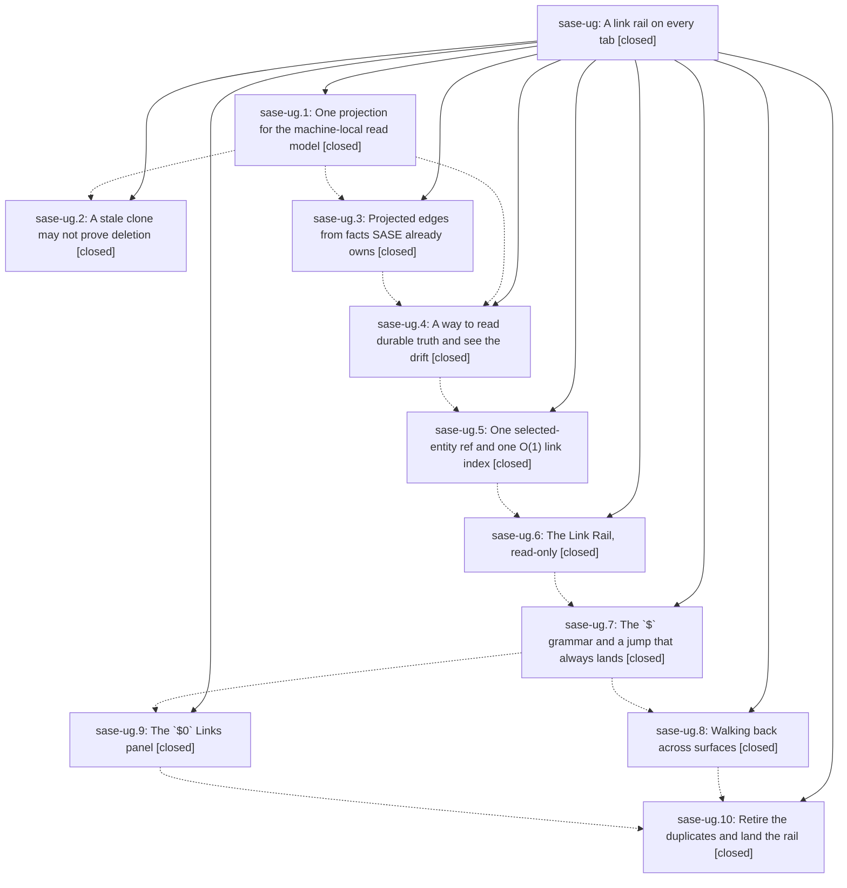

# Bead: sase-ug — A link rail on every tab

[Bead Pages](../README.md) / sase-ug

**Status:** ✓ closed · **Resolution:** done · **Type:** ▸ plan · **Tier:** epic
**Owner:** `bryanbugyi34@gmail.com` · **Created by:** [bbugyi200.athena.0eh](https://github.com/sase-org/sase--agents/blob/main/families/bbugyi200.athena.0eh.md) · **Assignee:** `sase-ug.land`
**Created:** 2026-08-26 14:48:23 EDT · **Closed:** 2026-08-27 10:28:58 EDT
**Plan:** [202608/link\_rail\_every\_tab.md](https://github.com/sase-org/sase--plans/blob/main/202608/link_rail_every_tab.md)

<!-- sase:links:start -->

## Links

| Relation | Artifact | Why |
| --- | --- | --- |
| implemented-by | [plan:202608/link_rail_every_tab.md][1] | derived from the plan's `bead_id:` frontmatter field |

[1]: https://github.com/sase-org/sase--plans/blob/main/202608/link_rail_every_tab.md

<!-- sase:links:end -->

## Description

Every ACE tab shows the selected entity's typed artifact links in one place, in one line, in the same place; `$` plus one key follows any of them across tabs and panes; the surface is invisible when the selection has no links; and the read model it draws from stops silently losing whole relation classes.

## Notes

[2026-08-26T20:50:33Z · sase-ud.3] DISCOVERED ISSUE: During gate_shell.md implementation verification on 2026-08-26, just check passed formatting, ruff, mypy, feature-flag, pyscript, test-wait, changelog, terminology, symvision, and toobig lints, then failed only SASE validation at init memory --check. The stale generated files are artifact-relation-specific: sase/artifact_relations.json (-32), sase/memory/sase_artifacts.md (-2), and sase/memory/README.md (+4 -4). Repro: just check, or .venv/bin/sase validate. This appears causally related to this epic's artifact-link/relation read-model work rather than the gate-shell diff; memory files were not regenerated because agent instructions require explicit user approval before changing SASE memory.

[2026-08-27T12:02:55Z · sase-ud.12] DISCOVERED ISSUE: During unrelated retire_q_asker_suffix verification on 2026-08-27, just check escalated to the full scoped pytest lane and failed two deterministic Artifacts relation-panel tests after the q-suffix failures were fixed. Repro: uv run pytest tests/ace/tui/test_artifacts_relation_collapse.py::test_expanded_link_row_renders_edge_metadata tests/ace/tui/test_artifacts_relation_collapse.py::test_dot_collapses_and_expands_on_each_relations_pane -q. The first failure is IndexError because build_relation_view skips RelationKind.LINK sections entirely while the test still expects link rows; the second leaves the ref:plan relation panel hidden. This is causally related to the link-rail epic's typed-link relocation, not to the q-suffix retirement diff.

[2026-08-27T14:28:58Z · sase-ug.land--4] Landed epic sase-ug (Link Rail on every tab). All ten phases verified against source and commits, integrated onto master, and gated.

VERIFICATION (read against real source at HEAD 259f39901, not inherited from phase reports):
- All ten phase beads sase-ug.1 through sase-ug.10 are CLOSED and their claims re-checked in code.
- The link_rail feature flag is gone: no surviving definition in the feature-flag catalog or default_config.yml. Its flag bead sase-un is CLOSED.
- The legacy L bindings and first_link_target are deleted, and typed links are filtered out of build_relation_view. Confirmed at src/sase/core/artifact_relation_layout.py: the docstring records that typed links are an app-level concern now that the Link Rail renders them on every tab (bead:sase-ug.10), so every RelationKind.LINK declaration is skipped when laying out the pane structure.
- Converge+project reached the Agent-pane filters, measured live: sase agent search linked:true returned 2127 agents (it was 5 before the epic), relation:produced-by 1368, relation:launched 58.
- sase bead epic-symbols sase-ug is empty (re-verified this turn); the whitelist carries only sase-n4(get_usage_limit_config) and sase-ud(question_next_action), neither of which belongs to this epic.

DEFECTS THE LANDING FOUND AND FIXED:
- The rail never rendered a single chip since sase-ug.6 landed. Textual boxes are border-box, so the rail fixed height:1 was entirely consumed by its own border-top and the chips got zero rows to paint in. Removed the border-top (the footer directly below already draws its own hkey rule, so no separator is lost, and a second one would double it). Shipped with 7 new PNG goldens across all three tabs at 120x40 and 60x30 plus a new mounted-geometry regression test, tests/ace/tui/test_link_rail_mount.py, so the geometry cannot silently regress again.
- The AXE fold-restore gap from sase-ug.8 note 2 is closed: LinkTrailHop gained axe_fold_expanded, so a Ctrl+O back-walk re-collapses the AXE lumberjack its forward hop expanded, carried across back/forward round trips.
- The new link-rail j/k bench was itself flaky as written and was fixed rather than shipped: a live disk-backed index build was removed from its baseline arm, one-time lazy Textual layout work is absorbed in a discarded round, and the two arms are interleaved into 4 pooled rounds. 2-of-8 failures before, 8-of-8 passes after; budget 4.0 -> 5.0 ms documented against 16 measured deltas.
- Two epic-caused test breakages that sase-ug.10 left behind in tests/ace/tui/test_artifacts_relation_collapse.py were found by the land gate (a LINK-only relation view no longer has sections, and the plans pane correctly hides its panel with no lifecycle chain). Master fixed both independently and canonically in 30f384324, so this landing adopted master version and dropped the local divergent fix rather than carrying a duplicate into a needless conflict.

INTEGRATION (step 2 of the land brief, done against real post-epic code):
- Fast-forwarded the workspace from a7b702863 onto master 259f39901 and reviewed all 12 intervening commits. A rule-7 feature-flag gate failure turned out to be workspace staleness, not a defect: flag bead sase-ul (link_pager) belongs to the concurrent pager epic sase-uk and had been closed while this workspace still carried the deleted definition.
- The concurrent pager epic had already integrated toward this epic: 5fb2189c2 aligns link resolution with the rail index and ships tests/pager/test_rail_parity.py, which imports _render_link_rail and _build_link_index. Zero file overlap with this epic dirty set, and the parity suite passes with this tree applied.
- The gate-shell and shells epics are independent surfaces with no ACE key or aggregate-writer collision; gate-shell rows on the Agents tab resolve through the normal agent adapter and simply show no rail.
- The new per-SHA sharded CI lane (5d8872f4d) needs no action for the two new test files: tests/_test_shards.py discovers by filesystem walk and estimates unknown files at default_duration, so an unregistered file still runs.

FOLLOW-UPS, every outcome recorded:
- Child PROPOSED FOLLOW-UPs are resolved. The test-wait pragma one was already fixed in 4bce1a4f6 and tracked by the closed sase-uj. The AXE fold one was fixed here rather than deferred.
- sase-up (visual-suite breakage) was filed by this landing and then updated with a re-measurement note: master eaf4ea891 rebaselined the corpus and discharged 359 of its 360 goldens, and the residual failure was proven not epic-caused by stashing the entire tree and reproducing it on clean master. The 7 new link_rail goldens pass unchanged against the rebaselined chrome.
- sase-lx received a +1 for the pre-existing tribe-bench budget failure, with the validated pooling technique recorded as the remediation sase-dx asked for. No duplicate task was filed.

FINAL GATE:
just check-full (proc en1yznv3q9dh) at this tree: all 13 lint gates, SASE validation and committed-plans green; 37806 passed, 12 skipped, 1 failed. The single failure is tests/test_plan_approval_launch_reliability_integration.py::test_archive_publication_order_survives_inverted_scheduling[host_first-2], a known pre-existing flake already tracked as sase-sf with four prior corroborations from four other epics. It is NOT epic-caused, established mechanically rather than by inspection: tools/select_tests --explain builds a 64-file static import-graph closure over this epic dirty set and that file is not in it. The whole file passes 9/9 inline on this same unchanged tree. Recorded a +1 on sase-sf carrying the traceback that bead explicitly asked for (tests/test_plan_approval_launch_reliability_integration.py:448, started.wait(timeout=5) returning False because a 2-worker ThreadPoolExecutor never scheduled the approve() future) plus new mechanism evidence: the gate own slowest-20 table clocked this node at 11.60s against 1.94s inline, a ~6x contention slowdown that by itself exceeds the test 5s Event budget, at host load 47.20 across 64 cores. The gate was not re-run because the tree is byte-identical to the one it measured, so a re-run would only re-roll the same flake.

LEFT UNFIXED, deliberately: build_artifact_link_index_drift keys on the full row signature (description/created_by/created_at/uses), so a row whose metadata changed is reported as BOTH missing and extra. Live drift reads 25 extra / 12 missing where the logical delta is 1 and 1. That is a reporting-precision nit, not a behavior change: the pre-epic check already went ERROR on any whole-row-set signature difference.

## Phases

| Bead | Title | Status | Size | Created | Agents | Commits |
|---|---|---|---|---|---:|---:|
| [sase-ug.1](sase-ug.1.md) | One projection for the machine-local read model | ✓ closed | medium | 2026-08-26 | 1 | 1 |
| [sase-ug.10](sase-ug.10.md) | Retire the duplicates and land the rail | ✓ closed | medium | 2026-08-26 | 1 | 1 |
| [sase-ug.2](sase-ug.2.md) | A stale clone may not prove deletion | ✓ closed | medium | 2026-08-26 | 1 | 1 |
| [sase-ug.3](sase-ug.3.md) | Projected edges from facts SASE already owns | ✓ closed | large | 2026-08-26 | 1 | 2 |
| [sase-ug.4](sase-ug.4.md) | A way to read durable truth and see the drift | ✓ closed | medium | 2026-08-26 | 1 | 1 |
| [sase-ug.5](sase-ug.5.md) | One selected-entity ref and one O(1) link index | ✓ closed | medium | 2026-08-26 | 1 | 1 |
| [sase-ug.6](sase-ug.6.md) | The Link Rail, read-only | ✓ closed | medium | 2026-08-26 | 1 | 2 |
| [sase-ug.7](sase-ug.7.md) | The \`$\` grammar and a jump that always lands | ✓ closed | large | 2026-08-26 | 1 | 1 |
| [sase-ug.8](sase-ug.8.md) | Walking back across surfaces | ✓ closed | medium | 2026-08-26 | 1 | 1 |
| [sase-ug.9](sase-ug.9.md) | The \`$0\` Links panel | ✓ closed | medium | 2026-08-26 | 1 | 1 |

## Lineage

## Agents

| Agent | Bead | Commits |
|---|---|---:|
| [bbugyi200.athena.sase-ug.1](https://github.com/sase-org/sase--agents/blob/main/agents/bbugyi200.athena.sase-ug.1/README.md) | [sase-ug.1](sase-ug.1.md) | 1 |
| [bbugyi200.athena.sase-ug.10](https://github.com/sase-org/sase--agents/blob/main/agents/bbugyi200.athena.sase-ug.10/README.md) | [sase-ug.10](sase-ug.10.md) | 1 |
| [bbugyi200.athena.sase-ug.2](https://github.com/sase-org/sase--agents/blob/main/agents/bbugyi200.athena.sase-ug.2/README.md) | [sase-ug.2](sase-ug.2.md) | 1 |
| [bbugyi200.athena.sase-ug.3](https://github.com/sase-org/sase--agents/blob/main/families/bbugyi200.athena.sase-ug.3.md) | [sase-ug.3](sase-ug.3.md) | 2 |
| [bbugyi200.athena.sase-ug.4](https://github.com/sase-org/sase--agents/blob/main/agents/bbugyi200.athena.sase-ug.4/README.md) | [sase-ug.4](sase-ug.4.md) | 1 |
| [bbugyi200.athena.sase-ug.5](https://github.com/sase-org/sase--agents/blob/main/agents/bbugyi200.athena.sase-ug.5/README.md) | [sase-ug.5](sase-ug.5.md) | 1 |
| [bbugyi200.athena.sase-ug.6](https://github.com/sase-org/sase--agents/blob/main/agents/bbugyi200.athena.sase-ug.6/README.md) | [sase-ug.6](sase-ug.6.md) | 2 |
| [bbugyi200.athena.sase-ug.7](https://github.com/sase-org/sase--agents/blob/main/families/bbugyi200.athena.sase-ug.7.md) | [sase-ug.7](sase-ug.7.md) | 1 |
| [bbugyi200.athena.sase-ug.8](https://github.com/sase-org/sase--agents/blob/main/families/bbugyi200.athena.sase-ug.8.md) | [sase-ug.8](sase-ug.8.md) | 1 |
| [bbugyi200.athena.sase-ug.9](https://github.com/sase-org/sase--agents/blob/main/agents/bbugyi200.athena.sase-ug.9/README.md) | [sase-ug.9](sase-ug.9.md) | 1 |
| [bbugyi200.athena.sase-ug.land](https://github.com/sase-org/sase--agents/blob/main/families/bbugyi200.athena.sase-ug.land.md) | [sase-ug](README.md) | 1 |

## Commits

| Repo | Commit | Subject | Bead | Committed |
|---|---|---|---|---|
| sase | [`452ac54`](https://github.com/sase-org/sase/commit/452ac54cf967dae7f8974eec522dd564007d6545) | fix(sdd): converge artifact-link aggregate projections on one read model | [sase-ug.1](sase-ug.1.md) | 2026-08-26 15:15:17 EDT |
| sase | [`9a477bf`](https://github.com/sase-org/sase/commit/9a477bfd1cf8f3aa1fec9e1eae900c9f3cb3970a) | fix(artifact-links): require fresh deletion authority | [sase-ug.2](sase-ug.2.md) | 2026-08-26 15:40:59 EDT |
| sase | [`4bce1a4`](https://github.com/sase-org/sase/commit/4bce1a4f68d985c623611416ea8187da7052609f) | feat(artifact-links): project recomputed edges into the read model (sase-ug.3) | [sase-ug.3](sase-ug.3.md) | 2026-08-26 18:45:13 EDT |
| sase-core | [`sase-core@917951d`](https://github.com/sase-org/sase-core/commit/917951d207b47099162423247c1811bcdf6aa31a) | feat(artifact-links): add projection relation builtins | [sase-ug.3](sase-ug.3.md) | 2026-08-26 18:49:40 EDT |
| sase | [`58e5a83`](https://github.com/sase-org/sase/commit/58e5a8310e26bd823209156c8890ee4fcb2ddfef) | feat(artifact-links): add durable truth drift reporting | [sase-ug.4](sase-ug.4.md) | 2026-08-26 20:32:42 EDT |
| sase | [`38c1588`](https://github.com/sase-org/sase/commit/38c15881ed3047ff976883b56f7e3e17c10f0af5) | feat(artifact-links): add link subject resolution and follow-link action wiring | [sase-ug.5](sase-ug.5.md) | 2026-08-26 21:26:56 EDT |
| sase | [`48e019a`](https://github.com/sase-org/sase/commit/48e019af82f279fc51d53d0e1f1ec51123bebd80) | feat(ace): add read-only link rail | [sase-ug.6](sase-ug.6.md) | 2026-08-26 22:22:44 EDT |
| sase--agents | [`sase--agents@b438c6d`](https://github.com/sase-org/sase--agents/commit/b438c6dea33ab4a04d4800ef29acf6b501c24333) | chore(agents): archive link rail prompt | [sase-ug.6](sase-ug.6.md) | 2026-08-26 22:25:24 EDT |
| sase | [`d070280`](https://github.com/sase-org/sase/commit/d07028050cb831849d1e666ab267a39223779f9b) | feat(tui): add link-follow key grammar | [sase-ug.7](sase-ug.7.md) | 2026-08-26 23:45:35 EDT |
| sase | [`e8f30d2`](https://github.com/sase-org/sase/commit/e8f30d25fba529b2cf16d755fd632915a8f53efe) | feat(ace): add artifact links panel | [sase-ug.9](sase-ug.9.md) | 2026-08-27 00:44:25 EDT |
| sase | [`d8e8b5a`](https://github.com/sase-org/sase/commit/d8e8b5ab8ed264a983fd892b29d8e6f752428a93) | feat(tui): add app-level link trail for Ctrl+O/Ctrl+Shift+O across tabs | [sase-ug.8](sase-ug.8.md) | 2026-08-27 01:04:08 EDT |
| sase | [`a7b7028`](https://github.com/sase-org/sase/commit/a7b702863fe57552d09ae9cae31f0cbe894959ea) | feat(tui): move links to app-level rail, drop link\_rail flag and L bindings | [sase-ug.10](sase-ug.10.md) | 2026-08-27 01:50:31 EDT |
| sase | [`00ff34a`](https://github.com/sase-org/sase/commit/00ff34acdbb7daffc2863251aac4e1803009c030) | fix(ace-tui): render the Link Rail chips and restore AXE folds on back-walk | [sase-ug](README.md) | 2026-08-27 10:32:12 EDT |
