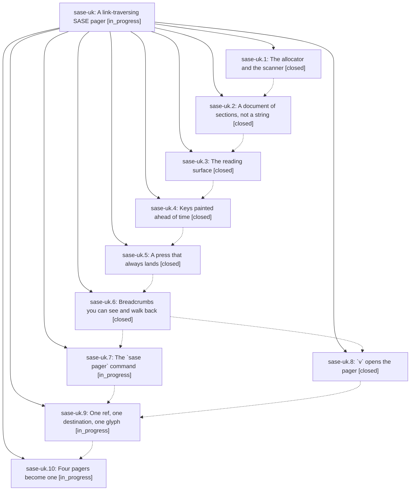

# Bead: sase-uk — A link-traversing SASE pager

[Bead Pages](../README.md) / sase-uk

**Status:** ◐ in_progress · **Type:** ▸ plan · **Tier:** epic
**Owner:** `bryanbugyi34@gmail.com` · **Created by:** [bbugyi200.athena.0ej](https://github.com/sase-org/sase--agents/blob/main/families/bbugyi200.athena.0ej.md) · **Assignee:** `sase-uk.land`
**Created:** 2026-08-26 17:44:34 EDT
**Plan:** [202608/link\_traversing\_pager.md](https://github.com/sase-org/sase--plans/blob/main/202608/link_traversing_pager.md)

<!-- sase:links:start -->

## Links

| Relation | Artifact | Why |
| --- | --- | --- |
| implemented-by | [plan:202608/link_traversing_pager.md][1] | derived from the plan's `bead_id:` frontmatter field |

[1]: https://github.com/sase-org/sase--plans/blob/main/202608/link_traversing_pager.md

<!-- sase:links:end -->

## Description

SASE has one reading surface. `sase bead show`, the Agents-tab `v` keymap, `sase artifact read`, and the new `sase pager` command all render the same `PagerDocument` through the same Textual app; every artifact ref, file path, and URL in that document carries a pre-painted key; one keypress follows it into another pager document instead of dead-ending in `less`; `ctrl+n`/`ctrl+p` puts the next entity's header at row 0; and a visible breadcrumb trail walks back with `backspace`.

## Phases

| Bead | Title | Status | Size | Created | Agents | Commits |
|---|---|---|---|---|---:|---:|
| [sase-uk.1](sase-uk.1.md) | The allocator and the scanner | ✓ closed | medium | 2026-08-26 | 1 | 1 |
| [sase-uk.10](sase-uk.10.md) | Four pagers become one | ◐ in_progress | medium | 2026-08-26 | 1 | 0 |
| [sase-uk.2](sase-uk.2.md) | A document of sections, not a string | ✓ closed | medium | 2026-08-26 | 1 | 1 |
| [sase-uk.3](sase-uk.3.md) | The reading surface | ✓ closed | medium | 2026-08-26 | 1 | 1 |
| [sase-uk.4](sase-uk.4.md) | Keys painted ahead of time | ✓ closed | medium | 2026-08-26 | 1 | 1 |
| [sase-uk.5](sase-uk.5.md) | A press that always lands | ✓ closed | medium | 2026-08-26 | 1 | 1 |
| [sase-uk.6](sase-uk.6.md) | Breadcrumbs you can see and walk back | ✓ closed | medium | 2026-08-26 | 1 | 1 |
| [sase-uk.7](sase-uk.7.md) | The \`sase pager\` command | ◐ in_progress | medium | 2026-08-26 | 1 | 0 |
| [sase-uk.8](sase-uk.8.md) | \`v\` opens the pager | ✓ closed | medium | 2026-08-26 | 1 | 1 |
| [sase-uk.9](sase-uk.9.md) | One ref, one destination, one glyph | ◐ in_progress | small | 2026-08-26 | 1 | 0 |

## Lineage

## Agents

| Agent | Bead | Commits |
|---|---|---:|
| [bbugyi200.athena.sase-uk.1](https://github.com/sase-org/sase--agents/blob/main/agents/bbugyi200.athena.sase-uk.1/README.md) | [sase-uk.1](sase-uk.1.md) | 1 |
| [bbugyi200.athena.sase-uk.10](https://github.com/sase-org/sase--agents/blob/main/agents/bbugyi200.athena.sase-uk.10/README.md) | [sase-uk.10](sase-uk.10.md) | 0 |
| [bbugyi200.athena.sase-uk.2](https://github.com/sase-org/sase--agents/blob/main/agents/bbugyi200.athena.sase-uk.2/README.md) | [sase-uk.2](sase-uk.2.md) | 1 |
| [bbugyi200.athena.sase-uk.3](https://github.com/sase-org/sase--agents/blob/main/families/bbugyi200.athena.sase-uk.3.md) | [sase-uk.3](sase-uk.3.md) | 1 |
| [bbugyi200.athena.sase-uk.4](https://github.com/sase-org/sase--agents/blob/main/agents/bbugyi200.athena.sase-uk.4/README.md) | [sase-uk.4](sase-uk.4.md) | 1 |
| [bbugyi200.athena.sase-uk.5](https://github.com/sase-org/sase--agents/blob/main/agents/bbugyi200.athena.sase-uk.5/README.md) | [sase-uk.5](sase-uk.5.md) | 1 |
| [bbugyi200.athena.sase-uk.6](https://github.com/sase-org/sase--agents/blob/main/agents/bbugyi200.athena.sase-uk.6/README.md) | [sase-uk.6](sase-uk.6.md) | 1 |
| [bbugyi200.athena.sase-uk.7](https://github.com/sase-org/sase--agents/blob/main/agents/bbugyi200.athena.sase-uk.7/README.md) | [sase-uk.7](sase-uk.7.md) | 0 |
| [bbugyi200.athena.sase-uk.8](https://github.com/sase-org/sase--agents/blob/main/agents/bbugyi200.athena.sase-uk.8/README.md) | [sase-uk.8](sase-uk.8.md) | 1 |
| [bbugyi200.athena.sase-uk.9](https://github.com/sase-org/sase--agents/blob/main/agents/bbugyi200.athena.sase-uk.9/README.md) | [sase-uk.9](sase-uk.9.md) | 0 |
| [bbugyi200.athena.sase-uk.land](https://github.com/sase-org/sase--agents/blob/main/agents/bbugyi200.athena.sase-uk.land/README.md) | [sase-uk](README.md) | 0 |

## Commits

| Repo | Commit | Subject | Bead | Committed |
|---|---|---|---|---|
| sase | [`e877263`](https://github.com/sase-org/sase/commit/e877263b65463ef942317df70ab94ba3f168a87c) | feat(pager): add prefix-free jump-hint allocator and link scanner | [sase-uk.1](sase-uk.1.md) | 2026-08-26 18:30:41 EDT |
| sase | [`2e5cd29`](https://github.com/sase-org/sase/commit/2e5cd29e680aaa08f57ae9573d11fc93fa9c7025) | feat(pager): add structured document adapters | [sase-uk.2](sase-uk.2.md) | 2026-08-26 18:57:47 EDT |
| sase | [`54f0c2a`](https://github.com/sase-org/sase/commit/54f0c2aaa5ebde3bdd2117b82af2a4442c53cf9e) | feat(pager): add SasePager reading surface | [sase-uk.3](sase-uk.3.md) | 2026-08-26 19:51:44 EDT |
| sase | [`338ecef`](https://github.com/sase-org/sase/commit/338ecef9cbddee88b74818c28d676de9066a38eb) | feat(pager): paint link labels | [sase-uk.4](sase-uk.4.md) | 2026-08-26 20:24:05 EDT |
| sase | [`699037f`](https://github.com/sase-org/sase/commit/699037f215b69128b8e49a5ccd7a2c588b002c27) | feat(pager): add link resolution and follow/copy/edit actions | [sase-uk.5](sase-uk.5.md) | 2026-08-26 21:19:08 EDT |
| sase | [`a6aab3b`](https://github.com/sase-org/sase/commit/a6aab3b799a3f64d63135d1645908463f52b1e96) | feat(pager): add breadcrumb trail navigation | [sase-uk.6](sase-uk.6.md) | 2026-08-26 21:53:01 EDT |
| sase | [`841255d`](https://github.com/sase-org/sase/commit/841255df480a0ef7562aacc4a74c730968f103bf) | feat(ace): route the Agents-tab v keymap to SasePager under suspend() | [sase-uk.8](sase-uk.8.md) | 2026-08-27 07:44:31 EDT |
