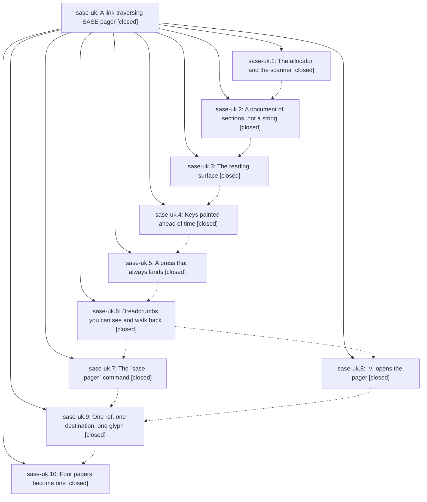

# Bead: sase-uk — A link-traversing SASE pager

[Bead Pages](../README.md) / sase-uk

**Status:** ✓ closed · **Resolution:** done · **Type:** ▸ plan · **Tier:** epic
**Owner:** `bryanbugyi34@gmail.com` · **Created by:** [bbugyi200.athena.0ej](https://github.com/sase-org/sase--agents/blob/main/families/bbugyi200.athena.0ej.md) · **Assignee:** `sase-uk.land`
**Created:** 2026-08-26 17:44:34 EDT · **Closed:** 2026-08-27 10:49:32 EDT
**Plan:** [202608/link\_traversing\_pager.md](https://github.com/sase-org/sase--plans/blob/main/202608/link_traversing_pager.md)

<!-- sase:links:start -->

## Links

| Relation | Artifact | Why |
| --- | --- | --- |
| implemented-by | [plan:202608/link_traversing_pager.md][1] | derived from the plan's `bead_id:` frontmatter field |
| related | [bead:sase-uq][2] | proposed by this epic's land agent while landing the link-traversing pager |
| related | [bead:sase-ur][3] | proposed by this epic's land agent while landing the link-traversing pager |
| related | [bead:sase-us][4] | proposed by this epic's land agent while landing the link-traversing pager |
| related | [bead:sase-ut][5] | proposed by this epic's land agent while landing the link-traversing pager |

[1]: https://github.com/sase-org/sase--plans/blob/main/202608/link_traversing_pager.md
[2]: https://github.com/sase-org/sase--beads/blob/main/pages/sase-uq/README.md
[3]: https://github.com/sase-org/sase--beads/blob/main/pages/sase-ur/README.md
[4]: https://github.com/sase-org/sase--beads/blob/main/pages/sase-us/README.md
[5]: https://github.com/sase-org/sase--beads/blob/main/pages/sase-ut/README.md

<!-- sase:links:end -->

## Description

SASE has one reading surface. `sase bead show`, the Agents-tab `v` keymap, `sase artifact read`, and the new `sase pager` command all render the same `PagerDocument` through the same Textual app; every artifact ref, file path, and URL in that document carries a pre-painted key; one keypress follows it into another pager document instead of dead-ending in `less`; `ctrl+n`/`ctrl+p` puts the next entity's header at row 0; and a visible breadcrumb trail walks back with `backspace`.

## Notes

[2026-08-27T13:31:11Z · 0eo] DISCOVERED ISSUE: During fix_telegram_ci verification on current workspace HEAD eaf4ea891, primary `just check` failed at the feature-flag lint before tests: `rule 7: closed flag bead 'sase-ul' still has a surviving 'link_pager' definition` from `SASE_SYMVISION_BEAD_STATUS_ONLY=1 BD_COMMAND=tools/sase_bead .venv/bin/python tools/check_feature_flags`. This is unrelated to the Telegram CI diff. It is causally linked to this link-traversing-pager epic because flag bead sase-ul belongs to this epic and phase sase-uk.10 note #1 says it removed the link_pager registry entry and closed the flag, but the checker still finds a surviving definition. Impact: `just check` cannot pass on the current tree until that surviving definition is removed or the flag bead status is corrected.

[2026-08-27T14:49:32Z · sase-uk.land--1] LANDED. Verified all ten phases against the source and the epic's ten commits
(e877263b6..259f39901), then integrated and closed out.

VERIFIED. Four pagers are one: `_print_or_page`, `_view_files_with_pager`, and
`page_or_print`'s `less`/`$PAGER`/`$SASE_PAGER` back end are gone from src/ and tests/
(cli_pager.py is 114 lines, down from 287, and now runs `SasePager` in-process with the
structured document); `artifact_text_viewer_command` execs `sase pager`; the shared
`v` hint-processing path routes both the Agents and Patches tabs into `SasePager` under
`suspend()`, matching the in-tree `MemoryReviewTuiApp` precedent exactly; the
`link_pager` flag and its removal bead sase-ul are retired. `sase pager` ships with
docs, mkdocs entry, completion metadata, stdin `-` and no-TTY plain fallbacks —
smoke-tested with stdin, with a single path, and with a mixed `path + bead:` multi-ref
document. Rail parity is a real shared assertion (tests/pager/test_rail_parity.py):
pager and the sase-ug link rail agree on target, glyph, accent, short label, and
dangling vocabulary across six ref kinds in both link positions, and the ACE resolver
goes through `link_index.target_for` rather than reintroducing the O(n)
`_known_target_for_ref` scan the plan forbids. 169 pager/CLI/ACE-pager tests pass, the
four pager PNG goldens pass under `just test-visual`, and `just lint` (ruff, mypy,
symvision, toobig) is clean. `sase bead epic-symbols sase-uk` was empty before the
close.

LAND GATE. `just check-full` on the combined tree (proc 4xgnw748w08k, 24m15s): the full
suite is green -- 37802 passed, 13 skipped -- and every lint and validation gate passed
(ruff, mypy, feature flags, pyscripts, test waits, changelog, patch/stitch terminology,
symvision, toobig, `sase validate`, committed plans). The run's single failure is the
`just test-cost` suite-cost budget gate, which is pre-existing and repo-wide, not this
epic's: I checked all eight retained cost recordings on this host with
`tools/check_test_cost_budgets --recording` and seven of eight breach the same hard CPU
budgets across at least four different trees, including a 01:21Z run that predates nine
of this epic's commits. Invocation counts are flat all day and under their hard limits
(ace_page_enter 663-666, textual_app_run_test_enter 3602-3634) while node count moved
only +0.9%, so the suite is not doing more work -- CPU per invocation is up, which is
host state against a baseline recalibrated on 2026-08-26 from smaller, quieter runs. Two
concurrent agents' runs at 14:18Z and 14:32Z post higher ace_page_enter CPU than this
one. Filed as a +1 with that diagnostic evidence on the existing in-progress
bead:sase-j0 rather than a new task; no budget was raised, per that file's own rule
against raising a limit to hide a one-off. Because test-cost fails one recipe line
earlier, check-full never reached `selection-health --fail-on-new-flake`, exactly the
interaction sase-j0's existing link to bead:sase-u7 describes -- so the flake baseline
carried by beads sase-uf/sase-u7 was not re-evaluated in this run.

FIXED AS EPIC WORK (2 defects the phases left behind):
1. A `bead:` link followed inside the pager rendered NO LINKS / REFERENCED BY section
   at all — `IssueDetail.artifact_links` defaults to `()` and only a `detail_enricher`
   fills it, and sase-uk.5 deliberately skipped `sase bead show`'s enricher because it
   calls `sys.exit(1)`, which a keypress handler cannot survive. That is the very block
   the plan's own reading-surface mockup paints as keyed links, so the epic's surface
   contradicted its design. Split the enricher in cli_show_batch.py into
   `artifact_link_neighborhood_detail` (raising) plus a non-exiting
   `enrich_with_artifact_link_neighborhood` that degrades to the un-enriched detail, had
   the CLI's `_with_artifact_link_neighborhood` delegate to the raising half so its
   report-and-exit behavior is unchanged, and wired `_bead_link_target` to the
   non-exiting half. Confirmed empirically both ways: `artifact_links == ()` without the
   enricher, LINKS + `implemented-by` present with it. Covered by two new tests in
   tests/test_bead/test_bead_show_links.py and one wiring test in
   tests/pager/test_resolve.py. This discharges sase-uk.5's second PROPOSED FOLLOW-UP.
2. docs/pager.md's option table was malformed: an unescaped pipe inside `` `REF|PATH` ``
   split that row into three cells against a two-column header, so the table rendered
   broken. Escaped it the way docs/cli.md:27 already does.

INTEGRATION with the 24 non-epic commits since e877263b6. Reviewed each; seven touched a
file the epic also touched and all were already reconciled by commit order. The pager's
new tests/pager/visual/ suite is marked `visual` so `just test-visual` collects it with
no path change, and tests/shard_timings.json already carries pager entries with a
default-duration fallback for the rest, so the new fast per-SHA master gate (5d8872f4d)
shards it correctly. 30f384324 had already repaired the epic's own
tests/main/test_pager_command.py for argparse help rendering across Python versions.
The pager's trail stays separate from the app-level ACE link trail added in d8e8b5ab8,
per the plan's explicit design, and reuses `build_trail_strip` rather than duplicating
it. No commit duplicated or conflicted with what the epic added.

CHILD NOTES — every PROPOSED FOLLOW-UP addressed:
- sase-uk.1 note 1 (pre-existing tree drift blocking a green check/check-full):
  RESOLVED by intervening commits, verified by rerunning every named node — the four
  completion/contract/init-memory/marker-audit/pending-handoff/memory-selector suites
  and tests/ace/tui/test_artifacts_relation_collapse.py all pass (41 passed),
  `sase validate` is fully green, and all 828 tests in tests/ace/tui/visual/ collect
  (the `_zoom_agent` ImportError was fixed under beads sase-ue/sase-ui). No task needed.
- sase-uk.1 note 2 (scope notes): item (1) is moot — `PagerOrigin` lives in
  document.py's namespace and is imported, not redefined. Item (2), the `sase-`-only
  bare-bead-id recognizer, is filed as bead:sase-ur.
- sase-uk.2 note 1 (regenerate SASE memory artifacts): RESOLVED — `sase validate`
  reports `init memory --check` ok. No task needed, and no memory files were edited.
- sase-uk.5 note 1 (DIFF-origin bare short shas cannot build a `commit:` ref): filed as
  bead:sase-uq, bundled with the two `bat | less` diff viewers still standing in
  ace/change_actions.py and ace/handlers/show_diff.py. Confirmed latent: no adapter
  constructs a `PagerOrigin.DIFF` document.
- sase-uk.5 note 2 (skipped link-neighborhood enricher): FIXED above as epic work.
- sase-uk.8 note 1 (no bench_tui_jk.py case, no bespoke terminal-restoration test):
  DECLINED, no task filed. The proposal was to parametrize a bench case on the
  `link_pager` flag, which sase-uk.10 removed, and the note itself conditions the work
  on a regression that has not happened; the phase measured ~140 ms open-to-first-paint
  against a 150 ms budget. On restoration: the call site is `with self.suspend():
  pager.run()`, byte-for-byte the shape `_notification_handlers.py:141` already uses for
  `MemoryReviewTuiApp`, and `suspend()`'s `__exit__` restores the terminal on any
  exception, so a bespoke test would assert the context manager, not this call site.
- sase-uk.9 note 1 (relation-collapse tests failing per sase-ug.10): RESOLVED — all 9
  tests in tests/ace/tui/test_artifacts_relation_collapse.py pass. No task needed.

FOLLOW-UPS FILED (all ready, each linked `related` to bead:sase-uk):
- bead:sase-uq (medium) — route the two remaining `bat | less` diff viewers through a
  PagerOrigin.DIFF adapter and give bare short shas resolvable repo context.
- bead:sase-ur (small) — recognize bare bead ids from any bead-store project key.
- bead:sase-us (medium) — migrate the four private selector alphabets onto the shared
  jump-hint allocator; named in the plan as a land follow-up, linked `related` to the
  analogous bead:sase-h1.
- bead:sase-ut (large) — open the ACE agent detail document in the pager, exercising the
  window-scoped labeller this epic shipped dormant; named in the plan as a land
  follow-up.

NOT FILED, RECORDED HERE: src/sase/pager/app.py is 922 lines and trips toobig's 850-line
advisory warning (hard limit 1000). Under the limit, and the toobig_split machinery
(beads sase-sk, sase-so.5) already owns that lane, so a task here would be noise. The
`just test-visual` lane's one remaining red golden
(agents_output_variables_multi_agent, a stale `q` asker suffix) is unrelated to this
epic and already carried by bead:sase-up.

## Phases

| Bead | Title | Status | Size | Created | Agents | Commits |
|---|---|---|---|---|---:|---:|
| [sase-uk.1](sase-uk.1.md) | The allocator and the scanner | ✓ closed | medium | 2026-08-26 | 1 | 1 |
| [sase-uk.10](sase-uk.10.md) | Four pagers become one | ✓ closed | medium | 2026-08-26 | 1 | 1 |
| [sase-uk.2](sase-uk.2.md) | A document of sections, not a string | ✓ closed | medium | 2026-08-26 | 1 | 1 |
| [sase-uk.3](sase-uk.3.md) | The reading surface | ✓ closed | medium | 2026-08-26 | 1 | 1 |
| [sase-uk.4](sase-uk.4.md) | Keys painted ahead of time | ✓ closed | medium | 2026-08-26 | 1 | 1 |
| [sase-uk.5](sase-uk.5.md) | A press that always lands | ✓ closed | medium | 2026-08-26 | 1 | 1 |
| [sase-uk.6](sase-uk.6.md) | Breadcrumbs you can see and walk back | ✓ closed | medium | 2026-08-26 | 1 | 1 |
| [sase-uk.7](sase-uk.7.md) | The \`sase pager\` command | ✓ closed | medium | 2026-08-26 | 1 | 1 |
| [sase-uk.8](sase-uk.8.md) | \`v\` opens the pager | ✓ closed | medium | 2026-08-26 | 1 | 1 |
| [sase-uk.9](sase-uk.9.md) | One ref, one destination, one glyph | ✓ closed | small | 2026-08-26 | 1 | 1 |

## Lineage

## Agents

| Agent | Bead | Commits |
|---|---|---:|
| [bbugyi200.athena.sase-uk.1](https://github.com/sase-org/sase--agents/blob/main/agents/bbugyi200.athena.sase-uk.1/README.md) | [sase-uk.1](sase-uk.1.md) | 1 |
| [bbugyi200.athena.sase-uk.10](https://github.com/sase-org/sase--agents/blob/main/agents/bbugyi200.athena.sase-uk.10/README.md) | [sase-uk.10](sase-uk.10.md) | 1 |
| [bbugyi200.athena.sase-uk.2](https://github.com/sase-org/sase--agents/blob/main/agents/bbugyi200.athena.sase-uk.2/README.md) | [sase-uk.2](sase-uk.2.md) | 1 |
| [bbugyi200.athena.sase-uk.3](https://github.com/sase-org/sase--agents/blob/main/families/bbugyi200.athena.sase-uk.3.md) | [sase-uk.3](sase-uk.3.md) | 1 |
| [bbugyi200.athena.sase-uk.4](https://github.com/sase-org/sase--agents/blob/main/agents/bbugyi200.athena.sase-uk.4/README.md) | [sase-uk.4](sase-uk.4.md) | 1 |
| [bbugyi200.athena.sase-uk.5](https://github.com/sase-org/sase--agents/blob/main/agents/bbugyi200.athena.sase-uk.5/README.md) | [sase-uk.5](sase-uk.5.md) | 1 |
| [bbugyi200.athena.sase-uk.6](https://github.com/sase-org/sase--agents/blob/main/agents/bbugyi200.athena.sase-uk.6/README.md) | [sase-uk.6](sase-uk.6.md) | 1 |
| [bbugyi200.athena.sase-uk.7](https://github.com/sase-org/sase--agents/blob/main/agents/bbugyi200.athena.sase-uk.7/README.md) | [sase-uk.7](sase-uk.7.md) | 1 |
| [bbugyi200.athena.sase-uk.8](https://github.com/sase-org/sase--agents/blob/main/agents/bbugyi200.athena.sase-uk.8/README.md) | [sase-uk.8](sase-uk.8.md) | 1 |
| [bbugyi200.athena.sase-uk.9](https://github.com/sase-org/sase--agents/blob/main/agents/bbugyi200.athena.sase-uk.9/README.md) | [sase-uk.9](sase-uk.9.md) | 1 |
| [bbugyi200.athena.sase-uk.land](https://github.com/sase-org/sase--agents/blob/main/families/bbugyi200.athena.sase-uk.land.md) | [sase-uk](README.md) | 1 |

## Commits

| Repo | Commit | Subject | Bead | Committed |
|---|---|---|---|---|
| sase | [`e877263`](https://github.com/sase-org/sase/commit/e877263b65463ef942317df70ab94ba3f168a87c) | feat(pager): add prefix-free jump-hint allocator and link scanner | [sase-uk.1](sase-uk.1.md) | 2026-08-26 18:30:41 EDT |
| sase | [`2e5cd29`](https://github.com/sase-org/sase/commit/2e5cd29e680aaa08f57ae9573d11fc93fa9c7025) | feat(pager): add structured document adapters | [sase-uk.2](sase-uk.2.md) | 2026-08-26 18:57:47 EDT |
| sase | [`54f0c2a`](https://github.com/sase-org/sase/commit/54f0c2aaa5ebde3bdd2117b82af2a4442c53cf9e) | feat(pager): add SasePager reading surface | [sase-uk.3](sase-uk.3.md) | 2026-08-26 19:51:44 EDT |
| sase | [`338ecef`](https://github.com/sase-org/sase/commit/338ecef9cbddee88b74818c28d676de9066a38eb) | feat(pager): paint link labels | [sase-uk.4](sase-uk.4.md) | 2026-08-26 20:24:05 EDT |
| sase | [`699037f`](https://github.com/sase-org/sase/commit/699037f215b69128b8e49a5ccd7a2c588b002c27) | feat(pager): add link resolution and follow/copy/edit actions | [sase-uk.5](sase-uk.5.md) | 2026-08-26 21:19:08 EDT |
| sase | [`a6aab3b`](https://github.com/sase-org/sase/commit/a6aab3b799a3f64d63135d1645908463f52b1e96) | feat(pager): add breadcrumb trail navigation | [sase-uk.6](sase-uk.6.md) | 2026-08-26 21:53:01 EDT |
| sase | [`841255d`](https://github.com/sase-org/sase/commit/841255df480a0ef7562aacc4a74c730968f103bf) | feat(ace): route the Agents-tab v keymap to SasePager under suspend() | [sase-uk.8](sase-uk.8.md) | 2026-08-27 07:44:31 EDT |
| sase | [`b52341b`](https://github.com/sase-org/sase/commit/b52341b5506a304356a77143a09a986b7fb08683) | feat(pager): add sase pager command | [sase-uk.7](sase-uk.7.md) | 2026-08-27 07:57:58 EDT |
| sase | [`5fb2189`](https://github.com/sase-org/sase/commit/5fb2189c2139663a502af8d6c5d7e3d9feaaead6) | feat(pager): align link resolution with rail index | [sase-uk.9](sase-uk.9.md) | 2026-08-27 08:41:22 EDT |
| sase | [`259f399`](https://github.com/sase-org/sase/commit/259f399012febb6778e7ca1bfb94e7251d642b94) | feat(pager): retire legacy text paging paths | [sase-uk.10](sase-uk.10.md) | 2026-08-27 09:21:55 EDT |
| sase | [`5cc5da0`](https://github.com/sase-org/sase/commit/5cc5da03a44c56ac25bf3b2971b902aca25a7de2) | fix(pager): render link neighborhoods for pager-followed beads | [sase-uk](README.md) | 2026-08-27 10:51:39 EDT |
