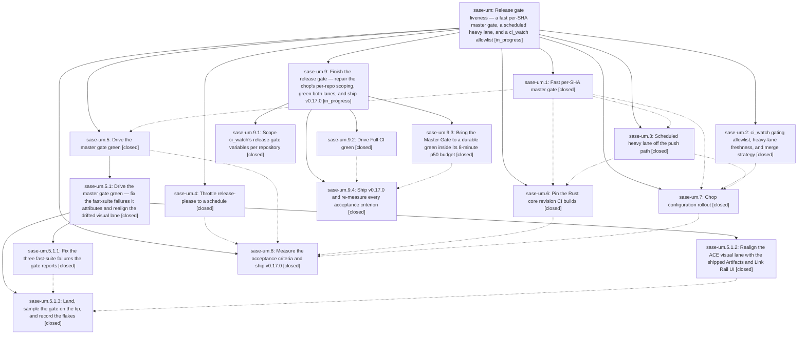

# Bead: sase-um — Release gate liveness — a fast per-SHA master gate, a scheduled heavy lane, and a ci\_watch allowlist

[Bead Pages](../README.md) / sase-um

**Status:** ◐ in_progress · **Type:** ▸ plan · **Tier:** epic
**Owner:** `bryanbugyi34@gmail.com` · **Created by:** [bbugyi200.athena.0ek](https://github.com/sase-org/sase--agents/blob/main/families/bbugyi200.athena.0ek.md) · **Assignee:** `sase-um.land`
**Created:** 2026-08-26 19:12:23 EDT
**Plan:** [202608/release\_gate\_liveness.md](https://github.com/sase-org/sase--plans/blob/main/202608/release_gate_liveness.md)

<!-- sase:links:start -->

## Links

| Relation | Artifact | Why |
| --- | --- | --- |
| implemented-by | [plan:202608/release_gate_liveness.md][1] | derived from the plan's `bead_id:` frontmatter field |

[1]: https://github.com/sase-org/sase--plans/blob/main/202608/release_gate_liveness.md

<!-- sase:links:end -->

## Description

sase-org/sase ships releases again without slowing agent velocity: every master commit gets its own uncancelled CI run, the release gate reads only the fast per-SHA gate, the exhaustive suite still runs on a cadence and still guards the release, and ci_watch merges the release PR with the merge strategy the repository actually allows.

## Notes

[2026-08-28T19:47:35Z · sase-um.land] LANDING INTERRUPTED (sase-um.land, 2026-08-28, master 52327ed78). The epic is not closed:
verification found the machinery complete but the goal unmet, and integration found a
regression the epic itself introduced. A child epic plan carries the remainder.

VERIFIED COMPLETE (read the source and the epic's commits, not just the phase notes):
master-gate.yml is per-SHA (group master-gate-${{ github.sha }}, cancel-in-progress:
false), timeout-bounded on every job, six shards fed by tests/shard_timings.json, core
wheel from a revision-keyed cache; full.yml schedules ci.yml every 2h under a full-ci
concurrency group; ci.yml is pull_request + workflow_call only; publish.yml's
release-please and sync-release-metadata are schedule + workflow_dispatch only with
publish_existing preserved; sase-core-revision.txt is the pinned source of truth read by
both master-gate.yml's core-wheel and ci.yml's build-core, with
tools/ratchet_core_revision and core-pin-ratchet.yml as the ratchet and
tools/check_sase_core_rs_bindings --remedy as the legible failure; tools/run_pytest has
the SASE_TEST_SHARD mode; tools/fetch_coverage_contexts is repointed at full.yml; both
README badges are present; docs/development.md and docs/rust_backend.md describe the new
lanes; the chezmoi ci_watch block carries merge_method/gating_workflows/heavy_workflows/
heavy_max_age_hours; bugyi-chops 0.8.0 implements all three chop changes with 104 tests.
sase bead epic-symbols sase-um reports no entries.

NOT COMPLETE: v0.17.0 has not shipped. PR #284 (chore(master): release 0.17.0) has been
open since 2026-08-07 and is still MERGEABLE/CLEAN/unmerged; PyPI's latest is 0.16.0. Of
the plan's 7 acceptance criteria, 3 pass, 1 is partial, and 4 fail (see sase-um.8 note
1). Full CI's newest completed run 33167273442 is red on visual-test, test (3.13), and
coverage-contexts, which holds the release shut through ci_watch's heavy_lane_not_green
condition; Master Gate's median wall is 10.32 min against the 8 min target.

REGRESSION FOUND WHILE INTEGRATING (caused by this epic, phase sase-um.7): ci_watch reads
merge_method, gating_workflows, heavy_workflows, and heavy_max_age_hours as flat,
chop-global values (src/bugyi_chops/ci_watch.py Config fields ~995-1047, applied at
~2017 and ~2069-2093), but the chop sweeps three release repositories. The rollout set
them chop-wide to merge / ["Master Gate"] / ["Full CI"] / 6, which is right only for
sase-org/sase. sase-org/sase-github and sase-org/sase-telegram have
allow_merge_commit: false with allow_squash_merge: true and expose only CI, PR Title,
and Publish workflows, so for both repos _release_gate_reason returns
gating_workflow_missing on every tick, _evaluate_heavy_lane returns heavy_lane_not_green,
and gh pr merge --merge would fail even past those. This is live: sase-org/sase-telegram
PR #21 (chore(master): release 0.4.10) has been open since 2026-08-27T02:46Z -- the day
after the rollout -- with no merge recorded in ci_watch_state.json. The epic replaced
sase's latent merge failure with the mirror-image failure in the two repos that were
merging fine before.

OTHER INTEGRATION OUTCOMES: closed sase-tp (Master CI churn outpaces run completion) as
resolved by this epic, with the measurement that 47 completed gate runs covered 46 master
commits in the trailing 24h. Noted on sase-up that sase-um.5.1.2 already absorbed the
bulk of its 360-golden drift and only 3 goldens remain red in Full CI. Noted on sase-th
(Repair the red master CI lanes, land agent still waiting) that its observability blocker
is gone and what the current red set actually is. Confirmed the post-epic commits that
touch this epic's surface already integrated correctly: d4d627dbc split the CI contract
tests and carried master-gate.yml with them, a5d59a4cb ratcheted sase-core-revision.txt
to 6ac162e through the epic's own ratchet, and 22f722168 retired the stale
sase-ud(question_next_action) Symvision epic-symbol that had been reddening the gate's
lint job.

FOLLOW-UP TRIAGE (every PROPOSED FOLLOW-UP note across sase-um.1-8 and the sase-um.5.1
subtree):
- Already fixed, no bead: the two ACE artifact relation-collapse tests (sase-um.3 #1,
  sase-um.6 #2) were rewritten by sase-um.5.1.1 and split by 9ec2a7f52; the feature-flag
  rule-7 lint failure (sase-um.6 #1) went away when sase-ul retired link_pager;
  test_scaled_suite_runs_share_capacity_and_release_after_sigkill (sase-um.5.1.3 #1) was
  fixed by 95444f868.
- Already filed by other agents, corroborated not duplicated: sase-oz, sase-qr, sase-r2,
  sase-t7, sase-u4, sase-ux, sase-uy, sase-uz cover sase-um.5.1.2 #1 and sase-um.5.1.3
  #2-#5 and #7-#10.
- Newly filed: sase-v6 (rust-lsp-install copies sase-xprompt-lsp from the checkout-local
  cargo target and exits 0 after cp/chmod/mv fail -- reproduced live this turn),
  sase-v7 (memory: the two-speed-CI decision record plan section 9 defers), sase-v8
  (R7: Full CI's test-cost and coverage-contexts outliers), sase-v9 (ci_watch
  watched-workflow notification list, required by plan phase heavy).
- Declined as a task bead, folded into the child plan instead: the Master Gate shard-2
  temp-path leakage cluster (sase-um.5.1.3 #6) is causally this epic's -- it only appears
  under the shard layout the epic introduced -- and belongs to driving the gate green,
  not to a standalone flake bead. The heavy-lane red and the gate flakiness (sase-um.8 #2
  and #3) are likewise epic work, not follow-ups.

## Phases

| Bead | Title | Status | Size | Created | Agents | Commits |
|---|---|---|---|---|---:|---:|
| [sase-um.1](sase-um.1.md) | Fast per-SHA master gate | ✓ closed | large | 2026-08-26 | 1 | 1 |
| [sase-um.2](sase-um.2.md) | ci\_watch gating allowlist, heavy-lane freshness, and merge strategy | ✓ closed | large | 2026-08-26 | 1 | 0 |
| [sase-um.3](sase-um.3.md) | Scheduled heavy lane off the push path | ✓ closed | medium | 2026-08-26 | 1 | 1 |
| [sase-um.4](sase-um.4.md) | Throttle release-please to a schedule | ✓ closed | medium | 2026-08-26 | 1 | 1 |
| [sase-um.5](sase-um.5.md) | Drive the master gate green | ✓ closed | large | 2026-08-26 | 1 | 0 |
| [sase-um.6](sase-um.6.md) | Pin the Rust core revision CI builds | ✓ closed | medium | 2026-08-26 | 1 | 1 |
| [sase-um.7](sase-um.7.md) | Chop configuration rollout | ✓ closed | small | 2026-08-26 | 1 | 1 |
| [sase-um.8](sase-um.8.md) | Measure the acceptance criteria and ship v0.17.0 | ✓ closed | small | 2026-08-26 | 1 | 0 |

## Lineage

## Agents

| Agent | Bead | Commits |
|---|---|---:|
| [bbugyi200.athena.sase-um.1](https://github.com/sase-org/sase--agents/blob/main/families/bbugyi200.athena.sase-um.1.md) | [sase-um.1](sase-um.1.md) | 1 |
| [bbugyi200.athena.sase-um.2](https://github.com/sase-org/sase--agents/blob/main/families/bbugyi200.athena.sase-um.2.md) | [sase-um.2](sase-um.2.md) | 0 |
| [bbugyi200.athena.sase-um.3](https://github.com/sase-org/sase--agents/blob/main/agents/bbugyi200.athena.sase-um.3/README.md) | [sase-um.3](sase-um.3.md) | 1 |
| [bbugyi200.athena.sase-um.4](https://github.com/sase-org/sase--agents/blob/main/agents/bbugyi200.athena.sase-um.4/README.md) | [sase-um.4](sase-um.4.md) | 1 |
| [bbugyi200.athena.sase-um.5](https://github.com/sase-org/sase--agents/blob/main/families/bbugyi200.athena.sase-um.5.md) | [sase-um.5](sase-um.5.md) | 0 |
| [bbugyi200.athena.sase-um.5.1.1](https://github.com/sase-org/sase--agents/blob/main/agents/bbugyi200.athena.sase-um.5.1.1/README.md) | [sase-um.5.1.1](sase-um.5.1.1.md) | 1 |
| [bbugyi200.athena.sase-um.5.1.2](https://github.com/sase-org/sase--agents/blob/main/agents/bbugyi200.athena.sase-um.5.1.2/README.md) | [sase-um.5.1.2](sase-um.5.1.2.md) | 1 |
| [bbugyi200.athena.sase-um.5.1.3](https://github.com/sase-org/sase--agents/blob/main/families/bbugyi200.athena.sase-um.5.1.3.md) | [sase-um.5.1.3](sase-um.5.1.3.md) | 8 |
| [bbugyi200.athena.sase-um.5.1.land](https://github.com/sase-org/sase--agents/blob/main/families/bbugyi200.athena.sase-um.5.1.land.md) | [sase-um.5.1](sase-um.5.1.md) | 0 |
| [bbugyi200.athena.sase-um.6](https://github.com/sase-org/sase--agents/blob/main/agents/bbugyi200.athena.sase-um.6/README.md) | [sase-um.6](sase-um.6.md) | 1 |
| [bbugyi200.athena.sase-um.7](https://github.com/sase-org/sase--agents/blob/main/agents/bbugyi200.athena.sase-um.7/README.md) | [sase-um.7](sase-um.7.md) | 1 |
| [bbugyi200.athena.sase-um.8](https://github.com/sase-org/sase--agents/blob/main/agents/bbugyi200.athena.sase-um.8/README.md) | [sase-um.8](sase-um.8.md) | 0 |
| [bbugyi200.athena.sase-um.9.1](https://github.com/sase-org/sase--agents/blob/main/families/bbugyi200.athena.sase-um.9.1.md) | [sase-um.9.1](sase-um.9.1.md) | 1 |
| [bbugyi200.athena.sase-um.9.2](https://github.com/sase-org/sase--agents/blob/main/agents/bbugyi200.athena.sase-um.9.2/README.md) | [sase-um.9.2](sase-um.9.2.md) | 1 |
| [bbugyi200.athena.sase-um.9.3](https://github.com/sase-org/sase--agents/blob/main/agents/bbugyi200.athena.sase-um.9.3/README.md) | [sase-um.9.3](sase-um.9.3.md) | 1 |
| [bbugyi200.athena.sase-um.9.4](https://github.com/sase-org/sase--agents/blob/main/families/bbugyi200.athena.sase-um.9.4.md) | [sase-um.9.4](sase-um.9.4.md) | 2 |
| [bbugyi200.athena.sase-um.9.land](https://github.com/sase-org/sase--agents/blob/main/agents/bbugyi200.athena.sase-um.9.land/README.md) | [sase-um.9](sase-um.9.md) | 0 |
| [bbugyi200.athena.sase-um.land](https://github.com/sase-org/sase--agents/blob/main/families/bbugyi200.athena.sase-um.land.md) | [sase-um](README.md) | 0 |

## Commits

| Repo | Commit | Subject | Bead | Committed |
|---|---|---|---|---|
| sase | [`bee0592`](https://github.com/sase-org/sase/commit/bee05929dd7104804fd9d13252da1789fcd6e2bb) | ci(release): throttle release-please workflow | [sase-um.4](sase-um.4.md) | 2026-08-26 19:49:15 EDT |
| sase | [`5d8872f`](https://github.com/sase-org/sase/commit/5d8872f4d2ed263d38a41bcedea44fd15e7ba206) | feat(ci): add fast per-SHA master gate with sharded test matrix | [sase-um.1](sase-um.1.md) | 2026-08-27 07:51:23 EDT |
| sase | [`840dd3e`](https://github.com/sase-org/sase/commit/840dd3eb4af4c5c93f4806ef00b31fad3ce02758) | ci: move exhaustive workflow to scheduled full lane | [sase-um.3](sase-um.3.md) | 2026-08-27 08:29:47 EDT |
| chezmoi | [`chezmoi@ae29a7c`](https://github.com/bbugyi200/dotfiles/commit/ae29a7c7dc1373b4716323451a80905ec6927cc0) | feat(ci): roll out ci\_watch release gate config | [sase-um.7](sase-um.7.md) | 2026-08-27 08:39:20 EDT |
| sase | [`30f3843`](https://github.com/sase-org/sase/commit/30f384324343eb9f2a6f6a84488276c464532ddb) | fix(fastlane): repair master gate fast-suite failures | [sase-um.5.1.1](sase-um.5.1.1.md) | 2026-08-27 08:43:37 EDT |
| sase | [`eaf4ea8`](https://github.com/sase-org/sase/commit/eaf4ea8919058d4ae5494b56be8007d128b70b26) | test(ace-tui-visual): route Artifacts digit presses through the live seam and rebaseline PNG goldens | [sase-um.5.1.2](sase-um.5.1.2.md) | 2026-08-27 09:11:16 EDT |
| sase | [`a8e72ce`](https://github.com/sase-org/sase/commit/a8e72cebeb234ff9a7c69483bc4ee800fd6e5ec8) | feat(ci): pin the sase-core revision CI builds from | [sase-um.6](sase-um.6.md) | 2026-08-27 09:41:48 EDT |
| sase | [`95444f8`](https://github.com/sase-org/sase/commit/95444f8685283a0635310688a7fa0906d5f4b709) | test(suite-gate): clear parent shard for scaled children | [sase-um.5.1.3](sase-um.5.1.3.md) | 2026-08-27 11:03:54 EDT |
| sase | [`612cabf`](https://github.com/sase-org/sase/commit/612cabf85a786d9bd2beedbb6556788f6869e70e) | fix(agent): carry process identity through scan liveness | [sase-um.5.1.3](sase-um.5.1.3.md) | 2026-08-27 12:52:13 EDT |
| sase | [`8690fe2`](https://github.com/sase-org/sase/commit/8690fe23a096538bd8c40115028b70a038d95771) | test(sdd): restore checkout marker facade after project-key tests | [sase-um.5.1.3](sase-um.5.1.3.md) | 2026-08-27 13:38:31 EDT |
| sase | [`5f06c64`](https://github.com/sase-org/sase/commit/5f06c647359cd3362f913d1e9fac3164ad99fc58) | chore(core): ratchet pinned core to v0.32.10 | [sase-um.5.1.3](sase-um.5.1.3.md) | 2026-08-27 15:27:30 EDT |
| sase | [`4d31563`](https://github.com/sase-org/sase/commit/4d315636322392d692e737651c6d10174ed7d81c) | fix(agent): restore logical planner projection rows | [sase-um.5.1.3](sase-um.5.1.3.md) | 2026-08-27 17:13:56 EDT |
| sase | [`ebdc9dd`](https://github.com/sase-org/sase/commit/ebdc9dda0c316fb8403d77e42efbbfdef7ada8de) | test(perf): isolate view-hints trace harness | [sase-um.5.1.3](sase-um.5.1.3.md) | 2026-08-27 18:38:42 EDT |
| sase | [`69527b8`](https://github.com/sase-org/sase/commit/69527b84a5d139087ff7ae997625ce529812b22c) | fix(agents): preserve planner projection status | [sase-um.5.1.3](sase-um.5.1.3.md) | 2026-08-27 19:50:12 EDT |
| sase | [`30b495e`](https://github.com/sase-org/sase/commit/30b495e66613e707ac43a7d7641aac869795d9c1) | fix(tui): defer confirm dialog default focus | [sase-um.5.1.3](sase-um.5.1.3.md) | 2026-08-28 03:15:19 EDT |
| chezmoi | [`chezmoi@ec5e82f`](https://github.com/bbugyi200/dotfiles/commit/ec5e82fb7490b21395a60bccd92cecf5c4b91379) | chore(config): scope ci\_watch release gates by repo | [sase-um.9.1](sase-um.9.1.md) | 2026-08-28 16:21:16 EDT |
| sase | [`69d3d71`](https://github.com/sase-org/sase/commit/69d3d71902aec6cbde1dd6d44054d5a1ab166e75) | perf(ci): raise Master Gate to eight shards and refresh timings from CI | [sase-um.9.3](sase-um.9.3.md) | 2026-08-28 16:58:05 EDT |
| sase | [`ed74b9f`](https://github.com/sase-org/sase/commit/ed74b9f7b742e4e252ef6693cdd9096711cb2958) | test: stabilize full ci release gate | [sase-um.9.2](sase-um.9.2.md) | 2026-08-28 17:18:10 EDT |
| sase | [`fa74163`](https://github.com/sase-org/sase/commit/fa74163b5a742fa1cd7e8bfcf98fdd5c0b579da3) | fix(ci): ratchet core pin and wait for models-panel snapshot refresh | [sase-um.9.4](sase-um.9.4.md) | 2026-08-28 19:52:06 EDT |
| chezmoi | [`chezmoi@aec90fe`](https://github.com/bbugyi200/dotfiles/commit/aec90fe238281b4ac8c9543c7c3d7c8e3d2cf8da) | fix(config): force colorless gh JSON for the ci\_watch chop | [sase-um.9.4](sase-um.9.4.md) | 2026-08-28 19:55:00 EDT |
