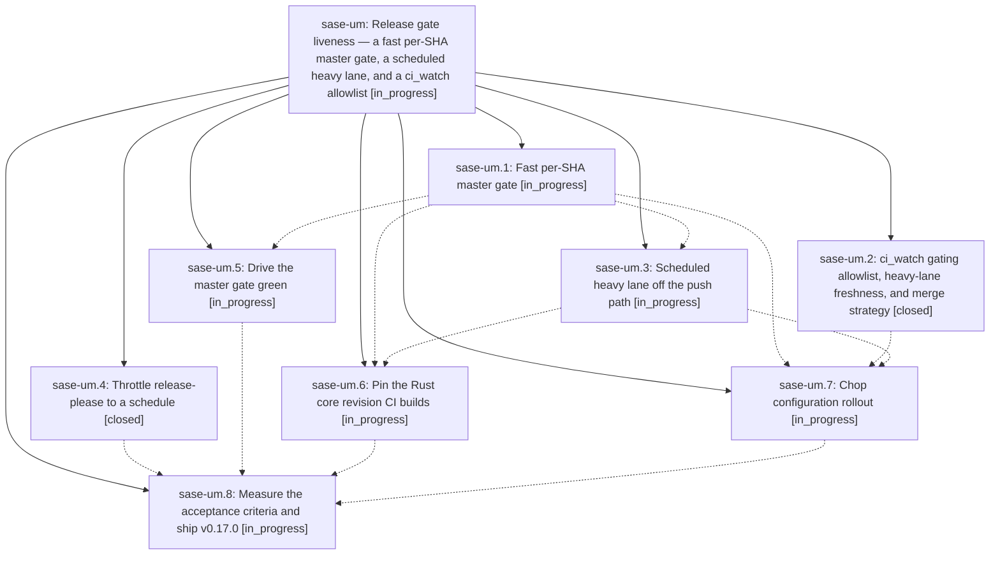

# Bead: sase-um — Release gate liveness — a fast per-SHA master gate, a scheduled heavy lane, and a ci\_watch allowlist

[Bead Pages](../README.md) / sase-um

**Status:** ◐ in_progress · **Type:** ▸ plan · **Tier:** epic
**Owner:** `bryanbugyi34@gmail.com` · **Created by:** [bbugyi200.athena.0ek](https://github.com/sase-org/sase--agents/blob/main/families/bbugyi200.athena.0ek.md) · **Assignee:** `sase-um.land`
**Created:** 2026-08-26 19:12:23 EDT
**Plan:** [202608/release\_gate\_liveness.md](https://github.com/sase-org/sase--plans/blob/main/202608/release_gate_liveness.md)

<!-- sase:links:start -->

## Links

| Relation | Artifact | Why |
| --- | --- | --- |
| implemented-by | [plan:202608/release_gate_liveness.md][1] | derived from the plan's `bead_id:` frontmatter field |

[1]: https://github.com/sase-org/sase--plans/blob/main/202608/release_gate_liveness.md

<!-- sase:links:end -->

## Description

sase-org/sase ships releases again without slowing agent velocity: every master commit gets its own uncancelled CI run, the release gate reads only the fast per-SHA gate, the exhaustive suite still runs on a cadence and still guards the release, and ci_watch merges the release PR with the merge strategy the repository actually allows.

## Phases

| Bead | Title | Status | Size | Created | Agents | Commits |
|---|---|---|---|---|---:|---:|
| [sase-um.1](sase-um.1.md) | Fast per-SHA master gate | ◐ in_progress | large | 2026-08-26 | 1 | 0 |
| [sase-um.2](sase-um.2.md) | ci\_watch gating allowlist, heavy-lane freshness, and merge strategy | ✓ closed | large | 2026-08-26 | 1 | 0 |
| [sase-um.3](sase-um.3.md) | Scheduled heavy lane off the push path | ◐ in_progress | medium | 2026-08-26 | 1 | 0 |
| [sase-um.4](sase-um.4.md) | Throttle release-please to a schedule | ✓ closed | medium | 2026-08-26 | 1 | 0 |
| [sase-um.5](sase-um.5.md) | Drive the master gate green | ◐ in_progress | large | 2026-08-26 | 1 | 0 |
| [sase-um.6](sase-um.6.md) | Pin the Rust core revision CI builds | ◐ in_progress | medium | 2026-08-26 | 1 | 0 |
| [sase-um.7](sase-um.7.md) | Chop configuration rollout | ◐ in_progress | small | 2026-08-26 | 1 | 0 |
| [sase-um.8](sase-um.8.md) | Measure the acceptance criteria and ship v0.17.0 | ◐ in_progress | small | 2026-08-26 | 1 | 0 |

## Lineage

## Agents

| Agent | Bead | Commits |
|---|---|---:|
| [bbugyi200.athena.sase-um.1](https://github.com/sase-org/sase--agents/blob/main/families/bbugyi200.athena.sase-um.1.md) | [sase-um.1](sase-um.1.md) | 0 |
| [bbugyi200.athena.sase-um.2](https://github.com/sase-org/sase--agents/blob/main/families/bbugyi200.athena.sase-um.2.md) | [sase-um.2](sase-um.2.md) | 0 |
| [bbugyi200.athena.sase-um.3](https://github.com/sase-org/sase--agents/blob/main/agents/bbugyi200.athena.sase-um.3/README.md) | [sase-um.3](sase-um.3.md) | 0 |
| [bbugyi200.athena.sase-um.4](https://github.com/sase-org/sase--agents/blob/main/agents/bbugyi200.athena.sase-um.4/README.md) | [sase-um.4](sase-um.4.md) | 0 |
| [bbugyi200.athena.sase-um.5](https://github.com/sase-org/sase--agents/blob/main/agents/bbugyi200.athena.sase-um.5/README.md) | [sase-um.5](sase-um.5.md) | 0 |
| [bbugyi200.athena.sase-um.6](https://github.com/sase-org/sase--agents/blob/main/agents/bbugyi200.athena.sase-um.6/README.md) | [sase-um.6](sase-um.6.md) | 0 |
| [bbugyi200.athena.sase-um.7](https://github.com/sase-org/sase--agents/blob/main/agents/bbugyi200.athena.sase-um.7/README.md) | [sase-um.7](sase-um.7.md) | 0 |
| [bbugyi200.athena.sase-um.8](https://github.com/sase-org/sase--agents/blob/main/agents/bbugyi200.athena.sase-um.8/README.md) | [sase-um.8](sase-um.8.md) | 0 |
| [bbugyi200.athena.sase-um.land](https://github.com/sase-org/sase--agents/blob/main/agents/bbugyi200.athena.sase-um.land/README.md) | [sase-um](README.md) | 0 |
