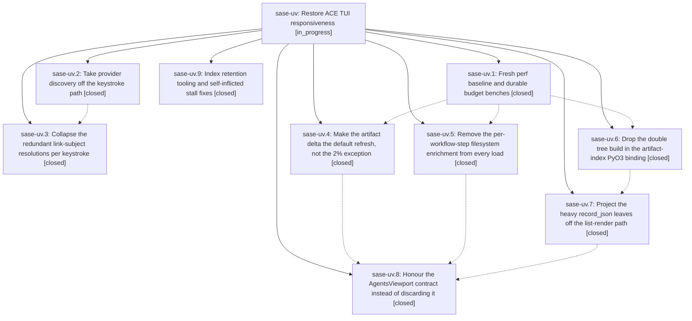

# Bead: sase-uv — Restore ACE TUI responsiveness

[Bead Pages](../README.md) / sase-uv

**Status:** ◐ in_progress · **Type:** ▸ plan · **Tier:** epic
**Owner:** `bryanbugyi34@gmail.com` · **Created by:** [bbugyi200.athena.0ex](https://github.com/sase-org/sase--agents/blob/main/families/bbugyi200.athena.0ex.md) · **Assignee:** `sase-uv.land`
**Created:** 2026-08-27 12:26:43 EDT
**Plan:** [202608/ace\_tui\_responsiveness.md](https://github.com/sase-org/sase--plans/blob/main/202608/ace_tui_responsiveness.md)

<!-- sase:links:start -->

## Links

| Relation | Artifact | Why |
| --- | --- | --- |
| implemented-by | [plan:202608/ace_tui_responsiveness.md][1] | derived from the plan's `bead_id:` frontmatter field |

[1]: https://github.com/sase-org/sase--plans/blob/main/202608/ace_tui_responsiveness.md

<!-- sase:links:end -->

## Description

Pressing a key in `sase ace` never blocks on provider discovery, git subprocesses, or filesystem walks; the steady-state agent refresh costs a fraction of today's ~800 ms warm / 2-3 s loaded full rebuild; and both are held there by benches that fail when the budgets regress.

## Notes

[2026-08-27T23:46:05Z · sase-uv.land] LAND PASS 1 (interrupted): verification + integration. Reviewed every phase bead note and read the epic's eight commits (795afdc5f keypath, c862dddcb hygiene, a9273e768 baseline, 1e8cd69ef railcalls, 668742678 stepmeta, a615273b1 projection, 794fbd3db delta, a805b0da2 viewport) plus the sase-core side (b786e90 read-only opens/VACUUM, a14e888 direct PyO3 serializer, bdce575 list projection, 07bd0f5 windowed reads).

VERIFIED IN CODE: keypath serves stale descriptors and revalidates on a daemon thread, TTL 0.75s -> 30s, fixed panes resolve from ARTIFACTS_ACCENTS/ARTIFACTS_ICONS without discovery, fixed_descriptor is @cache'd; railcalls caches LinkSubject per selection and every call site (rail, $, check_action, commands/context) reads it; delta classifies non-artifact paths honestly and applies partial batches, queue limit 64 -> 256; stepmeta reuses parent record markers instead of re-reading per-step agent_meta.json and dedups _done_extra_files on the raw string; marshal uses serialize_to_py (no intermediate serde_json::Value); projection strips _raw/_data plus linked_repos with lazy hydration wired through every render call site; hygiene ships open_index_read_only, the vacuum binding and `sase agent index vacuum`, and writes pump-stall records off the loop with bounded stacks. epic-symbols is clean for sase-uv and all nine phases.

INTEGRATION WITH LATER MASTER COMMITS: the refactors that landed after individual phases (f07abbec8 done-loader split, d78f5cf51 hint-render split, ebdc9dda0 view-hints harness, 4d3156363/9c3764539 planner projection) all preserved the epic's changes -- checked done_extra_files raw-string dedup, resolve_step_output/resolve_linked_repos call sites, and the jk_paint p95 ceiling individually.

CORE PIN RATCHETED (was a real CI gap): a805b0da2 sends window_limit/candidate_filter and sets active_limit/recent_completed_limit to None, but sase-core-revision.txt still pinned e939669e1 (v0.32.11), which predates 07bd0f5. The agent-scan wire has no deny_unknown_fields, so CI would have silently ignored the window fields AND read the index unbounded -- worse than the pre-epic 1000/200 caps. Ratcheted the pin to 6ac162e (v0.32.12), which contains the windowed-read support.

MEASUREMENT sase-uv.8 never recorded (its only note is the stitch auto-close): warm load_tiered_agents(patch_snapshot=[]) on the live index, 7 samples after warm-up. Bounded default viewport (requested_limit=120): median 272.7ms [235.3-378.7], 633 records, 35 agents. Unbounded: median 662.1ms [613.4-800.6], 833 records, 592 agents. Against the sase-uv.1 baseline (median ~1064ms) the bounded path is a ~74% reduction and meets the epic's <300ms budget -- but see the next note: it meets it by dropping rows it should be showing.

KEYPATH GATE WAS RED ON MASTER and is now green. tests/ace/tui/bench_tui_jk.py::test_bench_keystroke_reaches_no_provider_discovery_or_subprocess -- the phase's own stated "done when" -- still failed after sase-uv.2 closed. Its discovery half passed; its subprocess half patched subprocess.run/Popen process-wide, so it also caught Textual worker threads. Traced all ten calls: every one was on a worker thread (update-status poller, workspace-name probe, detail-header enrichment), never the event loop. tui_perf.md rule 1 *prescribes* pushing subprocess work off-thread and rule 11 governs the keystroke path itself, so the gate as written contradicted rule 1 and was flaky by construction. Scoped both assertions to the event-loop thread, kept off-loop calls as printed diagnostics, and stopped rendering kwargs into the failure message -- it was dumping the inherited env (API keys and tokens included) into pytest output. Gate now passes.

[2026-08-27T23:46:26Z · sase-uv.land] BLOCKING DEFECT (epic-caused, must be fixed before sase-uv closes): the bounded viewport shipped by sase-uv.8 drops nearly every completed agent from the ACE Agents tab.

Evidence on the live index, same warm load, only the viewport differs:
  bounded (default, requested_limit=120): 35 agents -- 17 WAITING, 9 RUNNING, 9 DONE
  unbounded:                              592 agents -- 505 DONE, 38 TALE DONE, 16 WAITING, 12 RUNNING, 12 ANSWERED, 5 TALE APPROVED, 4 WORKING TALE
The live path always passes a viewport (_loading_disk.py:136/191/299 -> _agents_viewport_for_load), so this is the default Agents-tab behaviour, not an opt-in.

ROOT CAUSE, sase-core crates/sase_core/src/agent_scan/index.rs:3733:
  let completed_budget = requested_limit.saturating_sub(active_candidates.len() as u32) as usize;
The window honours plan invariant 2 ("active rows are never hidden merely to satisfy the requested limit") by taking every active candidate first, then filling the remainder from completed. On this host active_candidate_count=633 and requested_limit=120, so completed_budget saturates to 0 and completed_candidate_count=2761 contributes nothing: selected_candidate_count == returned_record_count == 633, all active.

The 633 is the real problem. active_where() selects `has_done_marker = 0 OR workflow_status NOT IN (completed, failed, cancelled, noop)`, which on a long-lived index matches hundreds of abandoned/never-finalized rows that the Python loader then discards -- 633 index rows become 26 rendered active agents. So the window budget is consumed almost entirely by rows that never reach the screen, and the completed fill starves.

Viewport expansion cannot recover it: _maybe_schedule_agents_viewport_expansion grows requested_limit from current_idx, but only 35 rows exist to navigate, so current_idx never approaches 633 and the completed rows stay unreachable.

Test gap that let it through: the core's windowed_query_preserves_active_rows_and_fills_with_completed uses 3 active / 2 completed with limit 4, so it only ever exercises active < limit. The agents_viewport_1.md Part 4.3 loader test ("the bounded result must equal the exact prefix of the fully normalized/filtered ordering") was never written.

Candidate fixes, in rough order of preference -- needs measurement, not assumption:
1. Guarantee a completed floor: reserve a minimum completed fill (or fill completed to the requested limit independently of active overflow) so an inflated active set cannot starve it. Smallest blast radius; keeps invariant 2's intent.
2. Tighten active_where / reconcile abandoned rows so active_candidate_count reflects what the loader will actually render. Fixes the cause rather than the symptom, but couples to index retention (see sase-uv.9's retention follow-up).
3. Cap active candidates as well. Contradicts plan invariant 2 as written, so it would need a deliberate revision of that invariant.
Whatever is chosen must also add the missing loader-level prefix-equivalence test and a core test with active >> limit.

[2026-08-27T23:46:45Z · sase-uv.land] FOLLOW-UP INVENTORY carried forward for whoever resumes this landing. I deliberately did NOT file these as task beads this turn: the epic cannot close until the bounded-viewport defect above is fixed, and the close note is where /sase_new_task outcomes belong. Filing them now would only invite duplicates from the resuming land agent. Each is recorded here with its proposing bead so nothing is lost.

Already resolved, do not re-file:
- sase-uv.7 #3 (ratchet the pinned core before landing): done for the projection binding by 4d3156363, and done for sase-uv.8's windowed reads by this turn's ratchet to 6ac162e.

Still open, file with /sase_new_task at close time:
- sase-uv.1 #2 -- tests/test_plan_approval_launch_reliability_integration.py can hang forever. Still reproducible by inspection: both tests submit a poller (wait_for_gate / poll) into a ThreadPoolExecutor context manager. If an outer `assert ...wait(timeout=5)` fails before release.set(), the poller never returns and __exit__'s shutdown(wait=True) joins it with no deadline, so a timing failure becomes an unkillable suite hang instead of a fast failure. Wants shutdown(wait=True, cancel_futures=True) with its own deadline, or a bounded poll.
- sase-uv.4 #1 -- tests/pager/test_rail_parity.py expected_target5 parametrizations failed in a full run and passed immediately in isolation. Flake.
- sase-uv.9 #1 -- ~13 process-liveness/runner-slot tests (test_agent_wait_cli, test_agent_wait_live, test_running_agents_snapshot, test_agent_chat_from_name, axe/test_agent_meta_atomic, fakey/test_runner_slots_e2e) fail under host contention and were reproduced on a clean stashed master, so they predate the epic. Flake.
- sase-uv.7 #2 -- split heavy record details out of record_json (a record_detail_json column or detail table) so the index read and serde decode can skip _raw/_data and linked-repo bytes too, not just the PyO3 serialization and Python rehydration. Needs a full-table migration.
- sase-uv.9 #2 -- retention for the unbounded JSON registries the plan cites (agent_name_registry.json ~17MB/13,118 entries, dismissed_agents.json ~2.4MB). The SQLite dismissed_agents table is a mirror rebuilt from the JSON, so a real policy has to bound the JSON source and needs a product decision on TTL/count caps. Note this is the same abandoned-row accumulation that inflates active_candidate_count in the defect above.
- sase-uv.2 #1 -- full-lane red with agent/core schema and metadata failures plus an xdist shutdown stuck in test_archive_publication_order_survives_inverted_scheduling. Recorded at 13:58, before b69b07bc9, 4d3156363 and 9c3764539 landed fixes that look like exactly those failures. Probably stale; confirm against a fresh just check-full before filing.

From the plan's own "Out of scope", which it says the land agent should raise:
- tui_perf.md rule 1 GIL corollary: to_thread moves CPU-bound Python and PyO3 marshalling off the loop but only partially off the GIL, and each additional concurrent load makes the worst UI stall worse (100ms -> 426ms at 1 -> 8 threads). The measurements support it. Editing SASE memory needs the user's explicit approval,

… and 4012 more characters

## Phases

| Bead | Title | Status | Size | Created | Agents | Commits |
|---|---|---|---|---|---:|---:|
| [sase-uv.1](sase-uv.1.md) | Fresh perf baseline and durable budget benches | ✓ closed | small | 2026-08-27 | 1 | 1 |
| [sase-uv.2](sase-uv.2.md) | Take provider discovery off the keystroke path | ✓ closed | medium | 2026-08-27 | 1 | 1 |
| [sase-uv.3](sase-uv.3.md) | Collapse the redundant link-subject resolutions per keystroke | ✓ closed | small | 2026-08-27 | 1 | 1 |
| [sase-uv.4](sase-uv.4.md) | Make the artifact delta the default refresh, not the 2% exception | ✓ closed | medium | 2026-08-27 | 0 | 1 |
| [sase-uv.5](sase-uv.5.md) | Remove the per-workflow-step filesystem enrichment from every load | ✓ closed | medium | 2026-08-27 | 1 | 1 |
| [sase-uv.6](sase-uv.6.md) | Drop the double tree build in the artifact-index PyO3 binding | ✓ closed | medium | 2026-08-27 | 1 | 1 |
| [sase-uv.7](sase-uv.7.md) | Project the heavy record\_json leaves off the list-render path | ✓ closed | large | 2026-08-27 | 1 | 2 |
| [sase-uv.8](sase-uv.8.md) | Honour the AgentsViewport contract instead of discarding it | ✓ closed | large | 2026-08-27 | 1 | 2 |
| [sase-uv.9](sase-uv.9.md) | Index retention tooling and self-inflicted stall fixes | ✓ closed | medium | 2026-08-27 | 1 | 2 |

## Lineage

## Agents

| Agent | Bead | Commits |
|---|---|---:|
| [bbugyi200.athena.sase-uv.1](https://github.com/sase-org/sase--agents/blob/main/agents/bbugyi200.athena.sase-uv.1/README.md) | [sase-uv.1](sase-uv.1.md) | 1 |
| [bbugyi200.athena.sase-uv.2](https://github.com/sase-org/sase--agents/blob/main/agents/bbugyi200.athena.sase-uv.2/README.md) | [sase-uv.2](sase-uv.2.md) | 1 |
| [bbugyi200.athena.sase-uv.3](https://github.com/sase-org/sase--agents/blob/main/agents/bbugyi200.athena.sase-uv.3/README.md) | [sase-uv.3](sase-uv.3.md) | 1 |
| [bbugyi200.athena.sase-uv.5](https://github.com/sase-org/sase--agents/blob/main/agents/bbugyi200.athena.sase-uv.5/README.md) | [sase-uv.5](sase-uv.5.md) | 1 |
| [bbugyi200.athena.sase-uv.6](https://github.com/sase-org/sase--agents/blob/main/agents/bbugyi200.athena.sase-uv.6/README.md) | [sase-uv.6](sase-uv.6.md) | 1 |
| [bbugyi200.athena.sase-uv.7](https://github.com/sase-org/sase--agents/blob/main/families/bbugyi200.athena.sase-uv.7.md) | [sase-uv.7](sase-uv.7.md) | 2 |
| [bbugyi200.athena.sase-uv.8](https://github.com/sase-org/sase--agents/blob/main/families/bbugyi200.athena.sase-uv.8.md) | [sase-uv.8](sase-uv.8.md) | 2 |
| [bbugyi200.athena.sase-uv.9](https://github.com/sase-org/sase--agents/blob/main/agents/bbugyi200.athena.sase-uv.9/README.md) | [sase-uv.9](sase-uv.9.md) | 2 |
| [bbugyi200.athena.sase-uv.land](https://github.com/sase-org/sase--agents/blob/main/families/bbugyi200.athena.sase-uv.land.md) | [sase-uv](README.md) | 1 |

## Commits

| Repo | Commit | Subject | Bead | Committed |
|---|---|---|---|---|
| sase | [`795afdc`](https://github.com/sase-org/sase/commit/795afdc5faee02e63f5753f3ca7e822797b29538) | fix(ace): keep artifact discovery off key path | [sase-uv.2](sase-uv.2.md) | 2026-08-27 14:03:06 EDT |
| sase | [`c862ddd`](https://github.com/sase-org/sase/commit/c862dddcba39165fe5b21a94e22a5bdf0c3a1bde) | fix(tui): write pump-stall records off the event loop and add index vacuum tooling | [sase-uv.9](sase-uv.9.md) | 2026-08-27 14:14:13 EDT |
| sase-core | [`sase-core@b786e90`](https://github.com/sase-org/sase-core/commit/b786e90b5655c10a4cc7212b24a765a2505d6190) | feat(agent-scan): add read-only index opens and a VACUUM binding | [sase-uv.9](sase-uv.9.md) | 2026-08-27 14:15:02 EDT |
| sase | [`a9273e7`](https://github.com/sase-org/sase/commit/a9273e768052cf4d69fed1ffd203ca1598d2dfa3) | test(ace-tui): assert keystroke-to-paint budgets and add keypath discovery regression gate | [sase-uv.1](sase-uv.1.md) | 2026-08-27 14:17:01 EDT |
| sase | [`1e8cd69`](https://github.com/sase-org/sase/commit/1e8cd69ef4f639973c61e9dff8fb7fdeef3c7382) | perf(ace): cache link subjects per selection | [sase-uv.3](sase-uv.3.md) | 2026-08-27 14:25:27 EDT |
| sase-core | [`sase-core@a14e888`](https://github.com/sase-org/sase-core/commit/a14e888e13ae15d1ed578604fe96e880b6153d73) | perf(agent-scan): marshal artifact index directly to Python | [sase-uv.6](sase-uv.6.md) | 2026-08-27 14:33:54 EDT |
| sase | [`6687426`](https://github.com/sase-org/sase/commit/6687426783e2db699ba3fd2ffc8882cc8f435e8f) | perf(ace-tui): reuse parent record markers for workflow step enrichment | [sase-uv.5](sase-uv.5.md) | 2026-08-27 14:49:35 EDT |
| sase | [`a615273`](https://github.com/sase-org/sase/commit/a615273b13a5e0615ddbbc6a6c3747c58c19f8f8) | feat(tui): hydrate list-shaped artifact records | [sase-uv.7](sase-uv.7.md) | 2026-08-27 16:16:41 EDT |
| sase-core | [`sase-core@bdce575`](https://github.com/sase-org/sase-core/commit/bdce575a5bea16a97f0f5fd31947d42a7de81dd1) | feat(agent-scan): project list-shaped artifact records | [sase-uv.7](sase-uv.7.md) | 2026-08-27 16:19:51 EDT |
| sase | [`794fbd3`](https://github.com/sase-org/sase/commit/794fbd3db9f87417599200477ba3a5b149b4f807) | perf: Make the artifact delta the default refresh, not the 2% exception (sase-uv.4) | [sase-uv.4](sase-uv.4.md) | 2026-08-27 16:51:49 EDT |
| sase | [`a805b0d`](https://github.com/sase-org/sase/commit/a805b0da2f23de59d628c9c16ff4855fb68d8a02) | feat(agents): add bounded viewport loading | [sase-uv.8](sase-uv.8.md) | 2026-08-27 18:49:33 EDT |
| sase-core | [`sase-core@07bd0f5`](https://github.com/sase-org/sase-core/commit/07bd0f589434f90c51faab4994c0ef0d4db1c31d) | feat(agent-scan): support windowed index reads | [sase-uv.8](sase-uv.8.md) | 2026-08-27 18:52:28 EDT |
| sase | [`a5d59a4`](https://github.com/sase-org/sase/commit/a5d59a4cb34107399eebcd5bb0bb5d8343b2e8dd) | fix(agents): ratchet core pin and scope the keypath bench gate | [sase-uv](README.md) | 2026-08-27 20:09:26 EDT |
