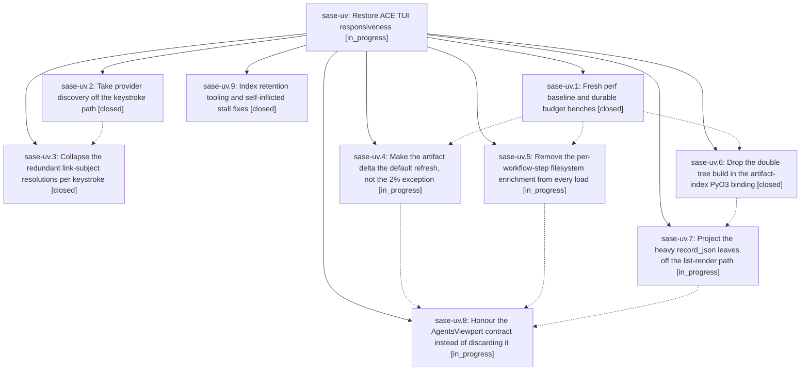

# Bead: sase-uv — Restore ACE TUI responsiveness

[Bead Pages](../README.md) / sase-uv

**Status:** ◐ in_progress · **Type:** ▸ plan · **Tier:** epic
**Owner:** `bryanbugyi34@gmail.com` · **Created by:** [bbugyi200.athena.0ex](https://github.com/sase-org/sase--agents/blob/main/families/bbugyi200.athena.0ex.md) · **Assignee:** `sase-uv.land`
**Created:** 2026-08-27 12:26:43 EDT
**Plan:** [202608/ace\_tui\_responsiveness.md](https://github.com/sase-org/sase--plans/blob/main/202608/ace_tui_responsiveness.md)

<!-- sase:links:start -->

## Links

| Relation | Artifact | Why |
| --- | --- | --- |
| implemented-by | [plan:202608/ace_tui_responsiveness.md][1] | derived from the plan's `bead_id:` frontmatter field |

[1]: https://github.com/sase-org/sase--plans/blob/main/202608/ace_tui_responsiveness.md

<!-- sase:links:end -->

## Description

Pressing a key in `sase ace` never blocks on provider discovery, git subprocesses, or filesystem walks; the steady-state agent refresh costs a fraction of today's ~800 ms warm / 2-3 s loaded full rebuild; and both are held there by benches that fail when the budgets regress.

## Phases

| Bead | Title | Status | Size | Created | Agents | Commits |
|---|---|---|---|---|---:|---:|
| [sase-uv.1](sase-uv.1.md) | Fresh perf baseline and durable budget benches | ✓ closed | small | 2026-08-27 | 1 | 1 |
| [sase-uv.2](sase-uv.2.md) | Take provider discovery off the keystroke path | ✓ closed | medium | 2026-08-27 | 1 | 1 |
| [sase-uv.3](sase-uv.3.md) | Collapse the redundant link-subject resolutions per keystroke | ✓ closed | small | 2026-08-27 | 1 | 1 |
| [sase-uv.4](sase-uv.4.md) | Make the artifact delta the default refresh, not the 2% exception | ◐ in_progress | medium | 2026-08-27 | 1 | 0 |
| [sase-uv.5](sase-uv.5.md) | Remove the per-workflow-step filesystem enrichment from every load | ◐ in_progress | medium | 2026-08-27 | 1 | 1 |
| [sase-uv.6](sase-uv.6.md) | Drop the double tree build in the artifact-index PyO3 binding | ✓ closed | medium | 2026-08-27 | 1 | 1 |
| [sase-uv.7](sase-uv.7.md) | Project the heavy record\_json leaves off the list-render path | ◐ in_progress | large | 2026-08-27 | 1 | 0 |
| [sase-uv.8](sase-uv.8.md) | Honour the AgentsViewport contract instead of discarding it | ◐ in_progress | large | 2026-08-27 | 1 | 0 |
| [sase-uv.9](sase-uv.9.md) | Index retention tooling and self-inflicted stall fixes | ✓ closed | medium | 2026-08-27 | 1 | 2 |

## Lineage

## Agents

| Agent | Bead | Commits |
|---|---|---:|
| [bbugyi200.athena.sase-uv.1](https://github.com/sase-org/sase--agents/blob/main/agents/bbugyi200.athena.sase-uv.1/README.md) | [sase-uv.1](sase-uv.1.md) | 1 |
| [bbugyi200.athena.sase-uv.2](https://github.com/sase-org/sase--agents/blob/main/agents/bbugyi200.athena.sase-uv.2/README.md) | [sase-uv.2](sase-uv.2.md) | 1 |
| [bbugyi200.athena.sase-uv.3](https://github.com/sase-org/sase--agents/blob/main/agents/bbugyi200.athena.sase-uv.3/README.md) | [sase-uv.3](sase-uv.3.md) | 1 |
| [bbugyi200.athena.sase-uv.4](https://github.com/sase-org/sase--agents/blob/main/agents/bbugyi200.athena.sase-uv.4/README.md) | [sase-uv.4](sase-uv.4.md) | 0 |
| [bbugyi200.athena.sase-uv.5](https://github.com/sase-org/sase--agents/blob/main/agents/bbugyi200.athena.sase-uv.5/README.md) | [sase-uv.5](sase-uv.5.md) | 1 |
| [bbugyi200.athena.sase-uv.6](https://github.com/sase-org/sase--agents/blob/main/agents/bbugyi200.athena.sase-uv.6/README.md) | [sase-uv.6](sase-uv.6.md) | 1 |
| [bbugyi200.athena.sase-uv.7](https://github.com/sase-org/sase--agents/blob/main/families/bbugyi200.athena.sase-uv.7.md) | [sase-uv.7](sase-uv.7.md) | 0 |
| [bbugyi200.athena.sase-uv.8](https://github.com/sase-org/sase--agents/blob/main/agents/bbugyi200.athena.sase-uv.8/README.md) | [sase-uv.8](sase-uv.8.md) | 0 |
| [bbugyi200.athena.sase-uv.9](https://github.com/sase-org/sase--agents/blob/main/agents/bbugyi200.athena.sase-uv.9/README.md) | [sase-uv.9](sase-uv.9.md) | 2 |
| [bbugyi200.athena.sase-uv.land](https://github.com/sase-org/sase--agents/blob/main/agents/bbugyi200.athena.sase-uv.land/README.md) | [sase-uv](README.md) | 0 |

## Commits

| Repo | Commit | Subject | Bead | Committed |
|---|---|---|---|---|
| sase | [`795afdc`](https://github.com/sase-org/sase/commit/795afdc5faee02e63f5753f3ca7e822797b29538) | fix(ace): keep artifact discovery off key path | [sase-uv.2](sase-uv.2.md) | 2026-08-27 14:03:06 EDT |
| sase | [`c862ddd`](https://github.com/sase-org/sase/commit/c862dddcba39165fe5b21a94e22a5bdf0c3a1bde) | fix(tui): write pump-stall records off the event loop and add index vacuum tooling | [sase-uv.9](sase-uv.9.md) | 2026-08-27 14:14:13 EDT |
| sase-core | [`sase-core@b786e90`](https://github.com/sase-org/sase-core/commit/b786e90b5655c10a4cc7212b24a765a2505d6190) | feat(agent-scan): add read-only index opens and a VACUUM binding | [sase-uv.9](sase-uv.9.md) | 2026-08-27 14:15:02 EDT |
| sase | [`a9273e7`](https://github.com/sase-org/sase/commit/a9273e768052cf4d69fed1ffd203ca1598d2dfa3) | test(ace-tui): assert keystroke-to-paint budgets and add keypath discovery regression gate | [sase-uv.1](sase-uv.1.md) | 2026-08-27 14:17:01 EDT |
| sase | [`1e8cd69`](https://github.com/sase-org/sase/commit/1e8cd69ef4f639973c61e9dff8fb7fdeef3c7382) | perf(ace): cache link subjects per selection | [sase-uv.3](sase-uv.3.md) | 2026-08-27 14:25:27 EDT |
| sase-core | [`sase-core@a14e888`](https://github.com/sase-org/sase-core/commit/a14e888e13ae15d1ed578604fe96e880b6153d73) | perf(agent-scan): marshal artifact index directly to Python | [sase-uv.6](sase-uv.6.md) | 2026-08-27 14:33:54 EDT |
| sase | [`6687426`](https://github.com/sase-org/sase/commit/6687426783e2db699ba3fd2ffc8882cc8f435e8f) | perf(ace-tui): reuse parent record markers for workflow step enrichment | [sase-uv.5](sase-uv.5.md) | 2026-08-27 14:49:35 EDT |
