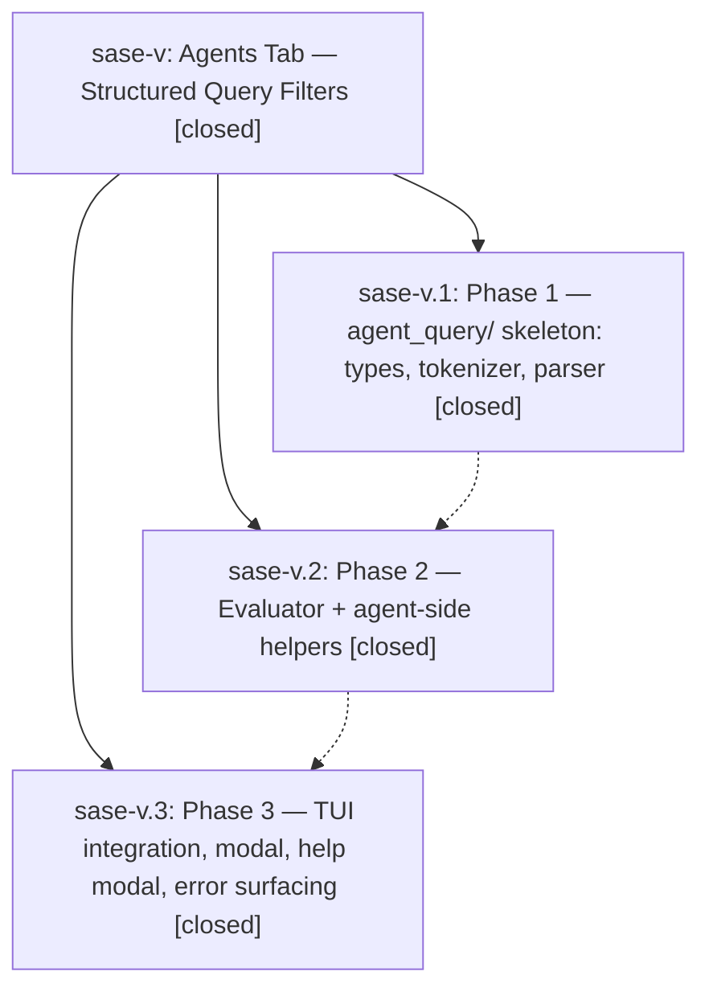

# Bead: sase-v — Agents Tab — Structured Query Filters

[Bead Pages](../README.md) / sase-v

**Status:** ✓ closed · **Resolution:** (unrecorded) · **Type:** plan · **Tier:** epic
**Owner:** `bryanbugyi34@gmail.com`
**Created:** 2026-04-26 07:30:45 UTC · **Closed:** 2026-04-26 08:18:54 UTC
**Plan:** [202604/agents\_tab\_query\_filters.md](https://github.com/sase-org/sase--plans/blob/main/202604/agents_tab_query_filters.md)

## Phases

| Bead | Title | Status | Size | Agents | Commits |
|---|---|---|---|---:|---:|
| [sase-v.1](sase-v.1.md) | Phase 1 — agent\_query/ skeleton: types, tokenizer, parser | ✓ closed | small | 0 | 0 |
| [sase-v.2](sase-v.2.md) | Phase 2 — Evaluator + agent-side helpers | ✓ closed | small | 0 | 1 |
| [sase-v.3](sase-v.3.md) | Phase 3 — TUI integration, modal, help modal, error surfacing | ✓ closed | small | 0 | 1 |

## Lineage

## Commits

| Commit | Subject | Bead | Committed (UTC) |
|---|---|---|---|
| [`8ca4684`](https://github.com/sase-org/sase/commit/8ca46840d49ef809c216eae66ae5151d8fa4e0e6) | feat: add agent\_query evaluator + agent helpers — phase 2 of agents-tab structured query filters (sase-v.2) | [sase-v.2](sase-v.2.md) | 2026-04-26 07:58:15 |
| [`3872af5`](https://github.com/sase-org/sase/commit/3872af53d1546d1617c12d0c007ed1216101978c) | feat(agents-tab): wire structured query filters into TUI — phase 3 of agents-tab structured query filters (sase-v.3) | [sase-v.3](sase-v.3.md) | 2026-04-26 08:15:25 |
