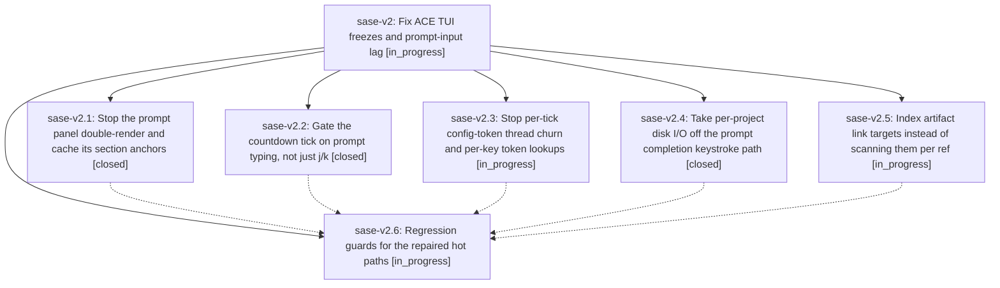

# Bead: sase-v2 — Fix ACE TUI freezes and prompt-input lag

[Bead Pages](../README.md) / sase-v2

**Status:** ◐ in_progress · **Type:** ▸ plan · **Tier:** epic
**Owner:** `bryanbugyi34@gmail.com` · **Created by:** [bbugyi200.athena.0fe](https://github.com/sase-org/sase--agents/blob/main/families/bbugyi200.athena.0fe.md) · **Assignee:** `sase-v2.land`
**Created:** 2026-08-28 09:01:18 EDT
**Plan:** [202608/tui\_freeze\_regression.md](https://github.com/sase-org/sase--plans/blob/main/202608/tui_freeze_regression.md)

<!-- sase:links:start -->

## Links

| Relation | Artifact | Why |
| --- | --- | --- |
| implemented-by | [plan:202608/tui_freeze_regression.md][1] | derived from the plan's `bead_id:` frontmatter field |

[1]: https://github.com/sase-org/sase--plans/blob/main/202608/tui_freeze_regression.md

<!-- sase:links:end -->

## Description

The ACE TUI stays responsive while typing in the prompt input and while navigating the Agents tab: the main thread stops burning CPU on redundant render and measurement passes, the one-second countdown tick stops doing unbounded synchronous work on the Textual pump, keystroke paths stop doing per-project disk I/O, and background workers stop starving the event loop. Key-to-paint p95 on the Agents tab returns under the 16 ms budget and the stall watchdog stops recording multi-second hitches during ordinary use.

## Phases

| Bead | Title | Status | Size | Created | Agents | Commits |
|---|---|---|---|---|---:|---:|
| [sase-v2.1](sase-v2.1.md) | Stop the prompt panel double-render and cache its section anchors | ✓ closed | medium | 2026-08-28 | 1 | 1 |
| [sase-v2.2](sase-v2.2.md) | Gate the countdown tick on prompt typing, not just j/k | ✓ closed | small | 2026-08-28 | 1 | 1 |
| [sase-v2.3](sase-v2.3.md) | Stop per-tick config-token thread churn and per-key token lookups | ◐ in_progress | small | 2026-08-28 | 1 | 0 |
| [sase-v2.4](sase-v2.4.md) | Take per-project disk I/O off the prompt completion keystroke path | ✓ closed | medium | 2026-08-28 | 1 | 1 |
| [sase-v2.5](sase-v2.5.md) | Index artifact link targets instead of scanning them per ref | ◐ in_progress | small | 2026-08-28 | 1 | 0 |
| [sase-v2.6](sase-v2.6.md) | Regression guards for the repaired hot paths | ◐ in_progress | medium | 2026-08-28 | 1 | 0 |

## Lineage

## Agents

| Agent | Bead | Commits |
|---|---|---:|
| [bbugyi200.athena.sase-v2.1](https://github.com/sase-org/sase--agents/blob/main/agents/bbugyi200.athena.sase-v2.1/README.md) | [sase-v2.1](sase-v2.1.md) | 1 |
| [bbugyi200.athena.sase-v2.2](https://github.com/sase-org/sase--agents/blob/main/agents/bbugyi200.athena.sase-v2.2/README.md) | [sase-v2.2](sase-v2.2.md) | 1 |
| [bbugyi200.athena.sase-v2.3](https://github.com/sase-org/sase--agents/blob/main/agents/bbugyi200.athena.sase-v2.3/README.md) | [sase-v2.3](sase-v2.3.md) | 0 |
| [bbugyi200.athena.sase-v2.4](https://github.com/sase-org/sase--agents/blob/main/agents/bbugyi200.athena.sase-v2.4/README.md) | [sase-v2.4](sase-v2.4.md) | 1 |
| [bbugyi200.athena.sase-v2.5](https://github.com/sase-org/sase--agents/blob/main/agents/bbugyi200.athena.sase-v2.5/README.md) | [sase-v2.5](sase-v2.5.md) | 0 |
| [bbugyi200.athena.sase-v2.6](https://github.com/sase-org/sase--agents/blob/main/agents/bbugyi200.athena.sase-v2.6/README.md) | [sase-v2.6](sase-v2.6.md) | 0 |
| [bbugyi200.athena.sase-v2.land](https://github.com/sase-org/sase--agents/blob/main/agents/bbugyi200.athena.sase-v2.land/README.md) | [sase-v2](README.md) | 0 |

## Commits

| Repo | Commit | Subject | Bead | Committed |
|---|---|---|---|---|
| sase | [`a01d3e5`](https://github.com/sase-org/sase/commit/a01d3e56cb466e47baecf1da507a4b5e8132385e) | fix(tui): defer countdown repaint during prompt input | [sase-v2.2](sase-v2.2.md) | 2026-08-28 09:30:24 EDT |
| sase | [`1858f75`](https://github.com/sase-org/sase/commit/1858f75606b82b31087410dc5447ccfcf731759c) | fix(tui): cache prompt panel section visuals | [sase-v2.1](sase-v2.1.md) | 2026-08-28 09:49:43 EDT |
| sase | [`cff6988`](https://github.com/sase-org/sase/commit/cff6988dadfc2a49fc55e34c9a0621afcc7e63f1) | fix(tui): move prompt completion lookups off pump | [sase-v2.4](sase-v2.4.md) | 2026-08-28 10:03:29 EDT |
