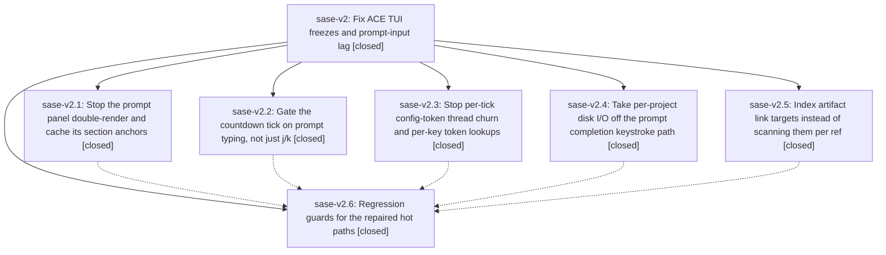

# Bead: sase-v2 — Fix ACE TUI freezes and prompt-input lag

[Bead Pages](../README.md) / sase-v2

**Status:** ✓ closed · **Resolution:** done · **Type:** ▸ plan · **Tier:** epic
**Owner:** `bryanbugyi34@gmail.com` · **Created by:** [bbugyi200.athena.0fe](https://github.com/sase-org/sase--agents/blob/main/families/bbugyi200.athena.0fe.md) · **Assignee:** `sase-v2.land`
**Created:** 2026-08-28 09:01:18 EDT · **Closed:** 2026-08-28 11:02:57 EDT
**Plan:** [202608/tui\_freeze\_regression.md](https://github.com/sase-org/sase--plans/blob/main/202608/tui_freeze_regression.md)

<!-- sase:links:start -->

## Links

| Relation | Artifact | Why |
| --- | --- | --- |
| implemented-by | [plan:202608/tui_freeze_regression.md][1] | derived from the plan's `bead_id:` frontmatter field |
| related | [bead:sase-v3][2] | Proposed by this epic's plan ('Out of scope'). The epic's live forensics on one sase ace process is where the 2.3-2.5 GB measurement came from; read its py-spy and stall evidence first. |

[1]: https://github.com/sase-org/sase--plans/blob/main/202608/tui_freeze_regression.md
[2]: https://github.com/sase-org/sase--beads/blob/main/pages/sase-v3/README.md

<!-- sase:links:end -->

## Description

The ACE TUI stays responsive while typing in the prompt input and while navigating the Agents tab: the main thread stops burning CPU on redundant render and measurement passes, the one-second countdown tick stops doing unbounded synchronous work on the Textual pump, keystroke paths stop doing per-project disk I/O, and background workers stop starving the event loop. Key-to-paint p95 on the Agents tab returns under the 16 ms budget and the stall watchdog stops recording multi-second hitches during ordinary use.

## Notes

[2026-08-28T15:02:57Z · sase-v2.land] LANDED. Verified all six phases against the source and their commits, integrated, and routed every follow-up.

VERIFIED (step 1). Read the epic bead, all six child beads and their notes, the linked plan, and each phase commit's diff against the plan's phase requirements:
- sase-v2.1 (1858f7560): AgentPromptPanel.render() now returns one cached SectionTrackingVisual per _section_generation, and SectionTrackingVisual memoizes anchors in _anchors_by_key[(generation, width)]. get_height() no longer runs a second full app.console.render per measurement pass; it delegates height to the wrapped visual and reuses the memoized anchors, so the extra Rich render happens at most once per (generation, width) instead of per call. Confirmed AgentPromptPanel.update() is the sole content-mutation path that bumps the generation (Textual's Static.content setter, the only other way __visual changes, is never used on this widget), so the cached visual cannot serve stale content.
- sase-v2.2 (a01d3e56c): _on_countdown_tick now defers _update_agents_info_panel/_patch_agent_runtime_rows/_poll_starting_agent_transitions on `not nav_gate.is_navigating() and not _prompt_input_active()`. It reuses the pre-existing _prompt_input_active() (prompt bar mounted or editor-suspended) rather than adding a new typing window; that is a broader gate than the plan sketched but matches the convention _auto_refresh and _watcher already use, the prompt bar is a transient on-demand surface rather than a persistent one, and the logical countdown decrement still runs every tick.
- sase-v2.3 (9415b82af): refresh_thread.start() moved out of _current_config_token_cache_lock (with the handle rolled back under the lock if start() raises); _CONFIG_TOKEN_REFRESH_INTERVAL_SECONDS raised 0.75 -> 5.0 with a comment tying it to the 1 s tick; effective_collapsed_panel_keys resolves _tribe_displays() once per call and indexes it per key instead of calling tribe_display_for (and therefore current_config_token) per key. clear_config_cache/CONFIG_DIR rebinding semantics unchanged; `cached` is provably non-None on the path that returns it outside the lock.
- sase-v2.4 (cff6988da): per-call memo dicts in canonicalize_project_aliases_in_prompt replaced by process-level caches keyed on (loader, project, mtime_ns+size signature) per tui_perf rule 8, with an explicit use_cache=False bypass for callers needing fresh reads; the soft-completion refresh moved off the pump via spawn_pump_free_task + asyncio.to_thread, applied under the existing generation guard plus a text/cursor recheck. Confirmed the new on_unmount is actually reached: ArtifactRefSyncMixin.on_unmount precedes it in PromptTextArea's MRO but chains through super(), no mixin between them shadows it, and cancel_pump_free_tasks(owner) walks every registry name so the "prompt-soft-completion" registry is cancelled at teardown.
- sase-v2.5 (4a3cd4404): _known_target_for_ref serves from a prebuilt _KnownTargetIndex (file first-part, (pane, last-part), per-repo stitch sha-prefix buckets, agent target list) built once per artifact_link_edges call; the agent branch hoists current_owner_agent_name_lookup_candidates to one call per ref. Checked equivalence by hand: the sha-prefix index reproduces the old `== sha or startswith(sha)` semantics including the empty-sha case, and inverting the agent candidate comparison is safe because the candidate set is symmetric over the {bare, machine.bare, global} spellings the panes and refs actually use. The one behavior narrowing is that kind in {file, agent, patch, bead, stitch} no longer falls through to a `ref:<kind>` pane target; that fall-through was unreachable, since target_for_ref_kind maps exactly those kinds to their own panes and `ref:<kind>` pane ids are only minted for ref-catalog kinds.
- sase-v2.6 (29e15be0d): the plan's six guards are all present and deterministic (instance/counter/read-count assertions, no timing assertions) - visual reuse and one anchor pass per (generation, width); countdown deferral plus catch-up on the next quiet tick; no thread per call at tick cadence and start() observed with the lock not held; zero project-file reads on a warm completion cache; index-only artifact-link lookup (via a frozenset whose __iter__ raises) plus a legacy-implementation equivalence test. The sixth, Agents-tab j/k p95, was already covered by tests/ace/tui/bench_tui_jk_agents.py, which the plan allowed for.

INTEGRATED (step 2). Only one commit landed between the epic's forensics and its first stitch: de491c710 "feat(ace): remove synthetic planner status reconciliation" (sase-ud.13.1.3.1.5.1, 08:42, before this epic's bead existed). It touches src/sase/ace/tui/models/_agent_status_*.py, disjoint from every file this epic changed; no conflict and nothing there should now use what this epic added. master is level with origin/master, so there is no base-branch drift and no PR to reconcile. Swept for the two patterns this epic established: no other production caller of _known_target_for_ref passes an unindexed frozenset (link_index.py builds its own separate ref->chips index and is not duplicative), and the remaining tribe_display_for callers (_agent_panel_title, agent_tribe_summary helpers) are once-per-panel, not the per-key loop sase-v2.3 removed.

LANDING FIX: removed one unreachable `return None` left after the final `return` in _known_target_for_ref by 4a3cd4404 - epic-introduced dead code that ruff does not flag.

VERIFICATION RUN: `just install` (this workspace was stale), then the focused suites for every touched area - test_artifacts_relation_sources, test_agents_pane_detail_relations, test_event_handlers_nav_gate, test_prompt_panel_section_navigation_targets, test_prompt_completion_root, test_config_cache_token, test_tribe_display, test_project_alias_services - 93 passed. `just check` green: every lint gate including symvision, plus the scoped test lane (174 of 3467 files). NOT RE-VERIFIED: the plan's live-forensics acceptance (py-spy on a running TUI, tui_jk.jsonl Agents-tab p95 < 16 ms, a clean tui_stalls.jsonl window) needs a live reproducing session and was not repeated here; the deterministic guards from sase-v2.6 stand in for it in CI.

FOLLOW-UPS (step 3), all three routed, none left for the next agent:
1. sase-v2.4's PROPOSED FOLLOW-UP (intermittent tests/ace/tui/test_plugins_browser_pane_sase_update.py::test_updates_pane_sase_update_confirm_executes_and_refreshes) is a semantic duplicate of ready flake task sase-qr, same 5 s wait_for-under-parallel-lane shape. Corroborated with `sase bead +1 sase-qr` (now +8) recording that the failing test stubs its catalog and never reaches sase-v2.4's prompt-completion path. No new task.
2. The plan's out-of-scope directive to file the ~2.5 GB RSS separately: no duplicate in an all-status search or the 1-week sweep, and no in-progress epic has a causal link, so created task(bug) sase-v3 (size large, status ready) with the measurement, the "measure before changing" scope, and related links to sase-v2 and sase-j0.
3. Found while running `just install`: the Justfile `rust-lsp-install` recipe builds without pinning CARGO_TARGET_DIR, so with a global `[build] target-dir` in ~/.cargo/config.toml the binary lands elsewhere, the hard-coded cp source never exists, and because the body chains with ';' the recipe still prints "installed" and exits 0, leaving a stale .venv/bin/sase-xprompt-lsp. This is the root cause of the four existing missing-LSP reports on active epic sase-rj, which owns that install path, so it went there as a DISCOVERED ISSUE note with the reproduction and the fix shape rather than becoming a task.

`sase bead epic-symbols sase-v2` reports no entries, before and after the landing fix.

## Phases

| Bead | Title | Status | Size | Created | Agents | Commits |
|---|---|---|---|---|---:|---:|
| [sase-v2.1](sase-v2.1.md) | Stop the prompt panel double-render and cache its section anchors | ✓ closed | medium | 2026-08-28 | 1 | 1 |
| [sase-v2.2](sase-v2.2.md) | Gate the countdown tick on prompt typing, not just j/k | ✓ closed | small | 2026-08-28 | 1 | 1 |
| [sase-v2.3](sase-v2.3.md) | Stop per-tick config-token thread churn and per-key token lookups | ✓ closed | small | 2026-08-28 | 1 | 1 |
| [sase-v2.4](sase-v2.4.md) | Take per-project disk I/O off the prompt completion keystroke path | ✓ closed | medium | 2026-08-28 | 1 | 1 |
| [sase-v2.5](sase-v2.5.md) | Index artifact link targets instead of scanning them per ref | ✓ closed | small | 2026-08-28 | 1 | 1 |
| [sase-v2.6](sase-v2.6.md) | Regression guards for the repaired hot paths | ✓ closed | medium | 2026-08-28 | 1 | 1 |

## Lineage

## Agents

| Agent | Bead | Commits |
|---|---|---:|
| [bbugyi200.athena.sase-v2.1](https://github.com/sase-org/sase--agents/blob/main/agents/bbugyi200.athena.sase-v2.1/README.md) | [sase-v2.1](sase-v2.1.md) | 1 |
| [bbugyi200.athena.sase-v2.2](https://github.com/sase-org/sase--agents/blob/main/agents/bbugyi200.athena.sase-v2.2/README.md) | [sase-v2.2](sase-v2.2.md) | 1 |
| [bbugyi200.athena.sase-v2.3](https://github.com/sase-org/sase--agents/blob/main/agents/bbugyi200.athena.sase-v2.3/README.md) | [sase-v2.3](sase-v2.3.md) | 1 |
| [bbugyi200.athena.sase-v2.4](https://github.com/sase-org/sase--agents/blob/main/agents/bbugyi200.athena.sase-v2.4/README.md) | [sase-v2.4](sase-v2.4.md) | 1 |
| [bbugyi200.athena.sase-v2.5](https://github.com/sase-org/sase--agents/blob/main/agents/bbugyi200.athena.sase-v2.5/README.md) | [sase-v2.5](sase-v2.5.md) | 1 |
| [bbugyi200.athena.sase-v2.6](https://github.com/sase-org/sase--agents/blob/main/agents/bbugyi200.athena.sase-v2.6/README.md) | [sase-v2.6](sase-v2.6.md) | 1 |
| [bbugyi200.athena.sase-v2.land](https://github.com/sase-org/sase--agents/blob/main/agents/bbugyi200.athena.sase-v2.land/README.md) | [sase-v2](README.md) | 1 |

## Commits

| Repo | Commit | Subject | Bead | Committed |
|---|---|---|---|---|
| sase | [`a01d3e5`](https://github.com/sase-org/sase/commit/a01d3e56cb466e47baecf1da507a4b5e8132385e) | fix(tui): defer countdown repaint during prompt input | [sase-v2.2](sase-v2.2.md) | 2026-08-28 09:30:24 EDT |
| sase | [`1858f75`](https://github.com/sase-org/sase/commit/1858f75606b82b31087410dc5447ccfcf731759c) | fix(tui): cache prompt panel section visuals | [sase-v2.1](sase-v2.1.md) | 2026-08-28 09:49:43 EDT |
| sase | [`cff6988`](https://github.com/sase-org/sase/commit/cff6988dadfc2a49fc55e34c9a0621afcc7e63f1) | fix(tui): move prompt completion lookups off pump | [sase-v2.4](sase-v2.4.md) | 2026-08-28 10:03:29 EDT |
| sase | [`4a3cd44`](https://github.com/sase-org/sase/commit/4a3cd4404f7cd82814d7ac5baaeaf969c7ad1995) | perf(tui): index artifact link targets | [sase-v2.5](sase-v2.5.md) | 2026-08-28 10:04:49 EDT |
| sase | [`9415b82`](https://github.com/sase-org/sase/commit/9415b82af119de673bcc47c9ee19e8464c098d61) | fix(config): reduce config token refresh churn | [sase-v2.3](sase-v2.3.md) | 2026-08-28 10:07:44 EDT |
| sase | [`29e15be`](https://github.com/sase-org/sase/commit/29e15be0d4fd12e6c2ed63bbc5e4adc8e3982894) | test(tui): guard repaired freeze hot paths | [sase-v2.6](sase-v2.6.md) | 2026-08-28 10:34:20 EDT |
| sase | [`d1906f2`](https://github.com/sase-org/sase/commit/d1906f2f76b511784b002b8635d15be125158588) | refactor(tui): drop unreachable artifact link return | [sase-v2](README.md) | 2026-08-28 11:05:51 EDT |
