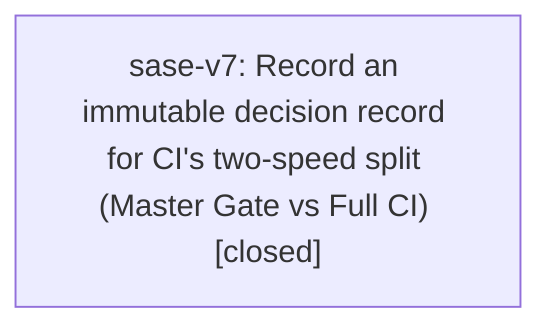

# Bead: sase-v7 — Record an immutable decision record for CI's two-speed split (Master Gate vs Full CI)

[Bead Pages](../README.md) / sase-v7

**Status:** ✓ closed · **Resolution:** done · **Type:** ◆ task · **Task type:** ▤ memory
**Owner:** `bryanbugyi34@gmail.com` · **Created by:** [bbugyi200.athena.sase-um.land](https://github.com/sase-org/sase--agents/blob/main/families/bbugyi200.athena.sase-um.land.md) · **Assignee:** `sase-v7` · **Size:** small
**Created:** 2026-08-28 15:37:37 EDT · **Closed:** 2026-09-06 16:03:13 EDT

## Description

Epic sase-um changed a real project policy -- CI no longer runs everything on every master push -- and plan 202608/release_gate_liveness.md section 9 calls for an immutable decision record alongside decisions:two-speed-verification. No such record exists. Proposed by the sase-um land agent from PROPOSED FOLLOW-UP note 4 on phase bead sase-um.8.

---

\## Memory update

- **Path:** `decisions/<new record, e.g. two-speed-ci.md>`

Add an immutable decision record for CI's two-speed split, alongside the existing
`decisions:two-speed-verification` record it generalizes.

The claim: **CI is no longer the thing that runs everything on every push.** As of epic
sase-um, a push to master runs `Master Gate` (`.github/workflows/master-gate.yml`) --
per-SHA, never cancelled, the whole fast suite in six balanced shards plus the lint
gate, budgeted at ~8 minutes -- while the exhaustive matrix (3.12/3.13/3.14,
`visual-test`, `coverage-contexts`, `perf-floors`, the contention harness) moved to
`Full CI` (`.github/workflows/full.yml`), a scheduled caller of `ci.yml` that runs every
two hours off the push path. `ci_watch` then gates the release on both: the fast gate
proves *this commit* is sound (`gating_workflows`), and a green `Full CI` inside
`heavy_max_age_hours` proves the exhaustive suite was recently green.

Why over the credible alternatives, all of which the plan measured and rejected:
`queue: max` on the master group, per-SHA concurrency on the full `ci.yml` (~62% of the
account's daily job-minutes, and the tip still settles only ~14% of the time), deleting
the master concurrency block, `cancel-in-progress: true`, a GitHub merge queue, bigger
or self-hosted runners, verifying every Nth commit, and a diff-scoped selector in CI
(backtesting showed 10 of 10 measurable master commits escalate to the full suite, and
`tests/test_github_actions_ci_workflow.py` deliberately forbids CI ever running the
scoped lane).

Cost: a regression only the heavy lane can catch is learned up to two hours late, and
heavy-lane failures do not page through `ci_watch`'s notification path while the tip
they attach to is unsettled.

Reopen condition: if the fast gate's p50 wall stops fitting the commit cadence, or if
the heavy lane catches regressions the gate misses often enough that a two-hour
detection lag is not acceptable.

Source: plan `202608/release_gate_liveness.md` section 9 explicitly defers this record
and directs that it be proposed as a memory task bead rather than written by an agent,
because SASE memory must not be edited without the user's explicit approval.

## Notes

[2026-09-06T20:03:13Z · sase-v7] Added decisions:ci-two-speed-split, regenerated memory outputs with sase memory init --no-commit, verified the record renders and links to decisions:two-speed-verification, confirmed Master Gate/Full CI workflow details in source, and ran git diff --check plus just check successfully.

## Lineage

## Agents

| Agent | Bead | Commits |
|---|---|---:|
| [bbugyi200.athena.sase-v7](https://github.com/sase-org/sase--agents/blob/main/agents/bbugyi200.athena.sase-v7/README.md) | [sase-v7](README.md) | 1 |

## Commits

| Repo | Commit | Subject | Bead | Committed |
|---|---|---|---|---|
| sase | [`b103017`](https://github.com/sase-org/sase/commit/b1030177a4794d0bde0fb7ef32095080d22127e8) | docs(memory): record two-speed CI decision | [sase-v7](README.md) | 2026-09-06 16:10:23 EDT |
