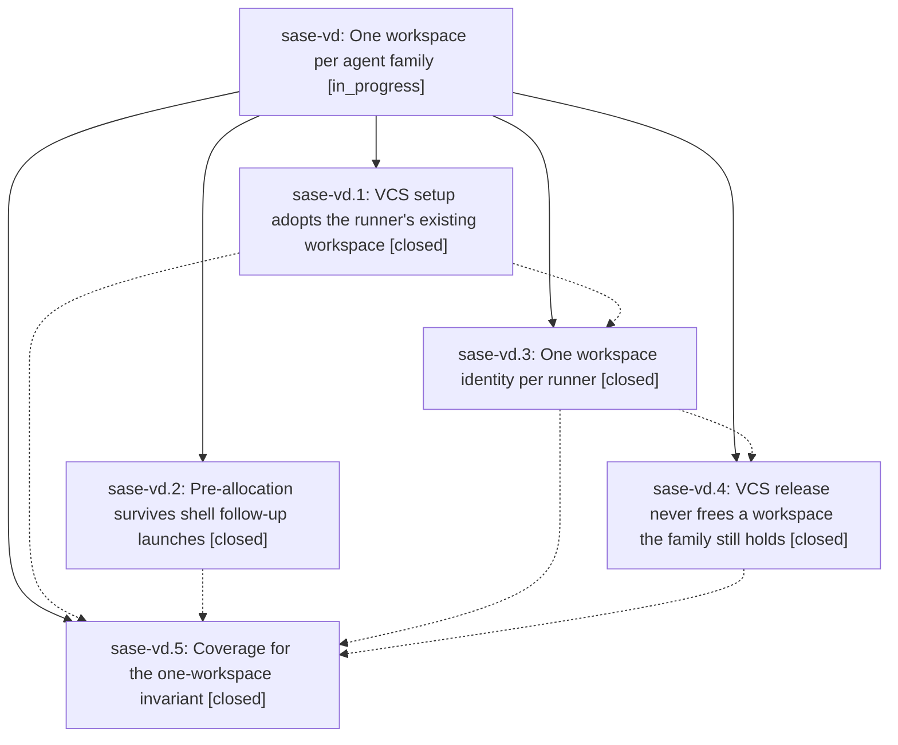

# Bead: sase-vd — One workspace per agent family

[Bead Pages](../README.md) / sase-vd

**Status:** ◐ in_progress · **Type:** ▸ plan · **Tier:** epic
**Owner:** `bryanbugyi34@gmail.com` · **Created by:** [bbugyi200.athena.0ft](https://github.com/sase-org/sase--agents/blob/main/families/bbugyi200.athena.0ft.md) · **Assignee:** `sase-vd.land`
**Created:** 2026-08-28 18:06:17 EDT
**Plan:** [202608/one\_workspace\_per\_agent\_family.md](https://github.com/sase-org/sase--plans/blob/main/202608/one_workspace_per_agent_family.md)

<!-- sase:links:start -->

## Links

| Relation | Artifact | Why |
| --- | --- | --- |
| implemented-by | [plan:202608/one_workspace_per_agent_family.md][1] | derived from the plan's `bead_id:` frontmatter field |

[1]: https://github.com/sase-org/sase--plans/blob/main/202608/one_workspace_per_agent_family.md

<!-- sase:links:end -->

## Description

Close the workspace-collision hole in which a `#gh:`/`#git:` agent works in a second, turn-scoped VCS workspace lease that the rest of SASE never learns about. Make the VCS workflow adopt the runner's existing numbered claim instead of allocating another one, propagate the launcher's pre-allocation across shell follow-up launches, rebind the runner's single workspace identity when a VCS workflow legitimately does allocate, refuse to release or un-occupy a workspace the agent's family still holds, and add doctor and regression coverage that fails when one live pid holds two numbered claims.

## Phases

| Bead | Title | Status | Size | Created | Agents | Commits |
|---|---|---|---|---|---:|---:|
| [sase-vd.1](sase-vd.1.md) | VCS setup adopts the runner's existing workspace | ✓ closed | medium | 2026-08-28 | 1 | 1 |
| [sase-vd.2](sase-vd.2.md) | Pre-allocation survives shell follow-up launches | ✓ closed | medium | 2026-08-28 | 1 | 1 |
| [sase-vd.3](sase-vd.3.md) | One workspace identity per runner | ✓ closed | medium | 2026-08-28 | 1 | 2 |
| [sase-vd.4](sase-vd.4.md) | VCS release never frees a workspace the family still holds | ✓ closed | medium | 2026-08-28 | 1 | 1 |
| [sase-vd.5](sase-vd.5.md) | Coverage for the one-workspace invariant | ✓ closed | small | 2026-08-28 | 1 | 1 |

## Lineage

## Agents

| Agent | Bead | Commits |
|---|---|---:|
| [bbugyi200.athena.sase-vd.1](https://github.com/sase-org/sase--agents/blob/main/agents/bbugyi200.athena.sase-vd.1/README.md) | [sase-vd.1](sase-vd.1.md) | 1 |
| [bbugyi200.athena.sase-vd.2](https://github.com/sase-org/sase--agents/blob/main/agents/bbugyi200.athena.sase-vd.2/README.md) | [sase-vd.2](sase-vd.2.md) | 1 |
| [bbugyi200.athena.sase-vd.3](https://github.com/sase-org/sase--agents/blob/main/agents/bbugyi200.athena.sase-vd.3/README.md) | [sase-vd.3](sase-vd.3.md) | 2 |
| [bbugyi200.athena.sase-vd.4](https://github.com/sase-org/sase--agents/blob/main/agents/bbugyi200.athena.sase-vd.4/README.md) | [sase-vd.4](sase-vd.4.md) | 1 |
| [bbugyi200.athena.sase-vd.5](https://github.com/sase-org/sase--agents/blob/main/agents/bbugyi200.athena.sase-vd.5/README.md) | [sase-vd.5](sase-vd.5.md) | 1 |
| [bbugyi200.athena.sase-vd.land](https://github.com/sase-org/sase--agents/blob/main/agents/bbugyi200.athena.sase-vd.land/README.md) | [sase-vd](README.md) | 0 |

## Commits

| Repo | Commit | Subject | Bead | Committed |
|---|---|---|---|---|
| sase | [`8426315`](https://github.com/sase-org/sase/commit/84263159f6499bf922e33ae58c7b4ce193e6698f) | feat(git-setup): adopt the runner's numbered workspace claim | [sase-vd.1](sase-vd.1.md) | 2026-08-28 18:44:44 EDT |
| sase | [`0235ff0`](https://github.com/sase-org/sase/commit/0235ff059ad3e5e87156508fd10bf43f7dbcade6) | feat(shells): pre-allocate VCS workspace on family follow-up launches | [sase-vd.2](sase-vd.2.md) | 2026-08-28 18:45:13 EDT |
| sase | [`b7fcee9`](https://github.com/sase-org/sase/commit/b7fcee9db595cebb6b5fcbc474898fab8c6595e8) | feat(agent): rebind runner workspace identity | [sase-vd.3](sase-vd.3.md) | 2026-08-28 20:19:02 EDT |
| sase-core | [`sase-core@4f16434`](https://github.com/sase-org/sase-core/commit/4f16434b5a5be70711d4617ef9a164c4efa28905) | fix(agent-launch): transfer workspace claim names | [sase-vd.3](sase-vd.3.md) | 2026-08-28 20:21:21 EDT |
| sase | [`1a14630`](https://github.com/sase-org/sase/commit/1a1463028a7619fa7bcd6ad3331ee640ac5f69c5) | feat(workspace): skip VCS release on handoff and pid mismatch | [sase-vd.4](sase-vd.4.md) | 2026-08-28 21:08:15 EDT |
| sase | [`6d88905`](https://github.com/sase-org/sase/commit/6d889058c89a0318ad74f3eabede360c7580680f) | feat(workspace): detect multi-workspace pid claims | [sase-vd.5](sase-vd.5.md) | 2026-08-28 21:28:38 EDT |
