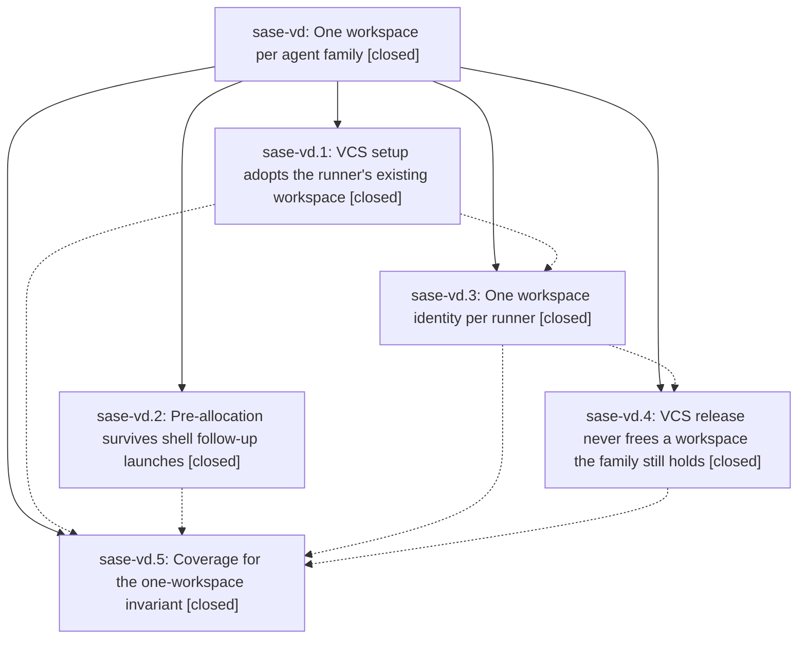

# Bead: sase-vd — One workspace per agent family

[Bead Pages](../README.md) / sase-vd

**Status:** ✓ closed · **Resolution:** done · **Type:** ▸ plan · **Tier:** epic
**Owner:** `bryanbugyi34@gmail.com` · **Created by:** [bbugyi200.athena.0ft](https://github.com/sase-org/sase--agents/blob/main/families/bbugyi200.athena.0ft.md) · **Assignee:** `sase-vd.land`
**Created:** 2026-08-28 18:06:17 EDT · **Closed:** 2026-08-28 22:15:37 EDT
**Plan:** [202608/one\_workspace\_per\_agent\_family.md](https://github.com/sase-org/sase--plans/blob/main/202608/one_workspace_per_agent_family.md)

<!-- sase:links:start -->

## Links

| Relation | Artifact | Why |
| --- | --- | --- |
| implemented-by | [plan:202608/one_workspace_per_agent_family.md][1] | derived from the plan's `bead_id:` frontmatter field |

[1]: https://github.com/sase-org/sase--plans/blob/main/202608/one_workspace_per_agent_family.md

<!-- sase:links:end -->

## Description

Close the workspace-collision hole in which a `#gh:`/`#git:` agent works in a second, turn-scoped VCS workspace lease that the rest of SASE never learns about. Make the VCS workflow adopt the runner's existing numbered claim instead of allocating another one, propagate the launcher's pre-allocation across shell follow-up launches, rebind the runner's single workspace identity when a VCS workflow legitimately does allocate, refuse to release or un-occupy a workspace the agent's family still holds, and add doctor and regression coverage that fails when one live pid holds two numbered claims.

## Notes

[2026-08-29T02:15:37Z · sase-vd.land--1] Verified all five phases against the source and their commits (84263159f, 0235ff059, b7fcee9db, 1a1463028, 6d889058c). `#git:`/`#gh:` setup adopt the runner's numbered claim through find_runner_numbered_workspace with should_release=false, no second claim and no occupant rewrite, while explicit n= pins and #0 runners keep allocating. Shell member meta records the starter vcs_ref and threads it through launch_shell_followup -> spawn_family_successor -> spawn_detached_child, so a gate/monitor follow-up whose composed prompt still carries a VCS tag spawns with SASE_<VCS>_PRE_ALLOCATED describing the workspace that spawn actually got, including the degraded #0 fallback. rebind_agent_workspace_identity_from_output moves a #0-bound runner onto the VCS-allocated workspace and republishes done.json, the occupant record, agent_meta and SASE_AGENT_WORKSPACE_NUM, releasing the #0 placeholder only after the numbered claim is held. release_vcs_workspace skips both mutations on any pending handoff marker and refuses release or occupant-clear on a pid mismatch, recording each refusal in workspace_claims.jsonl. multi_workspace_pid_claim reports a live pid holding two numbered claims. Live host check: `sase doctor -C workspace.occupancy_conflicts --json` is OK with 0 conflicts, and no live pid in the gh_sase-org__sase RUNNING field holds more than one numbered workspace.

Integration: nothing landed since the epic started touches these files (2a4c07537, 45a0a8880, fa74163b5, a97cabe3a; sase-github base is release chores only). One integration defect found and fixed as epic work - git_setup claimed with os.getpid() and no cl_name, so phase 4's identity-checked release refused every `#git:` release and leaked the claim; it now claims with os.getppid() plus the git_ref cl_name and a git-setup ledger tag, covered by tests/test_git_setup_release_identity.py.

Follow-ups filed: sase-vf (bug; sase-vd.1 note 1's remaining half - `#git:` setup still lacks the sase-q0 occupancy guard and occupant record that `#gh:` has), sase-vg (feature; the plan's Out of scope item - retire remove_vcs_workspace_claims and the TUI meta_workspace reconciliation), sase-vh (bug; all five epic commits carry a stale SASE_PLAN tag from the launching agent). Declined: sase-vd.3 note 1 ("investigate intermittent full-suite flakes") names no failing node, and this repo files a node-specific bead per failing test (see retired umbrella sase-ct), so there is nothing actionable to file; the combined tree was green under just check.

Landing gate: just check-full passed (exit 0, monitor c8my39ck8dg7, 17m53s) on the combined tree including the git_setup fix. Every lane green; the core-floor-probe and test-cost lines are pre-existing advisories, not failures.

## Phases

| Bead | Title | Status | Size | Created | Agents | Commits |
|---|---|---|---|---|---:|---:|
| [sase-vd.1](sase-vd.1.md) | VCS setup adopts the runner's existing workspace | ✓ closed | medium | 2026-08-28 | 1 | 2 |
| [sase-vd.2](sase-vd.2.md) | Pre-allocation survives shell follow-up launches | ✓ closed | medium | 2026-08-28 | 1 | 1 |
| [sase-vd.3](sase-vd.3.md) | One workspace identity per runner | ✓ closed | medium | 2026-08-28 | 1 | 3 |
| [sase-vd.4](sase-vd.4.md) | VCS release never frees a workspace the family still holds | ✓ closed | medium | 2026-08-28 | 1 | 2 |
| [sase-vd.5](sase-vd.5.md) | Coverage for the one-workspace invariant | ✓ closed | small | 2026-08-28 | 1 | 1 |

## Lineage

## Agents

| Agent | Bead | Commits |
|---|---|---:|
| [bbugyi200.athena.sase-vd.1](https://github.com/sase-org/sase--agents/blob/main/agents/bbugyi200.athena.sase-vd.1/README.md) | [sase-vd.1](sase-vd.1.md) | 2 |
| [bbugyi200.athena.sase-vd.2](https://github.com/sase-org/sase--agents/blob/main/agents/bbugyi200.athena.sase-vd.2/README.md) | [sase-vd.2](sase-vd.2.md) | 1 |
| [bbugyi200.athena.sase-vd.3](https://github.com/sase-org/sase--agents/blob/main/agents/bbugyi200.athena.sase-vd.3/README.md) | [sase-vd.3](sase-vd.3.md) | 3 |
| [bbugyi200.athena.sase-vd.4](https://github.com/sase-org/sase--agents/blob/main/agents/bbugyi200.athena.sase-vd.4/README.md) | [sase-vd.4](sase-vd.4.md) | 2 |
| [bbugyi200.athena.sase-vd.5](https://github.com/sase-org/sase--agents/blob/main/agents/bbugyi200.athena.sase-vd.5/README.md) | [sase-vd.5](sase-vd.5.md) | 1 |
| [bbugyi200.athena.sase-vd.land](https://github.com/sase-org/sase--agents/blob/main/families/bbugyi200.athena.sase-vd.land.md) | [sase-vd](README.md) | 1 |

## Commits

| Repo | Commit | Subject | Bead | Committed |
|---|---|---|---|---|
| sase | [`8426315`](https://github.com/sase-org/sase/commit/84263159f6499bf922e33ae58c7b4ce193e6698f) | feat(git-setup): adopt the runner's numbered workspace claim | [sase-vd.1](sase-vd.1.md) | 2026-08-28 18:44:44 EDT |
| sase | [`0235ff0`](https://github.com/sase-org/sase/commit/0235ff059ad3e5e87156508fd10bf43f7dbcade6) | feat(shells): pre-allocate VCS workspace on family follow-up launches | [sase-vd.2](sase-vd.2.md) | 2026-08-28 18:45:13 EDT |
| sase-github | [`sase-github@5e8e9ea`](https://github.com/sase-org/sase-github/commit/5e8e9ea6a48b5b285a65d9cb1fa087f74d52b6b0) | feat(gh-setup): adopt the runner's numbered workspace claim | [sase-vd.1](sase-vd.1.md) | 2026-08-28 18:46:43 EDT |
| sase | [`b7fcee9`](https://github.com/sase-org/sase/commit/b7fcee9db595cebb6b5fcbc474898fab8c6595e8) | feat(agent): rebind runner workspace identity | [sase-vd.3](sase-vd.3.md) | 2026-08-28 20:19:02 EDT |
| sase-core | [`sase-core@4f16434`](https://github.com/sase-org/sase-core/commit/4f16434b5a5be70711d4617ef9a164c4efa28905) | fix(agent-launch): transfer workspace claim names | [sase-vd.3](sase-vd.3.md) | 2026-08-28 20:21:21 EDT |
| sase-github | [`sase-github@f4663ae`](https://github.com/sase-org/sase-github/commit/f4663ae526929b23378372005662c20b495bd0f7) | feat(gh): mark runner-bound workspace allocations | [sase-vd.3](sase-vd.3.md) | 2026-08-28 20:23:10 EDT |
| sase | [`1a14630`](https://github.com/sase-org/sase/commit/1a1463028a7619fa7bcd6ad3331ee640ac5f69c5) | feat(workspace): skip VCS release on handoff and pid mismatch | [sase-vd.4](sase-vd.4.md) | 2026-08-28 21:08:15 EDT |
| sase-github | [`sase-github@2571c9d`](https://github.com/sase-org/sase-github/commit/2571c9d7466d4c6020a87b6ee86068c12170cdab) | feat(workspace): identity-check #gh release and skip on handoff | [sase-vd.4](sase-vd.4.md) | 2026-08-28 21:10:16 EDT |
| sase | [`6d88905`](https://github.com/sase-org/sase/commit/6d889058c89a0318ad74f3eabede360c7580680f) | feat(workspace): detect multi-workspace pid claims | [sase-vd.5](sase-vd.5.md) | 2026-08-28 21:28:38 EDT |
| sase | [`651619d`](https://github.com/sase-org/sase/commit/651619dcb366b8a0ae68e24fbfc8455dd2567f14) | fix(workspace): claim git setup workspace under the runner pid | [sase-vd](README.md) | 2026-08-28 22:17:48 EDT |
