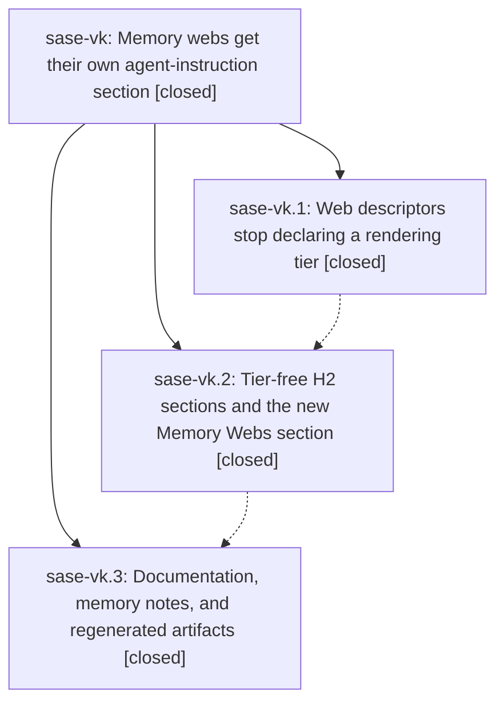

# Bead: sase-vk — Memory webs get their own agent-instruction section

[Bead Pages](../README.md) / sase-vk

**Status:** ✓ closed · **Resolution:** done · **Type:** ▸ plan · **Tier:** epic
**Owner:** `bryanbugyi34@gmail.com` · **Created by:** [bbugyi200.athena.0g6.w0](https://github.com/sase-org/sase--agents/blob/main/families/bbugyi200.athena.0g6.w0.md) · **Assignee:** `sase-vk.land`
**Created:** 2026-08-29 11:29:33 EDT · **Closed:** 2026-08-30 07:32:51 EDT
**Plan:** [202608/memory\_webs\_agents\_section.md](https://github.com/sase-org/sase--plans/blob/main/202608/memory_webs_agents_section.md)

<!-- sase:links:start -->

## Links

| Relation | Artifact | Why |
| --- | --- | --- |
| implemented-by | [plan:202608/memory_webs_agents_section.md][1] | derived from the plan's `bead_id:` frontmatter field |

[1]: https://github.com/sase-org/sase--plans/blob/main/202608/memory_webs_agents_section.md

<!-- sase:links:end -->

## Description

Generated agent instruction files render three tier-free sections — core memory, memory webs, reference memory — with every memory web inlined as its own numbered subsection of the memory-webs section, and no "Tier 1"/"Tier 2" memory vocabulary anywhere in the repo, its docs, its generated output, or its linked repos.

## Notes

[2026-08-30T11:32:51Z · sase-vk.land] VERIFIED (step 1). Read the epic bead, all three phase beads and every note; all three are CLOSED/done. Checked the plan's five acceptance criteria against the tree rather than the notes. (1) AGENTS.md renders `## 1. Core Memory`, `## 2. Memory Webs`, `## 3. Reference Memory` with no tier vocabulary; CLAUDE.md, GEMINI.md, QWEN.md and OPENCODE.md are byte-identical (cmp). (2) Each web is its own H3: `### 2.1 Decisions (decisions)`, `### 2.2 Glossary Terms (glossary)`, `### 2.3 Task Bead Types (task_types)`. (3) All three descriptors on disk carry `web: true` and no `type:`/`parent:`; `MemoryWeb.rendering_type` is gone repo-wide. (4) The webless home root renders `## 1. Core Memory` then `## 2. Reference Memory` with no stray heading (verified in the chezmoi clone at f429de9b, not just asserted in a unit test). (5) Confirmed the template is the three-variable `core_sections`/`web_sections`/`reference_entries` shape, `_WEB_SECTION_RE` plus `has_web_section`/`web_memory_paths` parse the new section, and `_agents_doc.py` still accepts the legacy Tier headings as read-only recovery tolerance. Exercised the CLI end to end after `just install`: `sase memory init --check` clean; `sase memory read glossary.md` refused with the new actionable strand message; `glossary:stitch` resolved; `sase memory web list` and its `--format json` carry no rendering type. `sase bead epic-symbols sase-vk` reports no entries.

INTEGRATED (step 2). Reviewed every non-epic commit since 1be5429ea. 179187499 (remove unused memory proposal path), da1da7aea (split read log module) and e9d1a973a (drop the installed version from generated task-type strands) all interleave with epic phases; confirmed the phase-1 web-descriptor branch survived the read-log split intact at src/sase/memory/_read_log_paths.py:133 and that the epic's docs phase, which landed last, carries no reference to the removed `sase memory write`/`review` surface.

FIXED HERE (four real gaps the docs phase's case-sensitive `rg 'Tier 1|Tier 2'` sweep missed, all inside the epic's own acceptance criterion 5).

1. src/sase/ace/tui/modals/memory_panel_rendering.py still labeled every memory note with the retired vocabulary in the TUI: `_TIER1_MARK`/`_TIER2_MARK` and a user-visible badge row reading `TIER 1 · always loaded` / `TIER 2`. Uppercase, so the sweep's case-sensitive pattern never saw it. Renamed to `_CORE_MARK`/`_REFERENCE_MARK` and the badges to `CORE · always loaded` / `REFERENCE · read on demand`, matching the `core — always loaded` / `reference — read on demand` wording phase 1 already put on the add form.

2. src/sase/xprompts/skills/sase_memory_read.md — the skill every agent is told to use for memory reads — still taught the exact claim this epic retires: "Memory has two independent axes ... a web's own descriptor can render at either tier." That is now false, not merely stale wording. Rewrote it as the kind-decides-placement rule: a flat note declares core or reference, a web descriptor declares no `type:` and always inlines into the Memory Webs section, a strand body never inlines. The change needs `sase skill init --force` after this lands to reach the deployed copies.

3. docs/ace.md documented the stale badge row, an add form field named `tier` with "illegal stems, tiers", and a web property grid that "names rendering type" — a row phase 1 deleted. Corrected all three against the current code.

4. chezmoi/sase/memory/README.md still carried the Tier lines the plan's docs phase required rewritten. Phase 3 note 4 records why: `sase memory init` writes the home root to the live ~/.local/share/chezmoi rather than the workspace-private `/sase_repo` clone, so that phase's hand-edit landed in the live checkout and was left uncommitted. Redone properly in the `/sase_repo` clone through `/sase_memory_write` (authorized by the approved plan, which names this file). Note for whoever syncs chezmoi: an equivalent uncommitted edit may still be sitting in the live host checkout.

VERIFICATION of the above: `just fmt`; `just check` green on every lint gate (ruff, mypy, symvision, toobig, changelog, feature flags, SASE validation) plus the scoped lane (182 files); `just test-visual` 840 passed / 1 skipped after accepting the two intended memory-panel badge snapshots (inspected actual.png first — only the badge text changed); and a focused 770-test run over tests/ace/tui/modals/, the skill-source suites, test_memory_notes.py and test_agent_tribe_terminology.py. Phase 3 had already run `just check-full` clean on the tree this delta sits on. Post-epic sweep: `grep -rniE 'tier ?[12]|tier1|tier2'` over src/, docs/, sase/memory/ and both linked repos now returns only the unrelated concepts the plan enumerated (TUI agent-loader lazy-load tiers, VCS provider resolution tiers, repo inventory tiers, plan/bead tiers) plus the deliberate legacy-heading regexes and their test, immutable CHANGELOG history, and historical sdd/ tales.

FOLLOW-UPS (all four PROPOSED FOLLOW-UP entries from sase-vk.3, none declined).
- Note 1 (actstat/bob-cli drift) -> new task sase-vv, size medium, task(memory). Not filed on the phase agent's word: opened both projects with `/sase_repo` and verified at actstat 6534ffc and bob-cli f1723a3 that both still commit `## 1. Tier 1 (core) Memory` / `## 2. Tier 2 (reference) Memory` AND `type:`/`parent:` on their web descriptors. Linked related to sase-tq (same drift shape, same two projects) and sase-o6 (the pinned uv-tool install that likely causes it).
- Note 2 (memory-directory-map.png stale) -> corroborated existing open task sase-te with `sase bead +1` rather than filing a duplicate; same file, same root cause. Recorded that the epic made it strictly worse: phase 3 updated only the prompt's lane labels, so the PNG is now two renames behind and one re-render should discharge both.
- Note 3 (flaky test_mounted_clan_fold_chords_zoom_and_patch_isolation) -> new task sase-vt, size large, task(flake); not in the reproducible-flake baseline and no existing bead. Linked related to sase-ty as a likely shared parallel-lane mount/settle race.
- Note 4 (sase memory init writes the live chezmoi checkout) -> new task sase-vu, size large, task(bug), carrying this landing's own reproduction of the isolation break. Linked related to sase-o6.

## Phases

| Bead | Title | Status | Size | Created | Agents | Commits |
|---|---|---|---|---|---:|---:|
| [sase-vk.1](sase-vk.1.md) | Web descriptors stop declaring a rendering tier | ✓ closed | medium | 2026-08-29 | 1 | 1 |
| [sase-vk.2](sase-vk.2.md) | Tier-free H2 sections and the new Memory Webs section | ✓ closed | medium | 2026-08-29 | 1 | 1 |
| [sase-vk.3](sase-vk.3.md) | Documentation, memory notes, and regenerated artifacts | ✓ closed | medium | 2026-08-29 | 1 | 1 |

## Lineage

## Agents

| Agent | Bead | Commits |
|---|---|---:|
| [bbugyi200.athena.sase-vk.1](https://github.com/sase-org/sase--agents/blob/main/agents/bbugyi200.athena.sase-vk.1/README.md) | [sase-vk.1](sase-vk.1.md) | 1 |
| [bbugyi200.athena.sase-vk.2](https://github.com/sase-org/sase--agents/blob/main/agents/bbugyi200.athena.sase-vk.2/README.md) | [sase-vk.2](sase-vk.2.md) | 1 |
| [bbugyi200.athena.sase-vk.3](https://github.com/sase-org/sase--agents/blob/main/families/bbugyi200.athena.sase-vk.3.md) | [sase-vk.3](sase-vk.3.md) | 1 |
| [bbugyi200.athena.sase-vk.land](https://github.com/sase-org/sase--agents/blob/main/agents/bbugyi200.athena.sase-vk.land/README.md) | [sase-vk](README.md) | 1 |

## Commits

| Repo | Commit | Subject | Bead | Committed |
|---|---|---|---|---|
| sase | [`1be5429`](https://github.com/sase-org/sase/commit/1be5429ea9812ff722c94cd2f1103ffc9b6142da) | feat(memory): make web descriptors tier-free | [sase-vk.1](sase-vk.1.md) | 2026-08-29 12:34:50 EDT |
| sase | [`b726d0a`](https://github.com/sase-org/sase/commit/b726d0a18cf690c871b12b4bb56ef5d07652afeb) | feat(memory): give agent docs a Memory Webs section | [sase-vk.2](sase-vk.2.md) | 2026-08-29 13:30:53 EDT |
| sase | [`0860fcb`](https://github.com/sase-org/sase/commit/0860fcb200f35e3ec99cdd50cc9f54ad82ea857b) | docs(memory): rewrite Tier-1/Tier-2 memory vocabulary across docs and templates | [sase-vk.3](sase-vk.3.md) | 2026-08-30 06:52:22 EDT |
| sase | [`891120e`](https://github.com/sase-org/sase/commit/891120e9ce5f7944301f2326ddb09da477838763) | fix(memory): retire the last Tier 1/Tier 2 memory vocabulary | [sase-vk](README.md) | 2026-08-30 07:34:54 EDT |
