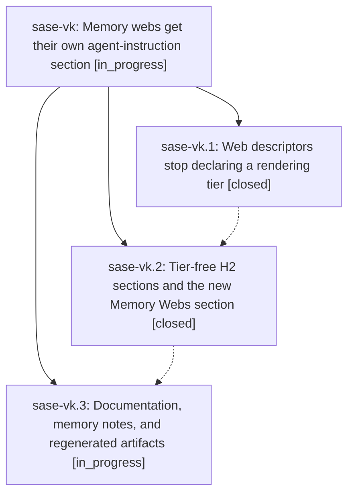

# Bead: sase-vk — Memory webs get their own agent-instruction section

[Bead Pages](../README.md) / sase-vk

**Status:** ◐ in_progress · **Type:** ▸ plan · **Tier:** epic
**Owner:** `bryanbugyi34@gmail.com` · **Created by:** [bbugyi200.athena.0g6.w0](https://github.com/sase-org/sase--agents/blob/main/families/bbugyi200.athena.0g6.w0.md) · **Assignee:** `sase-vk.land`
**Created:** 2026-08-29 11:29:33 EDT
**Plan:** [202608/memory\_webs\_agents\_section.md](https://github.com/sase-org/sase--plans/blob/main/202608/memory_webs_agents_section.md)

<!-- sase:links:start -->

## Links

| Relation | Artifact | Why |
| --- | --- | --- |
| implemented-by | [plan:202608/memory_webs_agents_section.md][1] | derived from the plan's `bead_id:` frontmatter field |

[1]: https://github.com/sase-org/sase--plans/blob/main/202608/memory_webs_agents_section.md

<!-- sase:links:end -->

## Description

Generated agent instruction files render three tier-free sections — core memory, memory webs, reference memory — with every memory web inlined as its own numbered subsection of the memory-webs section, and no "Tier 1"/"Tier 2" memory vocabulary anywhere in the repo, its docs, its generated output, or its linked repos.

## Phases

| Bead | Title | Status | Size | Created | Agents | Commits |
|---|---|---|---|---|---:|---:|
| [sase-vk.1](sase-vk.1.md) | Web descriptors stop declaring a rendering tier | ✓ closed | medium | 2026-08-29 | 1 | 1 |
| [sase-vk.2](sase-vk.2.md) | Tier-free H2 sections and the new Memory Webs section | ✓ closed | medium | 2026-08-29 | 1 | 1 |
| [sase-vk.3](sase-vk.3.md) | Documentation, memory notes, and regenerated artifacts | ◐ in_progress | medium | 2026-08-29 | 1 | 0 |

## Lineage

## Agents

| Agent | Bead | Commits |
|---|---|---:|
| [bbugyi200.athena.sase-vk.1](https://github.com/sase-org/sase--agents/blob/main/agents/bbugyi200.athena.sase-vk.1/README.md) | [sase-vk.1](sase-vk.1.md) | 1 |
| [bbugyi200.athena.sase-vk.2](https://github.com/sase-org/sase--agents/blob/main/agents/bbugyi200.athena.sase-vk.2/README.md) | [sase-vk.2](sase-vk.2.md) | 1 |
| [bbugyi200.athena.sase-vk.3](https://github.com/sase-org/sase--agents/blob/main/agents/bbugyi200.athena.sase-vk.3/README.md) | [sase-vk.3](sase-vk.3.md) | 0 |
| [bbugyi200.athena.sase-vk.land](https://github.com/sase-org/sase--agents/blob/main/agents/bbugyi200.athena.sase-vk.land/README.md) | [sase-vk](README.md) | 0 |

## Commits

| Repo | Commit | Subject | Bead | Committed |
|---|---|---|---|---|
| sase | [`1be5429`](https://github.com/sase-org/sase/commit/1be5429ea9812ff722c94cd2f1103ffc9b6142da) | feat(memory): make web descriptors tier-free | [sase-vk.1](sase-vk.1.md) | 2026-08-29 12:34:50 EDT |
| sase | [`b726d0a`](https://github.com/sase-org/sase/commit/b726d0a18cf690c871b12b4bb56ef5d07652afeb) | feat(memory): give agent docs a Memory Webs section | [sase-vk.2](sase-vk.2.md) | 2026-08-29 13:30:53 EDT |
