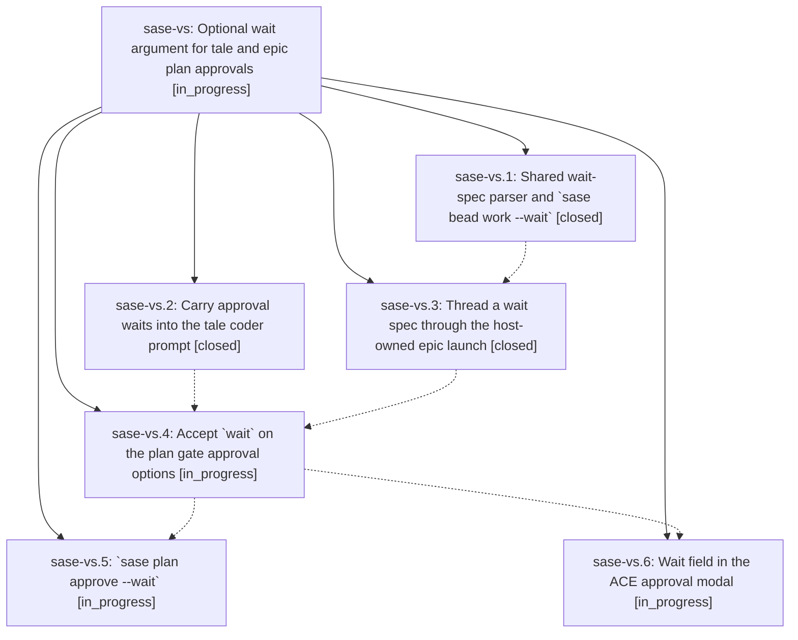

# Bead: sase-vs — Optional wait argument for tale and epic plan approvals

[Bead Pages](../README.md) / sase-vs

**Status:** ◐ in_progress · **Type:** ▸ plan · **Tier:** epic
**Owner:** `bryanbugyi34@gmail.com` · **Created by:** [bbugyi200.athena.0ga](https://github.com/sase-org/sase--agents/blob/main/families/bbugyi200.athena.0ga.md) · **Assignee:** `sase-vs.land`
**Created:** 2026-08-30 07:21:57 EDT
**Plan:** [202608/approval\_wait\_argument.md](https://github.com/sase-org/sase--plans/blob/main/202608/approval_wait_argument.md)

<!-- sase:links:start -->

## Links

| Relation | Artifact | Why |
| --- | --- | --- |
| implemented-by | [plan:202608/approval_wait_argument.md][1] | derived from the plan's `bead_id:` frontmatter field |

[1]: https://github.com/sase-org/sase--plans/blob/main/202608/approval_wait_argument.md

<!-- sase:links:end -->

## Description

Approving a tale or an epic can name agent and bead dependencies, and the work that approval starts stays held until every named dependency finishes.

## Phases

| Bead | Title | Status | Size | Created | Agents | Commits |
|---|---|---|---|---|---:|---:|
| [sase-vs.1](sase-vs.1.md) | Shared wait-spec parser and \`sase bead work --wait\` | ✓ closed | medium | 2026-08-30 | 1 | 1 |
| [sase-vs.2](sase-vs.2.md) | Carry approval waits into the tale coder prompt | ✓ closed | small | 2026-08-30 | 1 | 1 |
| [sase-vs.3](sase-vs.3.md) | Thread a wait spec through the host-owned epic launch | ✓ closed | small | 2026-08-30 | 1 | 1 |
| [sase-vs.4](sase-vs.4.md) | Accept \`wait\` on the plan gate approval options | ◐ in_progress | medium | 2026-08-30 | 1 | 0 |
| [sase-vs.5](sase-vs.5.md) | \`sase plan approve --wait\` | ◐ in_progress | small | 2026-08-30 | 1 | 0 |
| [sase-vs.6](sase-vs.6.md) | Wait field in the ACE approval modal | ◐ in_progress | medium | 2026-08-30 | 1 | 0 |

## Lineage

## Agents

| Agent | Bead | Commits |
|---|---|---:|
| [bbugyi200.athena.sase-vs.1](https://github.com/sase-org/sase--agents/blob/main/agents/bbugyi200.athena.sase-vs.1/README.md) | [sase-vs.1](sase-vs.1.md) | 1 |
| [bbugyi200.athena.sase-vs.2](https://github.com/sase-org/sase--agents/blob/main/agents/bbugyi200.athena.sase-vs.2/README.md) | [sase-vs.2](sase-vs.2.md) | 1 |
| [bbugyi200.athena.sase-vs.3](https://github.com/sase-org/sase--agents/blob/main/agents/bbugyi200.athena.sase-vs.3/README.md) | [sase-vs.3](sase-vs.3.md) | 1 |
| [bbugyi200.athena.sase-vs.4](https://github.com/sase-org/sase--agents/blob/main/agents/bbugyi200.athena.sase-vs.4/README.md) | [sase-vs.4](sase-vs.4.md) | 0 |
| [bbugyi200.athena.sase-vs.5](https://github.com/sase-org/sase--agents/blob/main/agents/bbugyi200.athena.sase-vs.5/README.md) | [sase-vs.5](sase-vs.5.md) | 0 |
| [bbugyi200.athena.sase-vs.6](https://github.com/sase-org/sase--agents/blob/main/agents/bbugyi200.athena.sase-vs.6/README.md) | [sase-vs.6](sase-vs.6.md) | 0 |
| [bbugyi200.athena.sase-vs.land](https://github.com/sase-org/sase--agents/blob/main/agents/bbugyi200.athena.sase-vs.land/README.md) | [sase-vs](README.md) | 0 |

## Commits

| Repo | Commit | Subject | Bead | Committed |
|---|---|---|---|---|
| sase | [`6e0e586`](https://github.com/sase-org/sase/commit/6e0e5860b0bcf4e1b08a50e68a72c32c62e1c5bd) | feat(plan-approval): stamp approval waits onto the tale coder successor prompt | [sase-vs.2](sase-vs.2.md) | 2026-08-30 08:00:09 EDT |
| sase | [`9c5cbea`](https://github.com/sase-org/sase/commit/9c5cbeac56ea753c88550e8095016f2c3a5a153b) | feat(bead): add wait-spec parser and sase bead work --wait | [sase-vs.1](sase-vs.1.md) | 2026-08-30 08:07:54 EDT |
| sase | [`2bf5164`](https://github.com/sase-org/sase/commit/2bf51641d2aa1952c359f787b5f075e8dbe9b47e) | feat(bead): thread wait spec through the host-owned epic launch | [sase-vs.3](sase-vs.3.md) | 2026-08-30 08:40:24 EDT |
