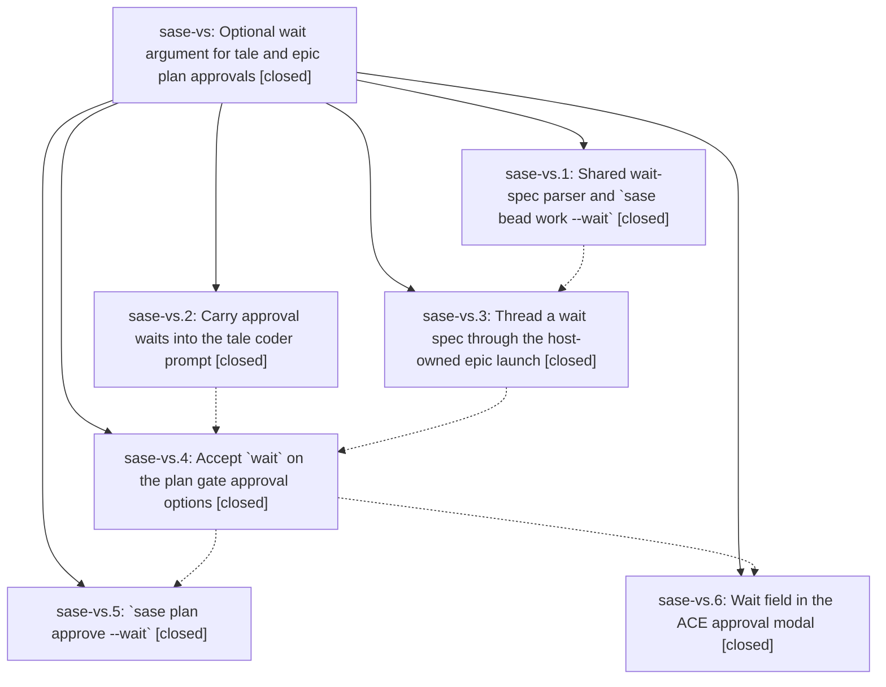

# Bead: sase-vs — Optional wait argument for tale and epic plan approvals

[Bead Pages](../README.md) / sase-vs

**Status:** ✓ closed · **Resolution:** done · **Type:** ▸ plan · **Tier:** epic
**Owner:** `bryanbugyi34@gmail.com` · **Created by:** [bbugyi200.athena.0ga](https://github.com/sase-org/sase--agents/blob/main/families/bbugyi200.athena.0ga.md) · **Assignee:** `sase-vs.land`
**Created:** 2026-08-30 07:21:57 EDT · **Closed:** 2026-08-30 10:33:10 EDT
**Plan:** [202608/approval\_wait\_argument.md](https://github.com/sase-org/sase--plans/blob/main/202608/approval_wait_argument.md)

<!-- sase:links:start -->

## Links

| Relation | Artifact | Why |
| --- | --- | --- |
| implemented-by | [plan:202608/approval_wait_argument.md][1] | derived from the plan's `bead_id:` frontmatter field |

[1]: https://github.com/sase-org/sase--plans/blob/main/202608/approval_wait_argument.md

<!-- sase:links:end -->

## Description

Approving a tale or an epic can name agent and bead dependencies, and the work that approval starts stays held until every named dependency finishes.

## Notes

[2026-08-30T14:33:10Z · sase-vs.land--1] Verified all six phases (sase-vs.1-6) closed done and every child note addressed against the source: shared wait_spec parser; `sase bead work --wait` rendering extra waits only on unblocked root segments and the land segment; `%wait` stamped on the approved tale coder successor; wait_spec threaded through build_epic_launch_argv and every epic-launch resume hint; `wait` declared on the tale approve/commit and epic approve gate input schemas with wait_agents/wait_beads on the approving result schemas; `sase plan approve -w/--wait` parsing before any mutation; and the ACE approval wait editor forwarding through both the neutral and legacy paths. Docs updated across ace/beads/cli/configuration/sdd. Smoke-tested the parser round trip and a bad spec exiting 2 before mutation.

INTEGRATION: the only non-epic commit since the epic started (93b005d99, AMD Memory Webs section) does not touch this feature, and no other flat wait-spec parser exists to consolidate. Nothing to integrate.

GATE: the first `just check-full` (monitor 5zf6pwn6nh2t) came back red with 7 failures. Triaged into two groups.

  1. EPIC-CAUSED, FIXED: tests/completion/test_snapshot.py::test_checked_in_snapshot_has_no_drift and ::test_current_structural_view_matches_checked_in_snapshot. Phase sase-vs.5 added `sase plan approve -w/--wait` without regenerating the checked-in structural completion snapshot, so tests/completion/snapshots/cli_spec.json was missing that option and its parent description_digest. Regenerated with `just sync-completion-spec`; the diff is exactly the one new option block plus the approve digest (13 insertions, 1 deletion). `sase bead work --wait` was already synced by 9c5cbeac5, so only `plan approve` drifted. tests/completion/ now passes 4/4 and `just check` is green end to end (every lint gate incl. symvision + the scoped test lane).

  2. NOT EPIC-CAUSED, ROUTED: the other 5 failures (tests/main/test_init_memory_managed_agents_descriptions.py x2, test_init_memory_managed_agents_frontmatter.py, test_init_memory_plan.py, test_init_onboarding_memory.py) all assert the pre-93b005d99 section numbering ("## 3. Reference Memory", "### 3.1 `sase/memory/...`"). Commit 93b005d99 moved Memory Webs below Reference Memory and updated five sibling test files but missed these four. Confirmed none of this epic's six commits touch src/sase/amd/ or any init-memory test. Via /sase_new_task: searched task beads by regex and swept `--since 1w --status all` (no duplicate; sase-vv and sase-pn are adjacent but different defects), and since originating epic sase-vk is already CLOSED/done, routed the traced root cause as a DISCOVERED ISSUE note on active epic sase-th ("Repair the red master CI lanes"), which owns exactly this scope and already carries two identically-shaped notes from other land agents. No new task bead created.

FOLLOW-UPS: the only `PROPOSED FOLLOW-UP:` note across all children was on sase-vs.2 (the `just rust-lsp-install` cargo target-dir bug). Via /sase_new_task it was found to be an exact semantic duplicate of task bead sase-v6 (READY) and corroborated there with `sase bead +1` carrying a fresh 2026-08-30 reproduction; no new task bead. No --epic-symbol entries remained (`sase bead epic-symbols sase-vs` empty).

The known flake sase-vl (test_ace_and_lsp_wait_prose_replacement_ranges_match) did not fire in this run, so it needed no corroboration.

## Phases

| Bead | Title | Status | Size | Created | Agents | Commits |
|---|---|---|---|---|---:|---:|
| [sase-vs.1](sase-vs.1.md) | Shared wait-spec parser and \`sase bead work --wait\` | ✓ closed | medium | 2026-08-30 | 1 | 1 |
| [sase-vs.2](sase-vs.2.md) | Carry approval waits into the tale coder prompt | ✓ closed | small | 2026-08-30 | 1 | 1 |
| [sase-vs.3](sase-vs.3.md) | Thread a wait spec through the host-owned epic launch | ✓ closed | small | 2026-08-30 | 1 | 1 |
| [sase-vs.4](sase-vs.4.md) | Accept \`wait\` on the plan gate approval options | ✓ closed | medium | 2026-08-30 | 1 | 1 |
| [sase-vs.5](sase-vs.5.md) | \`sase plan approve --wait\` | ✓ closed | small | 2026-08-30 | 1 | 1 |
| [sase-vs.6](sase-vs.6.md) | Wait field in the ACE approval modal | ✓ closed | medium | 2026-08-30 | 1 | 1 |

## Lineage

## Agents

| Agent | Bead | Commits |
|---|---|---:|
| [bbugyi200.athena.sase-vs.1](https://github.com/sase-org/sase--agents/blob/main/agents/bbugyi200.athena.sase-vs.1/README.md) | [sase-vs.1](sase-vs.1.md) | 1 |
| [bbugyi200.athena.sase-vs.2](https://github.com/sase-org/sase--agents/blob/main/agents/bbugyi200.athena.sase-vs.2/README.md) | [sase-vs.2](sase-vs.2.md) | 1 |
| [bbugyi200.athena.sase-vs.3](https://github.com/sase-org/sase--agents/blob/main/agents/bbugyi200.athena.sase-vs.3/README.md) | [sase-vs.3](sase-vs.3.md) | 1 |
| [bbugyi200.athena.sase-vs.4](https://github.com/sase-org/sase--agents/blob/main/agents/bbugyi200.athena.sase-vs.4/README.md) | [sase-vs.4](sase-vs.4.md) | 1 |
| [bbugyi200.athena.sase-vs.5](https://github.com/sase-org/sase--agents/blob/main/agents/bbugyi200.athena.sase-vs.5/README.md) | [sase-vs.5](sase-vs.5.md) | 1 |
| [bbugyi200.athena.sase-vs.6](https://github.com/sase-org/sase--agents/blob/main/agents/bbugyi200.athena.sase-vs.6/README.md) | [sase-vs.6](sase-vs.6.md) | 1 |
| [bbugyi200.athena.sase-vs.land](https://github.com/sase-org/sase--agents/blob/main/families/bbugyi200.athena.sase-vs.land.md) | [sase-vs](README.md) | 1 |

## Commits

| Repo | Commit | Subject | Bead | Committed |
|---|---|---|---|---|
| sase | [`6e0e586`](https://github.com/sase-org/sase/commit/6e0e5860b0bcf4e1b08a50e68a72c32c62e1c5bd) | feat(plan-approval): stamp approval waits onto the tale coder successor prompt | [sase-vs.2](sase-vs.2.md) | 2026-08-30 08:00:09 EDT |
| sase | [`9c5cbea`](https://github.com/sase-org/sase/commit/9c5cbeac56ea753c88550e8095016f2c3a5a153b) | feat(bead): add wait-spec parser and sase bead work --wait | [sase-vs.1](sase-vs.1.md) | 2026-08-30 08:07:54 EDT |
| sase | [`2bf5164`](https://github.com/sase-org/sase/commit/2bf51641d2aa1952c359f787b5f075e8dbe9b47e) | feat(bead): thread wait spec through the host-owned epic launch | [sase-vs.3](sase-vs.3.md) | 2026-08-30 08:40:24 EDT |
| sase | [`15be5ac`](https://github.com/sase-org/sase/commit/15be5ac470cafd2f31ba03b511ae11b959c951d6) | feat(plan): accept wait on tale and epic approval options | [sase-vs.4](sase-vs.4.md) | 2026-08-30 09:18:29 EDT |
| sase | [`c507cea`](https://github.com/sase-org/sase/commit/c507ceab9b2334268aeefda9a6272c838e33d677) | feat(plan): add approval wait CLI | [sase-vs.5](sase-vs.5.md) | 2026-08-30 09:38:51 EDT |
| sase | [`18fa499`](https://github.com/sase-org/sase/commit/18fa499a3af9c4d941123f51aa0827c6ab0a68d6) | feat(ace): add approval wait editor | [sase-vs.6](sase-vs.6.md) | 2026-08-30 09:46:42 EDT |
| sase | [`c087df8`](https://github.com/sase-org/sase/commit/c087df878c0bf6e2eb17ab3a899e6d4a1f6d7117) | fix(completion): resync the CLI spec snapshot for plan approve --wait | [sase-vs](README.md) | 2026-08-30 10:35:31 EDT |
