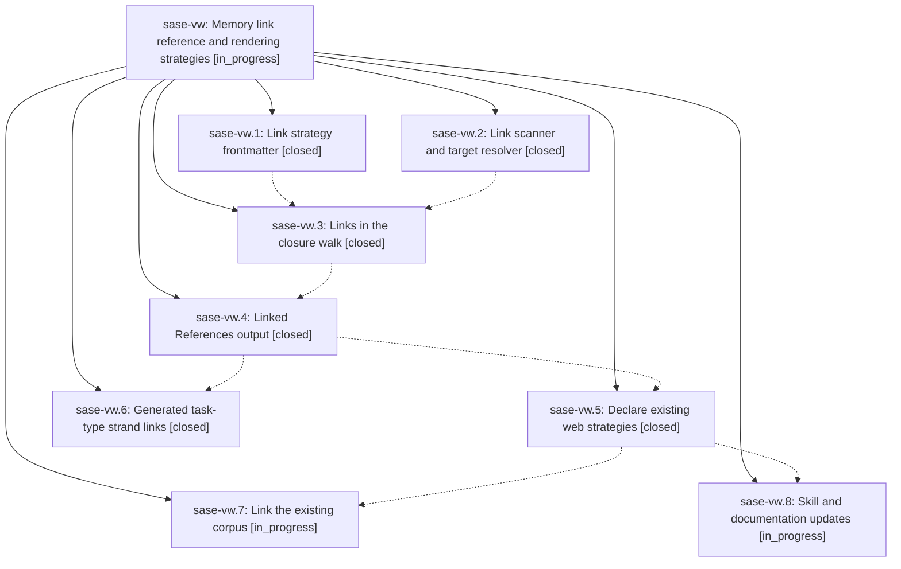

# Bead: sase-vw — Memory link reference and rendering strategies

[Bead Pages](../README.md) / sase-vw

**Status:** ◐ in_progress · **Type:** ▸ plan · **Tier:** epic
**Owner:** `bryanbugyi34@gmail.com` · **Created by:** [bbugyi200.athena.sase-vk.land.w1.w0](https://github.com/sase-org/sase--agents/blob/main/families/bbugyi200.athena.sase-vk.land.w1.w0.md) · **Assignee:** `sase-vw.land`
**Created:** 2026-08-30 10:02:14 EDT
**Plan:** [202608/memory\_link\_strategies.md](https://github.com/sase-org/sase--plans/blob/main/202608/memory_link_strategies.md)

<!-- sase:links:start -->

## Links

| Relation | Artifact | Why |
| --- | --- | --- |
| implemented-by | [plan:202608/memory_link_strategies.md][1] | derived from the plan's `bead_id:` frontmatter field |

[1]: https://github.com/sase-org/sase--plans/blob/main/202608/memory_link_strategies.md

<!-- sase:links:end -->

## Description

Memory notes, web descriptors, and strands declare how links to other memory files are detected and rendered, `[[target]]` / `![[target]]` links resolve and render in `sase memory show`/`read`, and the existing corpus links itself.

## Phases

| Bead | Title | Status | Size | Created | Agents | Commits |
|---|---|---|---|---|---:|---:|
| [sase-vw.1](sase-vw.1.md) | Link strategy frontmatter | ✓ closed | medium | 2026-08-30 | 1 | 1 |
| [sase-vw.2](sase-vw.2.md) | Link scanner and target resolver | ✓ closed | medium | 2026-08-30 | 1 | 1 |
| [sase-vw.3](sase-vw.3.md) | Links in the closure walk | ✓ closed | medium | 2026-08-30 | 1 | 1 |
| [sase-vw.4](sase-vw.4.md) | Linked References output | ✓ closed | medium | 2026-08-30 | 1 | 1 |
| [sase-vw.5](sase-vw.5.md) | Declare existing web strategies | ✓ closed | small | 2026-08-30 | 1 | 1 |
| [sase-vw.6](sase-vw.6.md) | Generated task-type strand links | ✓ closed | small | 2026-08-30 | 1 | 1 |
| [sase-vw.7](sase-vw.7.md) | Link the existing corpus | ◐ in_progress | medium | 2026-08-30 | 1 | 0 |
| [sase-vw.8](sase-vw.8.md) | Skill and documentation updates | ◐ in_progress | small | 2026-08-30 | 1 | 0 |

## Lineage

## Agents

| Agent | Bead | Commits |
|---|---|---:|
| [bbugyi200.athena.sase-vw.1](https://github.com/sase-org/sase--agents/blob/main/agents/bbugyi200.athena.sase-vw.1/README.md) | [sase-vw.1](sase-vw.1.md) | 1 |
| [bbugyi200.athena.sase-vw.2](https://github.com/sase-org/sase--agents/blob/main/agents/bbugyi200.athena.sase-vw.2/README.md) | [sase-vw.2](sase-vw.2.md) | 1 |
| [bbugyi200.athena.sase-vw.3](https://github.com/sase-org/sase--agents/blob/main/agents/bbugyi200.athena.sase-vw.3/README.md) | [sase-vw.3](sase-vw.3.md) | 1 |
| [bbugyi200.athena.sase-vw.4](https://github.com/sase-org/sase--agents/blob/main/agents/bbugyi200.athena.sase-vw.4/README.md) | [sase-vw.4](sase-vw.4.md) | 1 |
| [bbugyi200.athena.sase-vw.5](https://github.com/sase-org/sase--agents/blob/main/agents/bbugyi200.athena.sase-vw.5/README.md) | [sase-vw.5](sase-vw.5.md) | 1 |
| [bbugyi200.athena.sase-vw.6](https://github.com/sase-org/sase--agents/blob/main/agents/bbugyi200.athena.sase-vw.6/README.md) | [sase-vw.6](sase-vw.6.md) | 1 |
| [bbugyi200.athena.sase-vw.7](https://github.com/sase-org/sase--agents/blob/main/agents/bbugyi200.athena.sase-vw.7/README.md) | [sase-vw.7](sase-vw.7.md) | 0 |
| [bbugyi200.athena.sase-vw.8](https://github.com/sase-org/sase--agents/blob/main/agents/bbugyi200.athena.sase-vw.8/README.md) | [sase-vw.8](sase-vw.8.md) | 0 |
| [bbugyi200.athena.sase-vw.land](https://github.com/sase-org/sase--agents/blob/main/agents/bbugyi200.athena.sase-vw.land/README.md) | [sase-vw](README.md) | 0 |

## Commits

| Repo | Commit | Subject | Bead | Committed |
|---|---|---|---|---|
| sase | [`ae83faa`](https://github.com/sase-org/sase/commit/ae83faa2e020c5b9966badd44a0758b4cb271331) | feat(memory): add authored link scanner and resolver | [sase-vw.2](sase-vw.2.md) | 2026-08-30 10:47:13 EDT |
| sase | [`7c8117b`](https://github.com/sase-org/sase/commit/7c8117b17e92674f99f52d98f2a44ad5481f86b8) | feat(memory): add link\_reference and link\_rendering frontmatter | [sase-vw.1](sase-vw.1.md) | 2026-08-30 10:50:34 EDT |
| sase | [`90e3a38`](https://github.com/sase-org/sase/commit/90e3a385c526e7659b93b29a5ce599d1e6deade6) | feat(memory): fold authored links into the closure walk | [sase-vw.3](sase-vw.3.md) | 2026-08-30 11:32:44 EDT |
| sase | [`40cd8ce`](https://github.com/sase-org/sase/commit/40cd8ce6eaf4204f7cf55eab58193841f98a911e) | feat(memory): render Linked References for show and read | [sase-vw.4](sase-vw.4.md) | 2026-08-30 12:00:46 EDT |
| sase | [`19a77ee`](https://github.com/sase-org/sase/commit/19a77eea96af28f13f973f191cc0415afd1fcf3d) | feat(memory): emit Related Task Types links on generated strands | [sase-vw.6](sase-vw.6.md) | 2026-08-30 12:34:28 EDT |
| sase | [`70dd1da`](https://github.com/sase-org/sase/commit/70dd1da6174fe18fa264d5cbf1247daaaf88e8df) | feat(memory): declare existing web link strategies | [sase-vw.5](sase-vw.5.md) | 2026-08-30 12:40:50 EDT |
