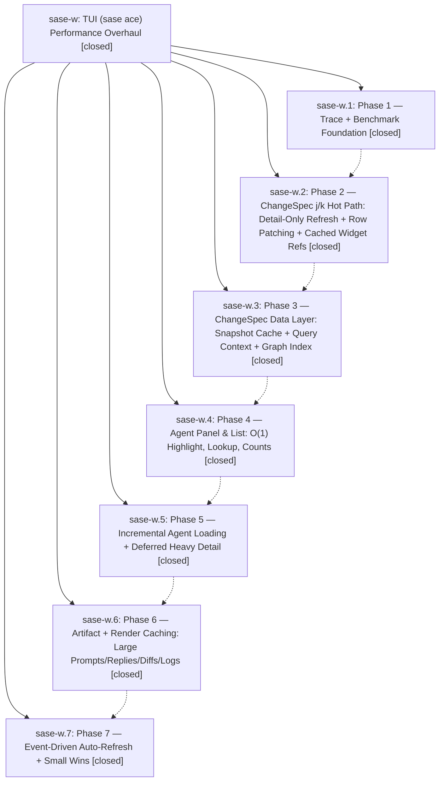

# Bead: sase-w — TUI (sase ace) Performance Overhaul

[Bead Pages](../README.md) / sase-w

**Status:** ✓ closed · **Resolution:** (unrecorded) · **Type:** plan · **Tier:** epic
**Owner:** `bryanbugyi34@gmail.com`
**Created:** 2026-04-27 16:16:09 UTC · **Closed:** 2026-04-27 18:39:44 UTC
**Plan:** [202604/tui\_perf\_overhaul\_1.md](https://github.com/sase-org/sase--plans/blob/main/202604/tui_perf_overhaul_1.md)

## Description

Significantly improve perceived and measured performance of the sase ace TUI: j/k navigation latency, startup/reload time, agent list responsiveness on large data sets, and idle CPU during auto-refresh. Operationalizes sdd/research/202604/sase_perf_research.md across 7 phases.

## Phases

| Bead | Title | Status | Size | Agents | Commits |
|---|---|---|---|---:|---:|
| [sase-w.1](sase-w.1.md) | Phase 1 — Trace + Benchmark Foundation | ✓ closed | small | 0 | 1 |
| [sase-w.2](sase-w.2.md) | Phase 2 — ChangeSpec j/k Hot Path: Detail-Only Refresh + Row Patching + Cached Widget Refs | ✓ closed | small | 0 | 1 |
| [sase-w.3](sase-w.3.md) | Phase 3 — ChangeSpec Data Layer: Snapshot Cache + Query Context + Graph Index | ✓ closed | small | 0 | 1 |
| [sase-w.4](sase-w.4.md) | Phase 4 — Agent Panel & List: O(1) Highlight, Lookup, Counts | ✓ closed | small | 0 | 1 |
| [sase-w.5](sase-w.5.md) | Phase 5 — Incremental Agent Loading + Deferred Heavy Detail | ✓ closed | small | 0 | 1 |
| [sase-w.6](sase-w.6.md) | Phase 6 — Artifact + Render Caching: Large Prompts/Replies/Diffs/Logs | ✓ closed | small | 0 | 1 |
| [sase-w.7](sase-w.7.md) | Phase 7 — Event-Driven Auto-Refresh + Small Wins | ✓ closed | small | 0 | 1 |

## Lineage

## Commits

| Commit | Subject | Bead | Committed (UTC) |
|---|---|---|---|
| [`a23eca4`](https://github.com/sase-org/sase/commit/a23eca45ecc4f80387eb7d67d6c2784c0984021a) | feat(ace/tui/perf): Add SASE\_TUI\_TRACE span recorder + benchmark harness (sase-w.1) | [sase-w.1](sase-w.1.md) | 2026-04-27 16:37:46 |
| [`b4d5fdc`](https://github.com/sase-org/sase/commit/b4d5fdce13c3bc3e84b20ca37931f4ac7a132dac) | feat(ace/tui/perf): ChangeSpec j/k detail-only refresh + row patching (sase-w.2) | [sase-w.2](sase-w.2.md) | 2026-04-27 16:52:05 |
| [`e180e93`](https://github.com/sase-org/sase/commit/e180e93796d728b1dc43c0cd6396abae2d086688) | feat(ace/tui/perf): ChangeSpec snapshot cache + query context + graph index (sase-w.3) | [sase-w.3](sase-w.3.md) | 2026-04-27 17:10:44 |
| [`0ba3d9c`](https://github.com/sase-org/sase/commit/0ba3d9c479c02760dfffa48dcddeaa8be794abc4) | feat(ace/tui/perf): AgentPanelIndex + O(1) agent-list row lookups (sase-w.4) | [sase-w.4](sase-w.4.md) | 2026-04-27 17:28:48 |
| [`6ed849a`](https://github.com/sase-org/sase/commit/6ed849a8a850587b4e9d5394f34ab1c344292694) | feat(ace/tui/perf): AgentSnapshotCache + two-phase agent detail (sase-w.5) | [sase-w.5](sase-w.5.md) | 2026-04-27 18:00:28 |
| [`a4f97a7`](https://github.com/sase-org/sase/commit/a4f97a7fb1d564f28cc856a6f787f12688ec1db8) | feat(ace/tui/perf): artifact + render caching (sase-w.6) | [sase-w.6](sase-w.6.md) | 2026-04-27 18:17:42 |
| [`0c8d55f`](https://github.com/sase-org/sase/commit/0c8d55f6413de8d90d49272e3d3a0bd05fd49d8d) | feat(ace/tui/perf): event-driven auto-refresh + small wins (sase-w.7) | [sase-w.7](sase-w.7.md) | 2026-04-27 18:37:31 |
