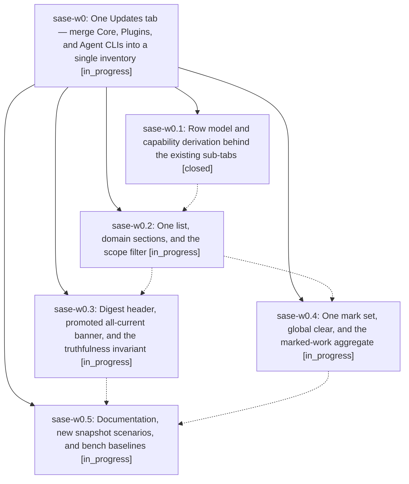

# Bead: sase-w0 — One Updates tab — merge Core, Plugins, and Agent CLIs into a single inventory

[Bead Pages](../README.md) / sase-w0

**Status:** ◐ in_progress · **Type:** ▸ plan · **Tier:** epic
**Owner:** `bryanbugyi34@gmail.com` · **Created by:** [bbugyi200.apollo.5](https://github.com/sase-org/sase--agents/blob/main/families/bbugyi200.apollo.5.md) · **Assignee:** `sase-w0.land`
**Created:** 2026-09-03 06:53:38 EDT
**Plan:** [202609/unified\_updates\_tab\_1.md](https://github.com/sase-org/sase--plans/blob/main/202609/unified_updates_tab_1.md)

<!-- sase:links:start -->

## Links

| Relation | Artifact | Why |
| --- | --- | --- |
| implemented-by | [plan:202609/unified_updates_tab_1.md][1] | derived from the plan's `bead_id:` frontmatter field |

[1]: https://github.com/sase-org/sase--plans/blob/main/202609/unified_updates_tab_1.md

<!-- sase:links:end -->

## Description

The Admin Center Updates tab is one master/detail inventory: every SASE package, plugin, and agent CLI appears as a row in a domain-sectioned list under a cycled Outdated / Installed / All scope filter, with a truthful digest header, one filter, one jump space, one mark set, and every keybinding and action path of the three retired sub-tabs preserved.

## Phases

| Bead | Title | Status | Size | Created | Agents | Commits |
|---|---|---|---|---|---:|---:|
| [sase-w0.1](sase-w0.1.md) | Row model and capability derivation behind the existing sub-tabs | ✓ closed | medium | 2026-09-03 | 1 | 1 |
| [sase-w0.2](sase-w0.2.md) | One list, domain sections, and the scope filter | ◐ in_progress | large | 2026-09-03 | 1 | 1 |
| [sase-w0.3](sase-w0.3.md) | Digest header, promoted all-current banner, and the truthfulness invariant | ◐ in_progress | medium | 2026-09-03 | 1 | 0 |
| [sase-w0.4](sase-w0.4.md) | One mark set, global clear, and the marked-work aggregate | ◐ in_progress | small | 2026-09-03 | 1 | 0 |
| [sase-w0.5](sase-w0.5.md) | Documentation, new snapshot scenarios, and bench baselines | ◐ in_progress | medium | 2026-09-03 | 1 | 0 |

## Lineage

## Agents

| Agent | Bead | Commits |
|---|---|---:|
| [bbugyi200.apollo.sase-w0.1](https://github.com/sase-org/sase--agents/blob/main/agents/bbugyi200.apollo.sase-w0.1/README.md) | [sase-w0.1](sase-w0.1.md) | 1 |
| [bbugyi200.apollo.sase-w0.2](https://github.com/sase-org/sase--agents/blob/main/families/bbugyi200.apollo.sase-w0.2.md) | [sase-w0.2](sase-w0.2.md) | 1 |
| [bbugyi200.apollo.sase-w0.3](https://github.com/sase-org/sase--agents/blob/main/agents/bbugyi200.apollo.sase-w0.3/README.md) | [sase-w0.3](sase-w0.3.md) | 0 |
| [bbugyi200.apollo.sase-w0.4](https://github.com/sase-org/sase--agents/blob/main/agents/bbugyi200.apollo.sase-w0.4/README.md) | [sase-w0.4](sase-w0.4.md) | 0 |
| [bbugyi200.apollo.sase-w0.5](https://github.com/sase-org/sase--agents/blob/main/agents/bbugyi200.apollo.sase-w0.5/README.md) | [sase-w0.5](sase-w0.5.md) | 0 |
| [bbugyi200.apollo.sase-w0.land](https://github.com/sase-org/sase--agents/blob/main/agents/bbugyi200.apollo.sase-w0.land/README.md) | [sase-w0](README.md) | 0 |

## Commits

| Repo | Commit | Subject | Bead | Committed |
|---|---|---|---|---|
| sase | [`f67169e`](https://github.com/sase-org/sase/commit/f67169ea715310e8da8a8034bd1842f7bc051c88) | refactor(plugins-browser): extract row model and capability derivation into plugins\_browser\_rows | [sase-w0.1](sase-w0.1.md) | 2026-09-03 09:55:06 EDT |
| sase | [`4c1c7b2`](https://github.com/sase-org/sase/commit/4c1c7b24ef396eef3973edaba33c0c9ce5ecc6d6) | feat(ace): merge Updates tab into one scoped inventory list | [sase-w0.2](sase-w0.2.md) | 2026-09-03 17:08:59 EDT |
