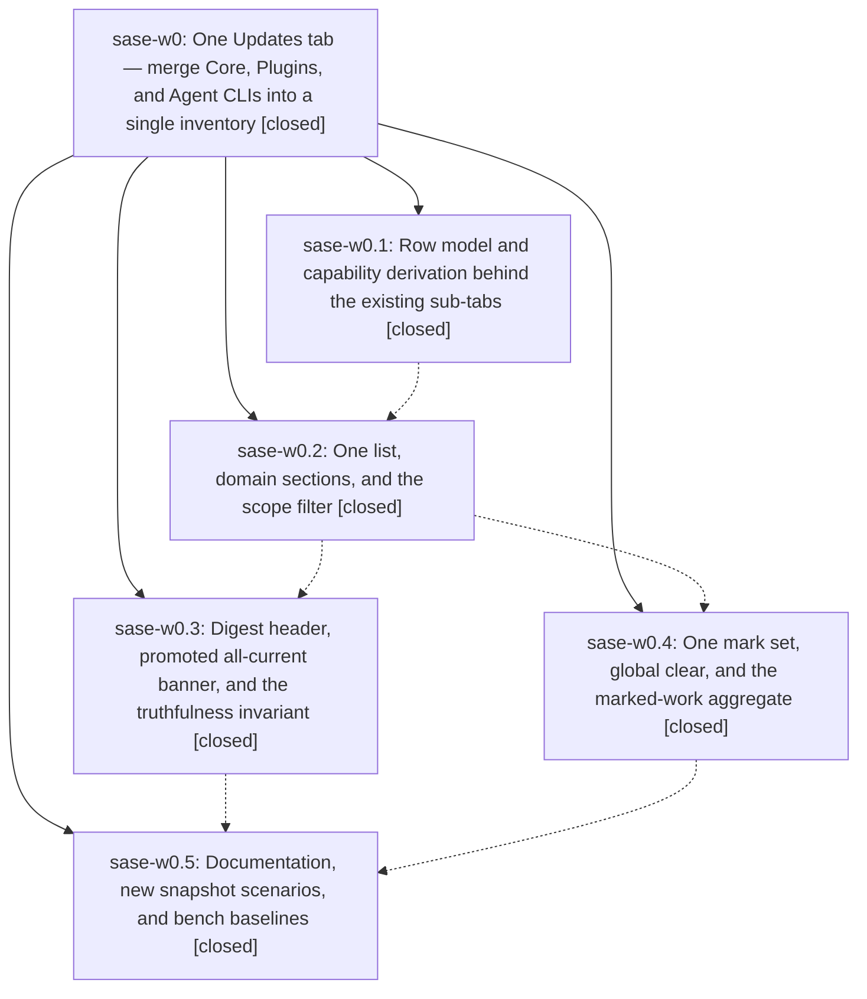

# Bead: sase-w0 — One Updates tab — merge Core, Plugins, and Agent CLIs into a single inventory

[Bead Pages](../README.md) / sase-w0

**Status:** ✓ closed · **Resolution:** done · **Type:** ▸ plan · **Tier:** epic
**Owner:** `bryanbugyi34@gmail.com` · **Created by:** [bbugyi200.apollo.5](https://github.com/sase-org/sase--agents/blob/main/families/bbugyi200.apollo.5.md) · **Assignee:** `sase-w0.land`
**Created:** 2026-09-03 06:53:38 EDT · **Closed:** 2026-09-04 07:09:23 EDT
**Plan:** [202609/unified\_updates\_tab\_1.md](https://github.com/sase-org/sase--plans/blob/main/202609/unified_updates_tab_1.md)

<!-- sase:links:start -->

## Links

| Relation | Artifact | Why |
| --- | --- | --- |
| implemented-by | [plan:202609/unified_updates_tab_1.md][1] | derived from the plan's `bead_id:` frontmatter field |

[1]: https://github.com/sase-org/sase--plans/blob/main/202609/unified_updates_tab_1.md

<!-- sase:links:end -->

## Description

The Admin Center Updates tab is one master/detail inventory: every SASE package, plugin, and agent CLI appears as a row in a domain-sectioned list under a cycled Outdated / Installed / All scope filter, with a truthful digest header, one filter, one jump space, one mark set, and every keybinding and action path of the three retired sub-tabs preserved.

## Notes

[2026-09-04T11:09:23Z · sase-w0.land] VERIFIED: all five phases closed and their work is real in the tree — f67169ea7 (w0.1 rows: plugins_browser_rows.py with UpdateRow, capability derivation, build_update_rows/select_rows/scope machinery), 4c1c7b24e (w0.2 list: one #updates-list/#updates-scopes master-detail surface, scope cycling on ]/[, unified ids/CSS), e17a73682 (w0.3 header: core_error carried through PluginsLoadResult into _sase_up_to_date/_all_up_to_date, digest + failed-source lines, 14 tests in test_plugins_browser_pane_all_current.py, digest/failed-source PNG goldens; also fixed the pre-existing 'bead note SystemExit 2' via parser.py parse_known_args), b558cc379 (w0.4 marks: single _marked row-key set, global Esc clear, marked-work aggregate), 719275bc8 (w0.5 docs: four doc surfaces rewritten, 4 new scenario goldens, refreshed plugin_catalog_scale_baseline.json; owner committed after the phase agent finished without committing). Final-sweep greps clean across src/ and docs/ (no subtab/sub-tab, _marked_install/_marked_agent_clis, _SUBTAB_NAV_HINT, _ITEM_PREFIX, plugins-list/agent-clis- ids). sase bead epic-symbols sase-w0: empty.

INTEGRATED: 17 non-epic commits landed interleaved; none touch the Updates pane. One straggler the w0.5 final sweep missed: handle_comprehensive_noop's dead switch_to_subtab parameter in plugins_browser_comprehensive_update_preview.py (dead since 9f24f133d, pointed at the retired "agent-clis" sub-tab id) — removed along with its only, test-only caller test_noop_with_subtab_keeps_agent_clis_toast; the production caller update_run.py never passed it. Verified: 18/18 tests in test_comprehensive_update_preview.py, ruff clean, no new mypy findings.

FOLLOW-UP OUTCOMES: (1) w0.5 flaky visuals — test_commits_persistent_filter_small_terminal_png_snapshot corroborated as +1 on existing sase-vo; test_config_center_logs_tab_png_snapshot filed as node-specific flake task sase-wh (linked to retired umbrella sase-ct and sibling sase-vo). (2) w0.2 jump-hint allocation hundreds of ms at n=2000 filed as bug task sase-wi (related sase-us; not epic-caused — the pre-merge Plugins sub-tab drove the same jump machinery over the same list). (3) w0.2 pre-existing full-suite failures declined as tasks: prompt-archive month path already tracked as sase-wa; bead-note SystemExit fixed in-epic by e17a73682; residual freeze soak (22 passed), startup stopwatch, and external mirror suites (60 passed across 6 files) all green serially on the landed tree — the originals match the known parallel-lane contention class.

KNOWN BLOCKER, NOT THIS EPIC: whole-repo mypy is red on master 719275bc8 (25 errors, all KillAndEditLastLaunchMixin in app.py from 4394da2e1/sase-w8), reproduced with this epic's tree unchanged via git stash; recorded as a DISCOVERED ISSUE note on active epic sase-w8. It aborts just check's lint gate for every agent; this epic's own diff verifies clean around it.

## Phases

| Bead | Title | Status | Size | Created | Agents | Commits |
|---|---|---|---|---|---:|---:|
| [sase-w0.1](sase-w0.1.md) | Row model and capability derivation behind the existing sub-tabs | ✓ closed | medium | 2026-09-03 | 1 | 1 |
| [sase-w0.2](sase-w0.2.md) | One list, domain sections, and the scope filter | ✓ closed | large | 2026-09-03 | 1 | 1 |
| [sase-w0.3](sase-w0.3.md) | Digest header, promoted all-current banner, and the truthfulness invariant | ✓ closed | medium | 2026-09-03 | 1 | 1 |
| [sase-w0.4](sase-w0.4.md) | One mark set, global clear, and the marked-work aggregate | ✓ closed | small | 2026-09-03 | 1 | 1 |
| [sase-w0.5](sase-w0.5.md) | Documentation, new snapshot scenarios, and bench baselines | ✓ closed | medium | 2026-09-03 | 1 | 1 |

## Lineage

## Agents

| Agent | Bead | Commits |
|---|---|---:|
| [bbugyi200.apollo.sase-w0.1](https://github.com/sase-org/sase--agents/blob/main/agents/bbugyi200.apollo.sase-w0.1/README.md) | [sase-w0.1](sase-w0.1.md) | 1 |
| [bbugyi200.apollo.sase-w0.2](https://github.com/sase-org/sase--agents/blob/main/families/bbugyi200.apollo.sase-w0.2.md) | [sase-w0.2](sase-w0.2.md) | 1 |
| [bbugyi200.apollo.sase-w0.3](https://github.com/sase-org/sase--agents/blob/main/agents/bbugyi200.apollo.sase-w0.3/README.md) | [sase-w0.3](sase-w0.3.md) | 1 |
| [bbugyi200.apollo.sase-w0.4](https://github.com/sase-org/sase--agents/blob/main/agents/bbugyi200.apollo.sase-w0.4/README.md) | [sase-w0.4](sase-w0.4.md) | 1 |
| [bbugyi200.apollo.sase-w0.5](https://github.com/sase-org/sase--agents/blob/main/families/bbugyi200.apollo.sase-w0.5.md) | [sase-w0.5](sase-w0.5.md) | 0 |
| [bbugyi200.apollo.sase-w0.land](https://github.com/sase-org/sase--agents/blob/main/agents/bbugyi200.apollo.sase-w0.land/README.md) | [sase-w0](README.md) | 1 |

## Commits

| Repo | Commit | Subject | Bead | Committed |
|---|---|---|---|---|
| sase | [`f67169e`](https://github.com/sase-org/sase/commit/f67169ea715310e8da8a8034bd1842f7bc051c88) | refactor(plugins-browser): extract row model and capability derivation into plugins\_browser\_rows | [sase-w0.1](sase-w0.1.md) | 2026-09-03 09:55:06 EDT |
| sase | [`4c1c7b2`](https://github.com/sase-org/sase/commit/4c1c7b24ef396eef3973edaba33c0c9ce5ecc6d6) | feat(ace): merge Updates tab into one scoped inventory list | [sase-w0.2](sase-w0.2.md) | 2026-09-03 17:08:59 EDT |
| sase | [`b558cc3`](https://github.com/sase-org/sase/commit/b558cc379c0295e5d132efe7b2e7341bfa36b849) | feat(ace): unify Updates tab marks into one row-key set | [sase-w0.4](sase-w0.4.md) | 2026-09-03 19:20:30 EDT |
| sase | [`e17a736`](https://github.com/sase-org/sase/commit/e17a736821efac38a7b7dcc8938bf3601e33b777) | feat(tui): add truthful updates digest header | [sase-w0.3](sase-w0.3.md) | 2026-09-03 22:09:56 EDT |
| sase | [`719275b`](https://github.com/sase-org/sase/commit/719275bc83615a61596087d89b34619def8b852d) | feat: Documentation, new snapshot scenarios, and bench baselines (sase-w0.5) | [sase-w0.5](sase-w0.5.md) | 2026-09-04 06:36:54 EDT |
| sase | [`2bf07da`](https://github.com/sase-org/sase/commit/2bf07dadf707fac934e75c6fe3301e703f752b1a) | chore(updates): land epic sase-w0 cleanup (sase-w0) | [sase-w0](README.md) | 2026-09-04 07:16:26 EDT |
