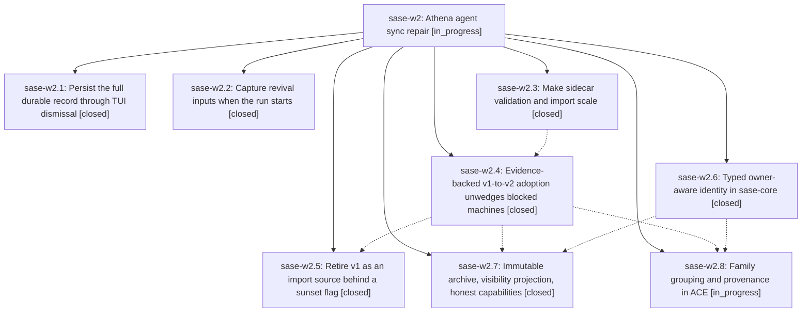

# Bead: sase-w2 — Athena agent sync repair

[Bead Pages](../README.md) / sase-w2

**Status:** ◐ in_progress · **Type:** ▸ plan · **Tier:** epic
**Owner:** `bryanbugyi34@gmail.com` · **Created by:** [bbugyi200.apollo.8--1](https://github.com/sase-org/sase--agents/blob/main/families/bbugyi200.apollo.8.md) · **Assignee:** `sase-w2.land`
**Created:** 2026-09-03 12:31:52 EDT
**Plan:** [202609/athena\_agent\_sync\_repair.md](https://github.com/sase-org/sase--plans/blob/main/202609/athena_agent_sync_repair.md)

<!-- sase:links:start -->

## Links

| Relation | Artifact | Why |
| --- | --- | --- |
| implemented-by | [plan:202609/athena_agent_sync_repair.md][1] | derived from the plan's `bead_id:` frontmatter field |

[1]: https://github.com/sase-org/sase--plans/blob/main/202609/athena_agent_sync_repair.md

<!-- sase:links:end -->

## Description

Agents synced from another machine import over the v2 transport as dismissed, fully revivable, correctly grouped records with owner-scoped names, and machines wedged on the legacy v1 import path heal in place on their next sync.

## Phases

| Bead | Title | Status | Size | Created | Agents | Commits |
|---|---|---|---|---|---:|---:|
| [sase-w2.1](sase-w2.1.md) | Persist the full durable record through TUI dismissal | ✓ closed | medium | 2026-09-03 | 1 | 1 |
| [sase-w2.2](sase-w2.2.md) | Capture revival inputs when the run starts | ✓ closed | medium | 2026-09-03 | 1 | 1 |
| [sase-w2.3](sase-w2.3.md) | Make sidecar validation and import scale | ✓ closed | medium | 2026-09-03 | 1 | 1 |
| [sase-w2.4](sase-w2.4.md) | Evidence-backed v1-to-v2 adoption unwedges blocked machines | ✓ closed | large | 2026-09-03 | 1 | 1 |
| [sase-w2.5](sase-w2.5.md) | Retire v1 as an import source behind a sunset flag | ✓ closed | medium | 2026-09-03 | 1 | 1 |
| [sase-w2.6](sase-w2.6.md) | Typed owner-aware identity in sase-core | ✓ closed | large | 2026-09-03 | 1 | 2 |
| [sase-w2.7](sase-w2.7.md) | Immutable archive, visibility projection, honest capabilities | ✓ closed | large | 2026-09-03 | 1 | 2 |
| [sase-w2.8](sase-w2.8.md) | Family grouping and provenance in ACE | ◐ in_progress | medium | 2026-09-03 | 1 | 0 |

## Lineage

## Agents

| Agent | Bead | Commits |
|---|---|---:|
| [bbugyi200.apollo.sase-w2.1](https://github.com/sase-org/sase--agents/blob/main/agents/bbugyi200.apollo.sase-w2.1/README.md) | [sase-w2.1](sase-w2.1.md) | 1 |
| [bbugyi200.apollo.sase-w2.2](https://github.com/sase-org/sase--agents/blob/main/agents/bbugyi200.apollo.sase-w2.2/README.md) | [sase-w2.2](sase-w2.2.md) | 1 |
| [bbugyi200.apollo.sase-w2.3](https://github.com/sase-org/sase--agents/blob/main/agents/bbugyi200.apollo.sase-w2.3/README.md) | [sase-w2.3](sase-w2.3.md) | 1 |
| [bbugyi200.apollo.sase-w2.4](https://github.com/sase-org/sase--agents/blob/main/families/bbugyi200.apollo.sase-w2.4.md) | [sase-w2.4](sase-w2.4.md) | 1 |
| [bbugyi200.apollo.sase-w2.5](https://github.com/sase-org/sase--agents/blob/main/agents/bbugyi200.apollo.sase-w2.5/README.md) | [sase-w2.5](sase-w2.5.md) | 1 |
| [bbugyi200.apollo.sase-w2.6](https://github.com/sase-org/sase--agents/blob/main/families/bbugyi200.apollo.sase-w2.6.md) | [sase-w2.6](sase-w2.6.md) | 2 |
| [bbugyi200.apollo.sase-w2.7](https://github.com/sase-org/sase--agents/blob/main/families/bbugyi200.apollo.sase-w2.7.md) | [sase-w2.7](sase-w2.7.md) | 2 |
| [bbugyi200.apollo.sase-w2.8](https://github.com/sase-org/sase--agents/blob/main/families/bbugyi200.apollo.sase-w2.8.md) | [sase-w2.8](sase-w2.8.md) | 0 |
| [bbugyi200.apollo.sase-w2.land](https://github.com/sase-org/sase--agents/blob/main/agents/bbugyi200.apollo.sase-w2.land/README.md) | [sase-w2](README.md) | 0 |

## Commits

| Repo | Commit | Subject | Bead | Committed |
|---|---|---|---|---|
| sase | [`e09a5f9`](https://github.com/sase-org/sase/commit/e09a5f9ab196011e9781c7616b331a739c41ad86) | fix(agents-sync): capture revival inputs at agent launch | [sase-w2.2](sase-w2.2.md) | 2026-09-03 15:26:34 EDT |
| sase | [`b0fb991`](https://github.com/sase-org/sase/commit/b0fb991b14baec042bb4d19cb99ed3743b9be712) | perf(agents-sync): batch fetched sidecar object reads | [sase-w2.3](sase-w2.3.md) | 2026-09-03 15:32:55 EDT |
| sase | [`9e2d95b`](https://github.com/sase-org/sase/commit/9e2d95bb0e85eb546502a069c1a0d7d773d715bf) | fix(ace): persist the full durable record through TUI dismissal | [sase-w2.1](sase-w2.1.md) | 2026-09-03 15:42:21 EDT |
| sase | [`bdd2ead`](https://github.com/sase-org/sase/commit/bdd2eadcf65b84d467ce26cfae34f11f2fb67fee) | feat(agents-sync): evidence-backed v1-to-v2 adoption unwedges blocked machines | [sase-w2.4](sase-w2.4.md) | 2026-09-03 17:30:08 EDT |
| sase | [`ffa4c76`](https://github.com/sase-org/sase/commit/ffa4c765d8b54732101964229b026d57a18b392d) | feat(agents-sync): retire v1 as an import source behind a sunset flag | [sase-w2.5](sase-w2.5.md) | 2026-09-03 19:50:46 EDT |
| sase | [`f4032c5`](https://github.com/sase-org/sase/commit/f4032c55d73694a137cc2ef5d3276870abb996a1) | feat(agent): wire typed owner identity through SASE | [sase-w2.6](sase-w2.6.md) | 2026-09-04 00:00:05 EDT |
| sase-core | [`sase-core@151dd84`](https://github.com/sase-org/sase-core/commit/151dd8445b1c483ca456f08054d6812bf1d9f4b6) | feat(agent): add typed owner identity core APIs | [sase-w2.6](sase-w2.6.md) | 2026-09-04 00:07:07 EDT |
| sase | [`b1c108f`](https://github.com/sase-org/sase/commit/b1c108fd7941c413faffbedb58331543ac7f4405) | feat(agent): add archive visibility capabilities | [sase-w2.7](sase-w2.7.md) | 2026-09-04 02:43:38 EDT |
| sase-core | [`sase-core@98552a4`](https://github.com/sase-org/sase-core/commit/98552a4afe87a1b17d5f8794b3d591e83e0bd49b) | feat(agent-archive): validate archive capabilities | [sase-w2.7](sase-w2.7.md) | 2026-09-04 02:47:14 EDT |
