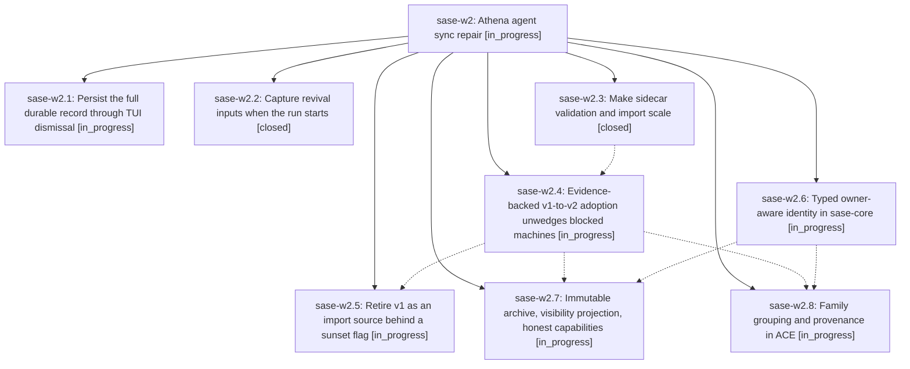

# Bead: sase-w2 — Athena agent sync repair

[Bead Pages](../README.md) / sase-w2

**Status:** ◐ in_progress · **Type:** ▸ plan · **Tier:** epic
**Owner:** `bryanbugyi34@gmail.com` · **Created by:** [bbugyi200.apollo.8--1](https://github.com/sase-org/sase--agents/blob/main/families/bbugyi200.apollo.8.md) · **Assignee:** `sase-w2.land`
**Created:** 2026-09-03 12:31:52 EDT
**Plan:** [202609/athena\_agent\_sync\_repair.md](https://github.com/sase-org/sase--plans/blob/main/202609/athena_agent_sync_repair.md)

<!-- sase:links:start -->

## Links

| Relation | Artifact | Why |
| --- | --- | --- |
| implemented-by | [plan:202609/athena_agent_sync_repair.md][1] | derived from the plan's `bead_id:` frontmatter field |

[1]: https://github.com/sase-org/sase--plans/blob/main/202609/athena_agent_sync_repair.md

<!-- sase:links:end -->

## Description

Agents synced from another machine import over the v2 transport as dismissed, fully revivable, correctly grouped records with owner-scoped names, and machines wedged on the legacy v1 import path heal in place on their next sync.

## Phases

| Bead | Title | Status | Size | Created | Agents | Commits |
|---|---|---|---|---|---:|---:|
| [sase-w2.1](sase-w2.1.md) | Persist the full durable record through TUI dismissal | ◐ in_progress | medium | 2026-09-03 | 1 | 0 |
| [sase-w2.2](sase-w2.2.md) | Capture revival inputs when the run starts | ✓ closed | medium | 2026-09-03 | 1 | 1 |
| [sase-w2.3](sase-w2.3.md) | Make sidecar validation and import scale | ✓ closed | medium | 2026-09-03 | 1 | 0 |
| [sase-w2.4](sase-w2.4.md) | Evidence-backed v1-to-v2 adoption unwedges blocked machines | ◐ in_progress | large | 2026-09-03 | 1 | 0 |
| [sase-w2.5](sase-w2.5.md) | Retire v1 as an import source behind a sunset flag | ◐ in_progress | medium | 2026-09-03 | 1 | 0 |
| [sase-w2.6](sase-w2.6.md) | Typed owner-aware identity in sase-core | ◐ in_progress | large | 2026-09-03 | 1 | 0 |
| [sase-w2.7](sase-w2.7.md) | Immutable archive, visibility projection, honest capabilities | ◐ in_progress | large | 2026-09-03 | 1 | 0 |
| [sase-w2.8](sase-w2.8.md) | Family grouping and provenance in ACE | ◐ in_progress | medium | 2026-09-03 | 1 | 0 |

## Lineage

## Agents

| Agent | Bead | Commits |
|---|---|---:|
| [bbugyi200.apollo.sase-w2.1](https://github.com/sase-org/sase--agents/blob/main/agents/bbugyi200.apollo.sase-w2.1/README.md) | [sase-w2.1](sase-w2.1.md) | 0 |
| [bbugyi200.apollo.sase-w2.2](https://github.com/sase-org/sase--agents/blob/main/agents/bbugyi200.apollo.sase-w2.2/README.md) | [sase-w2.2](sase-w2.2.md) | 1 |
| [bbugyi200.apollo.sase-w2.3](https://github.com/sase-org/sase--agents/blob/main/agents/bbugyi200.apollo.sase-w2.3/README.md) | [sase-w2.3](sase-w2.3.md) | 0 |
| [bbugyi200.apollo.sase-w2.4](https://github.com/sase-org/sase--agents/blob/main/agents/bbugyi200.apollo.sase-w2.4/README.md) | [sase-w2.4](sase-w2.4.md) | 0 |
| [bbugyi200.apollo.sase-w2.5](https://github.com/sase-org/sase--agents/blob/main/agents/bbugyi200.apollo.sase-w2.5/README.md) | [sase-w2.5](sase-w2.5.md) | 0 |
| [bbugyi200.apollo.sase-w2.6](https://github.com/sase-org/sase--agents/blob/main/families/bbugyi200.apollo.sase-w2.6.md) | [sase-w2.6](sase-w2.6.md) | 0 |
| [bbugyi200.apollo.sase-w2.7](https://github.com/sase-org/sase--agents/blob/main/agents/bbugyi200.apollo.sase-w2.7/README.md) | [sase-w2.7](sase-w2.7.md) | 0 |
| [bbugyi200.apollo.sase-w2.8](https://github.com/sase-org/sase--agents/blob/main/agents/bbugyi200.apollo.sase-w2.8/README.md) | [sase-w2.8](sase-w2.8.md) | 0 |
| [bbugyi200.apollo.sase-w2.land](https://github.com/sase-org/sase--agents/blob/main/agents/bbugyi200.apollo.sase-w2.land/README.md) | [sase-w2](README.md) | 0 |

## Commits

| Repo | Commit | Subject | Bead | Committed |
|---|---|---|---|---|
| sase | [`e09a5f9`](https://github.com/sase-org/sase/commit/e09a5f9ab196011e9781c7616b331a739c41ad86) | fix(agents-sync): capture revival inputs at agent launch | [sase-w2.2](sase-w2.2.md) | 2026-09-03 15:26:34 EDT |
