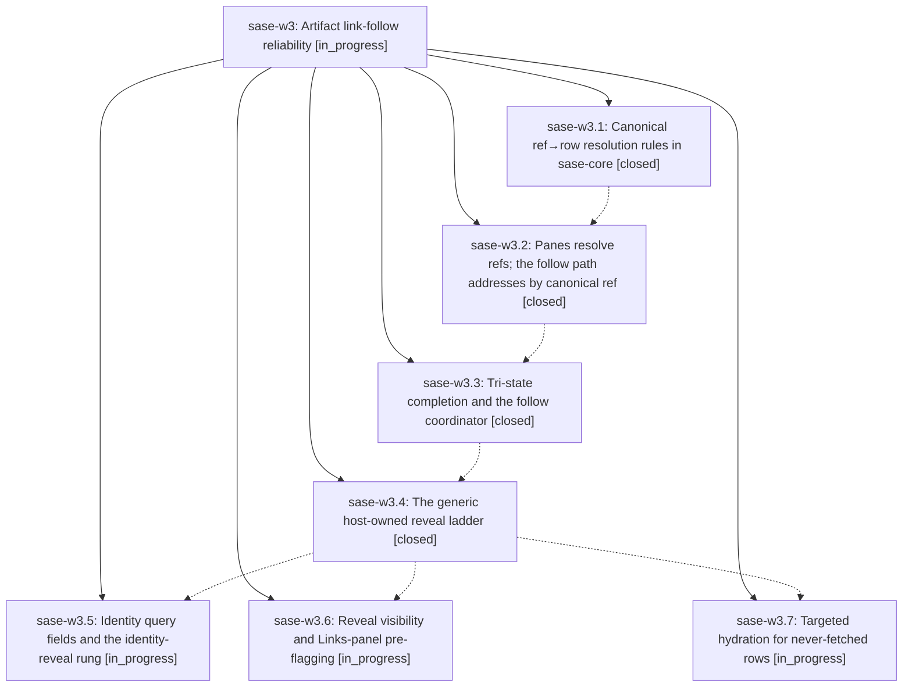

# Bead: sase-w3 — Artifact link-follow reliability

[Bead Pages](../README.md) / sase-w3

**Status:** ◐ in_progress · **Type:** ▸ plan · **Tier:** epic
**Owner:** `bryanbugyi34@gmail.com` · **Created by:** [bbugyi200.apollo.b](https://github.com/sase-org/sase--agents/blob/main/families/bbugyi200.apollo.b.md) · **Assignee:** `sase-w3.land`
**Created:** 2026-09-03 12:48:25 EDT
**Plan:** [202609/link\_follow\_reliability.md](https://github.com/sase-org/sase--plans/blob/main/202609/link_follow_reliability.md)

<!-- sase:links:start -->

## Links

| Relation | Artifact | Why |
| --- | --- | --- |
| implemented-by | [plan:202609/link_follow_reliability.md][1] | derived from the plan's `bead_id:` frontmatter field |

[1]: https://github.com/sase-org/sase--plans/blob/main/202609/link_follow_reliability.md

<!-- sase:links:end -->

## Description

Following a link from the Artifacts Links panel ($0) or the link rail ($1-$9) virtually never fails: refs resolve to real row identities, filtered-out rows are revealed by narrow ^-reversible query rewrites, loading is never reported as absence, and only genuinely dangling refs still warn.

## Phases

| Bead | Title | Status | Size | Created | Agents | Commits |
|---|---|---|---|---|---:|---:|
| [sase-w3.1](sase-w3.1.md) | Canonical ref→row resolution rules in sase-core | ✓ closed | large | 2026-09-03 | 1 | 2 |
| [sase-w3.2](sase-w3.2.md) | Panes resolve refs; the follow path addresses by canonical ref | ✓ closed | medium | 2026-09-03 | 0 | 1 |
| [sase-w3.3](sase-w3.3.md) | Tri-state completion and the follow coordinator | ✓ closed | large | 2026-09-03 | 1 | 1 |
| [sase-w3.4](sase-w3.4.md) | The generic host-owned reveal ladder | ✓ closed | large | 2026-09-03 | 1 | 1 |
| [sase-w3.5](sase-w3.5.md) | Identity query fields and the identity-reveal rung | ◐ in_progress | medium | 2026-09-03 | 1 | 0 |
| [sase-w3.6](sase-w3.6.md) | Reveal visibility and Links-panel pre-flagging | ◐ in_progress | small | 2026-09-03 | 1 | 0 |
| [sase-w3.7](sase-w3.7.md) | Targeted hydration for never-fetched rows | ◐ in_progress | large | 2026-09-03 | 1 | 0 |

## Lineage

## Agents

| Agent | Bead | Commits |
|---|---|---:|
| [bbugyi200.apollo.sase-w3.1](https://github.com/sase-org/sase--agents/blob/main/families/bbugyi200.apollo.sase-w3.1.md) | [sase-w3.1](sase-w3.1.md) | 1 |
| [bbugyi200.apollo.sase-w3.3](https://github.com/sase-org/sase--agents/blob/main/families/bbugyi200.apollo.sase-w3.3.md) | [sase-w3.3](sase-w3.3.md) | 1 |
| [bbugyi200.apollo.sase-w3.4](https://github.com/sase-org/sase--agents/blob/main/families/bbugyi200.apollo.sase-w3.4.md) | [sase-w3.4](sase-w3.4.md) | 1 |
| [bbugyi200.apollo.sase-w3.5](https://github.com/sase-org/sase--agents/blob/main/agents/bbugyi200.apollo.sase-w3.5/README.md) | [sase-w3.5](sase-w3.5.md) | 0 |
| [bbugyi200.apollo.sase-w3.6](https://github.com/sase-org/sase--agents/blob/main/agents/bbugyi200.apollo.sase-w3.6/README.md) | [sase-w3.6](sase-w3.6.md) | 0 |
| [bbugyi200.apollo.sase-w3.7](https://github.com/sase-org/sase--agents/blob/main/agents/bbugyi200.apollo.sase-w3.7/README.md) | [sase-w3.7](sase-w3.7.md) | 0 |
| [bbugyi200.apollo.sase-w3.land](https://github.com/sase-org/sase--agents/blob/main/agents/bbugyi200.apollo.sase-w3.land/README.md) | [sase-w3](README.md) | 0 |

## Commits

| Repo | Commit | Subject | Bead | Committed |
|---|---|---|---|---|
| sase | [`8c3e7b6`](https://github.com/sase-org/sase/commit/8c3e7b6bffd9f518ec33ce1698f717b69a49a394) | feat: use core artifact row resolution | [sase-w3.1](sase-w3.1.md) | 2026-09-03 17:06:53 EDT |
| sase-core | [`sase-core@30fe0b2`](https://github.com/sase-org/sase-core/commit/30fe0b283820af47514ff1ba2202919888373049) | feat: nonical ref to row resolution rules in sase-core (sase-w3.1) | [sase-w3.1](sase-w3.1.md) | 2026-09-03 17:20:02 EDT |
| sase | [`b93a189`](https://github.com/sase-org/sase/commit/b93a1894ddc88153bc85446a029092097cc393b3) | feat: Panes resolve refs; the follow path addresses by canonical ref (sase-w3.2) | [sase-w3.2](sase-w3.2.md) | 2026-09-04 06:47:49 EDT |
| sase | [`82dc1e2`](https://github.com/sase-org/sase/commit/82dc1e2246875a66a8084b79d62baed734a2728a) | feat(ace): tri-state link-follow coordinator for artifact panes (sase-w3.3) | [sase-w3.3](sase-w3.3.md) | 2026-09-04 08:05:59 EDT |
| sase | [`0f66320`](https://github.com/sase-org/sase/commit/0f66320dffd890e83975d016e0d18c8b2e4d5b39) | feat(tui): add host-owned artifact link reveal ladder | [sase-w3.4](sase-w3.4.md) | 2026-09-04 10:59:05 EDT |
