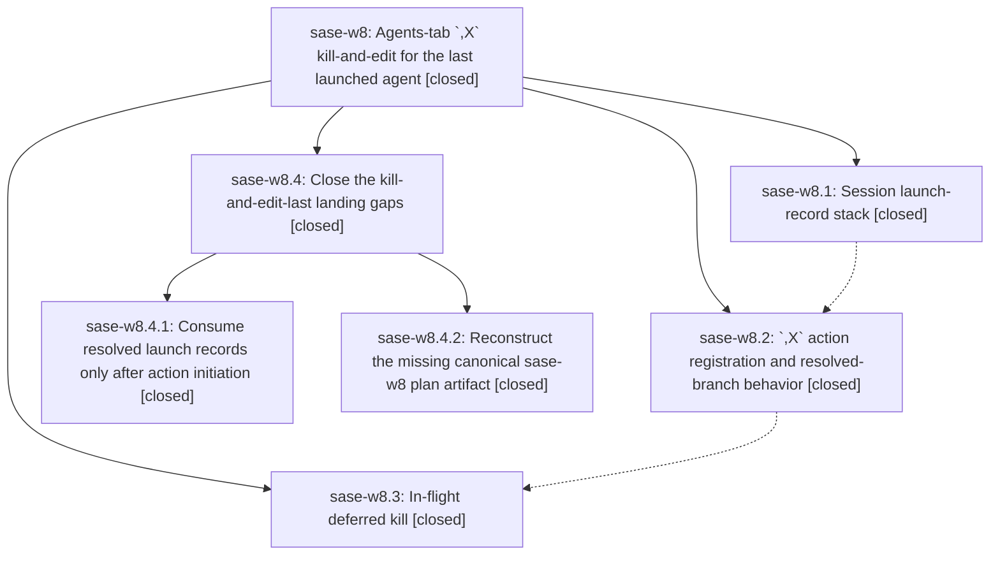

# Bead: sase-w8 — Agents-tab \`,X\` kill-and-edit for the last launched agent

[Bead Pages](../README.md) / sase-w8

**Status:** ✓ closed · **Resolution:** done · **Type:** ▸ plan · **Tier:** epic
**Owner:** `bryanbugyi34@gmail.com` · **Created by:** `bbugyi200.kellys_mbp.l` · **Assignee:** `sase-w8.land`
**Created:** 2026-09-03 17:02:19 EDT · **Closed:** 2026-09-04 19:56:04 EDT
**Plan:** [202609/kill\_and\_edit\_last\_launch.md](https://github.com/sase-org/sase--plans/blob/main/202609/kill_and_edit_last_launch.md)

<!-- sase:links:start -->

## Links

| Relation | Artifact | Why |
| --- | --- | --- |
| implemented-by | [plan:202609/kill_and_edit_last_launch.md][1] | derived from the plan's `bead_id:` frontmatter field |

[1]: https://github.com/sase-org/sase--plans/blob/main/202609/kill_and_edit_last_launch.md

<!-- sase:links:end -->

## Description

Pressing `,X` on the Agents tab kills and re-edits the most recently launched agent of this ACE session — including one whose launch proc has not finished — so a premature <enter> can be undone instantly, edited, and resubmitted.

## Notes

[2026-09-04T11:06:59Z · sase-w0.land] DISCOVERED ISSUE: whole-repo mypy is red on master 719275bc8 with 25 errors in src/sase/ace/tui/app.py, all from KillAndEditLastLaunchMixin (landed 4394da2e1 with sase-w8.1's 1caa4ece9): 'Definition of _current_group_key ... incompatible' against ~22 sibling mixins at app.py:117, plus a current_attempt_number override mismatch at app.py:264 (None vs int | None). Reproduced by sase-w0.land on a fresh 'just install' venv with the epic-w0 tree unchanged (git stash confirmed), so it is not caused by sase-w0; it aborts 'just check' at the _lint-mypy gate for every agent on master. Note sase-vr (lock-faithful venv reports findings stale venvs miss) may explain why it passed pre-land.

[2026-09-04T11:14:41Z · sase-w0.land] Whitelist cleanup by sase-w0.land: symvision flagged all four sase-w8.2 --epic-symbol entries (LaunchRecord, LaunchRecordState, consume_launch_record, latest_live_launch_record) as 'already properly used' after 4394da2e1 wired them up, so those Justfile lines were removed per the self-cleaning policy. sase-w8.3(launch_record_for_proc_id) remains whitelisted. just symvision green after removal.

[2026-09-04T23:56:04Z · sase-w8.4.land] Resumed and finished by the sase-w8.4 land agent after child epic sase-w8.4 closed. RECHECKED DESCENDANTS: sase-w8.1/.2/.3 and child epic sase-w8.4 are all closed done. sase-w8.2 was closed with 'the agent just didn't get to run just check' — just check now passes every lint gate on this tree, so that gap is settled. sase-w8.3's only PROPOSED FOLLOW-UP (abort a gated typed-admission launch bundle) is already ready task sase-wk with a typed related link back to the phase. EPIC NOTES: note #1 (whole-repo mypy red from KillAndEditLastLaunchMixin's _current_group_key/current_attempt_number) is fixed — lint (mypy) is green and the tracking task sase-wj is closed done. Note #2 (Symvision whitelist) is settled — the Justfile now carries only the unrelated sase-n4 entry, sase bead epic-symbols reports nothing for sase-w8 or any phase, and just symvision is green. LINKED PLAN: plan:202609/kill_and_edit_last_launch.md was restored by sase-w8.4.2 and now resolves; I re-read it end to end and re-verified its contract against the tree — all eight registration surfaces are present (default_config.yml:735, keymaps/mode_keymaps.py:175, _leader_mode.py:217, _mode_commands.py:67+108 label/AGENTS_ONLY, _availability_agents.py:230, widgets/_keybinding_modes.py:418 footer, help_modal/agents_bindings.py:287, docs/ace.md), the retired kill_marked_and_edit filter is still intact in keymaps/registry.py, and the resolved, in-flight KILL_PENDING, relaunch-hold and typed-admission-v1 behaviors match the plan. POST-CHILD DRIFT: reviewed every commit after the epic's last code commit 5a90ff882 through c0b741c93; none touch agent_workflow/, agents/ kill paths, or the launch-record stack, so no integration edits were needed there. INTEGRATION EDIT: docs/ace.md's ,X section still described the pre-sase-w8.4 behavior ('repeating ,X walks back one accepted launch at a time') and did not say that a canceled confirmation, a lost row, or a failed prompt resolution keeps the same target, nor that a repeat press during a pending resolved action does not start a second one. Updated that paragraph to match the shipped RESOLVED_ACTION_PENDING behavior. VERIFICATION on the final tree: just install; just check green through fmt, keep-sorted, ruff, mypy, feature flags, pyscripts, test waits, changelog, patch/stitch terminology, symvision, toobig, SASE validation and committed plans; the diff-scoped selection (63 files, 624 tests) passes, as do 137 tests across the kill/relaunch/marking suites and the 32 tests in test_kill_and_edit_last_launch.py + test_launch_records.py. Two stable master failures remain but are not this epic's: sase-wu (ci task, caused by 2c8422053) and the proc-producer inventory count, recorded as a DISCOVERED ISSUE on the still-active epic sase-ws that caused it.

## Phases

| Bead | Title | Status | Size | Created | Agents | Commits |
|---|---|---|---|---|---:|---:|
| [sase-w8.1](sase-w8.1.md) | Session launch-record stack | ✓ closed | medium | 2026-09-03 | 0 | 1 |
| [sase-w8.2](sase-w8.2.md) | \`,X\` action registration and resolved-branch behavior | ✓ closed | medium | 2026-09-03 | 1 | 1 |
| [sase-w8.3](sase-w8.3.md) | In-flight deferred kill | ✓ closed | medium | 2026-09-03 | 1 | 1 |

## Lineage

## Agents

| Agent | Bead | Commits |
|---|---|---:|
| [bbugyi200.apollo.sase-w8.4.1](https://github.com/sase-org/sase--agents/blob/main/agents/bbugyi200.apollo.sase-w8.4.1/README.md) | [sase-w8.4.1](sase-w8.4.1.md) | 1 |
| [bbugyi200.apollo.sase-w8.4.2](https://github.com/sase-org/sase--agents/blob/main/agents/bbugyi200.apollo.sase-w8.4.2/README.md) | [sase-w8.4.2](sase-w8.4.2.md) | 1 |
| [bbugyi200.apollo.sase-w8.4.land](https://github.com/sase-org/sase--agents/blob/main/agents/bbugyi200.apollo.sase-w8.4.land/README.md) | [sase-w8.4](sase-w8.4.md) | 2 |
| [bbugyi200.apollo.sase-w8.land](https://github.com/sase-org/sase--agents/blob/main/families/bbugyi200.apollo.sase-w8.land.md) | [sase-w8](README.md) | 0 |
| [bbugyi200.kellys\_mbp.sase-w8.2](https://github.com/sase-org/sase--agents/blob/main/agents/bbugyi200.kellys_mbp.sase-w8.2/README.md) | [sase-w8.2](sase-w8.2.md) | 1 |
| [bbugyi200.kellys\_mbp.sase-w8.3](https://github.com/sase-org/sase--agents/blob/main/agents/bbugyi200.kellys_mbp.sase-w8.3/README.md) | [sase-w8.3](sase-w8.3.md) | 1 |

## Commits

| Repo | Commit | Subject | Bead | Committed |
|---|---|---|---|---|
| sase | [`1caa4ec`](https://github.com/sase-org/sase/commit/1caa4ece9e5db54c0e46685610f896055214c17f) | feat: Session launch-record stack (sase-w8.1) | [sase-w8.1](sase-w8.1.md) | 2026-09-04 05:23:13 EDT |
| sase | [`4394da2`](https://github.com/sase-org/sase/commit/4394da2e11e2652c84f2d3c28a21212c56f696f3) | feat(ace): add kill-and-edit-last-launch keymap (,X) for resolved-branch relaunch | [sase-w8.2](sase-w8.2.md) | 2026-09-04 05:49:21 EDT |
| sase | [`51c3fbc`](https://github.com/sase-org/sase/commit/51c3fbcd5f487af273c0ff74871a3e7f990122fa) | feat(ace): defer in-flight ,X kill until launch completion | [sase-w8.3](sase-w8.3.md) | 2026-09-04 08:04:59 EDT |
| sase | [`5a90ff8`](https://github.com/sase-org/sase/commit/5a90ff8826f51d6d4c363bf28944de81ec77bc4c) | fix(ace): delay last-launch record consumption | [sase-w8.4.1](sase-w8.4.1.md) | 2026-09-04 17:37:02 EDT |
| sase--plans | [`sase--plans@f99ccb8`](https://github.com/sase-org/sase--plans/commit/f99ccb86d7abaec7a961e6b0b21f11590c85009b) | docs(plan): restore missing sase-w8 kill\_and\_edit\_last\_launch epic plan | [sase-w8.4.2](sase-w8.4.2.md) | 2026-09-04 18:17:46 EDT |
| sase | [`e7298cb`](https://github.com/sase-org/sase/commit/e7298cbfefdd624d62d961d0e2d24b4e872cf114) | docs(ace): describe ,X resolved-action consumption in the launch history | [sase-w8.4](sase-w8.4.md) | 2026-09-04 19:59:43 EDT |
| sase--plans | [`sase--plans@7676054`](https://github.com/sase-org/sase--plans/commit/7676054375ccb5aded33ca4726712270bfe00a7c) | chore(plans): mark the kill-and-edit-last epic plan done | [sase-w8.4](sase-w8.4.md) | 2026-09-04 20:00:55 EDT |
