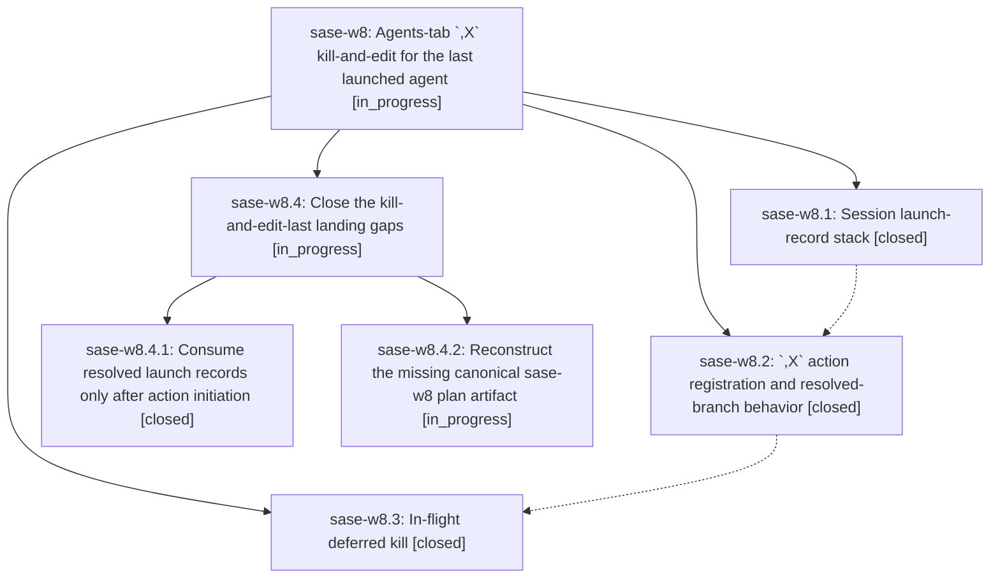

# Bead: sase-w8 — Agents-tab \`,X\` kill-and-edit for the last launched agent

[Bead Pages](../README.md) / sase-w8

**Status:** ◐ in_progress · **Type:** ▸ plan · **Tier:** epic
**Owner:** `bryanbugyi34@gmail.com` · **Created by:** `bbugyi200.kellys_mbp.l` · **Assignee:** `sase-w8.land`
**Created:** 2026-09-03 17:02:19 EDT
**Plan:** [202609/kill\_and\_edit\_last\_launch.md](https://github.com/sase-org/sase--plans/blob/main/202609/kill_and_edit_last_launch.md)

<!-- sase:links:start -->

## Links

| Relation | Artifact | Why |
| --- | --- | --- |
| implemented-by | [plan:202609/kill_and_edit_last_launch.md][1] | derived from the plan's `bead_id:` frontmatter field |

[1]: https://github.com/sase-org/sase--plans/blob/main/202609/kill_and_edit_last_launch.md

<!-- sase:links:end -->

## Description

Pressing `,X` on the Agents tab kills and re-edits the most recently launched agent of this ACE session — including one whose launch proc has not finished — so a premature <enter> can be undone instantly, edited, and resubmitted.

## Notes

[2026-09-04T11:06:59Z · sase-w0.land] DISCOVERED ISSUE: whole-repo mypy is red on master 719275bc8 with 25 errors in src/sase/ace/tui/app.py, all from KillAndEditLastLaunchMixin (landed 4394da2e1 with sase-w8.1's 1caa4ece9): 'Definition of _current_group_key ... incompatible' against ~22 sibling mixins at app.py:117, plus a current_attempt_number override mismatch at app.py:264 (None vs int | None). Reproduced by sase-w0.land on a fresh 'just install' venv with the epic-w0 tree unchanged (git stash confirmed), so it is not caused by sase-w0; it aborts 'just check' at the _lint-mypy gate for every agent on master. Note sase-vr (lock-faithful venv reports findings stale venvs miss) may explain why it passed pre-land.

[2026-09-04T11:14:41Z · sase-w0.land] Whitelist cleanup by sase-w0.land: symvision flagged all four sase-w8.2 --epic-symbol entries (LaunchRecord, LaunchRecordState, consume_launch_record, latest_live_launch_record) as 'already properly used' after 4394da2e1 wired them up, so those Justfile lines were removed per the self-cleaning policy. sase-w8.3(launch_record_for_proc_id) remains whitelisted. just symvision green after removal.

## Phases

| Bead | Title | Status | Size | Created | Agents | Commits |
|---|---|---|---|---|---:|---:|
| [sase-w8.1](sase-w8.1.md) | Session launch-record stack | ✓ closed | medium | 2026-09-03 | 0 | 1 |
| [sase-w8.2](sase-w8.2.md) | \`,X\` action registration and resolved-branch behavior | ✓ closed | medium | 2026-09-03 | 1 | 1 |
| [sase-w8.3](sase-w8.3.md) | In-flight deferred kill | ✓ closed | medium | 2026-09-03 | 1 | 1 |

## Lineage

## Agents

| Agent | Bead | Commits |
|---|---|---:|
| [bbugyi200.apollo.sase-w8.4.1](https://github.com/sase-org/sase--agents/blob/main/agents/bbugyi200.apollo.sase-w8.4.1/README.md) | [sase-w8.4.1](sase-w8.4.1.md) | 1 |
| [bbugyi200.apollo.sase-w8.4.2](https://github.com/sase-org/sase--agents/blob/main/agents/bbugyi200.apollo.sase-w8.4.2/README.md) | [sase-w8.4.2](sase-w8.4.2.md) | 0 |
| [bbugyi200.apollo.sase-w8.4.land](https://github.com/sase-org/sase--agents/blob/main/agents/bbugyi200.apollo.sase-w8.4.land/README.md) | [sase-w8.4](sase-w8.4.md) | 0 |
| [bbugyi200.apollo.sase-w8.land](https://github.com/sase-org/sase--agents/blob/main/families/bbugyi200.apollo.sase-w8.land.md) | [sase-w8](README.md) | 0 |
| [bbugyi200.kellys\_mbp.sase-w8.2](https://github.com/sase-org/sase--agents/blob/main/agents/bbugyi200.kellys_mbp.sase-w8.2/README.md) | [sase-w8.2](sase-w8.2.md) | 1 |
| [bbugyi200.kellys\_mbp.sase-w8.3](https://github.com/sase-org/sase--agents/blob/main/agents/bbugyi200.kellys_mbp.sase-w8.3/README.md) | [sase-w8.3](sase-w8.3.md) | 1 |

## Commits

| Repo | Commit | Subject | Bead | Committed |
|---|---|---|---|---|
| sase | [`1caa4ec`](https://github.com/sase-org/sase/commit/1caa4ece9e5db54c0e46685610f896055214c17f) | feat: Session launch-record stack (sase-w8.1) | [sase-w8.1](sase-w8.1.md) | 2026-09-04 05:23:13 EDT |
| sase | [`4394da2`](https://github.com/sase-org/sase/commit/4394da2e11e2652c84f2d3c28a21212c56f696f3) | feat(ace): add kill-and-edit-last-launch keymap (,X) for resolved-branch relaunch | [sase-w8.2](sase-w8.2.md) | 2026-09-04 05:49:21 EDT |
| sase | [`51c3fbc`](https://github.com/sase-org/sase/commit/51c3fbcd5f487af273c0ff74871a3e7f990122fa) | feat(ace): defer in-flight ,X kill until launch completion | [sase-w8.3](sase-w8.3.md) | 2026-09-04 08:04:59 EDT |
| sase | [`5a90ff8`](https://github.com/sase-org/sase/commit/5a90ff8826f51d6d4c363bf28944de81ec77bc4c) | fix(ace): delay last-launch record consumption | [sase-w8.4.1](sase-w8.4.1.md) | 2026-09-04 17:37:02 EDT |
