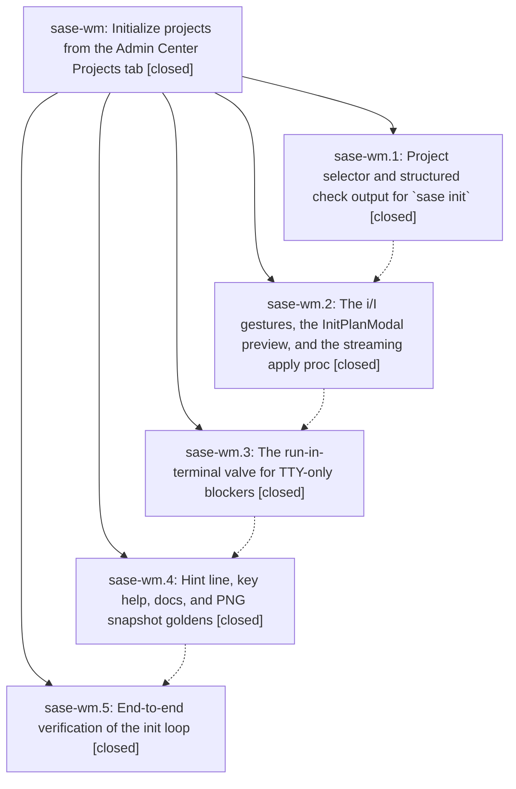

# Bead: sase-wm — Initialize projects from the Admin Center Projects tab

[Bead Pages](../README.md) / sase-wm

**Status:** ✓ closed · **Resolution:** done · **Type:** ▸ plan · **Tier:** epic
**Owner:** `bryanbugyi34@gmail.com` · **Created by:** [bbugyi200.apollo.e](https://github.com/sase-org/sase--agents/blob/main/families/bbugyi200.apollo.e.md) · **Assignee:** `sase-wm.land`
**Created:** 2026-09-04 11:58:54 EDT · **Closed:** 2026-09-05 02:01:45 EDT
**Plan:** [202609/projects\_tab\_init.md](https://github.com/sase-org/sase--plans/blob/main/202609/projects_tab_init.md)

<!-- sase:links:start -->

## Links

| Relation | Artifact | Why |
| --- | --- | --- |
| implemented-by | [plan:202609/projects_tab_init.md][1] | derived from the plan's `bead_id:` frontmatter field |

[1]: https://github.com/sase-org/sase--plans/blob/main/202609/projects_tab_init.md

<!-- sase:links:end -->

## Description

On the Admin Center Projects sub-tab, `i` initializes the marked or highlighted projects and `I` initializes every enabled project: each gesture plans off-thread via `sase init … --check --json`, shows a preview modal with the exact argv, per-planner rows, warnings, blockers, and full diffs, and on confirm streams exactly one `sase init … --yes` proc into the Procs tab — with an honest "Run in terminal" valve for TTY-only steps.

## Notes

[2026-09-05T06:01:45Z · sase-wm.land] Landed by sase-wm.land. Verified all 5 phases: (1) cli — sase init -p/--project repeatable selector in the -a/-M mutually exclusive group, -j/--json on --check with schema_version=1, drift-vs-blocked status, requires_tty markers, shared serialize_init_plan with explicit actions_truncated (parser_init.py, init_plan.py; commit 07aa56095); (2) flow — i/I wired through all five keymap layers (default_config.yml, app_keymaps.py, metadata.py, sase.schema.json, _PROJECT_ONLY_ACTIONS), off-thread check proc, InitPlanModal, exactly one streaming apply proc with sase-init exclusive scope and dedup keys, both submit sites registered in _proc_producer_sites_actions.py (29ce9cd8b); (3) valve — sase-wm.3 was auto-closed by its stitch with no verification implied, so I verified its source directly: action_run_in_terminal suspends into interactive sase init scoped to the tty_blocked_projects subset without --yes, handles OSError/SuspendNotSupported, reloads on return, and apply toasts are parsed from the CLI's own summary line so held projects are never reported initialized (c018b7498 plus tests); (4) polish — hint line 'i init  I init all' (F-force segment dropped per note), key help, docs/ace.md + configuration.md + init.md + cli.md, six InitPlanModal PNG goldens (69b5463c3); (5) verify — just check-full completed with one unrelated flake that passed on isolated rerun (fab5ccc37). Integration: local master == origin/master at fab5ccc37; the ten non-epic commits since 07aa56095 all landed before the epic's last three commits, so the verify phase ran on the integrated tree; 2eb13350f (auto-refresh surface tokens) and 0927b1092 (axe status cache) touch app-level refresh paths only — the init flow reloads explicitly via action_reload_projects, no conflict or missed reuse. Follow-ups: sase-wm.5's monitor-start hang recorded as a DISCOVERED ISSUE note on epic sase-kp (owns the monitor-start/family-promotion machinery; possibly the sase-cl registry-scan class); its full-lane flake filed as new flake task sase-wv (ready) with related links to retired umbrella sase-ct per its close policy and to epic sase-j7. No --epic-symbol entries existed for sase-wm.

## Phases

| Bead | Title | Status | Size | Created | Agents | Commits |
|---|---|---|---|---|---:|---:|
| [sase-wm.1](sase-wm.1.md) | Project selector and structured check output for \`sase init\` | ✓ closed | medium | 2026-09-04 | 1 | 1 |
| [sase-wm.2](sase-wm.2.md) | The i/I gestures, the InitPlanModal preview, and the streaming apply proc | ✓ closed | large | 2026-09-04 | 1 | 1 |
| [sase-wm.3](sase-wm.3.md) | The run-in-terminal valve for TTY-only blockers | ✓ closed | small | 2026-09-04 | 1 | 1 |
| [sase-wm.4](sase-wm.4.md) | Hint line, key help, docs, and PNG snapshot goldens | ✓ closed | medium | 2026-09-04 | 1 | 1 |
| [sase-wm.5](sase-wm.5.md) | End-to-end verification of the init loop | ✓ closed | small | 2026-09-04 | 1 | 1 |

## Lineage

## Agents

| Agent | Bead | Commits |
|---|---|---:|
| [bbugyi200.apollo.sase-wm.1](https://github.com/sase-org/sase--agents/blob/main/agents/bbugyi200.apollo.sase-wm.1/README.md) | [sase-wm.1](sase-wm.1.md) | 1 |
| [bbugyi200.apollo.sase-wm.2](https://github.com/sase-org/sase--agents/blob/main/families/bbugyi200.apollo.sase-wm.2.md) | [sase-wm.2](sase-wm.2.md) | 1 |
| [bbugyi200.apollo.sase-wm.3](https://github.com/sase-org/sase--agents/blob/main/agents/bbugyi200.apollo.sase-wm.3/README.md) | [sase-wm.3](sase-wm.3.md) | 1 |
| [bbugyi200.apollo.sase-wm.4](https://github.com/sase-org/sase--agents/blob/main/agents/bbugyi200.apollo.sase-wm.4/README.md) | [sase-wm.4](sase-wm.4.md) | 1 |
| [bbugyi200.apollo.sase-wm.5](https://github.com/sase-org/sase--agents/blob/main/families/bbugyi200.apollo.sase-wm.5.md) | [sase-wm.5](sase-wm.5.md) | 1 |
| [bbugyi200.apollo.sase-wm.land](https://github.com/sase-org/sase--agents/blob/main/agents/bbugyi200.apollo.sase-wm.land/README.md) | [sase-wm](README.md) | 1 |

## Commits

| Repo | Commit | Subject | Bead | Committed |
|---|---|---|---|---|
| sase | [`07aa560`](https://github.com/sase-org/sase/commit/07aa560950bea6dfc99155071503bd0e18d093b5) | feat(init): add project selector and JSON check output | [sase-wm.1](sase-wm.1.md) | 2026-09-04 15:39:03 EDT |
| sase | [`29ce9cd`](https://github.com/sase-org/sase/commit/29ce9cd8b202e6bfe6c1716ad773c25542b31ddc) | feat(ace): add Projects tab i/I init plan modal and streaming apply | [sase-wm.2](sase-wm.2.md) | 2026-09-04 22:10:36 EDT |
| sase | [`c018b74`](https://github.com/sase-org/sase/commit/c018b74987ac18c8ebd34be720a1391db8dc3824) | feat(ace): add run-in-terminal valve for tty-blocked init plans | [sase-wm.3](sase-wm.3.md) | 2026-09-04 22:31:22 EDT |
| sase | [`69b5463`](https://github.com/sase-org/sase/commit/69b5463c35c750711c74baf7832a16a69dc11ee8) | feat(ace): document Projects init keys and pin InitPlanModal goldens | [sase-wm.4](sase-wm.4.md) | 2026-09-04 23:26:06 EDT |
| sase | [`fab5ccc`](https://github.com/sase-org/sase/commit/fab5ccc370b842f7a9dfb27c1b0102c4737db849) | test(tui): verify projects init loop | [sase-wm.5](sase-wm.5.md) | 2026-09-05 01:47:48 EDT |
| sase--plans | [`sase--plans@256055e`](https://github.com/sase-org/sase--plans/commit/256055e28ed05ce01fef623567347a35d09f8e4f) | docs(plans): mark projects\_tab\_init epic plan done (sase-wm landed) | [sase-wm](README.md) | 2026-09-05 02:04:02 EDT |
