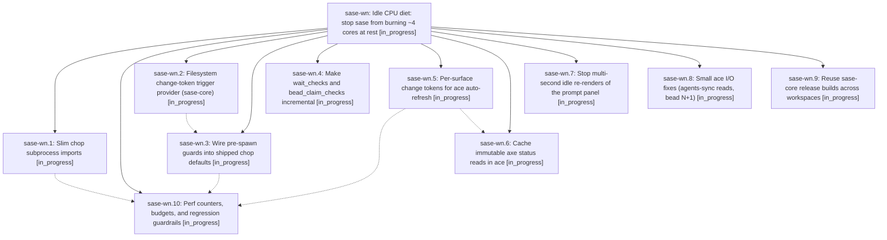

# Bead: sase-wn — Idle CPU diet: stop sase from burning ~4 cores at rest

[Bead Pages](../README.md) / sase-wn

**Status:** ◐ in_progress · **Type:** ▸ plan · **Tier:** epic
**Owner:** `bryanbugyi34@gmail.com` · **Created by:** `bbugyi200.kellys_mbp.o.f0` · **Assignee:** `sase-wn.land`
**Created:** 2026-09-04 12:10:57 EDT
**Plan:** [202609/sase\_idle\_cpu\_diet.md](https://github.com/sase-org/sase--plans/blob/main/202609/sase_idle_cpu_diet.md)

<!-- sase:links:start -->

## Links

| Relation | Artifact | Why |
| --- | --- | --- |
| implemented-by | [plan:202609/sase_idle_cpu_diet.md][1] | derived from the plan's `bead_id:` frontmatter field |

[1]: https://github.com/sase-org/sase--plans/blob/main/202609/sase_idle_cpu_diet.md

<!-- sase:links:end -->

## Description

An idle sase host (ace open, lumberjacks running, no agent work) drops from roughly four sustained cores of sase CPU to well under half a core — by eliminating per-chop interpreter boot waste, skipping chop subprocess spawns when their inputs are provably unchanged, replacing ace's unconditional full-disk refresh with cheap per-surface change tokens, caching immutable axe status reads, and reusing one sase-core release build across workspaces — all without changing chop cadence, subprocess isolation, timeout semantics, or user-visible TUI freshness.

## Phases

| Bead | Title | Status | Size | Created | Agents | Commits |
|---|---|---|---|---|---:|---:|
| [sase-wn.1](sase-wn.1.md) | Slim chop subprocess imports | ◐ in_progress | medium | 2026-09-04 | 1 | 0 |
| [sase-wn.10](sase-wn.10.md) | Perf counters, budgets, and regression guardrails | ◐ in_progress | medium | 2026-09-04 | 1 | 0 |
| [sase-wn.2](sase-wn.2.md) | Filesystem change-token trigger provider (sase-core) | ◐ in_progress | medium | 2026-09-04 | 1 | 1 |
| [sase-wn.3](sase-wn.3.md) | Wire pre-spawn guards into shipped chop defaults | ◐ in_progress | medium | 2026-09-04 | 1 | 0 |
| [sase-wn.4](sase-wn.4.md) | Make wait\_checks and bead\_claim\_checks incremental | ◐ in_progress | medium | 2026-09-04 | 1 | 0 |
| [sase-wn.5](sase-wn.5.md) | Per-surface change tokens for ace auto-refresh | ◐ in_progress | large | 2026-09-04 | 1 | 0 |
| [sase-wn.6](sase-wn.6.md) | Cache immutable axe status reads in ace | ◐ in_progress | medium | 2026-09-04 | 1 | 0 |
| [sase-wn.7](sase-wn.7.md) | Stop multi-second idle re-renders of the prompt panel | ◐ in_progress | medium | 2026-09-04 | 1 | 0 |
| [sase-wn.8](sase-wn.8.md) | Small ace I/O fixes (agents-sync reads, bead N+1) | ◐ in_progress | small | 2026-09-04 | 1 | 0 |
| [sase-wn.9](sase-wn.9.md) | Reuse sase-core release builds across workspaces | ◐ in_progress | medium | 2026-09-04 | 1 | 0 |

## Lineage

## Agents

| Agent | Bead | Commits |
|---|---|---:|
| [bbugyi200.apollo.sase-wn.1](https://github.com/sase-org/sase--agents/blob/main/agents/bbugyi200.apollo.sase-wn.1/README.md) | [sase-wn.1](sase-wn.1.md) | 0 |
| [bbugyi200.apollo.sase-wn.10](https://github.com/sase-org/sase--agents/blob/main/agents/bbugyi200.apollo.sase-wn.10/README.md) | [sase-wn.10](sase-wn.10.md) | 0 |
| [bbugyi200.apollo.sase-wn.2](https://github.com/sase-org/sase--agents/blob/main/agents/bbugyi200.apollo.sase-wn.2/README.md) | [sase-wn.2](sase-wn.2.md) | 1 |
| [bbugyi200.apollo.sase-wn.3](https://github.com/sase-org/sase--agents/blob/main/agents/bbugyi200.apollo.sase-wn.3/README.md) | [sase-wn.3](sase-wn.3.md) | 0 |
| [bbugyi200.apollo.sase-wn.4](https://github.com/sase-org/sase--agents/blob/main/agents/bbugyi200.apollo.sase-wn.4/README.md) | [sase-wn.4](sase-wn.4.md) | 0 |
| [bbugyi200.apollo.sase-wn.5](https://github.com/sase-org/sase--agents/blob/main/agents/bbugyi200.apollo.sase-wn.5/README.md) | [sase-wn.5](sase-wn.5.md) | 0 |
| [bbugyi200.apollo.sase-wn.6](https://github.com/sase-org/sase--agents/blob/main/agents/bbugyi200.apollo.sase-wn.6/README.md) | [sase-wn.6](sase-wn.6.md) | 0 |
| [bbugyi200.apollo.sase-wn.7](https://github.com/sase-org/sase--agents/blob/main/agents/bbugyi200.apollo.sase-wn.7/README.md) | [sase-wn.7](sase-wn.7.md) | 0 |
| [bbugyi200.apollo.sase-wn.8](https://github.com/sase-org/sase--agents/blob/main/agents/bbugyi200.apollo.sase-wn.8/README.md) | [sase-wn.8](sase-wn.8.md) | 0 |
| [bbugyi200.apollo.sase-wn.9](https://github.com/sase-org/sase--agents/blob/main/agents/bbugyi200.apollo.sase-wn.9/README.md) | [sase-wn.9](sase-wn.9.md) | 0 |
| [bbugyi200.apollo.sase-wn.land](https://github.com/sase-org/sase--agents/blob/main/agents/bbugyi200.apollo.sase-wn.land/README.md) | [sase-wn](README.md) | 0 |

## Commits

| Repo | Commit | Subject | Bead | Committed |
|---|---|---|---|---|
| sase | [`3a48a4c`](https://github.com/sase-org/sase/commit/3a48a4c65b10d7a5e1aa777669fa258b2d5aa2d6) | feat(axe): add pluggable chop trigger provider policy with fs support | [sase-wn.2](sase-wn.2.md) | 2026-09-04 12:50:58 EDT |
