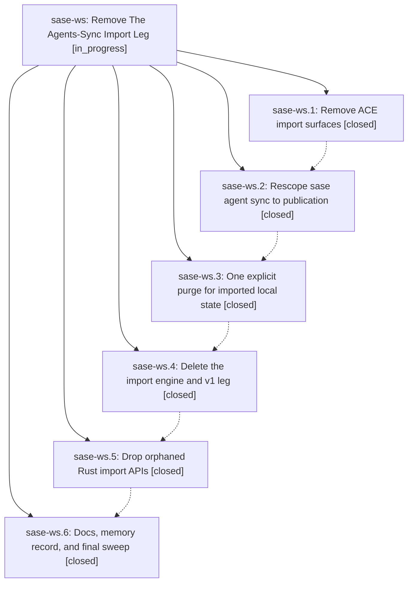

# Bead: sase-ws — Remove The Agents-Sync Import Leg

[Bead Pages](../README.md) / sase-ws

**Status:** ◐ in_progress · **Type:** ▸ plan · **Tier:** epic
**Owner:** `bryanbugyi34@gmail.com` · **Created by:** `bbugyi200.kellys_mbp.y` · **Assignee:** `sase-ws.land`
**Created:** 2026-09-04 13:48:25 EDT
**Plan:** [202609/remove\_agents\_sync\_import.md](https://github.com/sase-org/sase--plans/blob/main/202609/remove_agents_sync_import.md)

<!-- sase:links:start -->

## Links

| Relation | Artifact | Why |
| --- | --- | --- |
| implemented-by | [plan:202609/remove_agents_sync_import.md][1] | derived from the plan's `bead_id:` frontmatter field |
| related | [bead:sase-wy][2] | roughly half the bloated registry entries are v1 agents-sync imports from athena; epic sase-ws removes that import leg and bears on whether those entries can be GC'd |

[1]: https://github.com/sase-org/sase--plans/blob/main/202609/remove_agents_sync_import.md
[2]: https://github.com/sase-org/sase--beads/blob/main/pages/sase-wy/README.md

<!-- sase:links:end -->

## Description

Syncing agents from remote machines to local disk is completely removed: no import engine, no incoming cache, no ACE import surfaces, no import config keys, flags, docs, or memory references, and locally materialized imported state has one explicit cleanup path. The agents-sidecar publication leg (prompt archive, agent pages, provenance links, Referenced By write-backs) keeps working unchanged.

## Notes

[2026-09-04T23:31:51Z · sase-w8.4.land] DISCOVERED ISSUE: sase-ws.1 (61d72860a) removed the 'agents.cached' ProcProducerSite from src/sase/ace/tui/_proc_producer_sites_actions.py but did not update the hardcoded inventory count, so tests/ace/tui/test_proc_producer_inventory.py::test_inventory_records_infrastructure_and_classifications now fails with 'assert 42 == 43' at tests/ace/tui/test_proc_producer_inventory.py:317. Reproduced deterministically on clean master c0b741c93 with a freshly reinstalled venv, serially under -p no:randomly; independently observed earlier by phase agent sase-w8.4.1 in a separate full-suite run. This is a true failure, not a flake: the assertion compares len(PRODUCTION_PRODUCERS) against a literal. Fix belongs to this epic (change 43 -> 42, or to a computed expectation) since sase-ws.1 caused it. Reported by the sase-w8.4 land agent.

## Phases

| Bead | Title | Status | Size | Created | Agents | Commits |
|---|---|---|---|---|---:|---:|
| [sase-ws.1](sase-ws.1.md) | Remove ACE import surfaces | ✓ closed | large | 2026-09-04 | 0 | 1 |
| [sase-ws.2](sase-ws.2.md) | Rescope sase agent sync to publication | ✓ closed | medium | 2026-09-04 | 1 | 1 |
| [sase-ws.3](sase-ws.3.md) | One explicit purge for imported local state | ✓ closed | medium | 2026-09-04 | 1 | 1 |
| [sase-ws.4](sase-ws.4.md) | Delete the import engine and v1 leg | ✓ closed | large | 2026-09-04 | 1 | 1 |
| [sase-ws.5](sase-ws.5.md) | Drop orphaned Rust import APIs | ✓ closed | medium | 2026-09-04 | 1 | 2 |
| [sase-ws.6](sase-ws.6.md) | Docs, memory record, and final sweep | ✓ closed | medium | 2026-09-04 | 1 | 1 |

## Lineage

## Agents

| Agent | Bead | Commits |
|---|---|---:|
| [bbugyi200.apollo.sase-ws.3](https://github.com/sase-org/sase--agents/blob/main/agents/bbugyi200.apollo.sase-ws.3/README.md) | [sase-ws.3](sase-ws.3.md) | 1 |
| [bbugyi200.apollo.sase-ws.4](https://github.com/sase-org/sase--agents/blob/main/families/bbugyi200.apollo.sase-ws.4.md) | [sase-ws.4](sase-ws.4.md) | 1 |
| [bbugyi200.apollo.sase-ws.5](https://github.com/sase-org/sase--agents/blob/main/agents/bbugyi200.apollo.sase-ws.5/README.md) | [sase-ws.5](sase-ws.5.md) | 2 |
| [bbugyi200.apollo.sase-ws.6](https://github.com/sase-org/sase--agents/blob/main/agents/bbugyi200.apollo.sase-ws.6/README.md) | [sase-ws.6](sase-ws.6.md) | 1 |
| [bbugyi200.apollo.sase-ws.land](https://github.com/sase-org/sase--agents/blob/main/agents/bbugyi200.apollo.sase-ws.land/README.md) | [sase-ws](README.md) | 0 |
| [bbugyi200.kellys\_mbp.sase-ws.2](https://github.com/sase-org/sase--agents/blob/main/agents/bbugyi200.kellys_mbp.sase-ws.2/README.md) | [sase-ws.2](sase-ws.2.md) | 1 |

## Commits

| Repo | Commit | Subject | Bead | Committed |
|---|---|---|---|---|
| sase | [`61d7286`](https://github.com/sase-org/sase/commit/61d72860a1a8b636c0f8ec4e1a6d15d6172db054) | feat: Remove ACE agents-sync import surfaces (sase-ws.1) | [sase-ws.1](sase-ws.1.md) | 2026-09-04 14:58:26 EDT |
| sase | [`470442d`](https://github.com/sase-org/sase/commit/470442d3d828e720d99d44c7a0f305dfc225e3ff) | feat(agent-sync): make sync publication-only | [sase-ws.2](sase-ws.2.md) | 2026-09-05 06:13:38 EDT |
| sase | [`2a216ed`](https://github.com/sase-org/sase/commit/2a216eda9158cd57ed903d02e9ede93140f0753b) | feat(agents-sync): add purge-local-state command for incoming agent caches | [sase-ws.3](sase-ws.3.md) | 2026-09-05 11:22:21 EDT |
| sase | [`b5b3a98`](https://github.com/sase-org/sase/commit/b5b3a984f2fbe16909aa75e8007d43c35ea36681) | refactor(agents-sync): delete import engine | [sase-ws.4](sase-ws.4.md) | 2026-09-05 13:46:14 EDT |
| sase | [`3102527`](https://github.com/sase-org/sase/commit/3102527cd4464e881100bf663e9f2de095acf057) | refactor(agent-identity): drop legacy import facade APIs | [sase-ws.5](sase-ws.5.md) | 2026-09-05 15:22:59 EDT |
| sase-core | [`sase-core@1416679`](https://github.com/sase-org/sase-core/commit/141667964adeae1e7fa331303830463fee783801) | refactor(agent-identity): remove legacy import bindings | [sase-ws.5](sase-ws.5.md) | 2026-09-05 15:24:56 EDT |
| sase | [`302875c`](https://github.com/sase-org/sase/commit/302875cbc6d8d3fd7484e57012eff72db7c61e76) | docs(agents-sync): remove stale import-leg references, add decision records | [sase-ws.6](sase-ws.6.md) | 2026-09-05 16:26:36 EDT |
