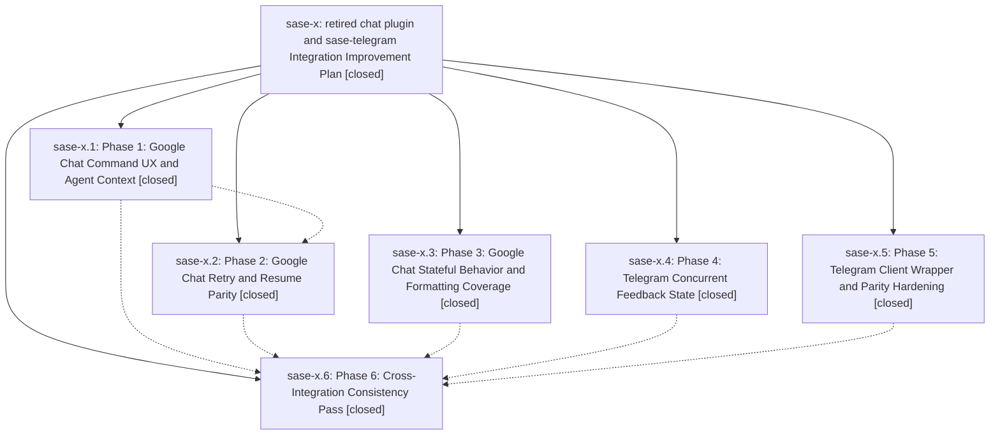

# Bead: sase-x — retired chat plugin and sase-telegram Integration Improvement Plan

[Bead Pages](../README.md) / sase-x

**Status:** ✓ closed · **Resolution:** (unrecorded) · **Type:** plan · **Tier:** epic
**Owner:** `bryanbugyi34@gmail.com`
**Created:** 2026-04-27 16:45:16 UTC · **Closed:** 2026-04-27 17:25:26 UTC
**Plan:** [202604/gchat\_telegram\_integration\_improvements.md](https://github.com/sase-org/sase--plans/blob/main/202604/gchat_telegram_integration_improvements.md)

## Phases

| Bead | Title | Status | Size | Agents | Commits |
|---|---|---|---|---:|---:|
| [sase-x.1](sase-x.1.md) | Phase 1: Google Chat Command UX and Agent Context | ✓ closed | small | 0 | 0 |
| [sase-x.2](sase-x.2.md) | Phase 2: Google Chat Retry and Resume Parity | ✓ closed | small | 0 | 0 |
| [sase-x.3](sase-x.3.md) | Phase 3: Google Chat Stateful Behavior and Formatting Coverage | ✓ closed | small | 0 | 0 |
| [sase-x.4](sase-x.4.md) | Phase 4: Telegram Concurrent Feedback State | ✓ closed | small | 0 | 0 |
| [sase-x.5](sase-x.5.md) | Phase 5: Telegram Client Wrapper and Parity Hardening | ✓ closed | small | 0 | 0 |
| [sase-x.6](sase-x.6.md) | Phase 6: Cross-Integration Consistency Pass | ✓ closed | small | 0 | 0 |

## Lineage

