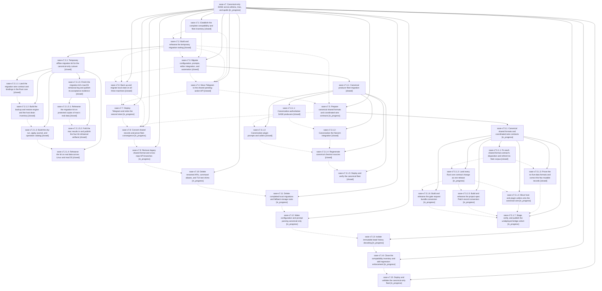

# Bead: sase-x7 — Canonical-only SASE across athena, mac, and apollo

[Bead Pages](../README.md) / sase-x7

**Status:** ◐ in_progress · **Type:** ▸ plan · **Tier:** epic
**Owner:** `bryanbugyi34@gmail.com` · **Created by:** [bbugyi200.athena.0gk](https://github.com/sase-org/sase--agents/blob/main/families/bbugyi200.athena.0gk.md) · **Assignee:** `sase-x7.land`
**Created:** 2026-09-05 18:55:26 EDT
**Plan:** [202609/canonical\_only\_fleet\_cutover.md](https://github.com/sase-org/sase--plans/blob/main/202609/canonical_only_fleet_cutover.md)

<!-- sase:links:start -->

## Links

| Relation | Artifact | Why |
| --- | --- | --- |
| implemented-by | [plan:202609/canonical_only_fleet_cutover.md][1] | derived from the plan's `bead_id:` frontmatter field |
| related | file:explicit:3e0b1dd6cf40c649ab155a23 | attached via sase artifact create --bead |

[1]: https://github.com/sase-org/sase--plans/blob/main/202609/canonical_only_fleet_cutover.md

<!-- sase:links:end -->

## Description

Migrate every fleet producer and live data store to canonical contracts, remove obsolete compatibility behavior from SASE and its coupled plugins, and verify the final installation on every machine while preserving historical records and a tested rollback.

## Notes

[2026-09-06T04:10:13Z · sase-x7.2.1.land] DISCOVERED ISSUE: the migration kit's 'procs-residue' operation cannot clear athena's real tasks.jsonl residue as scoped, because the canonical proc store keeps only a rolling recent window and every one of the 22 legacy rows is therefore unmatched. This is the kit refusing correctly, not a kit defect, but it means phase sase-x7.6 (local-state-cutover) inherits an unresolved residue class that needs either a human-verified manual archive path or a widened reconciliation rule in sase-core. Full evidence and the two options are recorded as a note on sase-x7.6. Found by sase-x7.2.1.4 on real athena data 2026-09-05; triaged here by sase-x7.2.1.land.

[2026-09-06T12:18:13Z · sase-x7.2.1.5.land] FOLLOW-UP ROUTING from child epic sase-x7.2.1.5: live core 0.32.23 on mac/apollo is a local-state-cutover precondition now recorded on sase-x7.6; Linux-hardcoded completion stamp targets in chezmoi source are canonical-producers work now recorded on sase-x7.3. The independent mac AXE stale-heartbeat/zero-runner-capacity defect became ready task sase-xd, related to sase-wd. No duplicate task beads were created for work already owned by this active epic.

[2026-09-06T12:19:01Z · sase-x7.2.1.5.land] FOLLOW-UP ROUTING from child epic sase-x7.2.1.5: live core 0.32.23 on mac/apollo is a local-state-cutover precondition now recorded on sase-x7.6; Linux-hardcoded completion stamp targets in chezmoi source are canonical-producers work now recorded on sase-x7.3. The independent mac AXE stale-heartbeat/zero-runner-capacity defect became ready task sase-xd, related to sase-wd. No duplicate task beads were created for work already owned by this active epic.

[2026-09-06T19:00:35Z · 0gu] TASK CONSOLIDATION from the owner-requested review of 57 notification-backed task beads (2026-09-06). Four existing tasks are being closed as superseded by this active epic, not as already fixed. Preserve these exact acceptance conditions in the epic ledger and final audit:

1. sase-vz -> local-state-cutover (sase-x7.6) / remove-layout-migrations (sase-x7.11): the Mac home has had BOTH ~/memory and ~/sase/memory, causing LayoutCollisionError even for project-only audited reads. Preserve unique prose, use the backed-up root migration, retire the alternative root/discovery, and prove project-only and home sase memory read work on the final host. Do not merely add another compatibility recovery branch.

2. sase-vg -> canonical-contracts (sase-x7.9) / remove-layout-migrations (sase-x7.11): inventory remove_vcs_workspace_claims in ace/tui/models/_dedup.py and its normalization caller, plus meta_workspace reconciliation in agent/workflow loaders, thinking session resolution and prompt-panel workflow rendering. These exist for the pre-sase-vd double-workspace shape. Canonicalize reachable historical metadata and preserve its information BEFORE deleting readers; do not retain a parallel cleanup task that races the fleet certificate.

3. sase-ca -> canonical-producers (sase-x7.3) / final guidance audit: audited generated_skills.md STILL has the Commit Skills per Runtime table and Gemini-only sase_hg_commit claim even though the skill source was deleted. Remove/rewrite the obsolete table and paragraphs through the memory workflow.

4. sase-se -> the same generated_skills.md update: the CLI/Skill Contract Synchronization section STILL says sase commit CLI arguments. It must name sase stitch create and the current source/caller/test synchronization contract. Preserve unrelated guidance and regenerate from the canonical landed source.

Ownership is consolidated under the already approved plan:202609/canonical_only_fleet_cutover.md, which explicitly requires root retirement and canonical generated_skills.md guidance. These four task closures must not be interpreted as verification that the underlying changes have landed.

[2026-09-06T19:10:35Z · 0gu--1] TASK CONSOLIDATION CORRECTION from the 57-task review: sase-se was assigned to its own worker and entered in_progress at 2026-09-06T18:54:09Z while the initial review was underway. The closure preflight correctly stopped. Withdraw the proposed superseded closure for sase-se; it remains open with its current owner. Incorporate or verify that worker result in the final generated_skills.md guidance audit. The earlier acceptance conditions and consolidation of sase-vz, sase-vg and sase-ca remain applicable.

[2026-09-06T19:30:56Z · 0gu--2] DISCOVERED ISSUE: During the owner-authorized 57-task notification review on athena at 2026-09-06 15:25 EDT, sase axe chop run bead_task_triage -V could not cancel stale task gate bead-task-triage-sase-cj-a255163035a8-g2: input_schema must equal the schema compiled from inputs. An exact sase gate show -i bead-task-triage-sase-cj-a255163035a8-g2 -k task_triage -j independently fails with conflicting_input_declaration at options[2].input_schema. Durable command/source evidence: file:explicit:378fad4a7a99ad2de9808462. Route this bundle to local-state-cutover sase-x7.6 and gate lifecycle acceptance: your approved canonical_only_fleet_cutover plan explicitly owns complete legacy gate bundle migration and preservation of pending actions, IDs, responses and cancellations. Do not hand-edit the request or fabricate a decision. No new duplicate legacy-migration task was created. A separate real snooze-factory closed_at keyword mismatch from the same chop is tracked by small task sase-xl. Neither defect belongs to the original 57-task cohort, whose 19 closures and exact reasons are fully verified with no residual TaskTriage notifications.

[2026-09-07T00:39:25Z · sase-xq.land] DISCOVERED ISSUE: The linked plan for epic sase-xq proposed retiring src/sase/bead/_project_store.py::_export's Python SQLite export_to_jsonl fallback because it can serialize canonical bead projections differently from Rust. Current master still catches AttributeError, ImportError, and ValueError from rust_beads.export_jsonl and silently writes issues.jsonl via Python. Evidence: file:explicit:3e0b1dd6cf40c649ab155a23. This is not caused by sase-xq; it is already causally owned by this canonical-only epic's explicit scope to remove Python mirrors of core behavior and old SQLite/JSONL fallbacks (especially phases sase-x7.11 and sase-x7.13). Preserve canonical cache rebuild behavior while removing the fallback and failing clearly on an incompatible core.

[2026-09-07T18:24:15Z · 03z] DISCOVERED ISSUE: sase-x7.4 is closed done but none of its code commits landed; workspace #29 is entangled with a foreign live agent and downstream phases are at risk.

What happened: the 2026-09-07 12:33 EDT run for sase-x7.4 (ace(run)-260907_123316) passed verification, closed the bead, and submitted commit decisions, but the commit finalizer failed with "second unresolved conflict in main". Root cause is a host bug, not phase work: the conflict-repair turn created a LaunchApproval gate at 13:01:37, the gate shell took workspace #29's claim (ledger caller_tag=gate-shell-create) and on settle at 13:01:44 released the workspace to the pool (gate-shell-settle) while the run was still alive mid-repair. Two unrelated runs were then allocated #29; the first one's workspace prep destroyed the paused rebase, and agent sase-xy.5.1 (still live in #29 as of 14:30 EDT) blocked any safe resume. A fix plan for the host bug has been proposed separately (gate shells must refuse creation from finalizer-owned turns and must not release a live creator's claim on settle).

Impact on this epic:
- Unlanded: main-repo commit 9759dd78c "feat(notifications): expose Rust-backed shared pending-action transport API" (recovered byte-exact by the repair turn), plus the matching sase-core and sase-telegram changes. Only beads/plans repo commits landed.
- Recovery data: paused-commit-recovery.tar (~/.sase/artifacts/agents/gh_sase-org__sase/20260907123316/paused-commit-recovery.tar-1ea23520b019.gz), the three verified wheels, deployment-note.md, and verification proof are all registered artifacts on sase-x7.4.
- Workspace #29 still holds the paused rebase (x7.4's staged resolution) interleaved with sase-xy.5.1's uncommitted work; do not reset it blindly.
- sase-x7.5 and sase-x7.7 depend on sase-x7.4 and will start from a master that lacks the transport API; they should not proceed (and sase-x7.land should not land) until the recovered commits are re-landed from the recovery bundle.

## Phases

| Bead | Title | Status | Size | Created | Agents | Commits |
|---|---|---|---|---|---:|---:|
| [sase-x7.1](sase-x7.1.md) | Establish the complete compatibility and fleet inventory | ✓ closed | medium | 2026-09-05 | 1 | 0 |
| [sase-x7.10](sase-x7.10.md) | Delete renamed APIs, command aliases, and TUI test shims | ◐ in_progress | medium | 2026-09-05 | 1 | 0 |
| [sase-x7.11](sase-x7.11.md) | Delete completed local migrations and fallback storage roots | ◐ in_progress | medium | 2026-09-05 | 1 | 0 |
| [sase-x7.12](sase-x7.12.md) | Make configuration and prompt parsing canonical-only | ◐ in_progress | large | 2026-09-05 | 1 | 0 |
| [sase-x7.13](sase-x7.13.md) | Isolate immutable bead history decoding | ◐ in_progress | medium | 2026-09-05 | 1 | 0 |
| [sase-x7.14](sase-x7.14.md) | Close the compatibility inventory and add regression enforcement | ◐ in_progress | medium | 2026-09-05 | 1 | 0 |
| [sase-x7.15](sase-x7.15.md) | Deploy and validate the canonical-only fleet | ◐ in_progress | medium | 2026-09-05 | 1 | 0 |
| [sase-x7.2](sase-x7.2.md) | Build and rehearse the temporary migration tooling | ✓ closed | large | 2026-09-05 | 1 | 0 |
| [sase-x7.3](sase-x7.3.md) | Migrate configuration, prompts, editor integration, and automation | ✓ closed | large | 2026-09-05 | 1 | 0 |
| [sase-x7.4](sase-x7.4.md) | Move Telegram to the shared pending-action API | ✓ closed | medium | 2026-09-05 | 1 | 2 |
| [sase-x7.5](sase-x7.5.md) | Prepare canonical shared formats and coordinated wire contracts | ◐ in_progress | large | 2026-09-05 | 1 | 0 |
| [sase-x7.6](sase-x7.6.md) | Back up and migrate local state on all three machines | ✓ closed | medium | 2026-09-05 | 1 | 0 |
| [sase-x7.7](sase-x7.7.md) | Deploy Telegram and retire the second store | ◐ in_progress | medium | 2026-09-05 | 1 | 0 |
| [sase-x7.8](sase-x7.8.md) | Convert shared records and prove fleet convergence | ◐ in_progress | medium | 2026-09-05 | 1 | 0 |
| [sase-x7.9](sase-x7.9.md) | Remove legacy shared-format and cross-repo API branches | ◐ in_progress | large | 2026-09-05 | 1 | 0 |

## Lineage

## Agents

| Agent | Bead | Commits |
|---|---|---:|
| [bbugyi200.athena.sase-x7.1](https://github.com/sase-org/sase--agents/blob/main/agents/bbugyi200.athena.sase-x7.1/README.md) | [sase-x7.1](sase-x7.1.md) | 0 |
| [bbugyi200.athena.sase-x7.10](https://github.com/sase-org/sase--agents/blob/main/agents/bbugyi200.athena.sase-x7.10/README.md) | [sase-x7.10](sase-x7.10.md) | 0 |
| [bbugyi200.athena.sase-x7.11](https://github.com/sase-org/sase--agents/blob/main/agents/bbugyi200.athena.sase-x7.11/README.md) | [sase-x7.11](sase-x7.11.md) | 0 |
| [bbugyi200.athena.sase-x7.12](https://github.com/sase-org/sase--agents/blob/main/agents/bbugyi200.athena.sase-x7.12/README.md) | [sase-x7.12](sase-x7.12.md) | 0 |
| [bbugyi200.athena.sase-x7.13](https://github.com/sase-org/sase--agents/blob/main/agents/bbugyi200.athena.sase-x7.13/README.md) | [sase-x7.13](sase-x7.13.md) | 0 |
| [bbugyi200.athena.sase-x7.14](https://github.com/sase-org/sase--agents/blob/main/agents/bbugyi200.athena.sase-x7.14/README.md) | [sase-x7.14](sase-x7.14.md) | 0 |
| [bbugyi200.athena.sase-x7.15](https://github.com/sase-org/sase--agents/blob/main/agents/bbugyi200.athena.sase-x7.15/README.md) | [sase-x7.15](sase-x7.15.md) | 0 |
| [bbugyi200.athena.sase-x7.2](https://github.com/sase-org/sase--agents/blob/main/families/bbugyi200.athena.sase-x7.2.md) | [sase-x7.2](sase-x7.2.md) | 0 |
| [bbugyi200.athena.sase-x7.2.1.1](https://github.com/sase-org/sase--agents/blob/main/agents/bbugyi200.athena.sase-x7.2.1.1/README.md) | [sase-x7.2.1.1](sase-x7.2.1.1.md) | 2 |
| [bbugyi200.athena.sase-x7.2.1.2](https://github.com/sase-org/sase--agents/blob/main/agents/bbugyi200.athena.sase-x7.2.1.2/README.md) | [sase-x7.2.1.2](sase-x7.2.1.2.md) | 1 |
| [bbugyi200.athena.sase-x7.2.1.3](https://github.com/sase-org/sase--agents/blob/main/families/bbugyi200.athena.sase-x7.2.1.3.md) | [sase-x7.2.1.3](sase-x7.2.1.3.md) | 1 |
| [bbugyi200.athena.sase-x7.2.1.4](https://github.com/sase-org/sase--agents/blob/main/agents/bbugyi200.athena.sase-x7.2.1.4/README.md) | [sase-x7.2.1.4](sase-x7.2.1.4.md) | 1 |
| [bbugyi200.athena.sase-x7.2.1.5.1](https://github.com/sase-org/sase--agents/blob/main/families/bbugyi200.athena.sase-x7.2.1.5.1.md) | [sase-x7.2.1.5.1](sase-x7.2.1.5.1.md) | 0 |
| [bbugyi200.athena.sase-x7.2.1.5.2](https://github.com/sase-org/sase--agents/blob/main/agents/bbugyi200.athena.sase-x7.2.1.5.2/README.md) | [sase-x7.2.1.5.2](sase-x7.2.1.5.2.md) | 0 |
| [bbugyi200.athena.sase-x7.2.1.5.land](https://github.com/sase-org/sase--agents/blob/main/families/bbugyi200.athena.sase-x7.2.1.5.land.md) | [sase-x7.2.1.5](sase-x7.2.1.5.md) | 0 |
| [bbugyi200.athena.sase-x7.2.1.land](https://github.com/sase-org/sase--agents/blob/main/families/bbugyi200.athena.sase-x7.2.1.land.md) | [sase-x7.2.1](sase-x7.2.1.md) | 0 |
| [bbugyi200.athena.sase-x7.3](https://github.com/sase-org/sase--agents/blob/main/families/bbugyi200.athena.sase-x7.3.md) | [sase-x7.3](sase-x7.3.md) | 0 |
| [bbugyi200.athena.sase-x7.3.1.1](https://github.com/sase-org/sase--agents/blob/main/agents/bbugyi200.athena.sase-x7.3.1.1/README.md) | [sase-x7.3.1.1](sase-x7.3.1.1.md) | 1 |
| [bbugyi200.athena.sase-x7.3.1.2](https://github.com/sase-org/sase--agents/blob/main/agents/bbugyi200.athena.sase-x7.3.1.2/README.md) | [sase-x7.3.1.2](sase-x7.3.1.2.md) | 0 |
| [bbugyi200.athena.sase-x7.3.1.3](https://github.com/sase-org/sase--agents/blob/main/agents/bbugyi200.athena.sase-x7.3.1.3/README.md) | [sase-x7.3.1.3](sase-x7.3.1.3.md) | 0 |
| [bbugyi200.athena.sase-x7.3.1.4](https://github.com/sase-org/sase--agents/blob/main/agents/bbugyi200.athena.sase-x7.3.1.4/README.md) | [sase-x7.3.1.4](sase-x7.3.1.4.md) | 0 |
| [bbugyi200.athena.sase-x7.3.1.5](https://github.com/sase-org/sase--agents/blob/main/families/bbugyi200.athena.sase-x7.3.1.5.md) | [sase-x7.3.1.5](sase-x7.3.1.5.md) | 0 |
| [bbugyi200.athena.sase-x7.3.1.land](https://github.com/sase-org/sase--agents/blob/main/families/bbugyi200.athena.sase-x7.3.1.land.md) | [sase-x7.3.1](sase-x7.3.1.md) | 0 |
| [bbugyi200.athena.sase-x7.4](https://github.com/sase-org/sase--agents/blob/main/families/bbugyi200.athena.sase-x7.4.md) | [sase-x7.4](sase-x7.4.md) | 1 |
| [bbugyi200.athena.sase-x7.5](https://github.com/sase-org/sase--agents/blob/main/families/bbugyi200.athena.sase-x7.5.md) | [sase-x7.5](sase-x7.5.md) | 0 |
| [bbugyi200.athena.sase-x7.5.1.1](https://github.com/sase-org/sase--agents/blob/main/agents/bbugyi200.athena.sase-x7.5.1.1/README.md) | [sase-x7.5.1.1](sase-x7.5.1.1.md) | 0 |
| [bbugyi200.athena.sase-x7.5.1.2](https://github.com/sase-org/sase--agents/blob/main/agents/bbugyi200.athena.sase-x7.5.1.2/README.md) | [sase-x7.5.1.2](sase-x7.5.1.2.md) | 1 |
| [bbugyi200.athena.sase-x7.5.1.3](https://github.com/sase-org/sase--agents/blob/main/agents/bbugyi200.athena.sase-x7.5.1.3/README.md) | [sase-x7.5.1.3](sase-x7.5.1.3.md) | 0 |
| [bbugyi200.athena.sase-x7.5.1.4](https://github.com/sase-org/sase--agents/blob/main/agents/bbugyi200.athena.sase-x7.5.1.4/README.md) | [sase-x7.5.1.4](sase-x7.5.1.4.md) | 0 |
| [bbugyi200.athena.sase-x7.5.1.5](https://github.com/sase-org/sase--agents/blob/main/agents/bbugyi200.athena.sase-x7.5.1.5/README.md) | [sase-x7.5.1.5](sase-x7.5.1.5.md) | 0 |
| [bbugyi200.athena.sase-x7.5.1.6](https://github.com/sase-org/sase--agents/blob/main/agents/bbugyi200.athena.sase-x7.5.1.6/README.md) | [sase-x7.5.1.6](sase-x7.5.1.6.md) | 0 |
| [bbugyi200.athena.sase-x7.5.1.7](https://github.com/sase-org/sase--agents/blob/main/agents/bbugyi200.athena.sase-x7.5.1.7/README.md) | [sase-x7.5.1.7](sase-x7.5.1.7.md) | 0 |
| [bbugyi200.athena.sase-x7.5.1.land](https://github.com/sase-org/sase--agents/blob/main/agents/bbugyi200.athena.sase-x7.5.1.land/README.md) | [sase-x7.5.1](sase-x7.5.1.md) | 0 |
| [bbugyi200.athena.sase-x7.6](https://github.com/sase-org/sase--agents/blob/main/agents/bbugyi200.athena.sase-x7.6/README.md) | [sase-x7.6](sase-x7.6.md) | 0 |
| [bbugyi200.athena.sase-x7.7](https://github.com/sase-org/sase--agents/blob/main/agents/bbugyi200.athena.sase-x7.7/README.md) | [sase-x7.7](sase-x7.7.md) | 0 |
| [bbugyi200.athena.sase-x7.8](https://github.com/sase-org/sase--agents/blob/main/agents/bbugyi200.athena.sase-x7.8/README.md) | [sase-x7.8](sase-x7.8.md) | 0 |
| [bbugyi200.athena.sase-x7.9](https://github.com/sase-org/sase--agents/blob/main/agents/bbugyi200.athena.sase-x7.9/README.md) | [sase-x7.9](sase-x7.9.md) | 0 |
| [bbugyi200.athena.sase-x7.land](https://github.com/sase-org/sase--agents/blob/main/agents/bbugyi200.athena.sase-x7.land/README.md) | [sase-x7](README.md) | 0 |

## Commits

| Repo | Commit | Subject | Bead | Committed |
|---|---|---|---|---|
| sase | [`13ebfeb`](https://github.com/sase-org/sase/commit/13ebfeb061db13fbcc2bea86a83727da6f8398ef) | test(core): require migration bindings in floor checks | [sase-x7.2.1.1](sase-x7.2.1.1.md) | 2026-09-05 20:31:29 EDT |
| sase-core | [`sase-core@1bf6023`](https://github.com/sase-org/sase-core/commit/1bf602388722385460c48d244d1e1571840a8922) | feat(migration): add offline migration wire contract | [sase-x7.2.1.1](sase-x7.2.1.1.md) | 2026-09-05 20:37:56 EDT |
| sase | [`43164ea`](https://github.com/sase-org/sase/commit/43164eace6ba51bce0ec00065f645e1ab78feac6) | feat(migrate): add sase migrate backup/restore and G3 fleet inventory | [sase-x7.2.1.2](sase-x7.2.1.2.md) | 2026-09-05 21:40:14 EDT |
| sase | [`bea92ce`](https://github.com/sase-org/sase/commit/bea92ce9287cec7250384a1fe88ba4fdcca4932b) | feat(migration-kit): add driver operation catalog | [sase-x7.2.1.3](sase-x7.2.1.3.md) | 2026-09-05 23:06:11 EDT |
| sase | [`16153bf`](https://github.com/sase-org/sase/commit/16153bf5606f085fcd1b13b58b188cb7eb4af954) | test(migration-kit): rehearse remaining synthetic edge-case matrix | [sase-x7.2.1.4](sase-x7.2.1.4.md) | 2026-09-05 23:53:32 EDT |
| sase | [`caa7917`](https://github.com/sase-org/sase/commit/caa7917ac966141b5cd6757e89ca245710e95950) | feat(cli): canonicalize host producers for the fleet cutover | [sase-x7.3.1.1](sase-x7.3.1.1.md) | 2026-09-06 09:54:28 EDT |
| sase | [`e0c5755`](https://github.com/sase-org/sase/commit/e0c5755033ff0e17c5b306a6c703901ada67b1f4) | feat(notifications): expose Rust-backed shared pending-action transport API | [sase-x7.4](sase-x7.4.md) | 2026-09-07 16:50:21 EDT |
| sase-core | [`sase-core@f7852f5`](https://github.com/sase-org/sase-core/commit/f7852f54f2b2962b71b7692f71d3ef699ddafd1d) | feat: Move Telegram to the shared pending-action API (sase-x7.4) | [sase-x7.4](sase-x7.4.md) | 2026-09-07 16:54:26 EDT |
| sase-core | [`sase-core@02a1725`](https://github.com/sase-org/sase-core/commit/02a172567b30e697fedf517b29f58e4a9349a895) | feat(core): land native PatchWire parser and shared-format conversion contracts | [sase-x7.5.1.2](sase-x7.5.1.2.md) | 2026-09-10 07:07:08 EDT |
