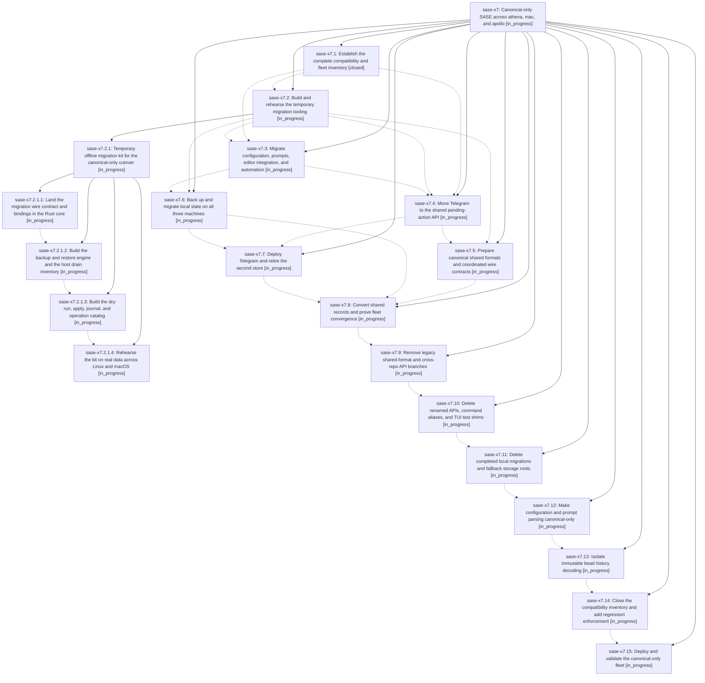

# Bead: sase-x7 — Canonical-only SASE across athena, mac, and apollo

[Bead Pages](../README.md) / sase-x7

**Status:** ◐ in_progress · **Type:** ▸ plan · **Tier:** epic
**Owner:** `bryanbugyi34@gmail.com` · **Created by:** [bbugyi200.athena.0gk](https://github.com/sase-org/sase--agents/blob/main/families/bbugyi200.athena.0gk.md) · **Assignee:** `sase-x7.land`
**Created:** 2026-09-05 18:55:26 EDT
**Plan:** [202609/canonical\_only\_fleet\_cutover.md](https://github.com/sase-org/sase--plans/blob/main/202609/canonical_only_fleet_cutover.md)

<!-- sase:links:start -->

## Links

| Relation | Artifact | Why |
| --- | --- | --- |
| implemented-by | [plan:202609/canonical_only_fleet_cutover.md][1] | derived from the plan's `bead_id:` frontmatter field |

[1]: https://github.com/sase-org/sase--plans/blob/main/202609/canonical_only_fleet_cutover.md

<!-- sase:links:end -->

## Description

Migrate every fleet producer and live data store to canonical contracts, remove obsolete compatibility behavior from SASE and its coupled plugins, and verify the final installation on every machine while preserving historical records and a tested rollback.

## Phases

| Bead | Title | Status | Size | Created | Agents | Commits |
|---|---|---|---|---|---:|---:|
| [sase-x7.1](sase-x7.1.md) | Establish the complete compatibility and fleet inventory | ✓ closed | medium | 2026-09-05 | 1 | 0 |
| [sase-x7.10](sase-x7.10.md) | Delete renamed APIs, command aliases, and TUI test shims | ◐ in_progress | medium | 2026-09-05 | 1 | 0 |
| [sase-x7.11](sase-x7.11.md) | Delete completed local migrations and fallback storage roots | ◐ in_progress | medium | 2026-09-05 | 1 | 0 |
| [sase-x7.12](sase-x7.12.md) | Make configuration and prompt parsing canonical-only | ◐ in_progress | large | 2026-09-05 | 1 | 0 |
| [sase-x7.13](sase-x7.13.md) | Isolate immutable bead history decoding | ◐ in_progress | medium | 2026-09-05 | 1 | 0 |
| [sase-x7.14](sase-x7.14.md) | Close the compatibility inventory and add regression enforcement | ◐ in_progress | medium | 2026-09-05 | 1 | 0 |
| [sase-x7.15](sase-x7.15.md) | Deploy and validate the canonical-only fleet | ◐ in_progress | medium | 2026-09-05 | 1 | 0 |
| [sase-x7.2](sase-x7.2.md) | Build and rehearse the temporary migration tooling | ◐ in_progress | large | 2026-09-05 | 1 | 0 |
| [sase-x7.3](sase-x7.3.md) | Migrate configuration, prompts, editor integration, and automation | ◐ in_progress | large | 2026-09-05 | 1 | 0 |
| [sase-x7.4](sase-x7.4.md) | Move Telegram to the shared pending-action API | ◐ in_progress | medium | 2026-09-05 | 1 | 0 |
| [sase-x7.5](sase-x7.5.md) | Prepare canonical shared formats and coordinated wire contracts | ◐ in_progress | large | 2026-09-05 | 1 | 0 |
| [sase-x7.6](sase-x7.6.md) | Back up and migrate local state on all three machines | ◐ in_progress | medium | 2026-09-05 | 1 | 0 |
| [sase-x7.7](sase-x7.7.md) | Deploy Telegram and retire the second store | ◐ in_progress | medium | 2026-09-05 | 1 | 0 |
| [sase-x7.8](sase-x7.8.md) | Convert shared records and prove fleet convergence | ◐ in_progress | medium | 2026-09-05 | 1 | 0 |
| [sase-x7.9](sase-x7.9.md) | Remove legacy shared-format and cross-repo API branches | ◐ in_progress | large | 2026-09-05 | 1 | 0 |

## Lineage

## Agents

| Agent | Bead | Commits |
|---|---|---:|
| [bbugyi200.athena.sase-x7.1](https://github.com/sase-org/sase--agents/blob/main/agents/bbugyi200.athena.sase-x7.1/README.md) | [sase-x7.1](sase-x7.1.md) | 0 |
| [bbugyi200.athena.sase-x7.10](https://github.com/sase-org/sase--agents/blob/main/agents/bbugyi200.athena.sase-x7.10/README.md) | [sase-x7.10](sase-x7.10.md) | 0 |
| [bbugyi200.athena.sase-x7.11](https://github.com/sase-org/sase--agents/blob/main/agents/bbugyi200.athena.sase-x7.11/README.md) | [sase-x7.11](sase-x7.11.md) | 0 |
| [bbugyi200.athena.sase-x7.12](https://github.com/sase-org/sase--agents/blob/main/agents/bbugyi200.athena.sase-x7.12/README.md) | [sase-x7.12](sase-x7.12.md) | 0 |
| [bbugyi200.athena.sase-x7.13](https://github.com/sase-org/sase--agents/blob/main/agents/bbugyi200.athena.sase-x7.13/README.md) | [sase-x7.13](sase-x7.13.md) | 0 |
| [bbugyi200.athena.sase-x7.14](https://github.com/sase-org/sase--agents/blob/main/agents/bbugyi200.athena.sase-x7.14/README.md) | [sase-x7.14](sase-x7.14.md) | 0 |
| [bbugyi200.athena.sase-x7.15](https://github.com/sase-org/sase--agents/blob/main/agents/bbugyi200.athena.sase-x7.15/README.md) | [sase-x7.15](sase-x7.15.md) | 0 |
| [bbugyi200.athena.sase-x7.2](https://github.com/sase-org/sase--agents/blob/main/families/bbugyi200.athena.sase-x7.2.md) | [sase-x7.2](sase-x7.2.md) | 0 |
| [bbugyi200.athena.sase-x7.2.1.1](https://github.com/sase-org/sase--agents/blob/main/agents/bbugyi200.athena.sase-x7.2.1.1/README.md) | [sase-x7.2.1.1](sase-x7.2.1.1.md) | 1 |
| [bbugyi200.athena.sase-x7.2.1.2](https://github.com/sase-org/sase--agents/blob/main/agents/bbugyi200.athena.sase-x7.2.1.2/README.md) | [sase-x7.2.1.2](sase-x7.2.1.2.md) | 0 |
| [bbugyi200.athena.sase-x7.2.1.3](https://github.com/sase-org/sase--agents/blob/main/agents/bbugyi200.athena.sase-x7.2.1.3/README.md) | [sase-x7.2.1.3](sase-x7.2.1.3.md) | 0 |
| [bbugyi200.athena.sase-x7.2.1.4](https://github.com/sase-org/sase--agents/blob/main/agents/bbugyi200.athena.sase-x7.2.1.4/README.md) | [sase-x7.2.1.4](sase-x7.2.1.4.md) | 0 |
| [bbugyi200.athena.sase-x7.2.1.land](https://github.com/sase-org/sase--agents/blob/main/agents/bbugyi200.athena.sase-x7.2.1.land/README.md) | [sase-x7.2.1](sase-x7.2.1.md) | 0 |
| [bbugyi200.athena.sase-x7.3](https://github.com/sase-org/sase--agents/blob/main/agents/bbugyi200.athena.sase-x7.3/README.md) | [sase-x7.3](sase-x7.3.md) | 0 |
| [bbugyi200.athena.sase-x7.4](https://github.com/sase-org/sase--agents/blob/main/agents/bbugyi200.athena.sase-x7.4/README.md) | [sase-x7.4](sase-x7.4.md) | 0 |
| [bbugyi200.athena.sase-x7.5](https://github.com/sase-org/sase--agents/blob/main/agents/bbugyi200.athena.sase-x7.5/README.md) | [sase-x7.5](sase-x7.5.md) | 0 |
| [bbugyi200.athena.sase-x7.6](https://github.com/sase-org/sase--agents/blob/main/agents/bbugyi200.athena.sase-x7.6/README.md) | [sase-x7.6](sase-x7.6.md) | 0 |
| [bbugyi200.athena.sase-x7.7](https://github.com/sase-org/sase--agents/blob/main/agents/bbugyi200.athena.sase-x7.7/README.md) | [sase-x7.7](sase-x7.7.md) | 0 |
| [bbugyi200.athena.sase-x7.8](https://github.com/sase-org/sase--agents/blob/main/agents/bbugyi200.athena.sase-x7.8/README.md) | [sase-x7.8](sase-x7.8.md) | 0 |
| [bbugyi200.athena.sase-x7.9](https://github.com/sase-org/sase--agents/blob/main/agents/bbugyi200.athena.sase-x7.9/README.md) | [sase-x7.9](sase-x7.9.md) | 0 |
| [bbugyi200.athena.sase-x7.land](https://github.com/sase-org/sase--agents/blob/main/agents/bbugyi200.athena.sase-x7.land/README.md) | [sase-x7](README.md) | 0 |

## Commits

| Repo | Commit | Subject | Bead | Committed |
|---|---|---|---|---|
| sase | [`13ebfeb`](https://github.com/sase-org/sase/commit/13ebfeb061db13fbcc2bea86a83727da6f8398ef) | test(core): require migration bindings in floor checks | [sase-x7.2.1.1](sase-x7.2.1.1.md) | 2026-09-05 20:31:29 EDT |
