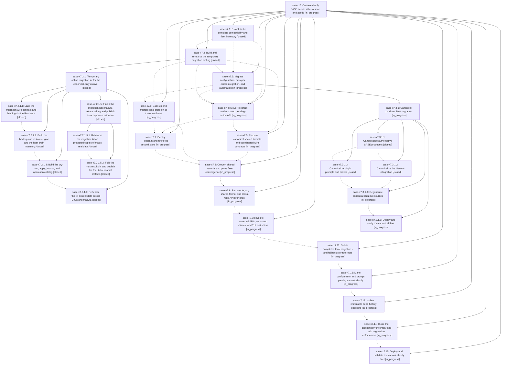

# Bead: sase-x7 — Canonical-only SASE across athena, mac, and apollo

[Bead Pages](../README.md) / sase-x7

**Status:** ◐ in_progress · **Type:** ▸ plan · **Tier:** epic
**Owner:** `bryanbugyi34@gmail.com` · **Created by:** [bbugyi200.athena.0gk](https://github.com/sase-org/sase--agents/blob/main/families/bbugyi200.athena.0gk.md) · **Assignee:** `sase-x7.land`
**Created:** 2026-09-05 18:55:26 EDT
**Plan:** [202609/canonical\_only\_fleet\_cutover.md](https://github.com/sase-org/sase--plans/blob/main/202609/canonical_only_fleet_cutover.md)

<!-- sase:links:start -->

## Links

| Relation | Artifact | Why |
| --- | --- | --- |
| implemented-by | [plan:202609/canonical_only_fleet_cutover.md][1] | derived from the plan's `bead_id:` frontmatter field |

[1]: https://github.com/sase-org/sase--plans/blob/main/202609/canonical_only_fleet_cutover.md

<!-- sase:links:end -->

## Description

Migrate every fleet producer and live data store to canonical contracts, remove obsolete compatibility behavior from SASE and its coupled plugins, and verify the final installation on every machine while preserving historical records and a tested rollback.

## Notes

[2026-09-06T04:10:13Z · sase-x7.2.1.land] DISCOVERED ISSUE: the migration kit's 'procs-residue' operation cannot clear athena's real tasks.jsonl residue as scoped, because the canonical proc store keeps only a rolling recent window and every one of the 22 legacy rows is therefore unmatched. This is the kit refusing correctly, not a kit defect, but it means phase sase-x7.6 (local-state-cutover) inherits an unresolved residue class that needs either a human-verified manual archive path or a widened reconciliation rule in sase-core. Full evidence and the two options are recorded as a note on sase-x7.6. Found by sase-x7.2.1.4 on real athena data 2026-09-05; triaged here by sase-x7.2.1.land.

[2026-09-06T12:18:13Z · sase-x7.2.1.5.land] FOLLOW-UP ROUTING from child epic sase-x7.2.1.5: live core 0.32.23 on mac/apollo is a local-state-cutover precondition now recorded on sase-x7.6; Linux-hardcoded completion stamp targets in chezmoi source are canonical-producers work now recorded on sase-x7.3. The independent mac AXE stale-heartbeat/zero-runner-capacity defect became ready task sase-xd, related to sase-wd. No duplicate task beads were created for work already owned by this active epic.

[2026-09-06T12:19:01Z · sase-x7.2.1.5.land] FOLLOW-UP ROUTING from child epic sase-x7.2.1.5: live core 0.32.23 on mac/apollo is a local-state-cutover precondition now recorded on sase-x7.6; Linux-hardcoded completion stamp targets in chezmoi source are canonical-producers work now recorded on sase-x7.3. The independent mac AXE stale-heartbeat/zero-runner-capacity defect became ready task sase-xd, related to sase-wd. No duplicate task beads were created for work already owned by this active epic.

## Phases

| Bead | Title | Status | Size | Created | Agents | Commits |
|---|---|---|---|---|---:|---:|
| [sase-x7.1](sase-x7.1.md) | Establish the complete compatibility and fleet inventory | ✓ closed | medium | 2026-09-05 | 1 | 0 |
| [sase-x7.10](sase-x7.10.md) | Delete renamed APIs, command aliases, and TUI test shims | ◐ in_progress | medium | 2026-09-05 | 1 | 0 |
| [sase-x7.11](sase-x7.11.md) | Delete completed local migrations and fallback storage roots | ◐ in_progress | medium | 2026-09-05 | 1 | 0 |
| [sase-x7.12](sase-x7.12.md) | Make configuration and prompt parsing canonical-only | ◐ in_progress | large | 2026-09-05 | 1 | 0 |
| [sase-x7.13](sase-x7.13.md) | Isolate immutable bead history decoding | ◐ in_progress | medium | 2026-09-05 | 1 | 0 |
| [sase-x7.14](sase-x7.14.md) | Close the compatibility inventory and add regression enforcement | ◐ in_progress | medium | 2026-09-05 | 1 | 0 |
| [sase-x7.15](sase-x7.15.md) | Deploy and validate the canonical-only fleet | ◐ in_progress | medium | 2026-09-05 | 1 | 0 |
| [sase-x7.2](sase-x7.2.md) | Build and rehearse the temporary migration tooling | ✓ closed | large | 2026-09-05 | 1 | 0 |
| [sase-x7.3](sase-x7.3.md) | Migrate configuration, prompts, editor integration, and automation | ◐ in_progress | large | 2026-09-05 | 1 | 0 |
| [sase-x7.4](sase-x7.4.md) | Move Telegram to the shared pending-action API | ◐ in_progress | medium | 2026-09-05 | 1 | 0 |
| [sase-x7.5](sase-x7.5.md) | Prepare canonical shared formats and coordinated wire contracts | ◐ in_progress | large | 2026-09-05 | 1 | 0 |
| [sase-x7.6](sase-x7.6.md) | Back up and migrate local state on all three machines | ◐ in_progress | medium | 2026-09-05 | 1 | 0 |
| [sase-x7.7](sase-x7.7.md) | Deploy Telegram and retire the second store | ◐ in_progress | medium | 2026-09-05 | 1 | 0 |
| [sase-x7.8](sase-x7.8.md) | Convert shared records and prove fleet convergence | ◐ in_progress | medium | 2026-09-05 | 1 | 0 |
| [sase-x7.9](sase-x7.9.md) | Remove legacy shared-format and cross-repo API branches | ◐ in_progress | large | 2026-09-05 | 1 | 0 |

## Lineage

## Agents

| Agent | Bead | Commits |
|---|---|---:|
| [bbugyi200.athena.sase-x7.1](https://github.com/sase-org/sase--agents/blob/main/agents/bbugyi200.athena.sase-x7.1/README.md) | [sase-x7.1](sase-x7.1.md) | 0 |
| [bbugyi200.athena.sase-x7.10](https://github.com/sase-org/sase--agents/blob/main/agents/bbugyi200.athena.sase-x7.10/README.md) | [sase-x7.10](sase-x7.10.md) | 0 |
| [bbugyi200.athena.sase-x7.11](https://github.com/sase-org/sase--agents/blob/main/agents/bbugyi200.athena.sase-x7.11/README.md) | [sase-x7.11](sase-x7.11.md) | 0 |
| [bbugyi200.athena.sase-x7.12](https://github.com/sase-org/sase--agents/blob/main/agents/bbugyi200.athena.sase-x7.12/README.md) | [sase-x7.12](sase-x7.12.md) | 0 |
| [bbugyi200.athena.sase-x7.13](https://github.com/sase-org/sase--agents/blob/main/agents/bbugyi200.athena.sase-x7.13/README.md) | [sase-x7.13](sase-x7.13.md) | 0 |
| [bbugyi200.athena.sase-x7.14](https://github.com/sase-org/sase--agents/blob/main/agents/bbugyi200.athena.sase-x7.14/README.md) | [sase-x7.14](sase-x7.14.md) | 0 |
| [bbugyi200.athena.sase-x7.15](https://github.com/sase-org/sase--agents/blob/main/agents/bbugyi200.athena.sase-x7.15/README.md) | [sase-x7.15](sase-x7.15.md) | 0 |
| [bbugyi200.athena.sase-x7.2](https://github.com/sase-org/sase--agents/blob/main/families/bbugyi200.athena.sase-x7.2.md) | [sase-x7.2](sase-x7.2.md) | 0 |
| [bbugyi200.athena.sase-x7.2.1.1](https://github.com/sase-org/sase--agents/blob/main/agents/bbugyi200.athena.sase-x7.2.1.1/README.md) | [sase-x7.2.1.1](sase-x7.2.1.1.md) | 2 |
| [bbugyi200.athena.sase-x7.2.1.2](https://github.com/sase-org/sase--agents/blob/main/agents/bbugyi200.athena.sase-x7.2.1.2/README.md) | [sase-x7.2.1.2](sase-x7.2.1.2.md) | 1 |
| [bbugyi200.athena.sase-x7.2.1.3](https://github.com/sase-org/sase--agents/blob/main/families/bbugyi200.athena.sase-x7.2.1.3.md) | [sase-x7.2.1.3](sase-x7.2.1.3.md) | 1 |
| [bbugyi200.athena.sase-x7.2.1.4](https://github.com/sase-org/sase--agents/blob/main/agents/bbugyi200.athena.sase-x7.2.1.4/README.md) | [sase-x7.2.1.4](sase-x7.2.1.4.md) | 1 |
| [bbugyi200.athena.sase-x7.2.1.5.1](https://github.com/sase-org/sase--agents/blob/main/families/bbugyi200.athena.sase-x7.2.1.5.1.md) | [sase-x7.2.1.5.1](sase-x7.2.1.5.1.md) | 0 |
| [bbugyi200.athena.sase-x7.2.1.5.2](https://github.com/sase-org/sase--agents/blob/main/agents/bbugyi200.athena.sase-x7.2.1.5.2/README.md) | [sase-x7.2.1.5.2](sase-x7.2.1.5.2.md) | 0 |
| [bbugyi200.athena.sase-x7.2.1.5.land](https://github.com/sase-org/sase--agents/blob/main/families/bbugyi200.athena.sase-x7.2.1.5.land.md) | [sase-x7.2.1.5](sase-x7.2.1.5.md) | 0 |
| [bbugyi200.athena.sase-x7.2.1.land](https://github.com/sase-org/sase--agents/blob/main/families/bbugyi200.athena.sase-x7.2.1.land.md) | [sase-x7.2.1](sase-x7.2.1.md) | 0 |
| [bbugyi200.athena.sase-x7.3](https://github.com/sase-org/sase--agents/blob/main/families/bbugyi200.athena.sase-x7.3.md) | [sase-x7.3](sase-x7.3.md) | 0 |
| [bbugyi200.athena.sase-x7.3.1.1](https://github.com/sase-org/sase--agents/blob/main/agents/bbugyi200.athena.sase-x7.3.1.1/README.md) | [sase-x7.3.1.1](sase-x7.3.1.1.md) | 1 |
| [bbugyi200.athena.sase-x7.3.1.2](https://github.com/sase-org/sase--agents/blob/main/agents/bbugyi200.athena.sase-x7.3.1.2/README.md) | [sase-x7.3.1.2](sase-x7.3.1.2.md) | 0 |
| [bbugyi200.athena.sase-x7.3.1.3](https://github.com/sase-org/sase--agents/blob/main/agents/bbugyi200.athena.sase-x7.3.1.3/README.md) | [sase-x7.3.1.3](sase-x7.3.1.3.md) | 1 |
| [bbugyi200.athena.sase-x7.3.1.4](https://github.com/sase-org/sase--agents/blob/main/agents/bbugyi200.athena.sase-x7.3.1.4/README.md) | [sase-x7.3.1.4](sase-x7.3.1.4.md) | 0 |
| [bbugyi200.athena.sase-x7.3.1.5](https://github.com/sase-org/sase--agents/blob/main/agents/bbugyi200.athena.sase-x7.3.1.5/README.md) | [sase-x7.3.1.5](sase-x7.3.1.5.md) | 0 |
| [bbugyi200.athena.sase-x7.3.1.land](https://github.com/sase-org/sase--agents/blob/main/agents/bbugyi200.athena.sase-x7.3.1.land/README.md) | [sase-x7.3.1](sase-x7.3.1.md) | 0 |
| [bbugyi200.athena.sase-x7.4](https://github.com/sase-org/sase--agents/blob/main/agents/bbugyi200.athena.sase-x7.4/README.md) | [sase-x7.4](sase-x7.4.md) | 0 |
| [bbugyi200.athena.sase-x7.5](https://github.com/sase-org/sase--agents/blob/main/agents/bbugyi200.athena.sase-x7.5/README.md) | [sase-x7.5](sase-x7.5.md) | 0 |
| [bbugyi200.athena.sase-x7.6](https://github.com/sase-org/sase--agents/blob/main/agents/bbugyi200.athena.sase-x7.6/README.md) | [sase-x7.6](sase-x7.6.md) | 0 |
| [bbugyi200.athena.sase-x7.7](https://github.com/sase-org/sase--agents/blob/main/agents/bbugyi200.athena.sase-x7.7/README.md) | [sase-x7.7](sase-x7.7.md) | 0 |
| [bbugyi200.athena.sase-x7.8](https://github.com/sase-org/sase--agents/blob/main/agents/bbugyi200.athena.sase-x7.8/README.md) | [sase-x7.8](sase-x7.8.md) | 0 |
| [bbugyi200.athena.sase-x7.9](https://github.com/sase-org/sase--agents/blob/main/agents/bbugyi200.athena.sase-x7.9/README.md) | [sase-x7.9](sase-x7.9.md) | 0 |
| [bbugyi200.athena.sase-x7.land](https://github.com/sase-org/sase--agents/blob/main/agents/bbugyi200.athena.sase-x7.land/README.md) | [sase-x7](README.md) | 0 |

## Commits

| Repo | Commit | Subject | Bead | Committed |
|---|---|---|---|---|
| sase | [`13ebfeb`](https://github.com/sase-org/sase/commit/13ebfeb061db13fbcc2bea86a83727da6f8398ef) | test(core): require migration bindings in floor checks | [sase-x7.2.1.1](sase-x7.2.1.1.md) | 2026-09-05 20:31:29 EDT |
| sase-core | [`sase-core@1bf6023`](https://github.com/sase-org/sase-core/commit/1bf602388722385460c48d244d1e1571840a8922) | feat(migration): add offline migration wire contract | [sase-x7.2.1.1](sase-x7.2.1.1.md) | 2026-09-05 20:37:56 EDT |
| sase | [`43164ea`](https://github.com/sase-org/sase/commit/43164eace6ba51bce0ec00065f645e1ab78feac6) | feat(migrate): add sase migrate backup/restore and G3 fleet inventory | [sase-x7.2.1.2](sase-x7.2.1.2.md) | 2026-09-05 21:40:14 EDT |
| sase | [`bea92ce`](https://github.com/sase-org/sase/commit/bea92ce9287cec7250384a1fe88ba4fdcca4932b) | feat(migration-kit): add driver operation catalog | [sase-x7.2.1.3](sase-x7.2.1.3.md) | 2026-09-05 23:06:11 EDT |
| sase | [`16153bf`](https://github.com/sase-org/sase/commit/16153bf5606f085fcd1b13b58b188cb7eb4af954) | test(migration-kit): rehearse remaining synthetic edge-case matrix | [sase-x7.2.1.4](sase-x7.2.1.4.md) | 2026-09-05 23:53:32 EDT |
| sase | [`caa7917`](https://github.com/sase-org/sase/commit/caa7917ac966141b5cd6757e89ca245710e95950) | feat(cli): canonicalize host producers for the fleet cutover | [sase-x7.3.1.1](sase-x7.3.1.1.md) | 2026-09-06 09:54:28 EDT |
| sase-github | [`sase-github@095181a`](https://github.com/sase-org/sase-github/commit/095181a338bd8295e7b450d341b238e587a0d78a) | refactor(workspace): canonicalize Patch imports and drop ChangeSpec facade | [sase-x7.3.1.3](sase-x7.3.1.3.md) | 2026-09-06 10:20:28 EDT |
