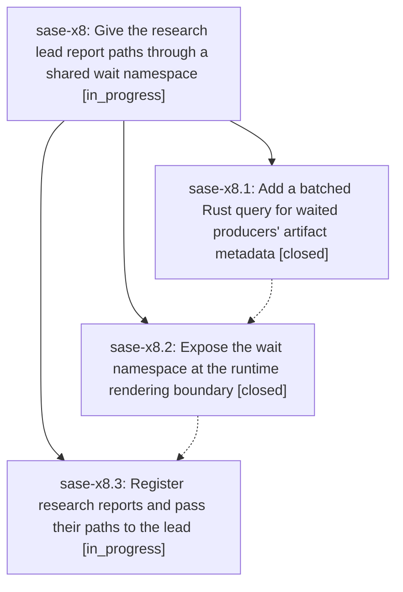

# Bead: sase-x8 — Give the research lead report paths through a shared wait namespace

[Bead Pages](../README.md) / sase-x8

**Status:** ◐ in_progress · **Type:** ▸ plan · **Tier:** epic
**Owner:** `bryanbugyi34@gmail.com` · **Created by:** [bbugyi200.athena.0gj.f0.f0](https://github.com/sase-org/sase--agents/blob/main/families/bbugyi200.athena.0gj.f0.f0.md) · **Assignee:** `sase-x8.land`
**Created:** 2026-09-05 19:26:19 EDT
**Plan:** [202609/wait\_artifacts.md](https://github.com/sase-org/sase--plans/blob/main/202609/wait_artifacts.md)

<!-- sase:links:start -->

## Links

| Relation | Artifact | Why |
| --- | --- | --- |
| implemented-by | [plan:202609/wait_artifacts.md][1] | derived from the plan's `bead_id:` frontmatter field |

[1]: https://github.com/sase-org/sase--plans/blob/main/202609/wait_artifacts.md

<!-- sase:links:end -->

## Description

Research leads receive their two predecessors' registered report paths without transcript discovery, using a generic wait.artifacts context alongside wait.chats with no additional artifact discovery for prompts that do not use it.

## Phases

| Bead | Title | Status | Size | Created | Agents | Commits |
|---|---|---|---|---|---:|---:|
| [sase-x8.1](sase-x8.1.md) | Add a batched Rust query for waited producers' artifact metadata | ✓ closed | medium | 2026-09-05 | 1 | 2 |
| [sase-x8.2](sase-x8.2.md) | Expose the wait namespace at the runtime rendering boundary | ✓ closed | medium | 2026-09-05 | 1 | 1 |
| [sase-x8.3](sase-x8.3.md) | Register research reports and pass their paths to the lead | ◐ in_progress | medium | 2026-09-05 | 1 | 0 |

## Lineage

## Agents

| Agent | Bead | Commits |
|---|---|---:|
| [bbugyi200.athena.sase-x8.1](https://github.com/sase-org/sase--agents/blob/main/agents/bbugyi200.athena.sase-x8.1/README.md) | [sase-x8.1](sase-x8.1.md) | 2 |
| [bbugyi200.athena.sase-x8.2](https://github.com/sase-org/sase--agents/blob/main/agents/bbugyi200.athena.sase-x8.2/README.md) | [sase-x8.2](sase-x8.2.md) | 1 |
| [bbugyi200.athena.sase-x8.3](https://github.com/sase-org/sase--agents/blob/main/agents/bbugyi200.athena.sase-x8.3/README.md) | [sase-x8.3](sase-x8.3.md) | 0 |
| [bbugyi200.athena.sase-x8.land](https://github.com/sase-org/sase--agents/blob/main/agents/bbugyi200.athena.sase-x8.land/README.md) | [sase-x8](README.md) | 0 |

## Commits

| Repo | Commit | Subject | Bead | Committed |
|---|---|---|---|---|
| sase | [`d64696c`](https://github.com/sase-org/sase/commit/d64696cce522d9a7a13f4304ac650c86d45be334) | feat(core): add exact-producer artifact-context query facade | [sase-x8.1](sase-x8.1.md) | 2026-09-05 20:30:14 EDT |
| sase-core | [`sase-core@84a4529`](https://github.com/sase-org/sase-core/commit/84a4529433ee1ebebcf180240fb4a7d9ac0a863f) | feat(artifact-file): add batched exact-producer artifact-context query | [sase-x8.1](sase-x8.1.md) | 2026-09-05 20:33:02 EDT |
| sase | [`f3b00cd`](https://github.com/sase-org/sase/commit/f3b00cd9f7a121cc7631bba46ead433066d36f84) | feat(xprompt): expose runtime wait context | [sase-x8.2](sase-x8.2.md) | 2026-09-05 22:04:45 EDT |
