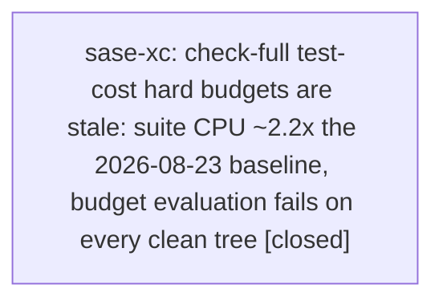

# Bead: sase-xc — check-full test-cost hard budgets are stale: suite CPU ~2.2x the 2026-08-23 baseline, budget evaluation fails on every clean tree

[Bead Pages](../README.md) / sase-xc

**Status:** ✓ closed · **Resolution:** done · **Type:** ◆ task · **Task type:** ⨯ bug · **+1 reports:** +7
**Owner:** `bryanbugyi34@gmail.com` · **Created by:** `bbugyi200.apollo.sase-ws.land--4` · **Assignee:** `sase-xc` · **Size:** medium
**Created:** 2026-09-06 00:28:43 EDT · **Closed:** 2026-09-09 11:28:58 EDT

<!-- sase:links:start -->

## Links

| Relation | Artifact | Why |
| --- | --- | --- |
| related | [bead:sase-v8][1] | sase-v8 cuts test-cost/coverage runtime; any suite-cost reduction it lands changes the correct new budget values for this rebaseline, so sequence the two deliberately. |
| related | [bead:sase-x4][2] | Same test-cost lane, different defect: sase-x4 hangs silently before budget evaluation (stuck cost-lease holder); sase-xc is a deterministic budget-evaluation failure after a clean run. |
| related | file:explicit:1fa997a5a5daf52abd86ea90 | attached via sase artifact create --bead |
| related | file:explicit:869cf6c70c31959e1f9dd178 | attached via sase artifact create --bead |
| related | file:explicit:cfdd2c7e9c2bc6a7137a14d8 | attached via sase artifact create --bead |
| related | file:explicit:efdd95a82bd265516514e3b9 | attached via sase artifact create --bead |

[1]: https://github.com/sase-org/sase--beads/blob/main/pages/sase-v8/README.md
[2]: https://github.com/sase-org/sase--beads/blob/main/pages/sase-x4/README.md

<!-- sase:links:end -->

## Description

Discovered by the sase-ws land agent while landing epic sase-ws (2026-09-06): `just check-full`'s test-cost budget evaluation now fails on every clean tree because the committed hard budgets are stale relative to ~2 weeks of suite growth, not because any current change regressed suite cost.

\## Root cause

`tests/perf/baselines/test_cost_budgets.json` was baselined in commit 22ece6b7c (2026-08-23, "commit per-cause cpu_limit budgets with provenance") and last adjusted in 623788895 (2026-08-28). Its hard limits — `total_file_cpu_seconds` 2100 (ceiling 2625 with the 25% cpu tolerance), per-cause `cpu_limit`s, `collection_cpu_seconds` 28, and `yaml_load.count_limit` 56000 with 0% tolerance — no longer fit the suite, which has grown to ~38,682 tests.

\## Evidence that this is pre-existing, not caused by any current tree

Recorded full-suite cost runs in `~/.sase/test-selection/gh_sase-org__sase/timings/cost/`:

| run | total_file_cpu_seconds | yaml_load count |
| --- | --- | --- |
| 20260903T230500Z (pre-landing) | 5681 | 55090 |
| 20260905T054351Z (pre-landing) | 5087 | 56186 |
| 20260906T041026Z (sase-ws landing attempt 4) | 4681 | 56006 |

Both pre-landing samples already exceeded the 2625 hard ceiling ~2x before epic sase-ws's landing attempts began, and the Sep 5 sample already exceeded the 56000 hard yaml_load count limit. The sase-ws attempt-4 tree measured LOWER than both pre-landing samples on every hard-failing cause (ace_page_enter cpu 1602 vs 1917/1701, textual_app_run_test_enter 1364 vs 1654/1445, parser_create 92 vs 103/101, yaml_load cpu 57.5 vs 67.6/61.3, subprocess_run 49.6 vs 66.5/56.3, collection 326 vs 407/379). In attempt 4 (monitor r55bzgpcyywb) the full suite was green — 38682 passed, 19 skipped, leak detector 0 poisonings, all lint gates green — and only the budget evaluation step failed (Justfile test-cost recipe, line 409) with 10 hard overages.

\## Remediation

Run a deliberate `--suggest` rebaseline cycle on a quiet host per the provenance notes inside `test_cost_budgets.json`. Those notes explicitly warn that `test_committed_pre_epic_baseline_still_fails_recalibrated_budgets` depends on the current parser_create/yaml_load limits still catching a historical regression, so the rebaseline must revisit that regression test (or its fixture) in the same change — this is why the fix was not done as a landing side-fix during sase-ws.

Distinct from sase-x4 (silent test-cost hang: cost lease holder stops heartbeating), which is a hang before any budget evaluation; this bead is a deterministic budget-evaluation failure after a clean, fully-recorded run. Related to sase-v8 (cutting test-cost/coverage CI runtime): work that shrinks suite cost would interact with the choice of new budget values.

---

\## Bug

- **Location:** `tests/perf/baselines/test_cost_budgets.json (evaluated by the Justfile test-cost recipe budget step, line ~409)`

Run 'just check-full' (or 'just test-cost') to completion on any current clean tree. The suite passes (38682 passed, leak detector 0 poisonings) and the budget evaluation then fails with ~10 hard overages, e.g. total_file_cpu_seconds actual ~4700-5700 vs budget 2100 + 25% tolerance (2625) and yaml_load.count 56006+ vs 56000 at 0% tolerance. Reproduced on three independent recordings: 20260903T230500Z, 20260905T054351Z, 20260906T041026Z.

check-full is the monitor-only landing gate (two-speed verification), so every epic landing now fails at test-cost even when tests, lints, and the leak gate are all green; land agents burn 1.5-2h monitor cycles per attempt and cannot obtain a literally-green gate.

## Notes

[2026-09-07T04:05:35Z · sase-xq.land.r0--2] CALIBRATION IN PROGRESS / sase-xq.land.r0--2: Applied the documented existing-key-only --suggest output from file:explicit:d496b0ff14235d9ac51905f2 to seven local hard CPU limits (total 2100->2400; ACE enter 740->830; settle 320->360; delay 290->320; subprocess 27->38; Textual enter 610->690; YAML 20->21). Every retained sample now passes hard budgets; all 42 tests/test_test_cost_budgets.py and tests/test_test_cost_committed_budgets.py tests pass, including historic parser/YAML baseline and per-metric doubled-cost rejection. No fixture edit, hard-enforcement change, count/RSS/wall increase, or tolerance adjustment. Full independent check-full rerun is still pending; this is not a done declaration. Code remains scoped to one JSON baseline file. The prior report includes another host and older twofold overages, so do not infer those conditions are reproduced or fixed solely from these athena samples.

[2026-09-07T05:35:11Z · sase-xq.land.r0--3] INDEPENDENT CALIBRATION RESULT / sase-xq.land.r0--3. Monitor 0h8bg1j5f8rp on main 272ebad82 and core 2fba6e4 produced a fresh 6-worker athena recording, 20260907T052823Z-2711740 (38,988 nodes), preserved as file:explicit:869cf6c70c31959e1f9dd178. Explicitly ran tools/check_test_cost_budgets --recording <that file> --report-advisories against the pending calibration: exit 0, every hard CPU/count/RSS budget passes, total CPU 2910.692 seconds. Wall-clock advisories remain. No further budget or tolerance changes. The full gate itself FAILED in two default cost-directory tests because this landing family's harness set SASE_TEST_COST_DIR globally; removed that harness override and both affected files now pass (19 tests). Full failed output is file:explicit:a0bca57238db1ec60d2e0ef7. This confirms the local calibration independently but does not close this task's broader older/other-host scope. Full integrated gate retry is still required.

[2026-09-07T06:29:25Z · sase-xq.land.r0--5] FULL CALIBRATION VERIFICATION / sase-xq.land.r0--5: monitor zxvt9tvkhjqy completed with exit 0 at 2026-09-07T06:19:09Z on main 34fb561dd plus the documented baseline changes and clean core 2fba6e4. All of just check-full passed, including the full test-cost lane, every hard budget and the flake baseline. Fresh athena recording 20260907T061714Z-4092563 reports total_file_cpu_seconds 2743.137; only wall advisories remain. Full retained output: file:explicit:a1a95625a24c66474d13f3bc. No further budget, tolerance, count, or RSS change. This completes the independent local calibration verification but leaves this task ready because its older roughly twofold overages and other-host scope are not established fixed.

[2026-09-08T00:31:27Z · 06k--4] The exact two recordings and tools/check_test_cost_budgets --suggest --history 8 output from the 06k continuation are preserved in file:explicit:efdd95a82bd265516514e3b9 (attached to this task).

[2026-09-09T15:28:58Z · sase-xc] Updated tests/perf/baselines/test_cost_budgets.json using tools/check_test_cost_budgets --suggest --history 8 over the 8 retained 2026-09-09 athena recordings; raised only ace_settle_pilot/parser_create/pilot_pause_delay hard CPU limits. Verified jq parse; tools/check_test_cost_budgets passes latest recording 20260909T143821Z-2284602 with advisories only; all 8 retained cost recordings pass hard budgets; pytest tests/test_test_cost_budgets.py tests/test_test_cost_committed_budgets.py: 42 passed; just check: passed, with scoped tests escalated to the full suite.

## +1 Evidence

> **+1** by `sase-x7.3.1.land--2` · 2026-09-06 17:01:11 EDT
> **Observed since:** 2026-09-06 16:56:27 EDT
>
> Independent landing reproduction from sase-x7.3.1.land: monitor z8agycb1n26h ran the supported 0.32.27 wheel on clean ae1f91fad, 2026-09-06 20:00:42Z-20:55:57Z. All 38,840 tests passed (13 skipped), all lint/SASE/plan gates passed; only test-cost evaluation stopped check-full. Athene 7-worker recording 20260906T205347Z-1224444: total_file_cpu_seconds 2702.870 > 2625 ceiling; ace_settle_pilot CPU 413.037 > 400; pilot_pause_delay CPU 363.199 > 362.5. Count/RSS gates passed. A separate contemporaneous 9-worker recording 20260906T204319Z-1470896 has total CPU 2703.455 and settle 404.630, whereas earlier same-day 14-worker recordings containing the producer change were 2451-2529 total CPU and passed those budgets. This corroborates existing full-lane budget sensitivity, not a canonical-producer source defect. Do not infer pure wall-clock contention or recalibrate from this single sample. No budgets or suppressions changed. Full command evidence file:explicit:dc2c02651bddaba4658afdc6.
>
> **References:** file:explicit:f4003f52b99267a503bf1f5b

> **+1** by `sase-xq.land.r0--2` · 2026-09-07 00:02:42 EDT
> **Observed since:** 2026-09-06 23:58:27 EDT
>
> Independent sase-xq landing reproduction: monitor 8ga912710568 on main 24ac549dd and core 93fe02b passed 38,961 Python tests (14 skipped), all Rust suites and lint/plan gates, then failed six hard CPU budgets. Athene 8-worker recording 20260907T035436Z-1201546: total CPU 2967.464 >2625; ace_page_enter 1027.887 >925; settle 444.740 >400; delay 399.929 >362.5; Textual enter 860.085 >762.5; YAML CPU 26.227 >25. Count and RSS gates passed. Eight retained local recordings (Sep 6 12:44Z to Sep 7 03:54Z, 7-14 workers, 38811-38974 nodes) include four total-CPU overages; ACE enter count remains exactly 711 throughout. Current failure is not pure wall-clock contention. Preserved all eight recordings and --suggest provenance in the attached artifact; full failed monitor evidence is file:explicit:d92859dff454ff5d20bdd068. Proceeding with the documented existing-key CPU-only recalibration as a landing prerequisite, retaining hard enforcement, count/RSS/wall limits, and historic/doubled-metric regression tests. No duplicate task created.
>
> **References:** file:explicit:d496b0ff14235d9ac51905f2

> **+1** by `019--3` · 2026-09-07 00:54:12 EDT
> **Observed since:** 2026-09-06 23:39:24 EDT
>
> Independent conflict-repair verification at main 272ebad82 with core 0.32.34: just check-full passed all lint/validation stages and 38,977 tests (14 skipped, zero global-state poisonings), then failed seven CPU budgets. Recording 20260907T045011Z-1983627: total 2961.450 >2625; ACE enter 1007.958 >925; settle 442.364 >400; parser 44.040 >42.5; delay 390.108 >362.5; Textual enter 799.661 >762.5; YAML 26.476 >25. Counts and RSS passed. Total CPU is slightly below the preceding 2967.464 sample; changed config/help test files together cost 0.631 CPU seconds. Core dependency/pin alignment and duplicate-key regression coverage do not account for the broad overages. Existing sase-xq calibration remains independently owned; no budgets or suppressions changed here.
>
> **References:** file:explicit:b663003900337a9a013cc8da

> **+1** by `sase-xy.4.land--1` · 2026-09-07 14:37:04 EDT
> **Observed since:** 2026-09-07 14:31:36 EDT
>
> Independent reproduction while landing epic sase-xy.4: monitor edyk2k68p7ej ran just check-full on clean 4b90cc9ee after both pager-link phases. All 39,232 tests passed (14 skipped), lint/validation completed, and only test-cost budget evaluation failed: causes.yaml_load.cpu=26.263653s exceeded the recalibrated 21.0s + 25% hard ceiling (26.250s) by 0.013653s. Count 55,040 stayed under 56,000; total file CPU 2614.271s stayed under its 3000s ceiling. A concurrent same-host recording at 18:17Z had the same dominant YAML-loading test count (test_vim_normal_key_containment: 5,238) at 3.897 CPU seconds versus this run's 5.632, while the current epic's pager tests do not call YAML loaders, supporting existing budget/host variance rather than a sase-xy.4 regression. The gate remains independently tracked by sase-xc; no budget was changed.
>
> **References:** file:explicit:1fa997a5a5daf52abd86ea90

> **+1** by `06k--4` · 2026-09-07 20:30:40 EDT
> **Observed since:** 2026-09-07 20:25:51 EDT
>
> Independent CI-repair verification: monitor z72z0msfpw7m on main 3fa3cdd92 with only core dependency pins and SDD Markdown formatting edits passed every lint gate and 39,396 tests (14 skipped), then failed only pilot_pause_delay CPU 401.097453s against the already recalibrated 400s ceiling. Total CPU 2801.114071s, count 14,551, and all count/RSS gates passed. Same-host retained record 20260907T234254Z-1780260 measured 389.741365s with count 14,471; the failed record is 20260908T002318Z-2496936. Only two records exist in the current sase cost store, so this is insufficient evidence to raise the budget. No budgets, tolerances, or suppressions changed. Full result: sase monitor show z72z0msfpw7m --all-lines. The cost snapshots and exact suggestion output are being preserved as an explicit artifact attached to this bead.

> **+1** by `sase-yt.land--1` · 2026-09-09 09:31:43 EDT
> **Observed since:** 2026-09-09 09:24:18 EDT
>
> Independent reproduction during sase-yt landing verification on clean main a1b08d06c (monitor p42rjgz2v8xf, 2026-09-09). All 39,956 tests passed with 14 skipped and zero global leak poisonings; check-full failed only at the established test-cost budget gate: ace_settle_pilot CPU 456.065 > 450 tolerated, parser_create CPU 44.413 > 43.750, and pilot_pause_delay CPU 403.697 > 400. The sase-yt implementation is confined to the linked chezmoi gateway unit/ignore rule and adds no SASE tests or ACE/parser/pilot code, so these aggregate overages are unrelated to that epic. No budgets were changed.
>
> **References:** file:explicit:cfdd2c7e9c2bc6a7137a14d8

> **+1** by `sase-yh.5.4.land` · 2026-09-09 11:03:37 EDT
> **Observed since:** 2026-09-09 10:58:17 EDT
>
> PROPOSED FOLLOW-UP disposition for proposing bead sase-yh.5.4.1 note #1: independently reproduced the existing stale/flapping test-cost hard-budget defect during monitored just check-full on the phase tree. All lints and 39,963 tests passed (14 skipped); only ace_settle_pilot, parser_create, and pilot_pause_delay CPU ceilings failed, while same-day retained records alternate pass/fail under stable call counts and another workspace was concurrently running the cost lane. This is unrelated to sase-yh.5.4's deadline-only source change and is an exact duplicate of sase-xc; no new task created.

## References

- file:explicit:f4003f52b99267a503bf1f5b
- file:explicit:d496b0ff14235d9ac51905f2
- file:explicit:b663003900337a9a013cc8da
- file:explicit:1fa997a5a5daf52abd86ea90
- file:explicit:cfdd2c7e9c2bc6a7137a14d8

## Lineage

## Agents

| Agent | Bead | Commits |
|---|---|---:|
| [bbugyi200.athena.sase-xc](https://github.com/sase-org/sase--agents/blob/main/agents/bbugyi200.athena.sase-xc/README.md) | [sase-xc](README.md) | 1 |

## Commits

| Repo | Commit | Subject | Bead | Committed |
|---|---|---|---|---|
| sase | [`e89b9e5`](https://github.com/sase-org/sase/commit/e89b9e522a4f89cbe68734861c65b3ba99a0a6c2) | fix(test-cost): recalibrate hard CPU budgets | [sase-xc](README.md) | 2026-09-09 11:30:27 EDT |
