# Bead: sase-xe — Remote dispatch and the Focus/Fleet agents experience

[Bead Pages](../README.md) / sase-xe

**Status:** ○ open · **Type:** ▸ plan · **Tier:** epic · **↺ Reopened:** ↺1
**Owner:** `bryanbugyi34@gmail.com` · **Created by:** [bbugyi200.athena.0gq](https://github.com/sase-org/sase--agents/blob/main/families/bbugyi200.athena.0gq.md) · **Assignee:** `sase-xe.land`
**Created:** 2026-09-06 14:06:39 EDT
**Plan:** [202609/remote\_dispatch\_fleet.md](https://github.com/sase-org/sase--plans/blob/main/202609/remote_dispatch_fleet.md)

## Previously Closed

> ↺ Closed 2026-09-08T01:11:58Z · done
>
> (none)
>
> Reopened 2026-09-09T01:00:46Z by `sase bead open`

<!-- sase:links:start -->

## Links

| Relation | Artifact | Why |
| --- | --- | --- |
| implemented-by | [plan:202609/remote_dispatch_fleet.md][1] | derived from the plan's `bead_id:` frontmatter field |
| related | [bead:sase-y9][2] | epic sase-xe landed the %dispatch directive vocabulary (50b1405f4) whose head produced two of the three promoting records |
| related | [bead:sase-ya][3] | Epic sase-xe shipped the remote dispatch feature this memory note must document; its plan and phase notes are the primary sources. |

_Plus 1 automatic references — see [Referenced By](#referenced-by)._

[1]: https://github.com/sase-org/sase--plans/blob/main/202609/remote_dispatch_fleet.md
[2]: https://github.com/sase-org/sase--beads/blob/main/pages/sase-y9/README.md
[3]: https://github.com/sase-org/sase--beads/blob/main/pages/sase-ya/README.md

<!-- sase:links:end -->

## Description

A user can enroll remote machines (Tailnet by default, plain HTTPS without Tailscale), launch agents on them with %dispatch:<machine>, browse every enrolled machine's agents in a new Fleet sub-view of the Agents tab, follow remote agents into the Focus sub-view, and manage followed remote agents (view, kill, retry, fork, answer questions, approve gates) with the same action vocabulary as local agents - all with zero added cost when no machines are configured and no event-loop stalls when a machine hangs.

## Notes

[2026-09-07T16:32:22Z · 03p.f1] DISCOVERED ISSUE: no in-TUI path to machine enrollment, so the Focus/Fleet strip is unreachable in the zero-machine state.

Reported by the user, who enabled the remote_dispatch flag from the TUI flag pane and saw no sub-tabs after restart. Two findings:

1. The strip is gated on enrollment, not on the flag, and that part is per spec. src/sase/ace/tui/actions/agents/_fleet.py:376 sets _agents_fleet_available from (config.hosts or config.diagnostics or projection.configured_host_count), and _update_agents_header (_fleet.py:457) hides #agents-header unless _fleet_mode_available(). With dispatch.machines empty, load_federation_config (src/sase/dispatch/federation/_hosts.py:91-104) returns early with no hosts AND no diagnostics, so all three inputs are empty. Plan lines 302 and the fleet-ui phase spec both call for exactly this ('rendered only when at least one machine is enrolled; before that, the tab is visually unchanged').

2. The discovery affordance the plan pairs with that hidden strip does not work in the state it exists for. Plan line 890 (fleet-ui scope) calls for a 'Connect a machine' command-menu action, and line 305 says it 'opens setup guidance'. The shipped app.connect_agent_machine command is titled 'Agents: show remote machine status' and is gated on ctx.selected_agent_remote (src/sase/ace/tui/commands/_availability_agents.py:117-118), which cannot be true until a machine is enrolled and a remote row is selected. Net effect: with zero machines the strip is hidden, the command menu offers nothing, and there is no in-TUI route to enrollment - the user must already know about 'sase machine add'.

Follow-up recorded on sase-xe.15 rather than filed as a task bead, at the user's direction.

[2026-09-07T19:47:08Z · sase-xe.7.f0] DISCOVERED ISSUE: sase-xe.7 is closed as done but has no stitch - its code agent was killed (2026-09-06 18:21 EDT) after closing the bead (18:00 EDT) but before host finalizers committed its work. git log --all --grep=sase-xe.7 finds no commit.

State of the phase deliverables on master:

1. Most of the content DID land, but under the sase-xe.8 stitch 09c93253d (feat(dispatch): add machine enrollment CLI, 21:02 EDT same day): src/sase/dispatch/providers.py (sase_dispatch pluggy hookspecs + builtin tailnet/https providers), config.py (dispatch: section with layer-aware parsing), credentials.py, models.py, the remote_dispatch flag registration in feature_flags/registry.py, and the sase.schema.json / default_config.yml updates. The xe.8 agent evidently swept the uncommitted xe.7 work into its own commit, so stitch attribution and plan links point at 202609/machine_cli_enrollment_1.md instead of 202609/dispatch_plugins.md.

2. Confirmed loss: tests/dispatch/test_dispatch.py - the suite the xe.7 close note cites as its verification evidence - never landed in any commit. tests/dispatch/ on master only has test_machine_service.py (from xe.8), so the provider hook/discovery/credential layer has no dedicated tests.

3. Not a gap: pyproject.toml has no sase_dispatch entry-points section, but builtin providers register in code (_BuiltinDispatchProviders in providers.py); the entry-point group is only for external plugins.

For the epic linter / land agent: audit master against plan:202609/dispatch_plugins.md and restore or recreate the missing dispatch test suite. Do not take the xe.7 close note verification claims at face value - they describe a workspace state that was never committed. Recorded at the user's direction; no fix attempted.

[2026-09-07T21:50:02Z · sase-xz.land--2] DISCOVERED ISSUE: the two %dispatch ACE/LSP parity nodes (tests/test_xprompt_directive_completion_parity.py::test_ace_and_lsp_include_dispatch_directive_when_enabled and ::test_ace_and_lsp_include_dispatch_machine_rows_when_enabled) were promoted over the reproducible-flake baseline by just check-full monitor 4fvbspmpxjw5 during the sase-xz landing, blocking that gate until they were baselined. Two of the three promoting full-lane records are at head 50b1405f4 (feat(dispatch): launch agents on remote machines), each co-failing test_dev_extension_exposes_every_collected_name and test_runtime_directive_vocabulary_matches_core_contract - the signature of an installed sase_core_rs or sase-xprompt-lsp older than the %dispatch vocabulary this epic added. The third record (20260907T163239Z-a0fcc5ade160-2351814) is a clean tree whose only co-failure is tests/main/test_parser_machine.py::test_machine_help_renders_sorted_subcommands_and_defaults_to_list, another dispatch-machine surface. Both nodes pass in isolation and passed the full test-cost lane on the sase-xz landing tree. Filed as ready flake task sase-y9, which links back here.

[2026-09-07T23:09:46Z · sase-xz.land--3] DISCOVERED ISSUE (follow-up to note #3, sharper root cause): the %dispatch flake family this epic's 50b1405f4 introduced is a stale-sase_core_rs-build failure, not an LSP or timing flake.

The sase-xz landing gate's third attempt promoted two more nodes over the reproducible-flake baseline, including tests/test_xprompt_directive_contract.py::test_runtime_directive_vocabulary_matches_core_contract. That node imports sase_core_rs directly and asserts the runtime directive vocabulary equals the core contract, including the literal "dispatch" keyword row. It has no LspSession, no subprocess and no async pilot, yet it co-fails with the ACE/LSP %dispatch parity nodes in all six promoting full-run records (workspaces sase_27, sase_34, sase_12, sase_29, sase_30). The only shared ingredient is a compiled sase_core_rs whose directive contract predates 50b1405f4.

Practical consequence for this epic: any workspace that runs the suite without rebuilding the extension after 50b1405f4 fails these nodes deterministically, which reads as a flake to selection-health and blocks other agents' landing gates at `just selection-health --fail-on-new-flake`. Evidence and node list are on flake bead sase-y9.

[2026-09-07T23:13:11Z · 06c] DISCOVERED ISSUE: During x7.4 Telegram finalization repair at host 837b1634 with linked core 9dc37f4 / v0.32.40, host CARGO_TARGET_DIR=/tmp/sase35-cargo-target just check passed lint through Symvision and toobig, then escalated to the full scoped suite (core-identity-changed) and failed five xprompt directive contract/parity nodes after 39,377 passes. A targeted rerun of the same five nodes failed deterministically. Key mismatch: sase_core_rs.directive_contract reports %dispatch with feature_flag remote_dispatch, while current host tests/ACE completion expect dispatch unflagged and visible after the sase-xe.15 flag-removal work. This is not caused by the Telegram adapter, pending-actions, or pager cleanup in the x7.4 finalization repair. Related but not duplicate: ready flake task sase-y9 covers stale-extension %dispatch parity promotions; this observation reproduces after rebuilding the extension and points at the core/host flag contract instead.

[2026-09-07T23:49:31Z · 06m--1] DISCOVERED ISSUE: the sase-xe.15 remote_dispatch flag removal (ac1ba1be9) landed only its Python half; the Rust core still gates %dispatch, so master is red across the boundary.

FOUND BY the 06m family while consuming `just check-full` monitor wtg57wkt2vza (landing gate for phase sase-y3.3, unrelated: hidden-clone artifact-link machine writes). That run was green except for 5 failures, all in this area:

  tests/test_xprompt_directive_contract.py::test_runtime_directive_vocabulary_matches_core_contract
  tests/test_xprompt_directive_completion_parity.py::test_ace_and_lsp_directive_name_rows_match
  tests/test_xprompt_directive_completion_parity.py::test_ace_and_lsp_include_dispatch_directive
  tests/test_xprompt_directive_completion_parity.py::test_ace_and_lsp_include_dispatch_machine_rows
  tests/test_xprompt_directive_completion_parity.py::test_ace_and_lsp_directive_argument_rows_match[%dispatch:]

DETERMINISTIC, NOT A FLAKE. All 5 reproduce in isolation on a clean checkout of master (a948dc25b): `pytest tests/test_xprompt_directive_contract.py::test_runtime_directive_vocabulary_matches_core_contract` fails in 2.5s, and the 4 parity nodes fail 4/4 in a 25-node single-file run.

ROOT CAUSE (cross-repo skew, per the rust_core_backend_boundary memory). ac1ba1be9 deleted the remote_dispatch Off branch in src/ and flipped the test to `assert contract['dispatch'].get('feature_flag') is None`, but the matching change was never made in sase-core. At sase-core HEAD 9dc37f4 (v0.32.40 -- the exact version installed here), crates/sase_core/src/editor/wire.rs:598 still reads `"dispatch" => Some("remote_dispatch")`. So:
  - directive_contract() reports feature_flag='remote_dispatch' -> the contract test fails;
  - the Rust LSP still gates dispatch rows behind a flag that is off in the test env, while the Python ACE side no longer gates -> parity diverges (LSP returns [], ACE returns the dispatch/'no matching remote machines' rows).

`just install` does NOT fix it: sase-core HEAD is the installed version, so a local rebuild reproduces the same gating. The fix belongs in sase-core (drop the dispatch arm from directive_feature_flag, update the LSP gating and its fixtures), then bump the sase-core-rs floor in pyproject.toml (currently >=0.32.34,<0.33.0).

IMPACT: this is the last non-green thing in check-full's test lane, so it blocks every landing agent that reaches it. It also means the sase-xp close note ('grep finds no remote_dispatch reference anywhere in src/ or tests/') verified only the sase repo -- the flag is still live in the Rust core.

RELATED: sase-y9 filed these same parity nodes as a flake ('pass in isolation'); that diagnosis does not hold on the current tree, and its node names (..._when_enabled) are the pre-ac1ba1be9 names that no longer exist.

[2026-09-08T00:07:04Z · sase-xe.land] LANDING PROGRESS (sase-xe.land, 2026-09-07): steps 1-2 verified and integrated; close deferred pending remaining epic work. State of this landing turn,

… and 9419 more characters

## Phases

| Bead | Title | Status | Size | Created | Agents | Commits |
|---|---|---|---|---|---:|---:|
| [sase-xe.1](sase-xe.1.md) | Bounded index-backed local listing reads | ✓ closed | medium | 2026-09-06 | 1 | 1 |
| [sase-xe.10](sase-xe.10.md) | Local federation worker and Python remote facade | ✓ closed | large | 2026-09-06 | 1 | 2 |
| [sase-xe.11](sase-xe.11.md) | Focus and Fleet sub-views of the Agents tab | ✓ closed | large | 2026-09-06 | 1 | 1 |
| [sase-xe.12](sase-xe.12.md) | The %dispatch directive and reliable remote launch | ✓ closed | large | 2026-09-06 | 1 | 2 |
| [sase-xe.13](sase-xe.13.md) | Remote lifecycle management parity | ✓ closed | large | 2026-09-06 | 1 | 2 |
| [sase-xe.14](sase-xe.14.md) | Remote questions, gates, and notification deduplication | ✓ closed | large | 2026-09-06 | 1 | 2 |
| [sase-xe.15](sase-xe.15.md) | Fleet-wide acceptance, flag removal, and polish | ✓ closed | medium | 2026-09-06 | 1 | 1 |
| [sase-xe.2](sase-xe.2.md) | Portable identity, resolved records, and operation contracts in sase-core | ✓ closed | large | 2026-09-06 | 1 | 2 |
| [sase-xe.3](sase-xe.3.md) | Split owner resolution from pure presentation in ACE loaders | ✓ closed | medium | 2026-09-06 | 1 | 1 |
| [sase-xe.4](sase-xe.4.md) | Authenticated enrollment and hardened gateway access | ✓ closed | large | 2026-09-06 | 1 | 1 |
| [sase-xe.5](sase-xe.5.md) | Bounded remote read protocol with recoverable events | ✓ closed | large | 2026-09-06 | 1 | 1 |
| [sase-xe.6](sase-xe.6.md) | Durable mutation journal and launch admission recovery | ✓ closed | large | 2026-09-06 | 0 | 0 |
| [sase-xe.7](sase-xe.7.md) | Dispatch provider plugin hooks, built-in providers, and config schema | ✓ closed | large | 2026-09-06 | 1 | 0 |
| [sase-xe.8](sase-xe.8.md) | sase machine CLI group and sase init enrollment | ✓ closed | large | 2026-09-06 | 1 | 1 |
| [sase-xe.9](sase-xe.9.md) | Durable follow subscriptions with family continuity | ✓ closed | medium | 2026-09-06 | 1 | 2 |

## Lineage

```mermaid
flowchart TD
    n0["sase-xe: Remote dispatch and the Focus/Fleet agents experience [open]"]
    n1["sase-xe.1: Bounded index-backed local listing reads [closed]"]
    n2["sase-xe.10: Local federation worker and Python remote facade [closed]"]
    n3["sase-xe.11: Focus and Fleet sub-views of the Agents tab [closed]"]
    n4["sase-xe.12: The %dispatch directive and reliable remote launch [closed]"]
    n5["sase-xe.13: Remote lifecycle management parity [closed]"]
    n6["sase-xe.14: Remote questions, gates, and notification deduplication [closed]"]
    n7["sase-xe.15: Fleet-wide acceptance, flag removal, and polish [closed]"]
    n8["sase-xe.16: Complete remote dispatch - target bootstrap, tailnet discovery, canonical machine init, and the live Apollo proof [in_progress]"]
    n9["sase-xe.16.1: Package the gateway, bind bootstrap issuance, advertise fleet protocol [closed]"]
    n10["sase-xe.16.10: Runbook plus live Athena-to-Apollo end-to-end proof [open]"]
    n11["sase-xe.16.11: Finish remote dispatch setup correctness and live acceptance [in_progress]"]
    n12["sase-xe.16.11.1: Put discovery and enrollment reconciliation policy in Rust [closed]"]
    n13["sase-xe.16.11.2: Share followed-family promotion decisions across frontends [in_progress]"]
    n14["sase-xe.16.11.3: Exercise actual deadlines, instance fencing, and bootstrap enrollment [in_progress]"]
    n15["sase-xe.16.11.4: Integrate shared policy, honest discovery, and durable activation [in_progress]"]
    n16["sase-xe.16.11.5: Complete the real Athena-to-Apollo workflow [in_progress]"]
    n17["sase-xe.16.2: Ratchet the core pin and dependency floor past the new surface [closed]"]
    n18["sase-xe.16.3: Target-local `sase machine bootstrap` and packaged-command resolution [closed]"]
    n19["sase-xe.16.4: Real builtin tailnet discovery with bounded probes and honest defaults [closed]"]
    n20["sase-xe.16.5: Third-party provider imports follow the finalizers trust model [closed]"]
    n21["sase-xe.16.6: Canonical `sase machine init` with real activation and honest outcomes [closed]"]
    n22["sase-xe.16.7: Offline fleet fixture and hidden-Fleet laziness regression tests [closed]"]
    n23["sase-xe.16.8: PNG snapshot coverage for Fleet and Focus states [closed]"]
    n24["sase-xe.16.9: Fleet benches under faults and the remaining failure-table tests [closed]"]
    n25["sase-xe.2: Portable identity, resolved records, and operation contracts in sase-core [closed]"]
    n26["sase-xe.3: Split owner resolution from pure presentation in ACE loaders [closed]"]
    n27["sase-xe.4: Authenticated enrollment and hardened gateway access [closed]"]
    n28["sase-xe.5: Bounded remote read protocol with recoverable events [closed]"]
    n29["sase-xe.6: Durable mutation journal and launch admission recovery [closed]"]
    n30["sase-xe.7: Dispatch provider plugin hooks, built-in providers, and config schema [closed]"]
    n31["sase-xe.8: sase machine CLI group and sase init enrollment [closed]"]
    n32["sase-xe.9: Durable follow subscriptions with family continuity [closed]"]
    n0 --> n1
    n0 --> n2
    n0 --> n3
    n0 --> n4
    n0 --> n5
    n0 --> n6
    n0 --> n7
    n0 --> n8
    n8 --> n9
    n8 --> n10
    n8 --> n11
    n11 --> n12
    n11 --> n13
    n11 --> n14
    n11 --> n15
    n11 --> n16
    n8 --> n17
    n8 --> n18
    n8 --> n19
    n8 --> n20
    n8 --> n21
    n8 --> n22
    n8 --> n23
    n8 --> n24
    n0 --> n25
    n0 --> n26
    n0 --> n27
    n0 --> n28
    n0 --> n29
    n0 --> n30
    n0 --> n31
    n0 --> n32
    n1 -.-> n26
    n2 -.-> n3
    n2 -.-> n4
    n3 -.-> n5
    n4 -.-> n5
    n5 -.-> n6
    n6 -.-> n7
    n9 -.-> n17
    n9 -.-> n18
    n12 -.-> n13
    n13 -.-> n14
    n14 -.-> n15
    n15 -.-> n16
    n17 -.-> n10
    n18 -.-> n10
    n19 -.-> n21
    n21 -.-> n10
    n22 -.-> n23
    n22 -.-> n24
    n25 -.-> n26
    n25 -.-> n27
    n25 -.-> n30
    n25 -.-> n32
    n26 -.-> n3
    n27 -.-> n28
    n27 -.-> n29
    n27 -.-> n31
    n28 -.-> n2
    n29 -.-> n4
    n30 -.-> n2
    n30 -.-> n31
    n31 -.-> n4
    n32 -.-> n3
```

## Agents

| Agent | Bead | Commits |
|---|---|---:|
| [bbugyi200.athena.sase-xe.1](https://github.com/sase-org/sase--agents/blob/main/agents/bbugyi200.athena.sase-xe.1/README.md) | [sase-xe.1](sase-xe.1.md) | 1 |
| [bbugyi200.athena.sase-xe.10](https://github.com/sase-org/sase--agents/blob/main/families/bbugyi200.athena.sase-xe.10.md) | [sase-xe.10](sase-xe.10.md) | 2 |
| [bbugyi200.athena.sase-xe.11](https://github.com/sase-org/sase--agents/blob/main/families/bbugyi200.athena.sase-xe.11.md) | [sase-xe.11](sase-xe.11.md) | 1 |
| [bbugyi200.athena.sase-xe.12](https://github.com/sase-org/sase--agents/blob/main/families/bbugyi200.athena.sase-xe.12.md) | [sase-xe.12](sase-xe.12.md) | 2 |
| [bbugyi200.athena.sase-xe.13](https://github.com/sase-org/sase--agents/blob/main/families/bbugyi200.athena.sase-xe.13.md) | [sase-xe.13](sase-xe.13.md) | 2 |
| [bbugyi200.athena.sase-xe.14](https://github.com/sase-org/sase--agents/blob/main/families/bbugyi200.athena.sase-xe.14.md) | [sase-xe.14](sase-xe.14.md) | 2 |
| [bbugyi200.athena.sase-xe.15](https://github.com/sase-org/sase--agents/blob/main/families/bbugyi200.athena.sase-xe.15.md) | [sase-xe.15](sase-xe.15.md) | 0 |
| [bbugyi200.athena.sase-xe.16.1](https://github.com/sase-org/sase--agents/blob/main/families/bbugyi200.athena.sase-xe.16.1.md) | [sase-xe.16.1](sase-xe.16.1.md) | 1 |
| [bbugyi200.athena.sase-xe.16.10](https://github.com/sase-org/sase--agents/blob/main/families/bbugyi200.athena.sase-xe.16.10.md) | [sase-xe.16.10](sase-xe.16.10.md) | 1 |
| [bbugyi200.athena.sase-xe.16.11.1](https://github.com/sase-org/sase--agents/blob/main/agents/bbugyi200.athena.sase-xe.16.11.1/README.md) | [sase-xe.16.11.1](sase-xe.16.11.1.md) | 1 |
| [bbugyi200.athena.sase-xe.16.11.2](https://github.com/sase-org/sase--agents/blob/main/agents/bbugyi200.athena.sase-xe.16.11.2/README.md) | [sase-xe.16.11.2](sase-xe.16.11.2.md) | 0 |
| [bbugyi200.athena.sase-xe.16.11.3](https://github.com/sase-org/sase--agents/blob/main/agents/bbugyi200.athena.sase-xe.16.11.3/README.md) | [sase-xe.16.11.3](sase-xe.16.11.3.md) | 0 |
| [bbugyi200.athena.sase-xe.16.11.4](https://github.com/sase-org/sase--agents/blob/main/agents/bbugyi200.athena.sase-xe.16.11.4/README.md) | [sase-xe.16.11.4](sase-xe.16.11.4.md) | 0 |
| [bbugyi200.athena.sase-xe.16.11.5](https://github.com/sase-org/sase--agents/blob/main/agents/bbugyi200.athena.sase-xe.16.11.5/README.md) | [sase-xe.16.11.5](sase-xe.16.11.5.md) | 0 |
| [bbugyi200.athena.sase-xe.16.11.land](https://github.com/sase-org/sase--agents/blob/main/agents/bbugyi200.athena.sase-xe.16.11.land/README.md) | [sase-xe.16.11](sase-xe.16.11.md) | 0 |
| [bbugyi200.athena.sase-xe.16.2](https://github.com/sase-org/sase--agents/blob/main/agents/bbugyi200.athena.sase-xe.16.2/README.md) | [sase-xe.16.2](sase-xe.16.2.md) | 1 |
| [bbugyi200.athena.sase-xe.16.3](https://github.com/sase-org/sase--agents/blob/main/agents/bbugyi200.athena.sase-xe.16.3/README.md) | [sase-xe.16.3](sase-xe.16.3.md) | 1 |
| [bbugyi200.athena.sase-xe.16.4](https://github.com/sase-org/sase--agents/blob/main/agents/bbugyi200.athena.sase-xe.16.4/README.md) | [sase-xe.16.4](sase-xe.16.4.md) | 1 |
| [bbugyi200.athena.sase-xe.16.5](https://github.com/sase-org/sase--agents/blob/main/agents/bbugyi200.athena.sase-xe.16.5/README.md) | [sase-xe.16.5](sase-xe.16.5.md) | 1 |
| [bbugyi200.athena.sase-xe.16.6](https://github.com/sase-org/sase--agents/blob/main/families/bbugyi200.athena.sase-xe.16.6.md) | [sase-xe.16.6](sase-xe.16.6.md) | 1 |
| [bbugyi200.athena.sase-xe.16.7](https://github.com/sase-org/sase--agents/blob/main/agents/bbugyi200.athena.sase-xe.16.7/README.md) | [sase-xe.16.7](sase-xe.16.7.md) | 1 |
| [bbugyi200.athena.sase-xe.16.8](https://github.com/sase-org/sase--agents/blob/main/agents/bbugyi200.athena.sase-xe.16.8/README.md) | [sase-xe.16.8](sase-xe.16.8.md) | 1 |
| [bbugyi200.athena.sase-xe.16.9](https://github.com/sase-org/sase--agents/blob/main/families/bbugyi200.athena.sase-xe.16.9.md) | [sase-xe.16.9](sase-xe.16.9.md) | 1 |
| [bbugyi200.athena.sase-xe.16.land](https://github.com/sase-org/sase--agents/blob/main/families/bbugyi200.athena.sase-xe.16.land.md) | [sase-xe.16](sase-xe.16.md) | 0 |
| [bbugyi200.athena.sase-xe.2](https://github.com/sase-org/sase--agents/blob/main/families/bbugyi200.athena.sase-xe.2.md) | [sase-xe.2](sase-xe.2.md) | 2 |
| [bbugyi200.athena.sase-xe.3](https://github.com/sase-org/sase--agents/blob/main/agents/bbugyi200.athena.sase-xe.3/README.md) | [sase-xe.3](sase-xe.3.md) | 1 |
| [bbugyi200.athena.sase-xe.4](https://github.com/sase-org/sase--agents/blob/main/families/bbugyi200.athena.sase-xe.4.md) | [sase-xe.4](sase-xe.4.md) | 1 |
| [bbugyi200.athena.sase-xe.5](https://github.com/sase-org/sase--agents/blob/main/families/bbugyi200.athena.sase-xe.5.md) | [sase-xe.5](sase-xe.5.md) | 1 |
| [bbugyi200.athena.sase-xe.7](https://github.com/sase-org/sase--agents/blob/main/families/bbugyi200.athena.sase-xe.7.md) | [sase-xe.7](sase-xe.7.md) | 0 |
| [bbugyi200.athena.sase-xe.8](https://github.com/sase-org/sase--agents/blob/main/families/bbugyi200.athena.sase-xe.8.md) | [sase-xe.8](sase-xe.8.md) | 1 |
| [bbugyi200.athena.sase-xe.9](https://github.com/sase-org/sase--agents/blob/main/agents/bbugyi200.athena.sase-xe.9/README.md) | [sase-xe.9](sase-xe.9.md) | 2 |
| [bbugyi200.athena.sase-xe.land](https://github.com/sase-org/sase--agents/blob/main/families/bbugyi200.athena.sase-xe.land.md) | [sase-xe](README.md) | 2 |

## Commits

| Repo | Commit | Subject | Bead | Committed |
|---|---|---|---|---|
| sase | [`27442bd`](https://github.com/sase-org/sase/commit/27442bd8e1fd96ed2e2f3b1b9a43bb27ab5e7d66) | test(fleet): cover portable contract bindings | [sase-xe.2](sase-xe.2.md) | 2026-09-06 16:10:16 EDT |
| sase-core | [`sase-core@ee7163e`](https://github.com/sase-org/sase-core/commit/ee7163e00d02a803afe4cdec3de1b00f577e16d4) | feat(fleet): add portable identity contracts | [sase-xe.2](sase-xe.2.md) | 2026-09-06 16:11:20 EDT |
| sase | [`8efecdd`](https://github.com/sase-org/sase/commit/8efecdd7390a0103f66ce7a3f4b54376a2079a63) | feat(agent-listing): use bounded index snapshots | [sase-xe.1](sase-xe.1.md) | 2026-09-06 16:25:23 EDT |
| sase-core | [`sase-core@f00ed92`](https://github.com/sase-org/sase-core/commit/f00ed92aa41f5bb0a94216b74031b38ac608824f) | feat(gateway): add fleet authentication | [sase-xe.4](sase-xe.4.md) | 2026-09-06 17:00:45 EDT |
| sase | [`fdfb4e2`](https://github.com/sase-org/sase/commit/fdfb4e238a386b5470a67025da8db1c30bc92e90) | feat(fleet): add durable follow store | [sase-xe.9](sase-xe.9.md) | 2026-09-06 17:59:43 EDT |
| sase-core | [`sase-core@7d382db`](https://github.com/sase-org/sase-core/commit/7d382db7d986a1e29ab6edc27689c6058b55ebf8) | feat(fleet): add follow reconciliation contracts | [sase-xe.9](sase-xe.9.md) | 2026-09-06 18:02:54 EDT |
| sase | [`804c8ed`](https://github.com/sase-org/sase/commit/804c8ed5bed91652fc4ae249b614bc56a8f29d09) | feat(ace): split running loader owner resolution | [sase-xe.3](sase-xe.3.md) | 2026-09-06 19:07:58 EDT |
| sase-core | [`sase-core@9492663`](https://github.com/sase-org/sase-core/commit/9492663599f95d49dfa778a23b19d791c3af57e7) | feat(gateway): add fleet read API | [sase-xe.5](sase-xe.5.md) | 2026-09-06 19:40:08 EDT |
| sase | [`e48d28c`](https://github.com/sase-org/sase/commit/e48d28c9517396c4818392c68a49ff1747bc6eda) | feat(dispatch): add federation worker facade | [sase-xe.10](sase-xe.10.md) | 2026-09-06 21:01:45 EDT |
| sase | [`09c9325`](https://github.com/sase-org/sase/commit/09c93253dc76bb71c71ee4e855de7998172abb73) | feat(dispatch): add machine enrollment CLI | [sase-xe.8](sase-xe.8.md) | 2026-09-06 21:02:29 EDT |
| sase-core | [`sase-core@69f24c9`](https://github.com/sase-org/sase-core/commit/69f24c90d134ebee039da0236cdcafde035253ad) | feat(gateway): add local federation worker | [sase-xe.10](sase-xe.10.md) | 2026-09-06 21:05:48 EDT |
| sase | [`e2fc10c`](https://github.com/sase-org/sase/commit/e2fc10c3c70d1ac1b778dbb267689e10e39fc264) | feat(tui): add focus and fleet agents views | [sase-xe.11](sase-xe.11.md) | 2026-09-07 00:30:29 EDT |
| sase | [`50b1405`](https://github.com/sase-org/sase/commit/50b1405f4268eae9e84302bb3f32bc429fe09d85) | feat(dispatch): launch agents on remote machines | [sase-xe.12](sase-xe.12.md) | 2026-09-07 02:32:38 EDT |
| sase-core | [`sase-core@06fb5c3`](https://github.com/sase-org/sase-core/commit/06fb5c38ec612253ce1d6ced75e4a4ae89278ed4) | feat(fleet): add remote launch dispatch contract | [sase-xe.12](sase-xe.12.md) | 2026-09-07 02:36:29 EDT |
| sase | [`1a3a12a`](https://github.com/sase-org/sase/commit/1a3a12a7eff807fa93da4d788242a3adbfba5b6d) | feat(dispatch): add remote fleet stop, retry, fork, and bounded content | [sase-xe.13](sase-xe.13.md) | 2026-09-07 09:27:01 EDT |
| sase-core | [`sase-core@3965615`](https://github.com/sase-org/sase-core/commit/396561556ec0d0c4f8ede23b01a182913e3a359d) | feat(fleet): add journaled mutation contract and mutate gateway | [sase-xe.13](sase-xe.13.md) | 2026-09-07 09:29:54 EDT |
| sase | [`287048d`](https://github.com/sase-org/sase/commit/287048d601b6a2003aa01e12743c2ed053c7c982) | feat(dispatch): surface and answer remote question/gate attention in Focus | [sase-xe.14](sase-xe.14.md) | 2026-09-07 11:24:08 EDT |
| sase-core | [`sase-core@b19c603`](https://github.com/sase-org/sase-core/commit/b19c6030c7c289ef26238073cc9a4c4aad24fe62) | feat(fleet): add attention contract, gateway routes, and federation ops | [sase-xe.14](sase-xe.14.md) | 2026-09-07 11:27:35 EDT |
| sase | [`ac1ba1b`](https://github.com/sase-org/sase/commit/ac1ba1be92a6d3f082d4082436617c43443f692e) | feat: Fleet-wide acceptance, flag removal, and polish (sase-xe.15) | [sase-xe.15](sase-xe.15.md) | 2026-09-07 17:17:28 EDT |
| sase | [`8e00e74`](https://github.com/sase-org/sase/commit/8e00e742be932d81064cb69bc5aa3b417023b4e6) | feat(dispatch): integrate and harden remote dispatch during the sase-xe landing | [sase-xe](README.md) | 2026-09-07 21:09:26 EDT |
| sase-core | [`sase-core@65203fc`](https://github.com/sase-org/sase-core/commit/65203fc3b851a71a9925df79e02396435b15d2ef) | feat(editor): drop the removed remote\_dispatch directive gate (sase-xe) | [sase-xe](README.md) | 2026-09-07 21:16:24 EDT |
| sase | [`8c4f8fd`](https://github.com/sase-org/sase/commit/8c4f8fd22ae92ddb1e56e67c13778673476aa79d) | test(tui): add offline fleet refresh fixture | [sase-xe.16.7](sase-xe.16.7.md) | 2026-09-08 10:49:43 EDT |
| sase-core | [`sase-core@9adb209`](https://github.com/sase-org/sase-core/commit/9adb209f95ab67a83b6bfe39303a065dd232ec33) | feat(gateway): expose fleet setup surface | [sase-xe.16.1](sase-xe.16.1.md) | 2026-09-08 11:22:18 EDT |
| sase | [`f081f23`](https://github.com/sase-org/sase/commit/f081f23038f4bb21170cc7860c24e5894ab36616) | feat(dispatch): isolate third-party provider hooks | [sase-xe.16.5](sase-xe.16.5.md) | 2026-09-08 11:29:47 EDT |
| sase | [`18b0a91`](https://github.com/sase-org/sase/commit/18b0a91a264ddd3e9b55a609c9a62c209b87a06a) | feat(machine): add target bootstrap CLI | [sase-xe.16.3](sase-xe.16.3.md) | 2026-09-08 12:39:32 EDT |
| sase | [`6ae983d`](https://github.com/sase-org/sase/commit/6ae983ddc2b607513cf5cebf1c6e9ea5ea2318f6) | test(tui): add Fleet and Focus PNG coverage | [sase-xe.16.8](sase-xe.16.8.md) | 2026-09-08 13:21:01 EDT |
| sase | [`7ee2e51`](https://github.com/sase-org/sase/commit/7ee2e51778692064bb4bc588c07a943b616475b1) | feat(fleet): harden fault refresh performance coverage | [sase-xe.16.9](sase-xe.16.9.md) | 2026-09-08 13:27:02 EDT |
| sase | [`5015d76`](https://github.com/sase-org/sase/commit/5015d76e9561cc68e0526627473aef9e159bc647) | chore(deps): ratchet sase-core pin and floor | [sase-xe.16.2](sase-xe.16.2.md) | 2026-09-08 13:33:48 EDT |
| sase | [`ace9e2c`](https://github.com/sase-org/sase/commit/ace9e2cd468ff998b1a3b849ea3f7adf12820231) | feat(dispatch): discover tailnet machines | [sase-xe.16.4](sase-xe.16.4.md) | 2026-09-08 16:44:35 EDT |
| sase | [`338e3b3`](https://github.com/sase-org/sase/commit/338e3b349e131797f122bff3e5fd8583279ca913) | feat(machine): add canonical sase machine init with verified activation | [sase-xe.16.6](sase-xe.16.6.md) | 2026-09-08 17:47:40 EDT |
| sase | [`890660e`](https://github.com/sase-org/sase/commit/890660e257526d3c8fd1d78ec3e0ab53a062321c) | docs(dispatch): add remote setup runbook | [sase-xe.16.10](sase-xe.16.10.md) | 2026-09-08 20:49:56 EDT |
| sase-core | [`sase-core@0318b31`](https://github.com/sase-org/sase-core/commit/0318b317e8bd96482f2dca4ea4819527ab907055) | feat(core): add Tailnet discovery and enrollment reconciliation policy | [sase-xe.16.11.1](sase-xe.16.11.1.md) | 2026-09-09 05:05:05 EDT |

<!-- sase:referenced-by:start -->

## Referenced By

| Relation | Artifact | Why | Uses |
| --- | --- | --- | ---: |
| read-by | [agent:research.1n.final][1] | Record direct epic evidence for the consolidated initialization report | 1 |

[1]: https://github.com/sase-org/sase--agents/blob/main/agents/bbugyi200.athena.research.1n.final/README.md

<!-- sase:referenced-by:end -->
