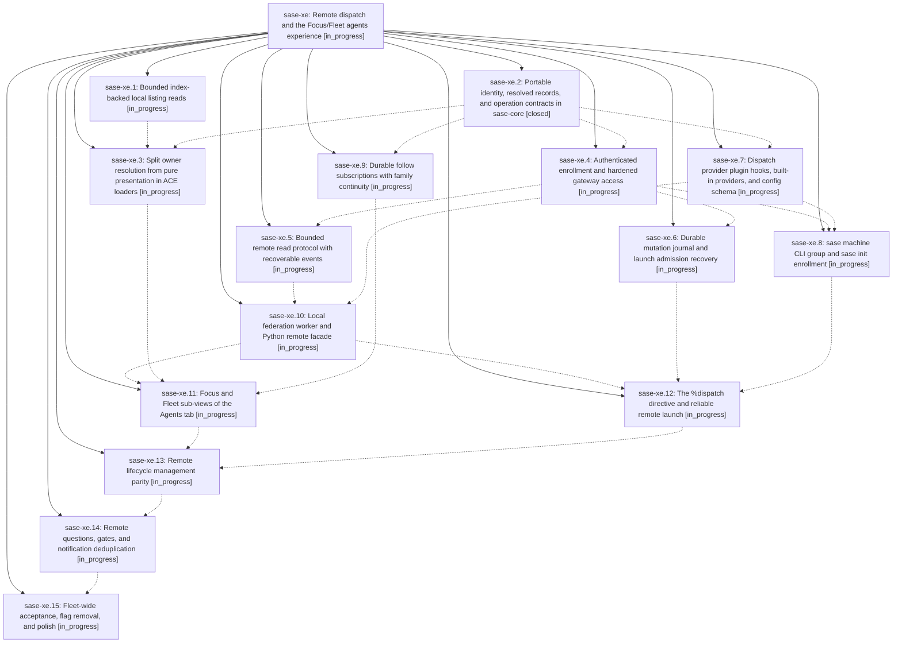

# Bead: sase-xe — Remote dispatch and the Focus/Fleet agents experience

[Bead Pages](../README.md) / sase-xe

**Status:** ◐ in_progress · **Type:** ▸ plan · **Tier:** epic
**Owner:** `bryanbugyi34@gmail.com` · **Created by:** [bbugyi200.athena.0gq](https://github.com/sase-org/sase--agents/blob/main/families/bbugyi200.athena.0gq.md) · **Assignee:** `sase-xe.land`
**Created:** 2026-09-06 14:06:39 EDT
**Plan:** [202609/remote\_dispatch\_fleet.md](https://github.com/sase-org/sase--plans/blob/main/202609/remote_dispatch_fleet.md)

<!-- sase:links:start -->

## Links

| Relation | Artifact | Why |
| --- | --- | --- |
| implemented-by | [plan:202609/remote_dispatch_fleet.md][1] | derived from the plan's `bead_id:` frontmatter field |

[1]: https://github.com/sase-org/sase--plans/blob/main/202609/remote_dispatch_fleet.md

<!-- sase:links:end -->

## Description

A user can enroll remote machines (Tailnet by default, plain HTTPS without Tailscale), launch agents on them with %dispatch:<machine>, browse every enrolled machine's agents in a new Fleet sub-view of the Agents tab, follow remote agents into the Focus sub-view, and manage followed remote agents (view, kill, retry, fork, answer questions, approve gates) with the same action vocabulary as local agents - all with zero added cost when no machines are configured and no event-loop stalls when a machine hangs.

## Phases

| Bead | Title | Status | Size | Created | Agents | Commits |
|---|---|---|---|---|---:|---:|
| [sase-xe.1](sase-xe.1.md) | Bounded index-backed local listing reads | ◐ in_progress | medium | 2026-09-06 | 1 | 0 |
| [sase-xe.10](sase-xe.10.md) | Local federation worker and Python remote facade | ◐ in_progress | large | 2026-09-06 | 1 | 0 |
| [sase-xe.11](sase-xe.11.md) | Focus and Fleet sub-views of the Agents tab | ◐ in_progress | large | 2026-09-06 | 1 | 0 |
| [sase-xe.12](sase-xe.12.md) | The %dispatch directive and reliable remote launch | ◐ in_progress | large | 2026-09-06 | 1 | 0 |
| [sase-xe.13](sase-xe.13.md) | Remote lifecycle management parity | ◐ in_progress | large | 2026-09-06 | 1 | 0 |
| [sase-xe.14](sase-xe.14.md) | Remote questions, gates, and notification deduplication | ◐ in_progress | large | 2026-09-06 | 1 | 0 |
| [sase-xe.15](sase-xe.15.md) | Fleet-wide acceptance, flag removal, and polish | ◐ in_progress | medium | 2026-09-06 | 1 | 0 |
| [sase-xe.2](sase-xe.2.md) | Portable identity, resolved records, and operation contracts in sase-core | ✓ closed | large | 2026-09-06 | 1 | 1 |
| [sase-xe.3](sase-xe.3.md) | Split owner resolution from pure presentation in ACE loaders | ◐ in_progress | medium | 2026-09-06 | 1 | 0 |
| [sase-xe.4](sase-xe.4.md) | Authenticated enrollment and hardened gateway access | ◐ in_progress | large | 2026-09-06 | 1 | 0 |
| [sase-xe.5](sase-xe.5.md) | Bounded remote read protocol with recoverable events | ◐ in_progress | large | 2026-09-06 | 1 | 0 |
| [sase-xe.6](sase-xe.6.md) | Durable mutation journal and launch admission recovery | ◐ in_progress | large | 2026-09-06 | 1 | 0 |
| [sase-xe.7](sase-xe.7.md) | Dispatch provider plugin hooks, built-in providers, and config schema | ◐ in_progress | large | 2026-09-06 | 1 | 0 |
| [sase-xe.8](sase-xe.8.md) | sase machine CLI group and sase init enrollment | ◐ in_progress | large | 2026-09-06 | 1 | 0 |
| [sase-xe.9](sase-xe.9.md) | Durable follow subscriptions with family continuity | ◐ in_progress | medium | 2026-09-06 | 1 | 0 |

## Lineage

## Agents

| Agent | Bead | Commits |
|---|---|---:|
| [bbugyi200.athena.sase-xe.1](https://github.com/sase-org/sase--agents/blob/main/agents/bbugyi200.athena.sase-xe.1/README.md) | [sase-xe.1](sase-xe.1.md) | 0 |
| [bbugyi200.athena.sase-xe.10](https://github.com/sase-org/sase--agents/blob/main/agents/bbugyi200.athena.sase-xe.10/README.md) | [sase-xe.10](sase-xe.10.md) | 0 |
| [bbugyi200.athena.sase-xe.11](https://github.com/sase-org/sase--agents/blob/main/agents/bbugyi200.athena.sase-xe.11/README.md) | [sase-xe.11](sase-xe.11.md) | 0 |
| [bbugyi200.athena.sase-xe.12](https://github.com/sase-org/sase--agents/blob/main/agents/bbugyi200.athena.sase-xe.12/README.md) | [sase-xe.12](sase-xe.12.md) | 0 |
| [bbugyi200.athena.sase-xe.13](https://github.com/sase-org/sase--agents/blob/main/agents/bbugyi200.athena.sase-xe.13/README.md) | [sase-xe.13](sase-xe.13.md) | 0 |
| [bbugyi200.athena.sase-xe.14](https://github.com/sase-org/sase--agents/blob/main/agents/bbugyi200.athena.sase-xe.14/README.md) | [sase-xe.14](sase-xe.14.md) | 0 |
| [bbugyi200.athena.sase-xe.15](https://github.com/sase-org/sase--agents/blob/main/agents/bbugyi200.athena.sase-xe.15/README.md) | [sase-xe.15](sase-xe.15.md) | 0 |
| [bbugyi200.athena.sase-xe.2](https://github.com/sase-org/sase--agents/blob/main/families/bbugyi200.athena.sase-xe.2.md) | [sase-xe.2](sase-xe.2.md) | 1 |
| [bbugyi200.athena.sase-xe.3](https://github.com/sase-org/sase--agents/blob/main/agents/bbugyi200.athena.sase-xe.3/README.md) | [sase-xe.3](sase-xe.3.md) | 0 |
| [bbugyi200.athena.sase-xe.4](https://github.com/sase-org/sase--agents/blob/main/agents/bbugyi200.athena.sase-xe.4/README.md) | [sase-xe.4](sase-xe.4.md) | 0 |
| [bbugyi200.athena.sase-xe.5](https://github.com/sase-org/sase--agents/blob/main/agents/bbugyi200.athena.sase-xe.5/README.md) | [sase-xe.5](sase-xe.5.md) | 0 |
| [bbugyi200.athena.sase-xe.6](https://github.com/sase-org/sase--agents/blob/main/agents/bbugyi200.athena.sase-xe.6/README.md) | [sase-xe.6](sase-xe.6.md) | 0 |
| [bbugyi200.athena.sase-xe.7](https://github.com/sase-org/sase--agents/blob/main/agents/bbugyi200.athena.sase-xe.7/README.md) | [sase-xe.7](sase-xe.7.md) | 0 |
| [bbugyi200.athena.sase-xe.8](https://github.com/sase-org/sase--agents/blob/main/agents/bbugyi200.athena.sase-xe.8/README.md) | [sase-xe.8](sase-xe.8.md) | 0 |
| [bbugyi200.athena.sase-xe.9](https://github.com/sase-org/sase--agents/blob/main/agents/bbugyi200.athena.sase-xe.9/README.md) | [sase-xe.9](sase-xe.9.md) | 0 |
| [bbugyi200.athena.sase-xe.land](https://github.com/sase-org/sase--agents/blob/main/agents/bbugyi200.athena.sase-xe.land/README.md) | [sase-xe](README.md) | 0 |

## Commits

| Repo | Commit | Subject | Bead | Committed |
|---|---|---|---|---|
| sase | [`27442bd`](https://github.com/sase-org/sase/commit/27442bd8e1fd96ed2e2f3b1b9a43bb27ab5e7d66) | test(fleet): cover portable contract bindings | [sase-xe.2](sase-xe.2.md) | 2026-09-06 16:10:16 EDT |
