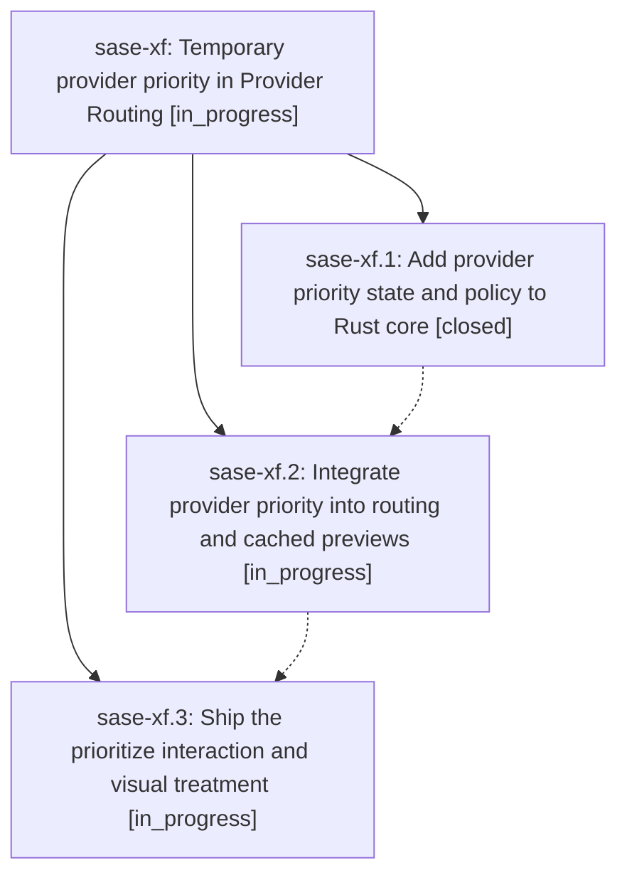

# Bead: sase-xf — Temporary provider priority in Provider Routing

[Bead Pages](../README.md) / sase-xf

**Status:** ◐ in_progress · **Type:** ▸ plan · **Tier:** epic
**Owner:** `bryanbugyi34@gmail.com` · **Created by:** [bbugyi200.athena.0gs](https://github.com/sase-org/sase--agents/blob/main/families/bbugyi200.athena.0gs.md) · **Assignee:** `sase-xf.land`
**Created:** 2026-09-06 14:31:03 EDT
**Plan:** [202609/provider\_priority.md](https://github.com/sase-org/sase--plans/blob/main/202609/provider_priority.md)

<!-- sase:links:start -->

## Links

| Relation | Artifact | Why |
| --- | --- | --- |
| implemented-by | [plan:202609/provider_priority.md][1] | derived from the plan's `bead_id:` frontmatter field |

[1]: https://github.com/sase-org/sase--plans/blob/main/202609/provider_priority.md

<!-- sase:links:end -->

## Description

Let users temporarily favor one provider in model alias pools through Provider Routing, with reversible state, reliable fallback behavior, and clear visual feedback throughout ACE.

## Phases

| Bead | Title | Status | Size | Created | Agents | Commits |
|---|---|---|---|---|---:|---:|
| [sase-xf.1](sase-xf.1.md) | Add provider priority state and policy to Rust core | ✓ closed | medium | 2026-09-06 | 1 | 1 |
| [sase-xf.2](sase-xf.2.md) | Integrate provider priority into routing and cached previews | ◐ in_progress | medium | 2026-09-06 | 1 | 0 |
| [sase-xf.3](sase-xf.3.md) | Ship the prioritize interaction and visual treatment | ◐ in_progress | medium | 2026-09-06 | 1 | 0 |

## Lineage

## Agents

| Agent | Bead | Commits |
|---|---|---:|
| [bbugyi200.athena.sase-xf.1](https://github.com/sase-org/sase--agents/blob/main/agents/bbugyi200.athena.sase-xf.1/README.md) | [sase-xf.1](sase-xf.1.md) | 1 |
| [bbugyi200.athena.sase-xf.2](https://github.com/sase-org/sase--agents/blob/main/agents/bbugyi200.athena.sase-xf.2/README.md) | [sase-xf.2](sase-xf.2.md) | 0 |
| [bbugyi200.athena.sase-xf.3](https://github.com/sase-org/sase--agents/blob/main/agents/bbugyi200.athena.sase-xf.3/README.md) | [sase-xf.3](sase-xf.3.md) | 0 |
| [bbugyi200.athena.sase-xf.land](https://github.com/sase-org/sase--agents/blob/main/agents/bbugyi200.athena.sase-xf.land/README.md) | [sase-xf](README.md) | 0 |

## Commits

| Repo | Commit | Subject | Bead | Committed |
|---|---|---|---|---|
| sase-core | [`sase-core@08c4c84`](https://github.com/sase-org/sase-core/commit/08c4c84044f533204d92779c8a6f9f023dee5a8a) | feat(provider): add provider priority core policy | [sase-xf.1](sase-xf.1.md) | 2026-09-06 15:03:30 EDT |
