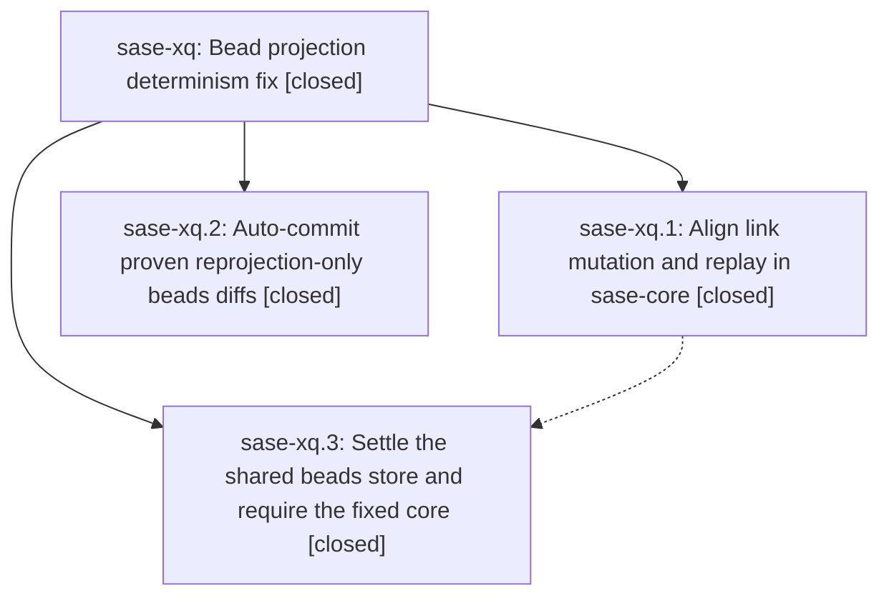

# Bead: sase-xq — Bead projection determinism fix

[Bead Pages](../README.md) / sase-xq

**Status:** ✓ closed · **Resolution:** done · **Type:** ▸ plan · **Tier:** epic
**Owner:** `bryanbugyi34@gmail.com` · **Created by:** [bbugyi200.athena.0h2](https://github.com/sase-org/sase--agents/blob/main/families/bbugyi200.athena.0h2.md) · **Assignee:** `sase-xq.land.r0`
**Created:** 2026-09-06 17:12:35 EDT · **Closed:** 2026-09-07 02:30:47 EDT
**Plan:** [202609/beads\_projection\_determinism.md](https://github.com/sase-org/sase--plans/blob/main/202609/beads_projection_determinism.md)

<!-- sase:links:start -->

## Links

| Relation | Artifact | Why |
| --- | --- | --- |
| implemented-by | [plan:202609/beads_projection_determinism.md][1] | derived from the plan's `bead_id:` frontmatter field |
| related | file:explicit:a0bca57238db1ec60d2e0ef7 | attached via sase artifact create --bead |
| related | file:explicit:a1a95625a24c66474d13f3bc | attached via sase artifact create --bead |
| related | file:explicit:f35ab27b0d533f91e34dd047 | attached via sase artifact create --bead |

[1]: https://github.com/sase-org/sase--plans/blob/main/202609/beads_projection_determinism.md

<!-- sase:links:end -->

## Description

Regenerating issues.jsonl from bead event streams is byte-stable in every workspace clone, and agent commit finalizers stop failing on beads:issues.jsonl dirt they did not cause.

## Notes

[2026-09-07T00:53:41Z · 00b--1] SUPERVISION RECOVERY / 00b--1 / 2026-09-07T00:53:40.200702+00:00
Original land run 20260906203136 exited completed at 00:43:34Z, but sase-xq remains in_progress, no active or historical monitor belongs to sase-xq.land (all-monitor inventory 728 entries), and no landing continuation is active. Tool history ends with an attempted sase monitor start --command at 00:42:31Z with no result receipt. Its final response claimed the full gate was running; this is not supported by runtime state. Preserve review/triage work already performed. Retry the unchanged landing assignment under sase-xq.land.r0. Installed monitor CLI takes command argv after --; it does NOT have --command. Use sase monitor start -s TESTING -S TESTED -t 90m -r <reason> --next <continuation> -- sh -c 'just install && just check-full'. Verify startup acknowledgement; nonzero is NOT handoff. Omit --model so the successor inherits codex/gpt-6-astra@xhigh. Finish the full gate, epic-symbol check and actual epic/plan closure with required finalization. Do not claim completion on a missing monitor. Operational board sase-xt tracks the recovery.

[2026-09-07T02:16:12Z · 016--1] SUPERVISION RETRY / 016--1 / 2026-09-07T02:15:03.127378+00:00
Reverified the incomplete landing: original run 20260906203136 is completed with successful metadata finalizer, but this epic remains in_progress and its claimed verification monitor never existed. No retry is active. Preauthorized sase-xq.land.r0 at codex/gpt-6-astra@xhigh will launch from epoch016 monitor using the original raw task. Follow note 1's recovery steps and installed command-after-- monitor syntax. Every monitor in that retry family must explicitly set -m codex/gpt-6-astra@xhigh to preserve the supervision model policy. Current baton is sase-xu (sase-xt is historical).

[2026-09-07T02:34:34Z · 016--2] MONITOR COMMAND CORRECTION / 016--2 / 2026-09-07T02:34:32.430306+00:00
The installed CLI joins all command words after -- with spaces, then executes sh -c. Passing separate argv entries for python -c <multiline code> or sh -c <compound script> loses their original argument grouping. Epoch016 monitor p71c3z676v1n failed before any retry launched for this reason. The safe prepared recovery uses an actual Python script file and its interpreter as the monitor command; nested sase run calls use subprocess argv. For your own verification monitor use one correctly shell-quoted command string or a script file, not the earlier unquoted sh -c example. Explicitly pass -m codex/gpt-6-astra@xhigh with --next. The x7/xq retries remain pending and will launch from the cycle2 monitor after a fresh duplicate check.

[2026-09-07T02:46:28Z · sase-xq.land.r0] LANDING AUDIT / sase-xq.land.r0 / gate pending. Re-read epic notes 1-3, all three child beads and all five child notes, and audited plan:202609/beads_projection_determinism.md. All children are closed with resolution done; no parent_id is linked to sase-xq. Verified core commit 530a1c0 removes only the two link-mutation updated_at assignments and adds byte-stability assertions for link add/remove (outbound and inbound), reference add/remove, update, dependency, note, close, and claim. Current core HEAD 93fe02b includes it, tags v0.32.29 through v0.32.33 contain it, and subsequent commits do not change the bead subtree. Release-plz owns the version bump. Verified Python commit 4093493a4 uses the Rust exporter on a temporary copy, rejects extra/event/mismatched changes, accepts staged and unstaged projection-only dirt, rechecks under the bead write lock, records host-owned commits, and runs before commit decisions. Its regression tests include a real execute_commit_finalizer success. Verified 4c3dace96 requires >=0.32.30,<0.33.0 and fixes isolated LSP installation; that addresses xq.3 note 1's unpublished-release blocker.

Integration audit through main HEAD 09c93253d (master=origin/master): examined post-start commit history including no-commit conflict resumes, durable follow store, ACE owner/proc listing changes, AXE systemd isolation, epic launch timing, federation facade, and machine enrollment. No new projection writer or incompatible finalizer path was introduced; no additional integration code is needed. Current bead doctor and sync --status report clean bead state, with only unrelated historical design/ref warnings. Initial epic-symbols check has no entries.

FOLLOW-UP OUTCOMES preserved from previous landing: xq.3 note 2's SIGTERM timeout flake is already corroborated on ready task sase-xb by sase-xq.land (2026-09-07T00:39:02Z); decline a duplicate task or repeated +1 without a fresh reproduction. The epic plan's Python _project_store._export fallback proposal is already recorded on active epic sase-x7 note 7 with evidence file:explicit:3e0b1dd6cf40c649ab155a23. Rechecked current fallback and open phases x7.11/x7.13; retain that causal ownership and decline a parallel task. No proposal is silently dropped.

Remaining verification: local .venv metadata says core 0.32.31, but importing its editable compiled extension fails because the module is missing. The attempted repeated-export check failed before mutation; repair this ordinary stale workspace install first. Prepared .git/sase-xq-landing-verify.py to run just install with explicit SASE_CORE_DIR pointing to the audited external core checkout, prove two exports leave the real beads projection byte-identical and Git clean under its write lock, run core just check, then main just check-full. Monitor not yet started at the time of this note. After confirmed gate success, recheck drift/readiness and epic-symbols, close sase-xq normally with this evidence plus actual gate results, run just symvision, mark the linked plan status done, and submit sase_final. Never infer verification success from a missing monitor. Use command after -- and explicit -m codex/gpt-6-astra@xhigh for every continuation monitor.

[2026-09-07T03:00:47Z · sase-xq.land.r0--1] LANDING VERIFICATION RETRY / sase-xq.land.r0--1. Read monitor 49vf71b1wanp through sase monitor show --all-lines and retained its output locally. It FAILED: just install successfully repaired the stale editable extension and installed core 0.32.33; two locked exports left the real beads issues.jsonl byte-identical and Git-clean (SHA256 8ff9d8832e8acf967ce779bfb7e546ea22c405a03b98910c52ae247402871273); core fmt/clippy and preceding Rust suites passed, but the PyO3 binding executable could not load libpython3.14.so.1.0. Main just check-full never ran. No failed gate is counted as passing.

Diagnosed the library exists under the uv-managed Python 3.14.7 LIBDIR. Adding that directory to LD_LIBRARY_PATH makes the exact failed binary load and enumerate all 116 binding tests. Updated only .git/sase-xq-landing-verify.py to derive LIBDIR from the workspace interpreter after just install and set LD_LIBRARY_PATH, PYO3_PYTHON, and VIRTUAL_ENV for subsequent checks, matching main Justfile rust-test. No product source change is required to resume verification. The unrelated core scripts/check.sh launcher omission predates this epic (865da85, 2026-08-12). Used sase_new_task, searched all task statuses/types, swept the last week, inspected 27 active epic scopes, and created ready small bug sase-xv with evidence file:explicit:31b8b28eec89b9940b0cfa2c. sase-xs only mentions temporary owner workarounds, not a duplicate repair task. Preserve this third follow-up outcome in the close note; no competing repair agent was launched.

Re-read all three child beads and all five child notes; all remain closed/done. Re-read the linked plan through audited artifact read. Earlier follow-up outcomes remain sase-xb for xq.3 note 2 and active sase-x7 note 7 for the plan fallback proposal. No duplicate reports were added for either. No epic-symbol entries exist.

Fresh origin fetch found one post-audit main commit: 24ac549dd (sase-xf.2 provider-priority routing), fast-forwarded into this clean checkout. Reviewed affected paths and core-floor/validator changes: no bead or finalizer implementation changed; core floor rose from >=0.32.30 to >=0.32.32, still including the projection fix and satisfied by audited core 0.32.33 at 93fe02b. No source integration work is needed. The full retry will verify main 24ac549dd plus core 93fe02b. Core and primary working trees remain clean. Plan artifact reads generated the expected untracked plans-sidecar links/202609/beads_projection_determinism.md.json; finalization must account for that generated link and the eventual status: done edit.

At this note the retry monitor is not yet started. Required next steps remain actual full verification success, post-gate drift and descendant/linked-plan readiness checks, epic-symbol cleanup, normal sase-xq close, just symvision, linked plan status done, parent recheck, and sase_final. No parent was linked. Use command-after-- monitor syntax and explicit -m codex/gpt-6-astra@xhigh.

[2026-09-07T04:12:29Z · sase-xq.land.r0--2] LANDING VERIFICATION REPAIR / sase-xq.land.r0--2. Audited failed monitor 8ga912710568 through sase monitor show --all-lines. Installation, two locked byte-identical/Git-clean real-store exports, every Rust check, every main lint/validation gate, and 38,961 Python tests (14 skipped) passed. Main check-full still FAILED at six CPU budgets; no terminal success line and no epic close. Full failed evidence: file:explicit:d92859dff454ff5d20bdd068.

Used sase_new_task; searched task types/statuses and the last-week sweep; inspected all active epic scopes. Exact CPU-budget duplicate is sase-xc (+1 evidence recorded); no new task. Preserved all eight local cost recordings and exact --suggest output in file:explicit:d496b0ff14235d9ac51905f2. Applied its documented existing-key-only calibration to tests/perf/baselines/test_cost_budgets.json: total CPU 2100->2400; ACE enter 740->830; settle 320->360; delay 290->320; subprocess 27->38; Textual enter 610->690; YAML 20->21. Four samples exceeded the old

… and 14892 more characters

## Phases

| Bead | Title | Status | Size | Created | Agents | Commits |
|---|---|---|---|---|---:|---:|
| [sase-xq.1](sase-xq.1.md) | Align link mutation and replay in sase-core | ✓ closed | small | 2026-09-06 | 1 | 1 |
| [sase-xq.2](sase-xq.2.md) | Auto-commit proven reprojection-only beads diffs | ✓ closed | medium | 2026-09-06 | 1 | 1 |
| [sase-xq.3](sase-xq.3.md) | Settle the shared beads store and require the fixed core | ✓ closed | small | 2026-09-06 | 1 | 1 |

## Lineage

## Agents

| Agent | Bead | Commits |
|---|---|---:|
| [bbugyi200.athena.sase-xq.1](https://github.com/sase-org/sase--agents/blob/main/agents/bbugyi200.athena.sase-xq.1/README.md) | [sase-xq.1](sase-xq.1.md) | 1 |
| [bbugyi200.athena.sase-xq.2](https://github.com/sase-org/sase--agents/blob/main/agents/bbugyi200.athena.sase-xq.2/README.md) | [sase-xq.2](sase-xq.2.md) | 1 |
| [bbugyi200.athena.sase-xq.3](https://github.com/sase-org/sase--agents/blob/main/agents/bbugyi200.athena.sase-xq.3/README.md) | [sase-xq.3](sase-xq.3.md) | 1 |
| [bbugyi200.athena.sase-xq.land](https://github.com/sase-org/sase--agents/blob/main/families/bbugyi200.athena.sase-xq.land.md) | [sase-xq](README.md) | 0 |
| [bbugyi200.athena.sase-xq.land.r0](https://github.com/sase-org/sase--agents/blob/main/families/bbugyi200.athena.sase-xq.land.r0.md) | [sase-xq](README.md) | 2 |

## Commits

| Repo | Commit | Subject | Bead | Committed |
|---|---|---|---|---|
| sase-core | [`sase-core@530a1c0`](https://github.com/sase-org/sase-core/commit/530a1c0d0b6724758e7d7fb4406fc2955808454c) | fix(beads): align link mutation replay projection | [sase-xq.1](sase-xq.1.md) | 2026-09-06 17:29:14 EDT |
| sase | [`4093493`](https://github.com/sase-org/sase/commit/4093493a4c504e1e4cb7d96c3cb135709085901d) | fix(finalizers): auto-commit bead reprojections | [sase-xq.2](sase-xq.2.md) | 2026-09-06 19:15:52 EDT |
| sase | [`4c3dace`](https://github.com/sase-org/sase/commit/4c3dace967966f1ef544a539f4922fc7236bd6a5) | fix(build): require fixed core and install lsp from isolated target | [sase-xq.3](sase-xq.3.md) | 2026-09-06 20:20:33 EDT |
| sase | [`144c2be`](https://github.com/sase-org/sase/commit/144c2be656233e727f80a063e7dbf3833743b2df) | test: calibrate suite budgets and record owned flake debt | [sase-xq](README.md) | 2026-09-07 02:34:46 EDT |
| sase--plans | [`sase--plans@645fa8b`](https://github.com/sase-org/sase--plans/commit/645fa8b418e6950a2138dc14dae13eef8334c65a) | docs(plans): archive completed bead projection determinism plan | [sase-xq](README.md) | 2026-09-07 02:36:33 EDT |
