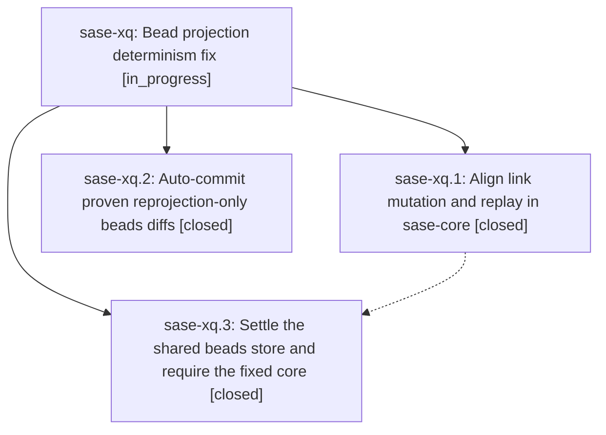

# Bead: sase-xq — Bead projection determinism fix

[Bead Pages](../README.md) / sase-xq

**Status:** ◐ in_progress · **Type:** ▸ plan · **Tier:** epic
**Owner:** `bryanbugyi34@gmail.com` · **Created by:** [bbugyi200.athena.0h2](https://github.com/sase-org/sase--agents/blob/main/families/bbugyi200.athena.0h2.md) · **Assignee:** `sase-xq.land`
**Created:** 2026-09-06 17:12:35 EDT
**Plan:** [202609/beads\_projection\_determinism.md](https://github.com/sase-org/sase--plans/blob/main/202609/beads_projection_determinism.md)

<!-- sase:links:start -->

## Links

| Relation | Artifact | Why |
| --- | --- | --- |
| implemented-by | [plan:202609/beads_projection_determinism.md][1] | derived from the plan's `bead_id:` frontmatter field |

[1]: https://github.com/sase-org/sase--plans/blob/main/202609/beads_projection_determinism.md

<!-- sase:links:end -->

## Description

Regenerating issues.jsonl from bead event streams is byte-stable in every workspace clone, and agent commit finalizers stop failing on beads:issues.jsonl dirt they did not cause.

## Phases

| Bead | Title | Status | Size | Created | Agents | Commits |
|---|---|---|---|---|---:|---:|
| [sase-xq.1](sase-xq.1.md) | Align link mutation and replay in sase-core | ✓ closed | small | 2026-09-06 | 1 | 1 |
| [sase-xq.2](sase-xq.2.md) | Auto-commit proven reprojection-only beads diffs | ✓ closed | medium | 2026-09-06 | 1 | 1 |
| [sase-xq.3](sase-xq.3.md) | Settle the shared beads store and require the fixed core | ✓ closed | small | 2026-09-06 | 1 | 1 |

## Lineage

## Agents

| Agent | Bead | Commits |
|---|---|---:|
| [bbugyi200.athena.sase-xq.1](https://github.com/sase-org/sase--agents/blob/main/agents/bbugyi200.athena.sase-xq.1/README.md) | [sase-xq.1](sase-xq.1.md) | 1 |
| [bbugyi200.athena.sase-xq.2](https://github.com/sase-org/sase--agents/blob/main/agents/bbugyi200.athena.sase-xq.2/README.md) | [sase-xq.2](sase-xq.2.md) | 1 |
| [bbugyi200.athena.sase-xq.3](https://github.com/sase-org/sase--agents/blob/main/agents/bbugyi200.athena.sase-xq.3/README.md) | [sase-xq.3](sase-xq.3.md) | 1 |
| [bbugyi200.athena.sase-xq.land](https://github.com/sase-org/sase--agents/blob/main/agents/bbugyi200.athena.sase-xq.land/README.md) | [sase-xq](README.md) | 0 |

## Commits

| Repo | Commit | Subject | Bead | Committed |
|---|---|---|---|---|
| sase-core | [`sase-core@530a1c0`](https://github.com/sase-org/sase-core/commit/530a1c0d0b6724758e7d7fb4406fc2955808454c) | fix(beads): align link mutation replay projection | [sase-xq.1](sase-xq.1.md) | 2026-09-06 17:29:14 EDT |
| sase | [`4093493`](https://github.com/sase-org/sase/commit/4093493a4c504e1e4cb7d96c3cb135709085901d) | fix(finalizers): auto-commit bead reprojections | [sase-xq.2](sase-xq.2.md) | 2026-09-06 19:15:52 EDT |
| sase | [`4c3dace`](https://github.com/sase-org/sase/commit/4c3dace967966f1ef544a539f4922fc7236bd6a5) | fix(build): require fixed core and install lsp from isolated target | [sase-xq.3](sase-xq.3.md) | 2026-09-06 20:20:33 EDT |
