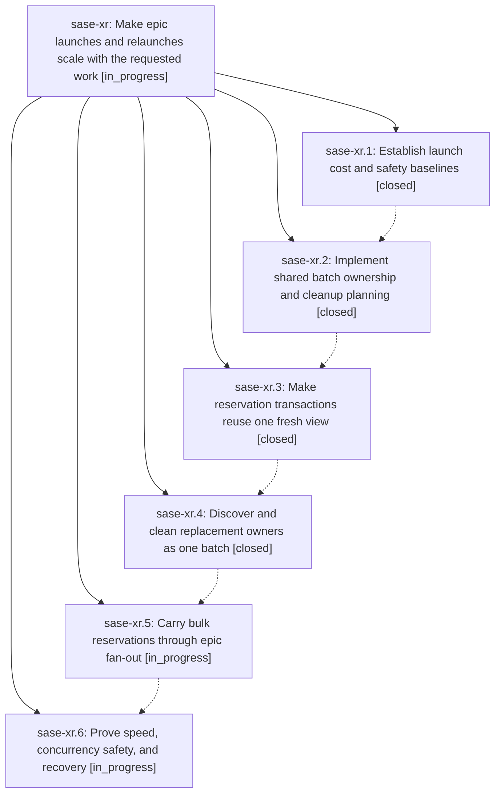

# Bead: sase-xr — Make epic launches and relaunches scale with the requested work

[Bead Pages](../README.md) / sase-xr

**Status:** ◐ in_progress · **Type:** ▸ plan · **Tier:** epic
**Owner:** `bryanbugyi34@gmail.com` · **Created by:** [bbugyi200.athena.0h7](https://github.com/sase-org/sase--agents/blob/main/families/bbugyi200.athena.0h7.md) · **Assignee:** `sase-xr.land`
**Created:** 2026-09-06 18:58:15 EDT
**Plan:** [202609/fast\_epic\_launches.md](https://github.com/sase-org/sase--plans/blob/main/202609/fast_epic_launches.md)

<!-- sase:links:start -->

## Links

| Relation | Artifact | Why |
| --- | --- | --- |
| implemented-by | [plan:202609/fast_epic_launches.md][1] | derived from the plan's `bead_id:` frontmatter field |

[1]: https://github.com/sase-org/sase--plans/blob/main/202609/fast_epic_launches.md

<!-- sase:links:end -->

## Description

Launching or relaunching one or several epics spends seconds on local preparation instead of minutes rescanning agent history, while preserving active workers, exact ownership checks, publication barriers, and partial-launch recovery.

## Phases

| Bead | Title | Status | Size | Created | Agents | Commits |
|---|---|---|---|---|---:|---:|
| [sase-xr.1](sase-xr.1.md) | Establish launch cost and safety baselines | ✓ closed | small | 2026-09-06 | 1 | 1 |
| [sase-xr.2](sase-xr.2.md) | Implement shared batch ownership and cleanup planning | ✓ closed | medium | 2026-09-06 | 1 | 1 |
| [sase-xr.3](sase-xr.3.md) | Make reservation transactions reuse one fresh view | ✓ closed | medium | 2026-09-06 | 1 | 1 |
| [sase-xr.4](sase-xr.4.md) | Discover and clean replacement owners as one batch | ✓ closed | medium | 2026-09-06 | 1 | 1 |
| [sase-xr.5](sase-xr.5.md) | Carry bulk reservations through epic fan-out | ◐ in_progress | medium | 2026-09-06 | 1 | 0 |
| [sase-xr.6](sase-xr.6.md) | Prove speed, concurrency safety, and recovery | ◐ in_progress | medium | 2026-09-06 | 1 | 0 |

## Lineage

## Agents

| Agent | Bead | Commits |
|---|---|---:|
| [bbugyi200.athena.sase-xr.1](https://github.com/sase-org/sase--agents/blob/main/agents/bbugyi200.athena.sase-xr.1/README.md) | [sase-xr.1](sase-xr.1.md) | 1 |
| [bbugyi200.athena.sase-xr.2](https://github.com/sase-org/sase--agents/blob/main/agents/bbugyi200.athena.sase-xr.2/README.md) | [sase-xr.2](sase-xr.2.md) | 1 |
| [bbugyi200.athena.sase-xr.3](https://github.com/sase-org/sase--agents/blob/main/agents/bbugyi200.athena.sase-xr.3/README.md) | [sase-xr.3](sase-xr.3.md) | 1 |
| [bbugyi200.athena.sase-xr.4](https://github.com/sase-org/sase--agents/blob/main/agents/bbugyi200.athena.sase-xr.4/README.md) | [sase-xr.4](sase-xr.4.md) | 1 |
| [bbugyi200.athena.sase-xr.5](https://github.com/sase-org/sase--agents/blob/main/agents/bbugyi200.athena.sase-xr.5/README.md) | [sase-xr.5](sase-xr.5.md) | 0 |
| [bbugyi200.athena.sase-xr.6](https://github.com/sase-org/sase--agents/blob/main/agents/bbugyi200.athena.sase-xr.6/README.md) | [sase-xr.6](sase-xr.6.md) | 0 |
| [bbugyi200.athena.sase-xr.land](https://github.com/sase-org/sase--agents/blob/main/agents/bbugyi200.athena.sase-xr.land/README.md) | [sase-xr](README.md) | 0 |

## Commits

| Repo | Commit | Subject | Bead | Committed |
|---|---|---|---|---|
| sase | [`223cd2e`](https://github.com/sase-org/sase/commit/223cd2e84a190beb09fa848a13a8ec2e9855e513) | feat(beads): instrument epic launch timing | [sase-xr.1](sase-xr.1.md) | 2026-09-06 20:44:32 EDT |
| sase-core | [`sase-core@09a10b4`](https://github.com/sase-org/sase-core/commit/09a10b4e894c664b81c5e4683537bb61078f4203) | feat(agent-ownership): add batch ownership planner | [sase-xr.2](sase-xr.2.md) | 2026-09-06 21:28:25 EDT |
| sase | [`272ebad`](https://github.com/sase-org/sase/commit/272ebad820f82a24901abd8dd84e1318e640cfee) | feat(agent): add batch registry reservation transactions | [sase-xr.3](sase-xr.3.md) | 2026-09-06 23:34:46 EDT |
| sase | [`34fb561`](https://github.com/sase-org/sase/commit/34fb561dd986ef362f1b68ab2a2fdd3171507aac) | perf(agent-names): batch forced-reuse cleanup | [sase-xr.4](sase-xr.4.md) | 2026-09-07 01:18:23 EDT |
