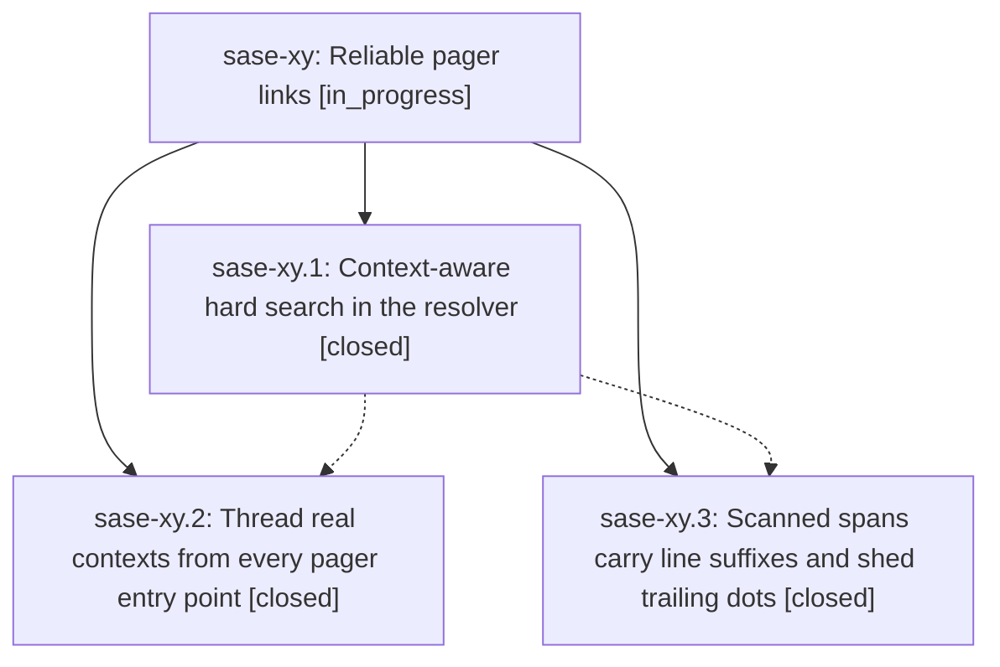

# Bead: sase-xy — Reliable pager links

[Bead Pages](../README.md) / sase-xy

**Status:** ◐ in_progress · **Type:** ▸ plan · **Tier:** epic
**Owner:** `bryanbugyi34@gmail.com` · **Created by:** [bbugyi200.athena.01q](https://github.com/sase-org/sase--agents/blob/main/families/bbugyi200.athena.01q.md) · **Assignee:** `sase-xy.land`
**Created:** 2026-09-07 10:02:18 EDT
**Plan:** [202609/pager\_link\_reliability.md](https://github.com/sase-org/sase--plans/blob/main/202609/pager_link_reliability.md)

<!-- sase:links:start -->

## Links

| Relation | Artifact | Why |
| --- | --- | --- |
| implemented-by | [plan:202609/pager_link_reliability.md][1] | derived from the plan's `bead_id:` frontmatter field |

[1]: https://github.com/sase-org/sase--plans/blob/main/202609/pager_link_reliability.md

<!-- sase:links:end -->

## Description

Pager link presses land on the file or artifact the text's author meant: file paths and typed refs resolve against the workspace directory where the corresponding agent ran when knowable, fall back through reliable anchors, and spans carry :line suffixes faithfully.

## Phases

| Bead | Title | Status | Size | Created | Agents | Commits |
|---|---|---|---|---|---:|---:|
| [sase-xy.1](sase-xy.1.md) | Context-aware hard search in the resolver | ✓ closed | medium | 2026-09-07 | 1 | 1 |
| [sase-xy.2](sase-xy.2.md) | Thread real contexts from every pager entry point | ✓ closed | medium | 2026-09-07 | 1 | 1 |
| [sase-xy.3](sase-xy.3.md) | Scanned spans carry line suffixes and shed trailing dots | ✓ closed | small | 2026-09-07 | 1 | 1 |

## Lineage

## Agents

| Agent | Bead | Commits |
|---|---|---:|
| [bbugyi200.athena.sase-xy.1](https://github.com/sase-org/sase--agents/blob/main/agents/bbugyi200.athena.sase-xy.1/README.md) | [sase-xy.1](sase-xy.1.md) | 1 |
| [bbugyi200.athena.sase-xy.2](https://github.com/sase-org/sase--agents/blob/main/agents/bbugyi200.athena.sase-xy.2/README.md) | [sase-xy.2](sase-xy.2.md) | 1 |
| [bbugyi200.athena.sase-xy.3](https://github.com/sase-org/sase--agents/blob/main/agents/bbugyi200.athena.sase-xy.3/README.md) | [sase-xy.3](sase-xy.3.md) | 1 |
| [bbugyi200.athena.sase-xy.land](https://github.com/sase-org/sase--agents/blob/main/agents/bbugyi200.athena.sase-xy.land/README.md) | [sase-xy](README.md) | 0 |

## Commits

| Repo | Commit | Subject | Bead | Committed |
|---|---|---|---|---|
| sase | [`4bb47fc`](https://github.com/sase-org/sase/commit/4bb47fc987541c33386ee508024a956c44cbb79d) | feat(pager): resolve links against ordered workspace anchors | [sase-xy.1](sase-xy.1.md) | 2026-09-07 10:44:14 EDT |
| sase | [`f6501e3`](https://github.com/sase-org/sase/commit/f6501e308fbf83d544501c724e201c54762361b6) | feat(pager): include :line suffixes in scanned file-path spans | [sase-xy.3](sase-xy.3.md) | 2026-09-07 11:08:47 EDT |
| sase | [`a0fcc5a`](https://github.com/sase-org/sase/commit/a0fcc5ade1600a815f1f250dcc15d95e67060aaf) | feat(pager): thread link context through entry points | [sase-xy.2](sase-xy.2.md) | 2026-09-07 11:46:36 EDT |
