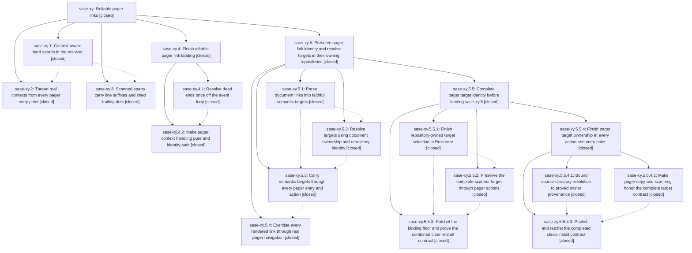

# Bead: sase-xy — Reliable pager links

[Bead Pages](../README.md) / sase-xy

**Status:** ✓ closed · **Resolution:** done · **Type:** ▸ plan · **Tier:** epic
**Owner:** `bryanbugyi34@gmail.com` · **Created by:** [bbugyi200.athena.01q](https://github.com/sase-org/sase--agents/blob/main/families/bbugyi200.athena.01q.md) · **Assignee:** `sase-xy.land`
**Created:** 2026-09-07 10:02:18 EDT · **Closed:** 2026-09-08 02:04:51 EDT
**Plan:** [202609/pager\_link\_reliability.md](https://github.com/sase-org/sase--plans/blob/main/202609/pager_link_reliability.md)

<!-- sase:links:start -->

## Links

| Relation | Artifact | Why |
| --- | --- | --- |
| implemented-by | [plan:202609/pager_link_reliability.md][1] | derived from the plan's `bead_id:` frontmatter field |

[1]: https://github.com/sase-org/sase--plans/blob/main/202609/pager_link_reliability.md

<!-- sase:links:end -->

## Description

Pager link presses land on the file or artifact the text's author meant: file paths and typed refs resolve against the workspace directory where the corresponding agent ran when knowable, fall back through reliable anchors, and spans carry :line suffixes faithfully.

## Notes

[2026-09-07T16:07:48Z · sase-xy.land] LAND AUDIT PAUSED FOR REMAINING EPIC WORK: all three phase commits and current entry-point wiring were reviewed; the focused pager/ACE/artifact/bead CLI suite passes (189 tests), and the sole child PROPOSED FOLLOW-UP from sase-xy.1 is already fixed on master by 777ec37dc (the exact lock test passes), so no task was filed. The three phase commits independently reproduce ready task sase-vh's stale SASE_PLAN provenance bug, so sase-vh was corroborated with +1 rather than duplicated. Post-start non-epic commits 777ec37dc and 287048d60 do not add a pager entry point or conflict with link contexts. Remaining epic-caused defects: a dead-end file press runs the git suffix search once in the background resolver and again synchronously from _apply_resolution/_unresolved_message to construct the toast (reproduction: git calls rise from 1 after resolve_ref to 2 after file_path_unresolved_message), violating one-search-per-anchor and the no-event-loop-I/O rule; merge_link_context also existence-checks/resolves anchors synchronously per label press; ACE _prepare_view_input constructs agent/patch contexts synchronously; and dangling-ref identity drops workspace_num even though typed-ref resolution depends on it. A child correction plan is being proposed; resume landing after it closes.

[2026-09-07T19:00:23Z · sase-xy.4.land--1] NESTED LANDING BLOCKER after sase-xy.4 closed: rechecked the parent landing note, every current descendant and note, plan:202609/pager_link_reliability.md, current origin/master drift through a9f95ca5e, and the parent epic-symbol ledger. The correction child sase-xy.4 is closed and its plan is done; post-close just symvision passes and sase-xy has no epic-symbol entries. Parent sase-xy cannot close yet because sibling child epic sase-xy.5 remains in_progress: only phase 5.1 is closed, while repository-resolution 5.2, pager-integration 5.3, and rendered-link-contract 5.4 are still in_progress. Its phase 5.1 also has a PROPOSED FOLLOW-UP for stale pending_actions Symvision URI pragmas that its own land agent must triage. The parent plan therefore remains active; resume its landing audit after sase-xy.5 closes.

[2026-09-08T06:04:51Z · sase-xy.5.5.4.land--1] LAND COMPLETE (2026-09-08), resuming the landing paused by note #1 and blocked by note #2. All three phases (sase-xy.1-.3) and both child epics (sase-xy.4, sase-xy.5) are CLOSED, with sase-xy.5's own remediation child sase-xy.5.5 and grandchild sase-xy.5.5.4 closed in this same landing pass; note #2's stated blocker (sase-xy.5 in_progress with phases 5.2-5.4 open) no longer holds. Re-verified note #1's four epic-caused defects against current source: (a) one-search-per-anchor is restored - resolve.py builds the toast from the already-computed owned-source result via owned_source_unresolved_message(last_path, last) instead of re-running the suffix search; (b) merge_link_context is documented and implemented as pure in-memory combination that does not stat, resolve, or normalize directories; (c) ACE _prepare_view_input is now only a UI-thread validation/snapshot step, with document construction moved behind asyncio.to_thread in build_pager_document; (d) _dangling_ref_key includes anchor.workspace_num in its identity tuple. Rechecked plan:202609/pager_link_reliability.md and all descendant notes; no descendant left an unaddressed PROPOSED FOLLOW-UP. Follow-up outcomes stand as recorded and no duplicates were filed: the sase-xy.1 proposal was already fixed by 777ec37dc, stale-SASE_PLAN task sase-vh remains open and corroborated (+1) rather than duplicated, and the bare-directory proposal remains open feature task sase-yb. Pre-existing PNG golden drift stays with open task sase-x5. Post-child drift check: git fetch shows local master identical to origin/master, so no later commit adds an unintegrated pager entry point. sase bead epic-symbols sase-xy is empty and just symvision is clean. Landing gate just check-full passed on the combined tree (exit 0; only advisory test-cost wall-clock entries, no failures).

## Phases

| Bead | Title | Status | Size | Created | Agents | Commits |
|---|---|---|---|---|---:|---:|
| [sase-xy.1](sase-xy.1.md) | Context-aware hard search in the resolver | ✓ closed | medium | 2026-09-07 | 1 | 1 |
| [sase-xy.2](sase-xy.2.md) | Thread real contexts from every pager entry point | ✓ closed | medium | 2026-09-07 | 1 | 1 |
| [sase-xy.3](sase-xy.3.md) | Scanned spans carry line suffixes and shed trailing dots | ✓ closed | small | 2026-09-07 | 1 | 1 |

## Lineage

## Agents

| Agent | Bead | Commits |
|---|---|---:|
| [bbugyi200.athena.sase-xy.1](https://github.com/sase-org/sase--agents/blob/main/agents/bbugyi200.athena.sase-xy.1/README.md) | [sase-xy.1](sase-xy.1.md) | 1 |
| [bbugyi200.athena.sase-xy.2](https://github.com/sase-org/sase--agents/blob/main/agents/bbugyi200.athena.sase-xy.2/README.md) | [sase-xy.2](sase-xy.2.md) | 1 |
| [bbugyi200.athena.sase-xy.3](https://github.com/sase-org/sase--agents/blob/main/agents/bbugyi200.athena.sase-xy.3/README.md) | [sase-xy.3](sase-xy.3.md) | 1 |
| [bbugyi200.athena.sase-xy.4.1](https://github.com/sase-org/sase--agents/blob/main/agents/bbugyi200.athena.sase-xy.4.1/README.md) | [sase-xy.4.1](sase-xy.4.1.md) | 1 |
| [bbugyi200.athena.sase-xy.4.2](https://github.com/sase-org/sase--agents/blob/main/agents/bbugyi200.athena.sase-xy.4.2/README.md) | [sase-xy.4.2](sase-xy.4.2.md) | 1 |
| [bbugyi200.athena.sase-xy.4.land](https://github.com/sase-org/sase--agents/blob/main/families/bbugyi200.athena.sase-xy.4.land.md) | [sase-xy.4](sase-xy.4.md) | 0 |
| [bbugyi200.athena.sase-xy.5.2](https://github.com/sase-org/sase--agents/blob/main/agents/bbugyi200.athena.sase-xy.5.2/README.md) | [sase-xy.5.2](sase-xy.5.2.md) | 2 |
| [bbugyi200.athena.sase-xy.5.3](https://github.com/sase-org/sase--agents/blob/main/agents/bbugyi200.athena.sase-xy.5.3/README.md) | [sase-xy.5.3](sase-xy.5.3.md) | 1 |
| [bbugyi200.athena.sase-xy.5.4](https://github.com/sase-org/sase--agents/blob/main/agents/bbugyi200.athena.sase-xy.5.4/README.md) | [sase-xy.5.4](sase-xy.5.4.md) | 1 |
| [bbugyi200.athena.sase-xy.5.5.1](https://github.com/sase-org/sase--agents/blob/main/agents/bbugyi200.athena.sase-xy.5.5.1/README.md) | [sase-xy.5.5.1](sase-xy.5.5.1.md) | 2 |
| [bbugyi200.athena.sase-xy.5.5.2](https://github.com/sase-org/sase--agents/blob/main/agents/bbugyi200.athena.sase-xy.5.5.2/README.md) | [sase-xy.5.5.2](sase-xy.5.5.2.md) | 1 |
| [bbugyi200.athena.sase-xy.5.5.3](https://github.com/sase-org/sase--agents/blob/main/families/bbugyi200.athena.sase-xy.5.5.3.md) | [sase-xy.5.5.3](sase-xy.5.5.3.md) | 1 |
| [bbugyi200.athena.sase-xy.5.5.4.1](https://github.com/sase-org/sase--agents/blob/main/agents/bbugyi200.athena.sase-xy.5.5.4.1/README.md) | [sase-xy.5.5.4.1](sase-xy.5.5.4.1.md) | 2 |
| [bbugyi200.athena.sase-xy.5.5.4.2](https://github.com/sase-org/sase--agents/blob/main/agents/bbugyi200.athena.sase-xy.5.5.4.2/README.md) | [sase-xy.5.5.4.2](sase-xy.5.5.4.2.md) | 1 |
| [bbugyi200.athena.sase-xy.5.5.4.3](https://github.com/sase-org/sase--agents/blob/main/families/bbugyi200.athena.sase-xy.5.5.4.3.md) | [sase-xy.5.5.4.3](sase-xy.5.5.4.3.md) | 1 |
| [bbugyi200.athena.sase-xy.5.5.4.land](https://github.com/sase-org/sase--agents/blob/main/families/bbugyi200.athena.sase-xy.5.5.4.land.md) | [sase-xy.5.5.4](sase-xy.5.5.4.md) | 1 |
| [bbugyi200.athena.sase-xy.5.5.land](https://github.com/sase-org/sase--agents/blob/main/families/bbugyi200.athena.sase-xy.5.5.land.md) | [sase-xy.5.5](sase-xy.5.5.md) | 0 |
| [bbugyi200.athena.sase-xy.5.land](https://github.com/sase-org/sase--agents/blob/main/families/bbugyi200.athena.sase-xy.5.land.md) | [sase-xy.5](sase-xy.5.md) | 0 |
| [bbugyi200.athena.sase-xy.land](https://github.com/sase-org/sase--agents/blob/main/families/bbugyi200.athena.sase-xy.land.md) | [sase-xy](README.md) | 0 |

## Commits

| Repo | Commit | Subject | Bead | Committed |
|---|---|---|---|---|
| sase | [`4bb47fc`](https://github.com/sase-org/sase/commit/4bb47fc987541c33386ee508024a956c44cbb79d) | feat(pager): resolve links against ordered workspace anchors | [sase-xy.1](sase-xy.1.md) | 2026-09-07 10:44:14 EDT |
| sase | [`f6501e3`](https://github.com/sase-org/sase/commit/f6501e308fbf83d544501c724e201c54762361b6) | feat(pager): include :line suffixes in scanned file-path spans | [sase-xy.3](sase-xy.3.md) | 2026-09-07 11:08:47 EDT |
| sase | [`a0fcc5a`](https://github.com/sase-org/sase/commit/a0fcc5ade1600a815f1f250dcc15d95e67060aaf) | feat(pager): thread link context through entry points | [sase-xy.2](sase-xy.2.md) | 2026-09-07 11:46:36 EDT |
| sase | [`5144564`](https://github.com/sase-org/sase/commit/51445642c37303762ef7bb51be7c49c680c19ee4) | feat(pager): resolve dead ends in one background pass | [sase-xy.4.1](sase-xy.4.1.md) | 2026-09-07 13:03:05 EDT |
| sase | [`4b90cc9`](https://github.com/sase-org/sase/commit/4b90cc9ee824c14021e0b2239f28ff7e509fd97c) | fix(pager): keep context merge pure and dangling identity workspace-safe | [sase-xy.4.2](sase-xy.4.2.md) | 2026-09-07 13:49:34 EDT |
| sase | [`d8a299c`](https://github.com/sase-org/sase/commit/d8a299c2c3e401d9a08f5802849c15afb3eceb7b) | feat(pager-refs): add Python adapter for document-owned source-path resolution | [sase-xy.5.2](sase-xy.5.2.md) | 2026-09-07 17:56:02 EDT |
| sase-core | [`sase-core@0ec3050`](https://github.com/sase-org/sase-core/commit/0ec30508fc0baa339cec0d89b1c5b70c3d800538) | feat(artifact-ref): resolve document-owned source paths by repository identity | [sase-xy.5.2](sase-xy.5.2.md) | 2026-09-07 17:58:40 EDT |
| sase | [`2b08ca3`](https://github.com/sase-org/sase/commit/2b08ca3017aade6523ab8fcb16d36460f6ed8866) | feat(pager): carry semantic targets and owner provenance through every action | [sase-xy.5.3](sase-xy.5.3.md) | 2026-09-07 18:50:46 EDT |
| sase | [`2ba228d`](https://github.com/sase-org/sase/commit/2ba228da326eedba37e66c5b8eb73ed4525b2967) | test(pager): enforce rendered-link contract through real navigation | [sase-xy.5.4](sase-xy.5.4.md) | 2026-09-07 19:51:30 EDT |
| sase | [`d101fbd`](https://github.com/sase-org/sase/commit/d101fbd08657694233523cca298a526ada3b2609) | feat(artifact-ref): transport optional source path\_globs on document owner | [sase-xy.5.5.1](sase-xy.5.5.1.md) | 2026-09-07 21:20:08 EDT |
| sase-core | [`sase-core@885a61b`](https://github.com/sase-org/sase-core/commit/885a61bd819ab239b2058ef8d6ef5bb6cc051c8e) | fix(artifact-ref): make document source resolution repository-owned | [sase-xy.5.5.1](sase-xy.5.5.1.md) | 2026-09-07 21:22:18 EDT |
| sase | [`e38f065`](https://github.com/sase-org/sase/commit/e38f065b8ba25478f38a2edae7c8a94fa7c2abe7) | feat(pager): preserve semantic target identity | [sase-xy.5.5.2](sase-xy.5.5.2.md) | 2026-09-07 22:08:09 EDT |
| sase | [`b67c74c`](https://github.com/sase-org/sase/commit/b67c74ce7ecf2268a3abba0d61e0fdbabf7f56e1) | feat(artifact-ref): ratchet sase-core-rs floor to 0.32.41 and extend contract validation | [sase-xy.5.5.3](sase-xy.5.5.3.md) | 2026-09-07 22:58:04 EDT |
| sase | [`eccc091`](https://github.com/sase-org/sase/commit/eccc0916048d844dfeaa64ee13ae4a411df2cd35) | fix(artifact-ref): send selected\_project and honor owner project in context assembly | [sase-xy.5.5.4.1](sase-xy.5.5.4.1.md) | 2026-09-07 23:46:50 EDT |
| sase-core | [`sase-core@d5c0f55`](https://github.com/sase-org/sase-core/commit/d5c0f55d0757391be06821be856c621bb029e174) | fix(artifact-ref): require proved owner provenance for source-directory hits | [sase-xy.5.5.4.1](sase-xy.5.5.4.1.md) | 2026-09-07 23:49:13 EDT |
| sase | [`3763cce`](https://github.com/sase-org/sase/commit/3763cce8fb584b3af323742a062606cbf7afc0e0) | fix(pager): honor owner-scoped copy and freeze configured kinds | [sase-xy.5.5.4.2](sase-xy.5.5.4.2.md) | 2026-09-07 23:49:36 EDT |
| sase | [`ce3d670`](https://github.com/sase-org/sase/commit/ce3d6708714127486f069a04fbba065350e289a6) | chore(deps): ratchet sase-core-rs to 0.32.42 | [sase-xy.5.5.4.3](sase-xy.5.5.4.3.md) | 2026-09-08 01:11:21 EDT |
| sase | [`6b7edb2`](https://github.com/sase-org/sase/commit/6b7edb2dda9b54e0ce6d078ab77a231a895c0057) | fix(pager): freeze configured kinds on the ACE commit manifest | [sase-xy.5.5.4](sase-xy.5.5.4.md) | 2026-09-08 02:06:51 EDT |
