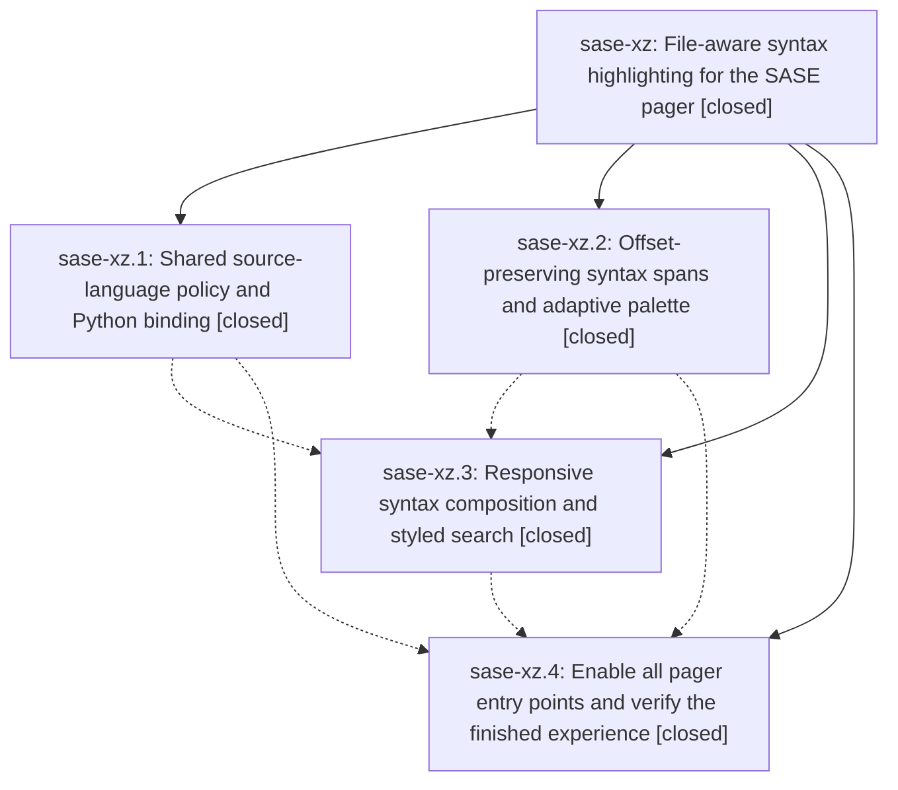

# Bead: sase-xz — File-aware syntax highlighting for the SASE pager

[Bead Pages](../README.md) / sase-xz

**Status:** ✓ closed · **Resolution:** done · **Type:** ▸ plan · **Tier:** epic
**Owner:** `bryanbugyi34@gmail.com` · **Created by:** [bbugyi200.athena.03g](https://github.com/sase-org/sase--agents/blob/main/families/bbugyi200.athena.03g.md) · **Assignee:** `sase-xz.land`
**Created:** 2026-09-07 10:51:40 EDT · **Closed:** 2026-09-07 19:17:23 EDT
**Plan:** [202609/pager\_filetype\_syntax.md](https://github.com/sase-org/sase--plans/blob/main/202609/pager_filetype_syntax.md)

<!-- sase:links:start -->

## Links

| Relation | Artifact | Why |
| --- | --- | --- |
| implemented-by | [plan:202609/pager_filetype_syntax.md][1] | derived from the plan's `bead_id:` frontmatter field |

[1]: https://github.com/sase-org/sase--plans/blob/main/202609/pager_filetype_syntax.md

<!-- sase:links:end -->

## Description

Make source files, Markdown documents, and diffs quietly beautiful in every pager entry point while preserving source text, existing styles, link actions, search, and responsiveness.

## Notes

[2026-09-07T23:17:23Z · sase-xz.land--3] Land verification for epic sase-xz (file-aware pager syntax highlighting).

VERIFIED (step 1). Reviewed all four phase beads, their single notes each, and the epic
commits 7ca1654a2 (source-language facade), 0aa7cb9e9 (inactive syntax engine),
a9f95ca5e (reading surface) and dbf94132c (activation), plus sase-core eacd178
(source_language module + PyO3 bindings, pushed to sase-core master). sase-xz.3 was
auto-closed by `sase stitch create` with "no verification is implied", so reading_surface
was re-verified by hand against the source: RawSourceSpec/section_syntax_language section
metadata carried independently of kind/title; PagerSyntaxMixin preparation that runs only
via call_after_refresh + spawn_pump_free_task + asyncio.to_thread, checks generation and
document identity after every await, and is cancelled at unmount; bounded
SyntaxResultCache/StyledTextCache (24 sections, 200k spans) keyed by content digest,
canonical language, theme signature and producer eligibility, plus the separate
MAX_DOCUMENT_SYNTAX_SPANS per-document budget; prepared text threaded through
compose_body, _measure_section_heights, _section_renderable and render_section_with_labels
without mutating any cached Text; styled_search_base plus the opt-in
VimSearchController.vim_search_styled_base that keeps the plain default for every other
host; theme watch invalidation that restyles without re-lexing; and the subject-line
language hint that drops first at narrow widths.

Functional smoke on the real code path (not just tests): path_section classifies
cli_pager.py as python, docs/pager.md and README.md as markdown, uv.lock as toml and
leaves Justfile deliberately plain; highlight_source/style_source_text preserve the source
string exactly (140 spans, hint "py"); `sase pager -s bogus-lang -p README.md` exits 2
with a concise error, `-s python -p` still prints plain text, and a piped `git show`
pages plainly. tests/pager: 250 passed.

Closed the plan Responsiveness acceptance row that phase 4 left unmeasured, by measuring
it here with SASE_TUI_TRACE=1 on a 513-line Python section: the synchronous pager.open
span is 84.1ms median with syntax auto, 83.9ms with syntax off and 86.4ms for an
unknown-language control (n=7 each), and cold scroll, warm scroll and prefix-key latency
are identical across all three - no added first-paint cost and no hot-path lexing or I/O.

INTEGRATED (step 2). Reviewed every commit landed since the epic began that is not the
epic: 51445642c and 4b90cc9ee (epic sase-xy pager link work) were rebased under phases 3
and 4, and the epic consumes their post-change seams - merge_link_context,
_is_target_dangling and the workspace_num-scoped _dangling_refs keys - with their tests
(test_pager_context_identity, test_app dangling/context cases) passing on the combined
tree. 07f44fc90, a1d88a861, ec6bc4a42 and e5106d490 touch unrelated subsystems. No
duplication was left behind: the private MIME/suffix text gates in pager/resolve.py and
artifact_cli/read.py were both replaced by the shared is_openable_text_path, and the
remaining Pygments users (ace frontmatter_syntax, ace xprompt_syntax, bead
cli_detail_prose) are exactly the consumers the plan deliberately leaves unchanged. All
four pager entry points (main/pager_handler, cli_pager.page_or_print, artifact_cli/read,
ace hints/_files) construct the app or screen with a resolved syntax session; bead detail
paging stays formatted and therefore ineligible.

FOLLOW-UPS. No child bead carried a PROPOSED FOLLOW-UP note, so no task beads were filed
and none were declined. `sase bead epic-symbols sase-xz` was already empty and the
Justfile carries no sase-xz --epic-symbol entry.

KNOWN, NOT EPIC-CAUSED. sase-core-revision.txt still pins 2fba6e44, which predates
eacd178, so the CI/master-gate "Check pinned core bindings" step reports
resolve_source_language, logical_source_filename and source_language_prefix_budget_bytes
as missing. That pin was already stale before this epic for nine fleet_* bindings landed
by earlier epics, and it is owned by the scheduled core-pin-ratchet workflow (ratchet
2fba6e44 -> eacd1782 currently pending), not by feature work. The published sase-core-rs
floor in pyproject.toml is release-lane owned; docs/rust_backend.md is explicit that a
change calling an unpublished binding should "do nothing" and let the release lane block.

Landing gate: `just check-full` on the combined tree.

LANDING GATE. `just check-full` was run under monitor hex54mv7bec5 (killed at 25m by a
20m no-output idle watchdog while the governed test-cost lane sat silent behind another
agent's suite-gate lease, not a real failure) and then under monitor 4fvbspmpxjw5 with no
idle timeout: 56m26s, every lint gate, SASE validation, committed plans and the whole
`just test-cost` full suite passed, and the only failing step was the last one,
`just selection-health --fail-on-new-flake`. That gate promoted four nodes with no
baseline entry, none of them caused by this epic:
tests/ace/tui/test_config_center_resume.py::test_new_process_loads_remembered_admin_center_section
(oldest promoting record is head a45669b26, committed 2026-09-06, before the epic's first
commit), tests/test_agent_name_registry_lock.py::test_wipe_does_not_delete_under_the_allocation_lock
(all four records at heads e2ce985dd and f28e64334, all other workspaces' dirty trees),
and both tests/test_xprompt_directive_completion_parity.py::test_ace_and_lsp_include_dispatch_*
nodes (records at heads 50b1405f4 and a0fcc5ade, with the stale-extension co-failure
signature). All four pass in isolation on this tree and all four passed this run's own
full test-cost lane. Per the baseline file's "fix or file the node before landing" rule
they were filed as ready flake task beads sase-y7, sase-y8 and sase-y9 (with related
links to sase-j7, sase-u7, sase-wy, sase-vl, sase-v6, sase-rj and sase-xe) and given
bead-named entries in tests/reproducible_flake_baseline.txt, which is this landing's only
tree change. DISCOVERED ISSUE notes recording the dispatch-parity evidence were appended
to active epics sase-xe (which landed the %dispatch vocabulary) and sase-rj (which owns
the ACE/LSP directive-completion contract). `tools/selection_health --fail-on-new-flake`
then exits 0 (35 current, 50 allowed).

LANDING GATE, ATTEMPT 3 AND CLOSE (sase-xz.land--3). Monitor nppac98sb90a reran the whole
gate at head e5106d490 because the linked sase-core checkout moved 0.32.37 -> 0.32.38 and
tools/select_tests reported core-identity-changed. 1h08m01s: fmt, every lint gate
(including lint (feature flags), which passed at 21:53Z), SASE validation, committed plans
and the full suite all passed - 39,329 passed, 14 skipped, 0 failed in 25m56s. Exactly two
steps failed, neither caused by this epic, and both are now resolved.

(a) TEST-COST HARD CEILING. causes.parser_create.cpu recorded 42.573s against the 42.500s
allowance (34.0 + 25% tolerance), an overage of 0.073s (0.17%). This is not a regression:
causes.parser_create.count is invariant at 1882 across all eight retained athena
recordings, and the two adjacent full-lane recordings 20260907T213439Z (35.765s CPU, this
epic's attempt 2) and 20260907T225737Z (42.573s CPU, attempt 3) attribute parser_create to
the identical 191 files with identical per-file counts - a +19% CPU swing from host
contention alone on the same tree, which also falsifies the budgets file's 2026-08-23
claim that per-cause CPU is contention-stable. Applied the calibration the budgets file
itself documents: tools/check_test_cost_budgets --suggest --history 8 (8 athena recordings
2026-09-07T14:39Z-22:57Z; parser_create.cpu min/median/max 35.765/40.791/42.573) raises
exactly one existing key, causes.parser_create.cpu_limit 34.0 -> 35.0, recorded with full
provenance in a new note in tests/perf/baselines/test_cost_budgets.json. Advisory wall
limits, count limits, RSS budgets, tolerances and every new cause key the suggestion
proposes were left unchanged, per that file's "existing keys only" rule. Same precedent as
commit 144c2be65, the sase-xq land agent's eight-sample athena CPU calibration.
tools/check_test_cost_budgets now exits 0 against the very recording that failed the gate,
--report-advisories exits 0, and all 32 committed-budget tests pass including
test_committed_pre_epic_baseline_still_fails_recalibrated_budgets. The systemic staleness
is tracked by bead sase-xc.

(b) FLAKE BASELINE GATE. Two further nodes were promoted:
tests/test_xprompt_directive_completion_parity.py::test_ace_and_lsp_directive_argument_rows_match[%dispatch:]
and tests/test_xprompt_directive_contract.py::test_runtime_directive_vocabulary_matches_core_contract.
Same underlying defect as the sase-y9 nodes filed by attempt 2, so this was recorded as
supplementary evidence on sase-y9 rather than as a duplicate bead, and both node IDs were
appended to that bead's stanza in tests/reproducible_flake_baseline.txt. The new evidence
sharpens the root cause and rules out the LSP limb of the original hypothesis:
test_runtime_directive_vocabulary_matches_core_contract imports sase_core_rs directly and
asserts the contract carries the "dispatch" keyword, with no LspSession, subprocess or
pilot, yet it co-fails with the ACE/LSP parity nodes in every promoting record - so the
one shared ingredient is a compiled sase_core_rs predating sase-xe's 50b1405f4, a
stale-extension-build failure that only resembles a flake. All six promoting full-run
records come from other workspaces (sase_27, sase_34, sase_12, sase_29, sase_30) at four
unrelated heads; this workspace's own two records at head e5106d490f89, one of them on a
clean tree, both recorded exit 0 with zero failures, and both nodes pass in isolation
here. A matching DISCOVERED ISSUE note was appended to active epic sase-xe.
tools/selection_health --fail-on-new-flake now exits 0 (37 current, 52 allowed).

POST-GATE VERIFICATION of this landing's only two tree changes - tests/perf/baselines/
test_cost

… and 1330 more characters

## Phases

| Bead | Title | Status | Size | Created | Agents | Commits |
|---|---|---|---|---|---:|---:|
| [sase-xz.1](sase-xz.1.md) | Shared source-language policy and Python binding | ✓ closed | medium | 2026-09-07 | 1 | 2 |
| [sase-xz.2](sase-xz.2.md) | Offset-preserving syntax spans and adaptive palette | ✓ closed | medium | 2026-09-07 | 1 | 1 |
| [sase-xz.3](sase-xz.3.md) | Responsive syntax composition and styled search | ✓ closed | medium | 2026-09-07 | 1 | 1 |
| [sase-xz.4](sase-xz.4.md) | Enable all pager entry points and verify the finished experience | ✓ closed | medium | 2026-09-07 | 1 | 1 |

## Lineage

## Agents

| Agent | Bead | Commits |
|---|---|---:|
| [bbugyi200.athena.sase-xz.1](https://github.com/sase-org/sase--agents/blob/main/agents/bbugyi200.athena.sase-xz.1/README.md) | [sase-xz.1](sase-xz.1.md) | 2 |
| [bbugyi200.athena.sase-xz.2](https://github.com/sase-org/sase--agents/blob/main/agents/bbugyi200.athena.sase-xz.2/README.md) | [sase-xz.2](sase-xz.2.md) | 1 |
| [bbugyi200.athena.sase-xz.3](https://github.com/sase-org/sase--agents/blob/main/agents/bbugyi200.athena.sase-xz.3/README.md) | [sase-xz.3](sase-xz.3.md) | 1 |
| [bbugyi200.athena.sase-xz.4](https://github.com/sase-org/sase--agents/blob/main/agents/bbugyi200.athena.sase-xz.4/README.md) | [sase-xz.4](sase-xz.4.md) | 1 |
| [bbugyi200.athena.sase-xz.land](https://github.com/sase-org/sase--agents/blob/main/families/bbugyi200.athena.sase-xz.land.md) | [sase-xz](README.md) | 1 |

## Commits

| Repo | Commit | Subject | Bead | Committed |
|---|---|---|---|---|
| sase | [`7ca1654`](https://github.com/sase-org/sase/commit/7ca1654a2175b3e042b862f9bacb20f04535d2bc) | feat(pager): add source-language facade over the rust contract | [sase-xz.1](sase-xz.1.md) | 2026-09-07 12:37:22 EDT |
| sase-core | [`sase-core@eacd178`](https://github.com/sase-org/sase-core/commit/eacd17823834d441f205289b0c4f30510918734f) | feat(source-language): add pager language policy and wire API | [sase-xz.1](sase-xz.1.md) | 2026-09-07 12:42:24 EDT |
| sase | [`0aa7cb9`](https://github.com/sase-org/sase/commit/0aa7cb9e965b504f08a6b3fccef69b84902c03a7) | feat(pager): add inactive syntax span engine | [sase-xz.2](sase-xz.2.md) | 2026-09-07 13:24:59 EDT |
| sase | [`a9f95ca`](https://github.com/sase-org/sase/commit/a9f95ca5e64510df9f6161ee259d4d99d042537f) | feat(pager): thread source-language syntax hints through screen and layout | [sase-xz.3](sase-xz.3.md) | 2026-09-07 14:10:25 EDT |
| sase | [`dbf9413`](https://github.com/sase-org/sase/commit/dbf94132ce3d34ec849eed9ab82e8cb401aec443) | feat(pager): activate file-aware syntax highlighting at every entry point | [sase-xz.4](sase-xz.4.md) | 2026-09-07 15:51:05 EDT |
| sase | [`ddbd1b1`](https://github.com/sase-org/sase/commit/ddbd1b10a7f0778351fe27aa60699d30d814e37d) | test: raise the parser\_create CPU ceiling and own two more flake nodes | [sase-xz](README.md) | 2026-09-07 19:31:04 EDT |
